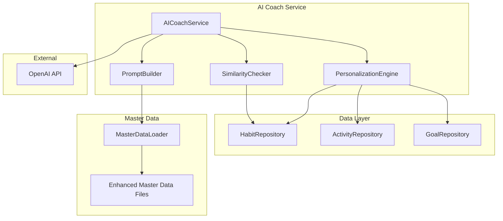

# Design Document: AI Coach Quality Improvement

## Overview

AIコーチの提案品質を向上させるため、以下の主要コンポーネントを実装・改善します：

1. **PersonalizationEngine**: ユーザーコンテキストを分析し、パーソナライズされた提案を生成
2. **SimilarityChecker**: 既存習慣との重複を検出
3. **MasterDataEnhancer**: マスターデータに難易度・習慣スタッキング情報を追加
4. **PromptBuilder**: 最適化されたシステムプロンプトを構築

## Architecture



## Components and Interfaces

### 1. PersonalizationEngine

ユーザーのコンテキストを分析し、パーソナライズ情報を提供するエンジン。

```typescript
interface UserContext {
  userId: string;
  activeHabitCount: number;
  averageCompletionRate: number;
  userLevel: 'beginner' | 'intermediate' | 'advanced';
  preferredFrequency: 'daily' | 'weekly' | 'monthly';
  preferredTimeSlots: TimeSlot[];
  existingHabitNames: string[];
  anchorHabits: AnchorHabit[];
}

interface TimeSlot {
  hour: number;
  dayOfWeek?: number;
  frequency: number; // how often this slot is used
}

interface AnchorHabit {
  habitId: string;
  habitName: string;
  completionRate: number;
  triggerTime: string | null;
}

interface PersonalizationEngine {
  analyzeUserContext(userId: string): Promise<UserContext>;
  determineUserLevel(context: Partial<UserContext>): UserLevel;
  identifyPreferredTimeSlots(activities: Activity[]): TimeSlot[];
  identifyAnchorHabits(habits: Habit[], activities: Activity[]): AnchorHabit[];
}
```

**実装詳細:**

```typescript
class PersonalizationEngineImpl implements PersonalizationEngine {
  constructor(
    private habitRepo: HabitRepository,
    private activityRepo: ActivityRepository
  ) {}

  async analyzeUserContext(userId: string): Promise<UserContext> {
    const habits = await this.habitRepo.getByOwner('user', userId, true);
    const activeHabits = habits.filter(h => h.active);
    
    // 過去30日間のアクティビティを取得
    const thirtyDaysAgo = new Date();
    thirtyDaysAgo.setDate(thirtyDaysAgo.getDate() - 30);
    
    const activities = await this.activityRepo.getActivitiesSince(userId, thirtyDaysAgo);
    
    // 達成率を計算
    const completionRates = await this.calculateCompletionRates(activeHabits, activities);
    const averageCompletionRate = this.calculateAverage(completionRates);
    
    // ユーザーレベルを判定
    const userLevel = this.determineUserLevel({
      activeHabitCount: activeHabits.length,
      averageCompletionRate
    });
    
    // 好みの頻度を特定
    const preferredFrequency = this.identifyPreferredFrequency(activeHabits);
    
    // 好みの時間帯を特定
    const preferredTimeSlots = this.identifyPreferredTimeSlots(activities);
    
    // アンカー習慣を特定
    const anchorHabits = this.identifyAnchorHabits(activeHabits, activities);
    
    return {
      userId,
      activeHabitCount: activeHabits.length,
      averageCompletionRate,
      userLevel,
      preferredFrequency,
      preferredTimeSlots,
      existingHabitNames: activeHabits.map(h => h.name),
      anchorHabits
    };
  }

  determineUserLevel(context: Partial<UserContext>): UserLevel {
    const { activeHabitCount = 0, averageCompletionRate = 0 } = context;
    
    if (activeHabitCount < 3 || averageCompletionRate < 0.4) {
      return 'beginner';
    }
    if (activeHabitCount <= 7 && averageCompletionRate <= 0.7) {
      return 'intermediate';
    }
    if (activeHabitCount > 7 && averageCompletionRate > 0.7) {
      return 'advanced';
    }
    return 'intermediate';
  }
}
```

### 2. SimilarityChecker

習慣名の類似度を計算し、重複を検出するコンポーネント。

```typescript
interface SimilarityResult {
  isUnique: boolean;
  mostSimilarHabit: string | null;
  similarityScore: number;
}

interface SimilarityChecker {
  checkSimilarity(newHabitName: string, existingHabitNames: string[]): SimilarityResult;
  calculateSimilarityScore(name1: string, name2: string): number;
  normalizeHabitName(name: string): string;
}
```

**実装詳細:**

```typescript
class SimilarityCheckerImpl implements SimilarityChecker {
  private readonly SIMILARITY_THRESHOLD = 0.7;

  checkSimilarity(newHabitName: string, existingHabitNames: string[]): SimilarityResult {
    const normalizedNew = this.normalizeHabitName(newHabitName);
    let maxScore = 0;
    let mostSimilar: string | null = null;

    for (const existing of existingHabitNames) {
      const normalizedExisting = this.normalizeHabitName(existing);
      const score = this.calculateSimilarityScore(normalizedNew, normalizedExisting);
      
      if (score > maxScore) {
        maxScore = score;
        mostSimilar = existing;
      }
    }

    return {
      isUnique: maxScore < this.SIMILARITY_THRESHOLD,
      mostSimilarHabit: mostSimilar,
      similarityScore: maxScore
    };
  }

  calculateSimilarityScore(name1: string, name2: string): number {
    // 完全一致チェック
    if (name1 === name2) return 1.0;
    
    // 包含チェック
    if (name1.includes(name2) || name2.includes(name1)) {
      const lengthRatio = Math.min(name1.length, name2.length) / 
                         Math.max(name1.length, name2.length);
      if (lengthRatio > 0.7) return 0.9;
    }
    
    // Levenshtein距離ベースの類似度
    const distance = this.levenshteinDistance(name1, name2);
    const maxLength = Math.max(name1.length, name2.length);
    return 1 - (distance / maxLength);
  }

  normalizeHabitName(name: string): string {
    return name
      .toLowerCase()
      .replace(/\s+/g, '')
      .replace(/[・、。]/g, '');
  }

  private levenshteinDistance(s1: string, s2: string): number {
    const m = s1.length;
    const n = s2.length;
    const dp: number[][] = Array(m + 1).fill(null).map(() => Array(n + 1).fill(0));

    for (let i = 0; i <= m; i++) dp[i][0] = i;
    for (let j = 0; j <= n; j++) dp[0][j] = j;

    for (let i = 1; i <= m; i++) {
      for (let j = 1; j <= n; j++) {
        if (s1[i - 1] === s2[j - 1]) {
          dp[i][j] = dp[i - 1][j - 1];
        } else {
          dp[i][j] = 1 + Math.min(dp[i - 1][j], dp[i][j - 1], dp[i - 1][j - 1]);
        }
      }
    }
    return dp[m][n];
  }
}
```

### 3. Enhanced Master Data Format

マスターデータに難易度レベルと習慣スタッキング情報を追加。

```typescript
interface EnhancedHabitSuggestion {
  name: string;
  type: 'do' | 'avoid';
  frequency: 'daily' | 'weekly' | 'monthly';
  suggestedTargetCount: number;
  workloadUnit: string | null;
  triggerTime: string | null;
  duration: number | null;
  reason: string;
  // 新規フィールド
  difficultyLevel: 'beginner' | 'intermediate' | 'advanced';
  habitStackingTriggers: string[]; // 例: ["朝食後", "歯磨き後", "起床時"]
  subcategory: string;
}
```

**マスターデータファイル形式の拡張:**

```markdown
#### 朝のストレッチ
- type: do
- frequency: daily
- suggestedTargetCount: 1
- workloadUnit: 回
- triggerTime: 07:00
- duration: 10
- reason: 朝のストレッチは血流を促進し、一日の活力を高めます。
- difficultyLevel: beginner
- habitStackingTriggers: 起床後, 朝食前
```

### 4. PromptBuilder

ユーザーコンテキストを含む最適化されたシステムプロンプトを構築。

```typescript
interface PromptBuilder {
  buildSystemPrompt(userContext: UserContext, basePrompt: string): string;
  buildContextSummary(userContext: UserContext): string;
}
```

**実装詳細:**

```typescript
class PromptBuilderImpl implements PromptBuilder {
  buildSystemPrompt(userContext: UserContext, basePrompt: string): string {
    const contextSummary = this.buildContextSummary(userContext);
    
    return `${basePrompt}

## ユーザーコンテキスト
${contextSummary}

## 提案時の注意事項
- ユーザーレベル「${userContext.userLevel}」に適した難易度の習慣を提案してください
- 以下の既存習慣と重複しない提案をしてください: ${userContext.existingHabitNames.join(', ')}
- 好みの時間帯: ${this.formatTimeSlots(userContext.preferredTimeSlots)}
`;
  }

  buildContextSummary(userContext: UserContext): string {
    const levelDescriptions = {
      beginner: '初心者（習慣数が少ない、または達成率が低め）',
      intermediate: '中級者（習慣を継続できている）',
      advanced: '上級者（多くの習慣を高い達成率で継続）'
    };

    return `- アクティブな習慣数: ${userContext.activeHabitCount}
- 平均達成率: ${Math.round(userContext.averageCompletionRate * 100)}%
- ユーザーレベル: ${levelDescriptions[userContext.userLevel]}
- 好みの頻度: ${userContext.preferredFrequency}
- アンカー習慣: ${userContext.anchorHabits.map(h => h.habitName).join(', ') || 'なし'}`;
  }

  private formatTimeSlots(slots: TimeSlot[]): string {
    if (slots.length === 0) return '特になし';
    return slots
      .slice(0, 3)
      .map(s => `${s.hour}:00頃`)
      .join(', ');
  }
}
```

## Data Models

### UserContext

```typescript
interface UserContext {
  userId: string;
  activeHabitCount: number;
  averageCompletionRate: number;  // 0.0 - 1.0
  userLevel: 'beginner' | 'intermediate' | 'advanced';
  preferredFrequency: 'daily' | 'weekly' | 'monthly';
  preferredTimeSlots: TimeSlot[];
  existingHabitNames: string[];
  anchorHabits: AnchorHabit[];
}
```

### SuggestionValidationResult

```typescript
interface SuggestionValidationResult {
  isValid: boolean;
  errors: string[];
  warnings: string[];
  similarityCheck: SimilarityResult;
}
```


## Correctness Properties

*A property is a characteristic or behavior that should hold true across all valid executions of a system—essentially, a formal statement about what the system should do. Properties serve as the bridge between human-readable specifications and machine-verifiable correctness guarantees.*

### Property 1: User Context Analysis Completeness

*For any* user with habits and activities, when the PersonalizationEngine analyzes their context, the returned UserContext object SHALL contain all required fields (userId, activeHabitCount, averageCompletionRate, userLevel, preferredFrequency, preferredTimeSlots, existingHabitNames, anchorHabits).

**Validates: Requirements 1.1**

### Property 2: Average Completion Rate Calculation

*For any* set of habits with completion data, the calculated average completion rate SHALL equal the sum of individual completion rates divided by the number of habits.

**Validates: Requirements 1.2**

### Property 3: Preferred Frequency Identification

*For any* set of habits with different frequencies, the identified preferred frequency SHALL be the frequency that appears most often among active habits.

**Validates: Requirements 1.3**

### Property 4: User Level Classification

*For any* combination of active habit count and average completion rate:
- If habitCount < 3 OR completionRate < 0.4, level SHALL be 'beginner'
- If 3 <= habitCount <= 7 AND 0.4 <= completionRate <= 0.7, level SHALL be 'intermediate'
- If habitCount > 7 AND completionRate > 0.7, level SHALL be 'advanced'

**Validates: Requirements 2.1, 2.2, 2.3**

### Property 5: Suggestion Filtering by User Level

*For any* habit suggestion and user level:
- For 'beginner' users, suggestions SHALL have daily frequency and duration <= 15 minutes
- For 'intermediate' users, suggestions SHALL have duration <= 30 minutes
- For 'advanced' users, no filtering restrictions SHALL apply

**Validates: Requirements 2.4, 2.5, 2.6**

### Property 6: Similarity Score Calculation

*For any* two habit names, the similarity score SHALL:
- Return 1.0 for exact matches (after normalization)
- Return a value between 0 and 1
- Be symmetric (similarity(a, b) == similarity(b, a))
- Treat normalized names as equivalent ("朝 ストレッチ" == "朝ストレッチ")

**Validates: Requirements 4.1, 4.3, 4.4**

### Property 7: High Similarity Rejection

*For any* habit suggestion with similarity score > 0.7 to an existing habit, the suggestion SHALL be rejected and marked as duplicate.

**Validates: Requirements 4.2**

### Property 8: Prompt Context Completeness

*For any* UserContext, the built system prompt SHALL contain:
- The user's active habit count
- The user's average completion rate
- The user's level description
- The list of existing habit names
- The user's preferred time slots

**Validates: Requirements 6.1, 6.2, 6.3**

### Property 9: Anchor Habit Identification

*For any* set of habits with completion rates, habits with completion rate > 0.8 SHALL be identified as anchor habits.

**Validates: Requirements 7.1**

### Property 10: Habit Stacking Format

*For any* habit stacking suggestion, the format SHALL match the pattern "[After existing habit], [new habit]" or "[既存の習慣]した後に、[新しい習慣]をする".

**Validates: Requirements 7.2, 7.4**

### Property 11: Goal Suggestion Structure

*For any* goal suggestion, the suggestedHabits array SHALL contain between 2 and 4 habit names.

**Validates: Requirements 8.2**

### Property 12: Master Data Validation

*For any* habit in master data, all required fields (name, type, frequency, suggestedTargetCount, reason, difficultyLevel) SHALL be present and valid.

**Validates: Requirements 5.1, 5.2, 5.4**

## Error Handling

### PersonalizationEngine Errors

| Error Condition | Handling Strategy |
|-----------------|-------------------|
| Database connection failure | Return cached context if available, otherwise use default beginner context |
| No habits found | Return default beginner context with empty arrays |
| Activity data unavailable | Calculate context without time slot preferences |

### SimilarityChecker Errors

| Error Condition | Handling Strategy |
|-----------------|-------------------|
| Empty habit name | Return similarity score of 0 |
| Invalid characters | Normalize and continue processing |

### MasterDataLoader Errors

| Error Condition | Handling Strategy |
|-----------------|-------------------|
| File not found | Log warning, return empty category |
| Invalid format | Log warning, skip invalid entries |
| Missing required fields | Use default values, log warning |

## Testing Strategy

### Unit Tests

Unit tests will cover specific examples and edge cases:

1. **PersonalizationEngine**
   - Empty user (no habits)
   - User with single habit
   - User at boundary conditions (exactly 3 habits, exactly 40% completion)

2. **SimilarityChecker**
   - Exact match detection
   - Partial match detection
   - Japanese character handling
   - Whitespace normalization

3. **PromptBuilder**
   - Empty context handling
   - Maximum length validation

### Property-Based Tests

Property-based tests will use **fast-check** library for TypeScript with minimum 100 iterations per test.

Each property test will be tagged with:
- **Feature: ai-coach-quality-improvement, Property {number}: {property_text}**

**Test Configuration:**
```typescript
import fc from 'fast-check';

// Minimum 100 iterations per property
const propertyConfig = { numRuns: 100 };
```

**Property Test Examples:**

```typescript
// Property 4: User Level Classification
describe('Property 4: User Level Classification', () => {
  it('should classify users correctly based on habit count and completion rate', () => {
    fc.assert(
      fc.property(
        fc.integer({ min: 0, max: 20 }),  // habitCount
        fc.float({ min: 0, max: 1 }),      // completionRate
        (habitCount, completionRate) => {
          const level = determineUserLevel({ activeHabitCount: habitCount, averageCompletionRate: completionRate });
          
          if (habitCount < 3 || completionRate < 0.4) {
            return level === 'beginner';
          }
          if (habitCount > 7 && completionRate > 0.7) {
            return level === 'advanced';
          }
          return level === 'intermediate';
        }
      ),
      propertyConfig
    );
  });
});

// Property 6: Similarity Score Calculation
describe('Property 6: Similarity Score Calculation', () => {
  it('should be symmetric and bounded', () => {
    fc.assert(
      fc.property(
        fc.string({ minLength: 1, maxLength: 50 }),
        fc.string({ minLength: 1, maxLength: 50 }),
        (name1, name2) => {
          const score1 = calculateSimilarityScore(name1, name2);
          const score2 = calculateSimilarityScore(name2, name1);
          
          return score1 === score2 && score1 >= 0 && score1 <= 1;
        }
      ),
      propertyConfig
    );
  });
});
```

### Integration Tests

Integration tests will verify end-to-end flows:

1. Full context analysis with real database
2. Suggestion generation with similarity checking
3. Prompt building with actual user data
