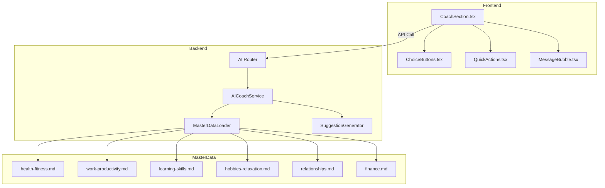

# Design Document: AI Coach UI Redesign

## Overview

このデザインは、AIコーチセクションをGeminiスタイルの広々としたUIに刷新し、選択肢ボタンの活用を拡張し、カテゴリ別マスターデータによるトークン最適化を実現する。

主な変更点：
1. **UIの大幅拡大**: チャットエリア、入力エリア、メッセージバブルのサイズを拡大
2. **選択肢ボタンの拡張**: AIが質問時に回答候補をボタンで提示
3. **マスターデータ導入**: カテゴリ別のHabit/Goal提案をmdファイルで管理

## Architecture



## Components and Interfaces

### Frontend Components

#### 1. CoachSection (リファクタリング)

```typescript
interface CoachSectionProps {
  goals: Goal[];
  onHabitCreated?: () => void;
  onGoalCreated?: () => void;
}

// 新しいレイアウト構造
// - ヘッダー: タイトル + トークン情報 + クリアボタン
// - チャットエリア: flex-1で残りスペースを占有
// - クイックアクション: 会話がない時に中央表示
// - 入力エリア: sticky bottom、自動拡張
```

#### 2. MessageBubble (新規)

```typescript
interface MessageBubbleProps {
  message: Message;
  onChoiceSelect?: (choice: Choice) => void;
}

interface Message {
  id: string;
  role: 'user' | 'assistant';
  content: string;
  timestamp: Date;
  uiComponents?: UIComponentData[];
}
```

#### 3. ChoiceButtons (拡張)

```typescript
interface Choice {
  id: string;
  label: string;
  description?: string;
  icon?: string;
  urgency?: 'low' | 'medium' | 'high';
  disabled?: boolean;
}

interface ChoiceButtonsProps {
  choices: Choice[];
  onSelect: (choice: Choice) => void;
  layout?: 'vertical' | 'horizontal' | 'grid';
  size?: 'sm' | 'md' | 'lg';
  title?: string;  // 新規: 選択肢のタイトル
}
```

#### 4. QuickActions (リファクタリング)

```typescript
interface QuickAction {
  id: string;
  label: string;
  icon: string;
  prompt: string;  // AIに送信するプロンプト
}

interface QuickActionsProps {
  actions: QuickAction[];
  onAction: (action: QuickAction) => void;
  layout?: 'grid' | 'list';
}

// デフォルトアクション
const defaultActions: QuickAction[] = [
  { id: 'add-habit', label: '習慣を追加', icon: '➕', prompt: '新しい習慣を追加したい' },
  { id: 'set-goal', label: 'ゴールを設定', icon: '🎯', prompt: 'ゴールを設定したい' },
  { id: 'check-progress', label: '進捗を確認', icon: '📊', prompt: '習慣の進捗を確認したい' },
  { id: 'get-advice', label: 'アドバイス', icon: '💡', prompt: '習慣を続けるコツを教えて' },
];
```

### Backend Components

#### 1. MasterDataLoader (新規)

```typescript
interface HabitSuggestion {
  name: string;
  type: 'do' | 'avoid';
  frequency: 'daily' | 'weekly' | 'monthly';
  suggestedTargetCount: number;
  workloadUnit: string | null;
  reason: string;
  triggerTime?: string;
  duration?: number;
}

interface GoalSuggestion {
  name: string;
  description: string;
  icon: string;
  reason: string;
  suggestedHabits: string[];
}

interface CategoryData {
  category: string;
  categoryJa: string;
  habits: HabitSuggestion[];
  goals: GoalSuggestion[];
}

class MasterDataLoader {
  private cache: Map<string, CategoryData> = new Map();
  
  async loadCategory(category: string): Promise<CategoryData>;
  async getAllCategories(): Promise<CategoryData[]>;
  async getHabitsByCategory(category: string): Promise<HabitSuggestion[]>;
  async getGoalsByCategory(category: string): Promise<GoalSuggestion[]>;
}
```

#### 2. AICoachService (拡張)

```typescript
interface ChatResponse {
  message: string;
  toolsUsed: string[];
  data?: {
    parsedHabit?: ParsedHabit;
    habitSuggestions?: HabitSuggestion[];
    goalSuggestions?: GoalSuggestion[];
    uiComponents?: UIComponentData[];
  };
  tokensUsed: number;
}

interface UIComponentData {
  type: 'ui_component';
  component: 'choice_buttons' | 'habit_stats' | 'workload_chart' | 'progress_indicator' | 'quick_actions';
  data: any;
}

// choice_buttons の data 構造
interface ChoiceButtonsData {
  title?: string;
  choices: Choice[];
}
```

## Data Models

### Master Data File Format

各カテゴリのマスターデータは以下の形式でMarkdownファイルに格納：

```markdown
# カテゴリ名

## Habits

### 習慣名1
- type: do
- frequency: daily
- suggestedTargetCount: 1
- workloadUnit: 回
- triggerTime: 07:00
- duration: 30
- reason: 理由の説明

### 習慣名2
...

## Goals

### ゴール名1
- icon: 💪
- description: ゴールの説明
- reason: このゴールを設定する理由
- suggestedHabits:
  - 関連習慣1
  - 関連習慣2
```

### Category Structure

| カテゴリID | 日本語名 | ファイル名 |
|-----------|---------|-----------|
| health-fitness | 健康・運動 | health-fitness.md |
| work-productivity | 仕事・生産性 | work-productivity.md |
| learning-skills | 学習・スキル | learning-skills.md |
| hobbies-relaxation | 趣味・リラックス | hobbies-relaxation.md |
| relationships | 人間関係 | relationships.md |
| finance | 財務 | finance.md |

### UI Layout Specifications

#### Desktop Layout (≥768px)

```
┌─────────────────────────────────────────────────┐
│ 🤖 AI Coach          残り: 約XX回    [クリア]   │ ← ヘッダー (48px)
├─────────────────────────────────────────────────┤
│                                                 │
│  ┌─────────────────────────────────────────┐   │
│  │ AIメッセージ                             │   │
│  │ 内容...                                  │   │
│  └─────────────────────────────────────────┘   │
│                                                 │
│         ┌─────────────────────────────────┐    │
│         │                 ユーザーメッセージ│    │
│         │                         内容... │    │
│         └─────────────────────────────────┘    │
│                                                 │ ← チャットエリア (flex-1, min-h-400px)
│  ┌─────────────────────────────────────────┐   │
│  │ AIメッセージ                             │   │
│  │ 内容...                                  │   │
│  │                                          │   │
│  │ [選択肢1] [選択肢2] [選択肢3]            │   │
│  └─────────────────────────────────────────┘   │
│                                                 │
├─────────────────────────────────────────────────┤
│ ┌─────────────────────────────────────────────┐│
│ │ メッセージを入力...                          ││ ← 入力エリア (min-h-80px, max-h-160px)
│ │                                             ││
│ └─────────────────────────────────────────────┘│
│                                        [送信] │
└─────────────────────────────────────────────────┘
```

#### Mobile Layout (<768px)

```
┌───────────────────────────┐
│ 🤖 AI Coach    [クリア]   │ ← ヘッダー (44px)
├───────────────────────────┤
│                           │
│ ┌───────────────────────┐ │
│ │ AIメッセージ          │ │
│ │ 内容...               │ │
│ └───────────────────────┘ │
│                           │
│   ┌───────────────────┐   │
│   │ ユーザーメッセージ │   │
│   │ 内容...           │   │
│   └───────────────────┘   │
│                           │ ← チャットエリア (flex-1, min-h-250px)
│ ┌───────────────────────┐ │
│ │ AIメッセージ          │ │
│ │                       │ │
│ │ [選択肢1]             │ │
│ │ [選択肢2]             │ │
│ │ [選択肢3]             │ │
│ └───────────────────────┘ │
│                           │
├───────────────────────────┤
│ ┌───────────────────────┐ │
│ │ メッセージを入力...   │ │ ← 入力エリア (min-h-60px)
│ └───────────────────────┘ │
│                   [送信] │
└───────────────────────────┘
```

#### Quick Actions (会話がない時)

```
┌─────────────────────────────────────────────────┐
│ 🤖 AI Coach                                     │
├─────────────────────────────────────────────────┤
│                                                 │
│                                                 │
│           何をお手伝いしましょうか？             │
│                                                 │
│     ┌──────────────┐  ┌──────────────┐         │
│     │ ➕           │  │ 🎯           │         │
│     │ 習慣を追加   │  │ ゴールを設定 │         │
│     └──────────────┘  └──────────────┘         │
│                                                 │
│     ┌──────────────┐  ┌──────────────┐         │
│     │ 📊           │  │ 💡           │         │
│     │ 進捗を確認   │  │ アドバイス   │         │
│     └──────────────┘  └──────────────┘         │
│                                                 │
│                                                 │
├─────────────────────────────────────────────────┤
│ ┌─────────────────────────────────────────────┐│
│ │ メッセージを入力...                          ││
│ └─────────────────────────────────────────────┘│
└─────────────────────────────────────────────────┘
```


## Correctness Properties

*A property is a characteristic or behavior that should hold true across all valid executions of a system—essentially, a formal statement about what the system should do. Properties serve as the bridge between human-readable specifications and machine-verifiable correctness guarantees.*

### Property 1: Chat Area Proportional Height

*For any* viewport size, the Chat_Area height SHALL be at least 60% of the AI_Coach_Section's total vertical space.

**Validates: Requirements 1.1**

### Property 2: Input Area Auto-Expansion

*For any* multi-line text input, the Input_Area height SHALL expand proportionally up to 160px maximum, and never shrink below 80px (desktop) or 60px (mobile).

**Validates: Requirements 2.2, 8.2**

### Property 3: Message Bubble Max Width

*For any* message content regardless of length, the Message_Bubble width SHALL not exceed 85% of Chat_Area width on desktop (≥768px) or 95% on mobile (<768px).

**Validates: Requirements 3.5, 8.4**

### Property 4: Auto-Scroll on New Message

*For any* new message added to the conversation, the Chat_Area SHALL automatically scroll to make the new message visible.

**Validates: Requirements 1.4**

### Property 5: Choice Buttons Rendering

*For any* AI response containing a `choice_buttons` UI component with 2-5 choices, the system SHALL render clickable Choice_Buttons below the message.

**Validates: Requirements 4.1, 4.2, 4.6**

### Property 6: Choice Button Click Sends Message

*For any* Choice_Button click, the system SHALL send the selected choice's label as a user message to the AI.

**Validates: Requirements 4.3**

### Property 7: Quick Action Click Sends Prompt

*For any* Quick_Action button click, the system SHALL send the action's predefined prompt as a user message to the AI.

**Validates: Requirements 7.3**

### Property 8: Master Data Schema Validation

*For any* category in Master_Data, the file SHALL contain 5-10 habit suggestions and 3-5 goal suggestions, where each habit includes name, type, frequency, suggestedTargetCount, workloadUnit, and reason fields.

**Validates: Requirements 6.4, 6.5, 6.6**

### Property 9: Backend Choice Response Schema

*For any* backend response containing choice_buttons, the data SHALL be an array of objects with required `id` and `label` fields, and optional `icon` and `description` fields.

**Validates: Requirements 5.2**

### Property 10: Choice Selection Processing

*For any* user choice selection sent to the backend, the system SHALL process it as a regular user message and return a valid AI response.

**Validates: Requirements 5.4**

### Property 11: Master Data Caching

*For any* sequence of Master_Data requests for the same category, the system SHALL read the file at most once and serve subsequent requests from cache.

**Validates: Requirements 9.2**

### Property 12: Conversation Clear State Reset

*For any* confirmed clear action, the system SHALL reset the messages array to empty and display the Quick_Actions in the initial state.

**Validates: Requirements 10.3**

## Error Handling

### Frontend Error Handling

| Error Scenario | Handling Strategy |
|----------------|-------------------|
| API request failure | Display error message in chat, allow retry |
| Invalid AI response | Log error, display generic error message |
| Network timeout | Show timeout message, suggest retry |
| Choice button click during processing | Disable buttons while processing |

### Backend Error Handling

| Error Scenario | Handling Strategy |
|----------------|-------------------|
| Master Data file not found | Fall back to AI-generated suggestions, log warning |
| Master Data parse error | Fall back to AI-generated suggestions, log error |
| Invalid choice selection | Process as regular message, log warning |
| Token quota exceeded | Return 429 with upgrade prompt |

### Error Response Format

```typescript
interface ErrorResponse {
  error: string;       // Error code
  message: string;     // User-friendly message
  resetAt?: string;    // For quota errors
  upgradeUrl?: string; // For premium features
}
```

## Testing Strategy

### Unit Tests

Unit tests focus on specific examples and edge cases:

1. **Component Rendering Tests**
   - MessageBubble renders correctly for user/assistant roles
   - ChoiceButtons renders correct number of buttons
   - QuickActions displays all default actions
   - Input area expands/contracts correctly

2. **Edge Cases**
   - Empty message handling
   - Very long message truncation
   - Maximum choice buttons (5)
   - Minimum choice buttons (2)

3. **Responsive Breakpoints**
   - Desktop layout at 768px+
   - Mobile layout at <768px
   - Viewport height <600px handling

### Property-Based Tests

Property-based tests validate universal properties across many generated inputs.

**Testing Framework**: Use `fast-check` for TypeScript property-based testing.

**Configuration**: Minimum 100 iterations per property test.

**Tag Format**: `Feature: ai-coach-ui-redesign, Property {number}: {property_text}`

#### Property Test Implementations

1. **Property 1: Chat Area Proportional Height**
   - Generate random viewport heights (400-1200px)
   - Verify Chat_Area is ≥60% of section height

2. **Property 2: Input Area Auto-Expansion**
   - Generate random multi-line strings (1-10 lines)
   - Verify height stays within bounds

3. **Property 5: Choice Buttons Rendering**
   - Generate random choice arrays (2-5 items)
   - Verify all choices are rendered as buttons

4. **Property 8: Master Data Schema Validation**
   - Parse all category files
   - Verify habit/goal counts and required fields

5. **Property 11: Master Data Caching**
   - Request same category multiple times
   - Verify file read count is 1

### Integration Tests

1. **End-to-End Chat Flow**
   - Send message → Receive response → Verify UI update
   - Click choice button → Verify message sent → Verify response

2. **Master Data Integration**
   - Request habit suggestions → Verify data from Master_Data
   - Verify token usage is reduced compared to AI generation

3. **Responsive Behavior**
   - Resize viewport → Verify layout changes
   - Test touch interactions on mobile viewport
