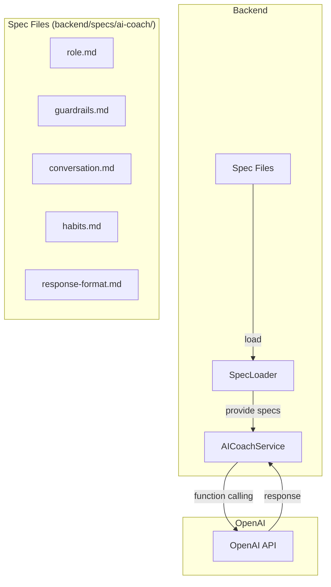

# Design Document: AI Coach Usability Enhancement

## Overview

このドキュメントは、AIコーチエージェントの使用性向上のための設計を定義する。主な変更点は：

1. **仕様の外部化**: `aiCoachSpec.ts`に埋め込まれた仕様を外部マークダウンファイルに分離
2. **会話品質の向上**: より自然で共感的な会話ガイドラインの実装
3. **ガードレールの最適化**: 適切な制限と柔軟性のバランス
4. **応答フォーマットの改善**: 読みやすく行動しやすい応答形式

## Architecture



## Components and Interfaces

### 1. SpecLoader

仕様ファイルを読み込み、システムプロンプトを構築するコンポーネント。

```typescript
interface SpecLoader {
  /**
   * 指定されたディレクトリから全ての仕様ファイルを読み込む
   */
  loadSpecs(specDir: string): Promise<SpecContent>;
  
  /**
   * 仕様をシステムプロンプトに変換
   */
  buildSystemPrompt(specs: SpecContent): string;
  
  /**
   * 仕様ファイルの変更を監視（開発環境用）
   */
  watchForChanges?(specDir: string, callback: () => void): void;
}

interface SpecContent {
  role: string;
  guardrails: string;
  conversation: string;
  habits: string;
  responseFormat: string;
}
```

### 2. 改善されたAICoachService

```typescript
interface AICoachService {
  /**
   * ユーザーメッセージを処理し、応答を生成
   */
  chat(
    userMessage: string,
    conversationHistory: ConversationMessage[],
    options?: ChatOptions
  ): Promise<CoachResponse>;
  
  /**
   * サービスが利用可能かチェック
   */
  isAvailable(): boolean;
}

interface ChatOptions {
  /** 最大応答長（文字数） */
  maxResponseLength?: number;
  /** 感情認識を有効化 */
  enableEmotionRecognition?: boolean;
  /** コンテキスト認識の深さ（メッセージ数） */
  contextDepth?: number;
}

interface ConversationMessage {
  role: 'user' | 'assistant';
  content: string;
  timestamp?: Date;
  metadata?: {
    emotion?: 'positive' | 'neutral' | 'frustrated' | 'confused';
    intent?: 'create_habit' | 'get_advice' | 'analyze' | 'general';
  };
}
```

### 3. GuardrailChecker

ガードレールのチェックを行うコンポーネント。

```typescript
interface GuardrailChecker {
  /**
   * メッセージがスコープ内かチェック
   */
  isWithinScope(message: string): ScopeCheckResult;
  
  /**
   * 習慣提案が安全かチェック
   */
  isHabitSafe(habit: HabitSuggestion): SafetyCheckResult;
  
  /**
   * リダイレクトが必要かチェック
   */
  needsRedirect(message: string, history: ConversationMessage[]): RedirectResult;
}

interface ScopeCheckResult {
  inScope: boolean;
  category?: 'habit' | 'wellness' | 'borderline' | 'out_of_scope';
  suggestedRedirect?: string;
}

interface SafetyCheckResult {
  safe: boolean;
  concerns?: string[];
  alternatives?: HabitSuggestion[];
}

interface RedirectResult {
  needed: boolean;
  redirectCount: number;
  shouldDecline: boolean;
  message?: string;
}
```

## Data Models

### Spec File Structure

```
backend/
└── specs/
    └── ai-coach/
        ├── role.md           # 役割定義
        ├── guardrails.md     # ガードレール
        ├── conversation.md   # 会話ガイドライン
        ├── habits.md         # 習慣提案ガイドライン
        └── response-format.md # 応答フォーマット
```

### role.md の構造

```markdown
# AI Coach Role Definition

## Identity
- Name: Vowの習慣コーチ
- Personality: 温かく、励まし、実践的

## Primary Responsibilities
1. 習慣形成のサポート
2. 行動科学に基づいたアドバイス
3. データ分析と改善提案
4. 習慣の作成・編集支援

## Available Tools
- analyze_habits
- get_workload_summary
- create_habit_suggestion
- create_multiple_habit_suggestions
- ...
```

### guardrails.md の構造

```markdown
# Guardrails

## Absolute Restrictions
- 医療診断・処方の提案禁止
- 法的アドバイス禁止
- 金融・投資アドバイス禁止
- 政治・宗教的意見の表明禁止

## Habit Safety Rules
- 危険な習慣の提案禁止
- 依存性行動の推奨禁止

## Scope Management
- 習慣管理に関係のない質問への対応方法
- リダイレクトの方法と回数制限
```

### conversation.md の構造

```markdown
# Conversation Guidelines

## Emotional Intelligence
- 挨拶への対応
- フラストレーションへの共感
- 小さな成功の祝福

## Clarification Strategy
- 最大2つの質問/ターン
- 合理的な仮定と確認
- 具体的な選択肢の提示

## Context Awareness
- 会話履歴の参照方法
- 曖昧な参照の解決
- セッション内の記憶
```

### habits.md の構造

```markdown
# Habit Suggestion Guidelines

## Principles
- 2分ルール
- 習慣スタッキング
- 環境デザイン
- アイデンティティベース

## Category Templates
- 運動系
- 読書系
- 瞑想系
- 学習系
- ...

## Tool Usage Rules
- 習慣作成意図の検出
- ツール使用のタイミング
- テキストのみの応答を避ける
```

### response-format.md の構造

```markdown
# Response Format Guidelines

## Length Guidelines
- 簡単な確認: 200文字以下
- 分析結果: 箇条書き使用
- 複数選択肢: 番号付き

## Visual Elements
- 絵文字: 1-2個/応答
- 箇条書き: 3項目以上の場合
- 視覚的インジケーター: 📊 💡 ✅

## Call-to-Action
- 常に次のステップを提示
- 質問で会話を続ける
- 具体的なアクションを提案
```

### ConversationContext Model

```typescript
interface ConversationContext {
  /** セッションID */
  sessionId: string;
  
  /** 会話履歴（最新10件） */
  messages: ConversationMessage[];
  
  /** セッション内で言及された習慣 */
  mentionedHabits: string[];
  
  /** セッション内で言及されたゴール */
  mentionedGoals: string[];
  
  /** ユーザーの感情状態 */
  userEmotion?: 'positive' | 'neutral' | 'frustrated' | 'confused';
  
  /** リダイレクト回数 */
  redirectCount: number;
  
  /** 最後に提案した習慣 */
  lastSuggestion?: HabitSuggestion | HabitSuggestion[];
}
```

### 4. 拡張UIコンポーネント

AIコーチが積極的に活用するUIコンポーネント群。

#### ChoiceButtons（選択肢ボタン）

```typescript
interface ChoiceButton {
  id: string;
  label: string;
  icon?: string;
  description?: string;
  action: string; // ボタンクリック時に送信されるメッセージ
  variant?: 'default' | 'primary' | 'destructive';
  urgent?: boolean;
}

interface ChoiceButtonsProps {
  choices: ChoiceButton[];
  onSelect: (choice: ChoiceButton) => void;
  maxVisible?: number; // デフォルト5
}
```

#### HabitStatsCard（習慣統計カード）

```typescript
interface HabitStatsCardProps {
  habitId: string;
  habitName: string;
  completionRate: number;
  trend: 'improving' | 'stable' | 'declining';
  streakDays: number;
  recentHistory: Array<{ date: string; completed: boolean }>;
  onViewDetails?: () => void;
}
```

#### HabitDetailCard（習慣詳細カード）

```typescript
interface HabitDetailCardProps {
  habit: {
    id: string;
    name: string;
    type: 'do' | 'avoid';
    frequency: string;
    targetCount: number;
    workloadUnit: string;
    triggerTime?: string;
    goalName?: string;
  };
  stats: {
    completionRate: number;
    totalCompletions: number;
    currentStreak: number;
    bestStreak: number;
  };
  onEdit?: () => void;
  onDelete?: () => void;
}
```

#### WorkloadChart（ワークロードチャート）

```typescript
interface WorkloadChartProps {
  dailyMinutes: number;
  weeklyMinutes: number;
  status: 'light' | 'moderate' | 'heavy' | 'overloaded';
  breakdown: Array<{
    habitName: string;
    minutes: number;
    percentage: number;
  }>;
  recommendation: string;
}
```

#### ProgressIndicator（進捗インジケーター）

```typescript
interface ProgressIndicatorProps {
  label: string;
  current: number;
  target: number;
  unit?: string;
  showPercentage?: boolean;
  variant?: 'linear' | 'circular';
  color?: 'primary' | 'success' | 'warning' | 'destructive';
}
```

#### QuickActionButtons（クイックアクションボタン）

```typescript
interface QuickAction {
  id: string;
  label: string;
  icon: string;
  action: () => void;
}

interface QuickActionButtonsProps {
  actions: QuickAction[];
  layout?: 'horizontal' | 'grid';
}
```

### 5. AI応答データ構造の拡張

```typescript
interface CoachResponse {
  message: string;
  toolsUsed: string[];
  tokensUsed: number;
  data?: {
    // 既存のデータ
    analysis?: HabitAnalysis[];
    workload?: WorkloadSummary;
    suggestions?: AdjustmentSuggestion[];
    habitDetails?: Record<string, unknown>;
    goalProgress?: Record<string, unknown>;
    parsedHabit?: Record<string, unknown>;
    habitSuggestions?: Array<Record<string, unknown>>;
    
    // 新規: UIコンポーネント指示
    uiComponents?: UIComponentInstruction[];
  };
}

interface UIComponentInstruction {
  type: 'choice_buttons' | 'habit_stats' | 'habit_detail' | 'workload_chart' | 'progress' | 'quick_actions';
  props: Record<string, unknown>;
  position?: 'before_message' | 'after_message' | 'replace_message';
}
```


## Correctness Properties

*A property is a characteristic or behavior that should hold true across all valid executions of a system—essentially, a formal statement about what the system should do. Properties serve as the bridge between human-readable specifications and machine-verifiable correctness guarantees.*

### Property 1: Spec Loading Round-Trip

*For any* valid spec directory containing markdown files, loading the specs and building a system prompt SHALL produce a string containing all file contents in the expected order.

**Validates: Requirements 1.1, 1.2**

### Property 2: Missing Spec File Fallback

*For any* spec directory with one or more missing files, the SpecLoader SHALL return default values for missing files and log warnings, without throwing errors.

**Validates: Requirements 1.4**

### Property 3: Spec Hot-Reload

*For any* spec file modification, the next AI Coach request SHALL use the updated content without requiring service restart.

**Validates: Requirements 1.5**

### Property 4: Greeting Response Quality

*For any* greeting message (e.g., "こんにちは", "おはよう", "hi"), the AI Coach response SHALL contain warm language and a reference to habit-related topics.

**Validates: Requirements 2.1**

### Property 5: Emotional Acknowledgment

*For any* message expressing frustration or difficulty (e.g., "できない", "難しい", "挫折"), the AI Coach response SHALL acknowledge the emotion before providing advice.

**Validates: Requirements 2.2**

### Property 6: Help Options Presentation

*For any* vague help request without specifics, the AI Coach response SHALL contain 2-3 numbered options for the user to choose from.

**Validates: Requirements 2.3**

### Property 7: Question Limit Per Turn

*For any* AI Coach response, the number of clarifying questions SHALL NOT exceed 2.

**Validates: Requirements 2.4**

### Property 8: Wellness Topic Handling

*For any* message about wellness topics related to habits (e.g., sleep quality, stress management for habit formation), the AI Coach SHALL provide helpful responses without rejecting the message.

**Validates: Requirements 3.1, 3.4**

### Property 9: Incidental Mention Tolerance

*For any* message that mentions out-of-scope topics incidentally while primarily discussing habits, the AI Coach SHALL NOT reject the message.

**Validates: Requirements 3.2**

### Property 10: Gentle Redirection

*For any* borderline topic message, the AI Coach response SHALL contain language redirecting to habit-related aspects.

**Validates: Requirements 3.3**

### Property 11: Redirect Limit and Decline

*For any* conversation with 2 or more out-of-scope redirects, the next out-of-scope request SHALL result in a polite decline.

**Validates: Requirements 3.5**

### Property 12: Tool Usage for Habit Creation

*For any* message expressing intent to create a habit, the AI Coach SHALL call the habit suggestion tool within 2 conversation turns, and SHALL NOT output habit suggestions as plain text.

**Validates: Requirements 4.1, 4.3**

### Property 13: Multiple Suggestions Tool Usage

*For any* request for multiple habits related to a goal, the AI Coach SHALL use the `create_multiple_habit_suggestions` tool.

**Validates: Requirements 4.2**

### Property 14: Suggestion Modification Handling

*For any* user request to modify a previously suggested habit, the AI Coach SHALL call the habit suggestion tool with updated parameters.

**Validates: Requirements 4.4**

### Property 15: Confirmation Acknowledgment

*For any* user confirmation of a habit suggestion, the AI Coach response SHALL contain acknowledgment and next steps.

**Validates: Requirements 4.5**

### Property 16: Response Format Constraints

*For any* AI Coach response:
- Simple acknowledgments SHALL be under 200 characters
- Analysis responses SHALL contain bullet points or visual indicators
- Responses SHALL end with a call-to-action or question
- Multiple options SHALL be numbered
- Emoji count SHALL NOT exceed 2

**Validates: Requirements 5.1, 5.2, 5.3, 5.4, 5.5**

### Property 17: Context Awareness

*For any* conversation with multiple turns, the AI Coach SHALL correctly recall:
- Previously mentioned topics
- User preferences stated in the session
- Habits and goals discussed

**Validates: Requirements 6.1, 6.2, 6.5**

### Property 18: Reference Resolution

*For any* message containing ambiguous references (e.g., "that one", "it"), the AI Coach SHALL either correctly identify the referent or ask for clarification with specific options.

**Validates: Requirements 6.3, 6.4**

### Property 19: Graceful Error Handling

*For any* error condition (tool failure, missing data, rate limit):
- The AI Coach SHALL provide a helpful fallback response
- Technical error messages SHALL NOT be exposed to users
- The response SHALL suggest next steps

**Validates: Requirements 7.1, 7.2, 7.3, 7.4, 7.5**

### Property 20: Behavioral Science Integration

*For any* habit suggestion or struggle-related message:
- Suggestions SHALL reference behavioral science principles
- Habit stacking SHALL be suggested when appropriate
- The 2-minute rule SHALL be suggested for struggles
- Milestone achievements SHALL include identity-based language

**Validates: Requirements 8.1, 8.2, 8.3, 8.5**

### Property 21: UI Component Usage for Structured Data

*For any* response containing structured data (habit stats, workload, progress), the AI Coach SHALL include appropriate UIComponentInstruction instead of plain text formatting.

**Validates: Requirements 9.1, 9.2, 9.3, 9.5, 9.6, 9.7**

### Property 22: Choice Buttons for Options

*For any* response presenting 2-5 options to the user, the AI Coach SHALL include ChoiceButtons UIComponentInstruction with clickable options.

**Validates: Requirements 9.4, 10.1, 10.2, 10.3, 10.5**

### Property 23: Choice Button Click Handling

*For any* ChoiceButton click, the system SHALL send the button's action as a user message and process it through the normal conversation flow.

**Validates: Requirements 10.2**

## Error Handling

### Spec Loading Errors

| Error | Handling |
|-------|----------|
| Spec directory not found | Use embedded default specs, log error |
| Individual file missing | Use default for that section, log warning |
| File read error | Retry once, then use default |
| Invalid markdown format | Use raw content, log warning |

### AI Response Errors

| Error | Handling |
|-------|----------|
| OpenAI API error | Return friendly error message, suggest retry |
| Tool execution failure | Provide text-based fallback response |
| Rate limit exceeded | Inform user politely, suggest waiting |
| Context too long | Truncate older messages, continue |

### Guardrail Violations

| Violation | Handling |
|-----------|----------|
| Out-of-scope request | Redirect to habit topics (max 2 times) |
| Unsafe habit suggestion | Block and suggest safer alternative |
| Persistent out-of-scope | Politely decline, offer habit help |

## Testing Strategy

### Unit Tests

Unit tests will verify specific examples and edge cases:

1. **SpecLoader Tests**
   - Load valid spec directory
   - Handle missing files
   - Handle empty files
   - Verify file combination order

2. **GuardrailChecker Tests**
   - In-scope message detection
   - Out-of-scope message detection
   - Borderline topic handling
   - Unsafe habit detection

3. **Response Formatter Tests**
   - Character count limits
   - Emoji count limits
   - Bullet point formatting
   - Numbered list formatting

### Property-Based Tests

Property-based tests will verify universal properties using a PBT library (e.g., fast-check for TypeScript):

1. **Spec Loading Properties**
   - Property 1: Round-trip loading
   - Property 2: Missing file fallback
   - Property 3: Hot-reload behavior

2. **Conversation Quality Properties**
   - Property 4-7: Response quality constraints
   - Property 16: Format constraints

3. **Guardrail Properties**
   - Property 8-11: Scope handling
   - Property 19: Error handling

4. **Tool Usage Properties**
   - Property 12-15: Tool selection and usage

5. **Context Properties**
   - Property 17-18: Context awareness and reference resolution

6. **Behavioral Science Properties**
   - Property 20: Science integration

### Test Configuration

- Minimum 100 iterations per property test
- Each test tagged with: **Feature: ai-coach-usability-enhancement, Property {number}: {property_text}**
- Use fast-check for TypeScript property-based testing
