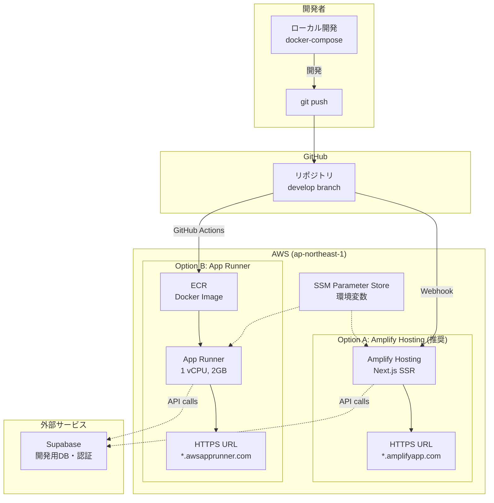
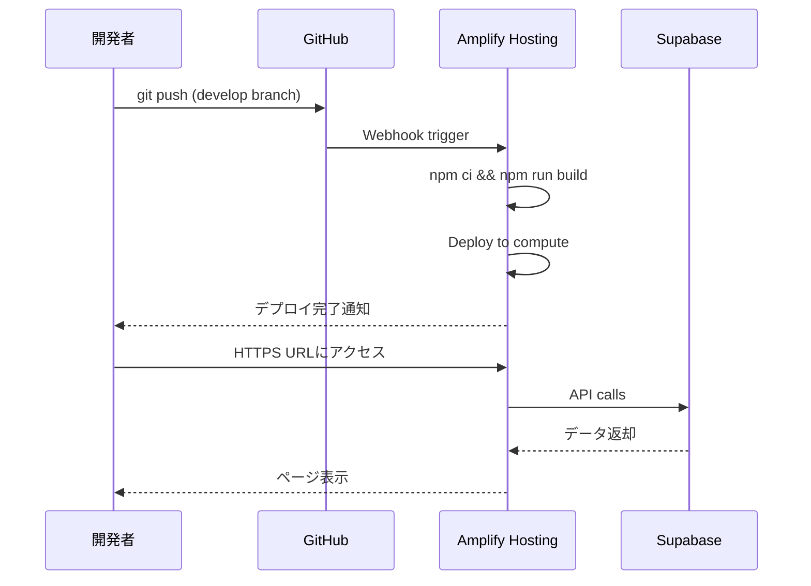

# 設計ドキュメント

## 概要

本設計書は、習慣管理ダッシュボードアプリケーションの開発環境をAWSクラウドにサーバーレスアーキテクチャで構築するためのアーキテクチャと実装方針を定義します。本番環境（Vercel + Supabase）は現状維持とし、開発環境のみをAWSに構築します。

主な特徴：
- AWS Amplify Hosting（推奨）またはApp Runnerによるサーバーレスデプロイ
- Dockerコンテナ化による環境の一貫性
- AWS CDK（Python）によるインフラのコード化
- GitHub連携による自動デプロイ
- 無料枠・低コスト運用

## アーキテクチャ

### 全体構成図



### デプロイフロー



## コンポーネントとインターフェース

### プロジェクト構成

```
vow/
├── frontend/                    # Next.jsアプリケーション
│   ├── Dockerfile              # コンテナ定義
│   ├── .dockerignore           # Docker除外設定
│   └── ...
├── infra/                       # AWS CDK (Python)
│   ├── app.py                  # CDKエントリーポイント
│   ├── stack.py                # メインスタック
│   ├── requirements.txt        # Python依存関係
│   └── cdk.json                # CDK設定
├── docker-compose.yml          # ローカル開発用
├── amplify.yml                 # Amplifyビルド設定
└── .github/
    └── workflows/
        └── deploy-apprunner.yml # App Runner用CI/CD (オプション)
```

### CDKスタック設計

```python
# infra/stack.py
from aws_cdk import (
    Stack,
    aws_amplify_alpha as amplify,
    aws_ssm as ssm,
    SecretValue,
)
from constructs import Construct

class VowDevStack(Stack):
    """開発環境用CDKスタック"""
    
    def __init__(self, scope: Construct, construct_id: str, **kwargs) -> None:
        super().__init__(scope, construct_id, **kwargs)
        
        # Amplify App
        self.amplify_app = amplify.App(
            self, "VowDevApp",
            app_name="vow-dev",
            source_code_provider=amplify.GitHubSourceCodeProvider(
                owner="<github-owner>",
                repository="<repo-name>",
                oauth_token=SecretValue.secrets_manager("github-token")
            ),
            platform=amplify.Platform.WEB_COMPUTE,  # Next.js SSR
            environment_variables={
                "NEXT_PUBLIC_SUPABASE_URL": ssm.StringParameter.value_for_string_parameter(
                    self, "/vow/dev/supabase-url"
                ),
            },
            build_spec=codebuild.BuildSpec.from_object({
                "version": 1,
                "frontend": {
                    "phases": {
                        "preBuild": {"commands": ["cd frontend", "npm ci"]},
                        "build": {"commands": ["npm run build"]}
                    },
                    "artifacts": {
                        "baseDirectory": "frontend/.next",
                        "files": ["**/*"]
                    },
                    "cache": {"paths": ["frontend/node_modules/**/*"]}
                }
            })
        )
        
        # develop branch
        self.develop_branch = self.amplify_app.add_branch(
            "develop",
            auto_build=True,
            stage=amplify.BranchStage.DEVELOPMENT
        )
```

### Dockerfile設計

```dockerfile
# frontend/Dockerfile
# Multi-stage build for optimized image size

# Stage 1: Dependencies
FROM node:20-alpine AS deps
WORKDIR /app
COPY package*.json ./
RUN npm ci --only=production

# Stage 2: Builder
FROM node:20-alpine AS builder
WORKDIR /app
COPY --from=deps /app/node_modules ./node_modules
COPY . .
RUN npm run build

# Stage 3: Runner
FROM node:20-alpine AS runner
WORKDIR /app
ENV NODE_ENV=production
RUN addgroup --system --gid 1001 nodejs
RUN adduser --system --uid 1001 nextjs

COPY --from=builder /app/public ./public
COPY --from=builder --chown=nextjs:nodejs /app/.next/standalone ./
COPY --from=builder --chown=nextjs:nodejs /app/.next/static ./.next/static

USER nextjs
EXPOSE 3000
ENV PORT=3000
CMD ["node", "server.js"]
```

### docker-compose設計

```yaml
# docker-compose.yml
version: '3.8'

services:
  frontend:
    build:
      context: ./frontend
      dockerfile: Dockerfile
      target: builder  # 開発時はbuilderステージを使用
    ports:
      - "3000:3000"
    volumes:
      - ./frontend:/app
      - /app/node_modules
      - /app/.next
    environment:
      - NODE_ENV=development
      - NEXT_PUBLIC_SUPABASE_URL=${NEXT_PUBLIC_SUPABASE_URL}
      - NEXT_PUBLIC_SUPABASE_ANON_KEY=${NEXT_PUBLIC_SUPABASE_ANON_KEY}
    command: npm run dev
```

### Amplifyビルド設定

```yaml
# amplify.yml
version: 1
frontend:
  phases:
    preBuild:
      commands:
        - cd frontend
        - npm ci
    build:
      commands:
        - npm run build
  artifacts:
    baseDirectory: frontend/.next
    files:
      - '**/*'
  cache:
    paths:
      - frontend/node_modules/**/*
```

## データモデル

本設計では、データベースは本番環境と同じSupabaseを使用します。開発環境用に別のSupabaseプロジェクトを作成することを推奨します。

## 正確性プロパティ

### Property 1: デプロイの一貫性

*For any* git push to develop branch, the Amplify Hosting SHALL trigger a build and deploy within 5 minutes.

**Validates: Requirements 3.4, 7.1**

### Property 2: 環境変数の安全性

*For any* sensitive value (API keys, tokens), the value SHALL NOT be committed to repository and SHALL be stored in SSM Parameter Store or Secrets Manager.

**Validates: Requirements 6.3, 6.4**

### Property 3: コスト制限

*For any* monthly billing period, the total AWS cost SHALL stay under $5 when using Amplify Hosting Free Tier for development usage.

**Validates: Requirements 9.1, 9.4**

## エラーハンドリング

### ビルドエラー

| エラー種別 | 原因 | 対処方法 |
|-----------|------|---------|
| Build Failed | 依存関係エラー | package-lock.jsonを確認、npm ci実行 |
| Out of Memory | ビルドメモリ不足 | Amplifyのビルド設定でメモリ増加 |
| Timeout | ビルド時間超過 | ビルドコマンドの最適化 |

### デプロイエラー

| エラー種別 | 原因 | 対処方法 |
|-----------|------|---------|
| Permission Denied | IAMロール不足 | サービスロールの権限確認 |
| Environment Variable Missing | 環境変数未設定 | SSM Parameter Store確認 |

## テスト戦略

### ローカル開発テスト

1. **docker-compose起動テスト**: `docker-compose up`でアプリが起動すること
2. **ホットリロードテスト**: ファイル変更が即座に反映されること
3. **Supabase接続テスト**: 開発用Supabaseにアクセスできること

### CDKテスト

1. **スナップショットテスト**: CDKスタックの構成が期待通りであること
2. **合成テスト**: `cdk synth`がエラーなく完了すること

## コスト見積もり

### Option A: Amplify Hosting（推奨）

| 項目 | 無料枠 | 超過料金 |
|------|--------|---------|
| ビルド時間 | 1000分/月 | $0.01/分 |
| データ転送 | 15GB/月 | $0.15/GB |
| リクエスト | 500,000/月 | $0.30/100万 |
| SSR実行時間 | - | $0.0000556/GB-秒 |

### Option B: App Runner

| 項目 | 料金 |
|------|------|
| vCPU | $0.064/vCPU-時間 |
| メモリ | $0.007/GB-時間 |
| プロビジョニング | $0.007/GB-時間（アイドル時） |

### 想定月額コスト

| シナリオ | Amplify Hosting | App Runner |
|---------|-----------------|------------|
| 軽量利用（週5時間開発） | **$0（無料枠内）** | ~$5 |
| 標準利用（週15時間開発） | **$0〜$2** | ~$15 |
| ヘビー利用（週30時間開発） | ~$5 | ~$30 |

## 比較: Amplify Hosting vs App Runner

| 項目 | Amplify Hosting | App Runner |
|------|-----------------|------------|
| 月額コスト | **$0〜$5** | $5〜$30 |
| セットアップ | **簡単（GitHub連携のみ）** | 中程度（ECR + CI/CD） |
| Next.js SSR | **ネイティブサポート** | Dockerで対応 |
| コンテナ | 不要 | **必要** |
| カスタマイズ性 | 中 | **高** |
| 無料枠 | **あり** | なし |

**推奨**: 開発環境には**Amplify Hosting**を使用。コンテナ化が必要な場合のみApp Runnerを検討。

## 制限事項

1. **Amplify Hosting**: Next.js 12〜15のみサポート
2. **App Runner**: 無料枠なし、最小コストが発生
3. **リージョン**: ap-northeast-1（東京）を使用
4. **Supabase**: 開発用プロジェクトの作成を推奨

## 将来の拡張

1. **クラウドIDE**: Cloud9またはcode-serverの追加
2. **プレビュー環境**: PRごとのプレビューデプロイ
3. **本番移行**: 本番環境もAWSに移行する場合の拡張
