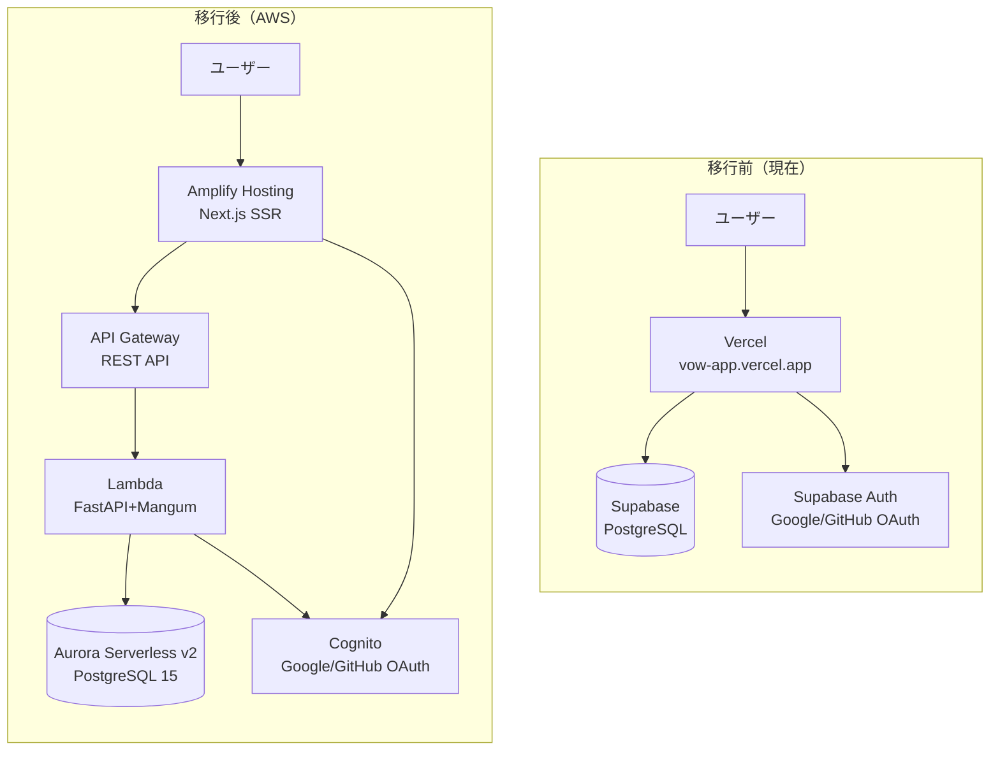
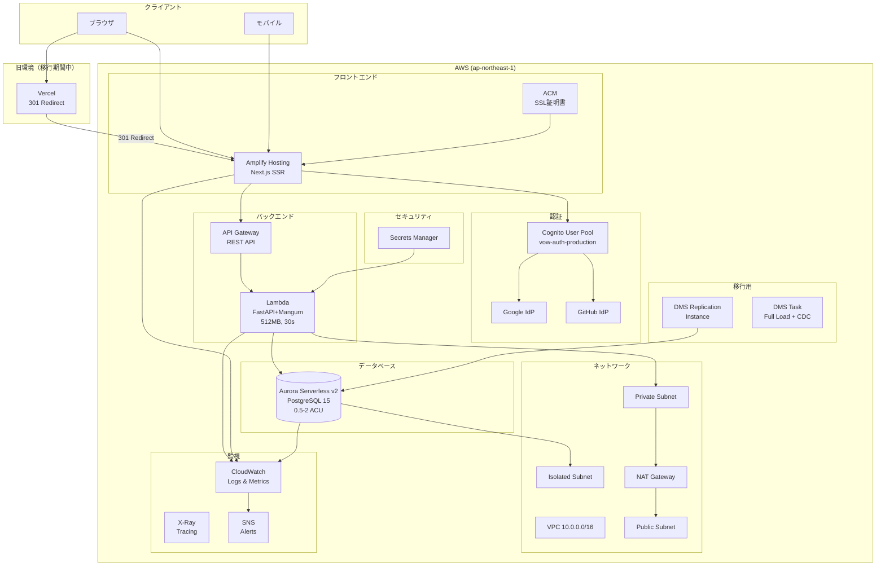
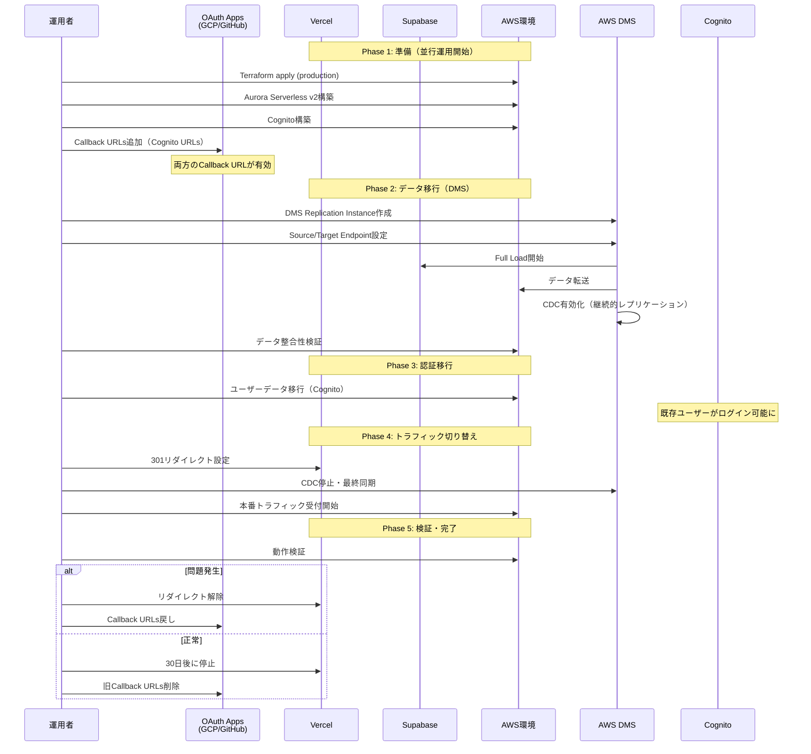
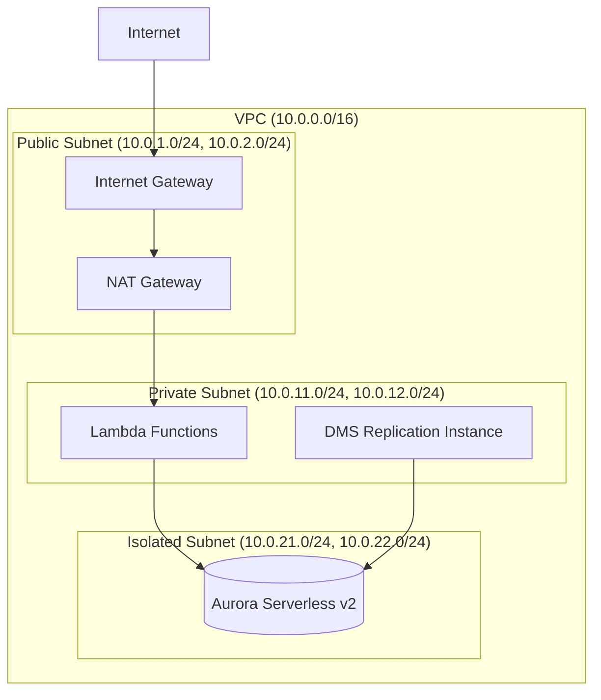

# 設計ドキュメント

## 概要

本設計書は、習慣管理ダッシュボードアプリケーションの本番環境をVercel + SupabaseからAWSに移行するためのアーキテクチャと実装方針を定義します。

主な特徴：
- Blue-Green Deploymentによるゼロダウンタイム移行
- AWS DMSによるデータベース移行（Full Load + CDC）
- 既存Terraformモジュールの再利用（開発環境と同一構成）
- 旧URL（vow-app.vercel.app）からの自動リダイレクト
- OAuth認証の並行運用によるゼロダウンタイム認証移行
- 完全なロールバック機能の確保

## アーキテクチャ

### 移行前後の構成比較



### 本番環境アーキテクチャ（移行後）



### 移行フロー（Blue-Green Deployment with DMS）



### VPCネットワーク構成（Terraform既存モジュール）



## コンポーネントとインターフェース

### プロジェクト構成（追加・更新ファイル）

```
vow/
├── backend/                     # FastAPIバックエンド（既存）
│   ├── app/
│   │   ├── main.py             # Mangumアダプター対応済み
│   │   ├── middleware/
│   │   │   └── auth.py         # Cognito JWT対応
│   │   └── ...
│   ├── lambda_handler.py       # Lambda用エントリーポイント（既存）
│   └── ...
├── infra/
│   └── terraform/              # Terraform設定（更新）
│       ├── aurora.tf           # Aurora設定（本番用パラメータ追加）
│       ├── cognito.tf          # Cognito設定（本番用パラメータ追加）
│       ├── lambda.tf           # Lambda設定（既存）
│       ├── network.tf          # VPC設定（既存）
│       ├── dms.tf              # DMS設定（新規）
│       ├── amplify.tf          # Amplify設定（新規）
│       ├── monitoring.tf       # 監視設定（新規）
│       ├── variables.tf        # 変数定義（本番用追加）
│       ├── terraform.tfvars    # 開発環境用
│       └── terraform.production.tfvars  # 本番環境用（新規）
├── scripts/
│   └── migration/              # 移行スクリプト
│       ├── verify_data.py      # データ検証
│       ├── migrate_users.py    # ユーザー移行
│       └── rollback.sh         # ロールバック
├── docs/
│   └── AWS_PRODUCTION_MIGRATION.md  # 移行手順書（新規）
└── .github/
    └── workflows/
        ├── deploy-frontend-prod.yml  # 本番フロントエンドCI/CD（新規）
        └── deploy-lambda-prod.yml    # Lambda CI/CD（新規）
```

### Terraform本番環境設定

```hcl
# infra/terraform/terraform.production.tfvars
environment = "production"
project_name = "vow"
aws_region = "ap-northeast-1"

# Network
vpc_cidr = "10.0.0.0/16"
availability_zones = ["ap-northeast-1a", "ap-northeast-1c"]

# Aurora (本番設定)
aurora_min_capacity = 0.5
aurora_max_capacity = 4.0
database_name = "vow"

# Cognito OAuth (本番用)
google_client_id = "YOUR_GOOGLE_CLIENT_ID"
google_client_secret = "YOUR_GOOGLE_CLIENT_SECRET"
github_client_id = "YOUR_GITHUB_CLIENT_ID"
github_client_secret = "YOUR_GITHUB_CLIENT_SECRET"

callback_urls = [
  "https://YOUR_AMPLIFY_DOMAIN/auth/callback",
  "http://localhost:3000/auth/callback"
]
logout_urls = [
  "https://YOUR_AMPLIFY_DOMAIN",
  "http://localhost:3000"
]

# Lambda
lambda_memory_size = 512
lambda_timeout = 30
```

### DMS設定（新規Terraformリソース）

```hcl
# infra/terraform/dms.tf
# =================================================================
# AWS DMS for Supabase to Aurora Migration
# =================================================================

# DMS Replication Subnet Group
resource "aws_dms_replication_subnet_group" "main" {
  count = var.enable_dms ? 1 : 0
  
  replication_subnet_group_id          = "${var.project_name}-${var.environment}-dms-subnet"
  replication_subnet_group_description = "DMS subnet group for database migration"
  subnet_ids                           = aws_subnet.private[*].id

  tags = {
    Name = "${var.project_name}-${var.environment}-dms-subnet-group"
  }
}

# DMS Replication Instance
resource "aws_dms_replication_instance" "main" {
  count = var.enable_dms ? 1 : 0
  
  replication_instance_id     = "${var.project_name}-${var.environment}-dms"
  replication_instance_class  = "dms.t3.medium"
  allocated_storage           = 50
  vpc_security_group_ids      = [aws_security_group.dms[0].id]
  replication_subnet_group_id = aws_dms_replication_subnet_group.main[0].id
  
  publicly_accessible = false
  multi_az            = false  # コスト最適化

  tags = {
    Name = "${var.project_name}-${var.environment}-dms-instance"
  }
}

# DMS Security Group
resource "aws_security_group" "dms" {
  count = var.enable_dms ? 1 : 0
  
  name        = "${var.project_name}-${var.environment}-dms-sg"
  description = "Security group for DMS replication instance"
  vpc_id      = aws_vpc.main.id

  egress {
    from_port   = 0
    to_port     = 0
    protocol    = "-1"
    cidr_blocks = ["0.0.0.0/0"]
    description = "Allow all outbound traffic"
  }

  tags = {
    Name = "${var.project_name}-${var.environment}-dms-sg"
  }
}

# Allow DMS to connect to Aurora
resource "aws_security_group_rule" "aurora_from_dms" {
  count = var.enable_dms ? 1 : 0
  
  type                     = "ingress"
  from_port                = 5432
  to_port                  = 5432
  protocol                 = "tcp"
  source_security_group_id = aws_security_group.dms[0].id
  security_group_id        = aws_security_group.aurora.id
  description              = "Allow PostgreSQL from DMS"
}

# DMS Source Endpoint (Supabase)
resource "aws_dms_endpoint" "source" {
  count = var.enable_dms ? 1 : 0
  
  endpoint_id   = "${var.project_name}-${var.environment}-supabase-source"
  endpoint_type = "source"
  engine_name   = "postgres"
  
  server_name   = var.supabase_host
  port          = 5432
  database_name = var.supabase_database
  username      = var.supabase_username
  password      = var.supabase_password
  ssl_mode      = "require"

  tags = {
    Name = "${var.project_name}-${var.environment}-dms-source"
  }
}

# DMS Target Endpoint (Aurora)
resource "aws_dms_endpoint" "target" {
  count = var.enable_dms ? 1 : 0
  
  endpoint_id   = "${var.project_name}-${var.environment}-aurora-target"
  endpoint_type = "target"
  engine_name   = "aurora-postgresql"
  
  server_name   = aws_rds_cluster.aurora.endpoint
  port          = 5432
  database_name = var.database_name
  
  secrets_manager_arn             = aws_rds_cluster.aurora.master_user_secret[0].secret_arn
  secrets_manager_access_role_arn = aws_iam_role.dms_secrets_access[0].arn

  tags = {
    Name = "${var.project_name}-${var.environment}-dms-target"
  }
}

# DMS Replication Task
resource "aws_dms_replication_task" "main" {
  count = var.enable_dms ? 1 : 0
  
  replication_task_id      = "${var.project_name}-${var.environment}-migration"
  migration_type           = "full-load-and-cdc"
  replication_instance_arn = aws_dms_replication_instance.main[0].replication_instance_arn
  source_endpoint_arn      = aws_dms_endpoint.source[0].endpoint_arn
  target_endpoint_arn      = aws_dms_endpoint.target[0].endpoint_arn
  
  table_mappings = jsonencode({
    rules = [
      {
        rule-type = "selection"
        rule-id   = "1"
        rule-name = "include-all-tables"
        object-locator = {
          schema-name = "public"
          table-name  = "%"
        }
        rule-action = "include"
      }
    ]
  })

  replication_task_settings = jsonencode({
    TargetMetadata = {
      SupportLobs          = true
      FullLobMode          = false
      LobChunkSize         = 64
      LimitedSizeLobMode   = true
      LobMaxSize           = 32
    }
    FullLoadSettings = {
      TargetTablePrepMode = "DROP_AND_CREATE"
    }
    Logging = {
      EnableLogging = true
    }
  })

  tags = {
    Name = "${var.project_name}-${var.environment}-dms-task"
  }
}

# IAM Role for DMS Secrets Manager Access
resource "aws_iam_role" "dms_secrets_access" {
  count = var.enable_dms ? 1 : 0
  
  name = "${var.project_name}-${var.environment}-dms-secrets-role"

  assume_role_policy = jsonencode({
    Version = "2012-10-17"
    Statement = [
      {
        Action = "sts:AssumeRole"
        Effect = "Allow"
        Principal = {
          Service = "dms.amazonaws.com"
        }
      }
    ]
  })
}

resource "aws_iam_role_policy" "dms_secrets_access" {
  count = var.enable_dms ? 1 : 0
  
  name = "${var.project_name}-${var.environment}-dms-secrets-policy"
  role = aws_iam_role.dms_secrets_access[0].id

  policy = jsonencode({
    Version = "2012-10-17"
    Statement = [
      {
        Effect = "Allow"
        Action = [
          "secretsmanager:GetSecretValue"
        ]
        Resource = aws_rds_cluster.aurora.master_user_secret[0].secret_arn
      }
    ]
  })
}
```


### Amplify Hosting設定（新規Terraformリソース）

```hcl
# infra/terraform/amplify.tf
# =================================================================
# AWS Amplify Hosting for Production Frontend
# =================================================================

resource "aws_amplify_app" "frontend" {
  count = var.environment == "production" ? 1 : 0
  
  name       = "${var.project_name}-${var.environment}"
  repository = var.github_repository_url
  
  # GitHub OAuth token from Secrets Manager
  access_token = var.github_access_token

  platform = "WEB_COMPUTE"  # SSR support

  build_spec = <<-EOT
    version: 1
    frontend:
      phases:
        preBuild:
          commands:
            - cd frontend
            - npm ci
        build:
          commands:
            - npm run build
      artifacts:
        baseDirectory: frontend/.next
        files:
          - '**/*'
      cache:
        paths:
          - frontend/node_modules/**/*
          - frontend/.next/cache/**/*
  EOT

  environment_variables = {
    NEXT_PUBLIC_API_URL              = "https://${aws_apigatewayv2_api.main.id}.execute-api.${var.aws_region}.amazonaws.com"
    NEXT_PUBLIC_COGNITO_USER_POOL_ID = aws_cognito_user_pool.main.id
    NEXT_PUBLIC_COGNITO_CLIENT_ID    = aws_cognito_user_pool_client.main.id
    NEXT_PUBLIC_COGNITO_DOMAIN       = "${var.project_name}-auth-${var.environment}"
    NEXT_PUBLIC_COGNITO_REGION       = var.aws_region
  }

  # Auto branch creation disabled for production
  enable_auto_branch_creation = false

  tags = {
    Name = "${var.project_name}-${var.environment}-amplify"
  }
}

# Production branch
resource "aws_amplify_branch" "main" {
  count = var.environment == "production" ? 1 : 0
  
  app_id      = aws_amplify_app.frontend[0].id
  branch_name = "main"
  
  framework = "Next.js - SSR"
  stage     = "PRODUCTION"

  enable_auto_build = true

  environment_variables = {
    NODE_ENV = "production"
  }
}

# Custom domain (optional)
resource "aws_amplify_domain_association" "main" {
  count = var.environment == "production" && var.custom_domain != "" ? 1 : 0
  
  app_id      = aws_amplify_app.frontend[0].id
  domain_name = var.custom_domain

  sub_domain {
    branch_name = aws_amplify_branch.main[0].branch_name
    prefix      = ""
  }

  sub_domain {
    branch_name = aws_amplify_branch.main[0].branch_name
    prefix      = "www"
  }
}
```

### 監視設定（新規Terraformリソース）

```hcl
# infra/terraform/monitoring.tf
# =================================================================
# CloudWatch Monitoring and Alarms
# =================================================================

# SNS Topic for Alerts
resource "aws_sns_topic" "alerts" {
  count = var.environment == "production" ? 1 : 0
  
  name = "${var.project_name}-${var.environment}-alerts"

  tags = {
    Name = "${var.project_name}-${var.environment}-alerts"
  }
}

# Email subscription (optional)
resource "aws_sns_topic_subscription" "email" {
  count = var.environment == "production" && var.alert_email != "" ? 1 : 0
  
  topic_arn = aws_sns_topic.alerts[0].arn
  protocol  = "email"
  endpoint  = var.alert_email
}

# CloudWatch Dashboard
resource "aws_cloudwatch_dashboard" "main" {
  count = var.environment == "production" ? 1 : 0
  
  dashboard_name = "${var.project_name}-${var.environment}"

  dashboard_body = jsonencode({
    widgets = [
      {
        type   = "metric"
        x      = 0
        y      = 0
        width  = 12
        height = 6
        properties = {
          title  = "Lambda Invocations & Errors"
          region = var.aws_region
          metrics = [
            ["AWS/Lambda", "Invocations", "FunctionName", aws_lambda_function.api.function_name],
            [".", "Errors", ".", "."]
          ]
          period = 300
          stat   = "Sum"
        }
      },
      {
        type   = "metric"
        x      = 12
        y      = 0
        width  = 12
        height = 6
        properties = {
          title  = "Lambda Duration"
          region = var.aws_region
          metrics = [
            ["AWS/Lambda", "Duration", "FunctionName", aws_lambda_function.api.function_name, { stat = "p50" }],
            ["...", { stat = "p99" }]
          ]
          period = 300
        }
      },
      {
        type   = "metric"
        x      = 0
        y      = 6
        width  = 12
        height = 6
        properties = {
          title  = "Aurora CPU & Connections"
          region = var.aws_region
          metrics = [
            ["AWS/RDS", "CPUUtilization", "DBClusterIdentifier", aws_rds_cluster.aurora.cluster_identifier],
            [".", "DatabaseConnections", ".", "."]
          ]
          period = 300
        }
      },
      {
        type   = "metric"
        x      = 12
        y      = 6
        width  = 12
        height = 6
        properties = {
          title  = "Aurora ACU Utilization"
          region = var.aws_region
          metrics = [
            ["AWS/RDS", "ServerlessDatabaseCapacity", "DBClusterIdentifier", aws_rds_cluster.aurora.cluster_identifier]
          ]
          period = 300
        }
      }
    ]
  })
}

# Lambda Error Alarm
resource "aws_cloudwatch_metric_alarm" "lambda_errors" {
  count = var.environment == "production" ? 1 : 0
  
  alarm_name          = "${var.project_name}-${var.environment}-lambda-errors"
  comparison_operator = "GreaterThanThreshold"
  evaluation_periods  = 2
  metric_name         = "Errors"
  namespace           = "AWS/Lambda"
  period              = 300
  statistic           = "Sum"
  threshold           = 5
  alarm_description   = "Lambda function error rate exceeded threshold"
  
  dimensions = {
    FunctionName = aws_lambda_function.api.function_name
  }

  alarm_actions = var.environment == "production" ? [aws_sns_topic.alerts[0].arn] : []
  ok_actions    = var.environment == "production" ? [aws_sns_topic.alerts[0].arn] : []

  tags = {
    Name = "${var.project_name}-${var.environment}-lambda-errors-alarm"
  }
}

# Lambda Duration Alarm (p99 > 2s)
resource "aws_cloudwatch_metric_alarm" "lambda_duration" {
  count = var.environment == "production" ? 1 : 0
  
  alarm_name          = "${var.project_name}-${var.environment}-lambda-duration"
  comparison_operator = "GreaterThanThreshold"
  evaluation_periods  = 3
  metric_name         = "Duration"
  namespace           = "AWS/Lambda"
  period              = 300
  extended_statistic  = "p99"
  threshold           = 2000  # 2 seconds
  alarm_description   = "Lambda p99 latency exceeded 2 seconds"
  
  dimensions = {
    FunctionName = aws_lambda_function.api.function_name
  }

  alarm_actions = var.environment == "production" ? [aws_sns_topic.alerts[0].arn] : []

  tags = {
    Name = "${var.project_name}-${var.environment}-lambda-duration-alarm"
  }
}

# Aurora CPU Alarm
resource "aws_cloudwatch_metric_alarm" "aurora_cpu" {
  count = var.environment == "production" ? 1 : 0
  
  alarm_name          = "${var.project_name}-${var.environment}-aurora-cpu"
  comparison_operator = "GreaterThanThreshold"
  evaluation_periods  = 3
  metric_name         = "CPUUtilization"
  namespace           = "AWS/RDS"
  period              = 300
  statistic           = "Average"
  threshold           = 80
  alarm_description   = "Aurora CPU utilization exceeded 80%"
  
  dimensions = {
    DBClusterIdentifier = aws_rds_cluster.aurora.cluster_identifier
  }

  alarm_actions = var.environment == "production" ? [aws_sns_topic.alerts[0].arn] : []

  tags = {
    Name = "${var.project_name}-${var.environment}-aurora-cpu-alarm"
  }
}
```

### 本番用変数追加

```hcl
# infra/terraform/variables.tf (追加分)

variable "enable_dms" {
  description = "Enable DMS for database migration"
  type        = bool
  default     = false
}

variable "supabase_host" {
  description = "Supabase PostgreSQL host"
  type        = string
  default     = ""
  sensitive   = true
}

variable "supabase_database" {
  description = "Supabase database name"
  type        = string
  default     = "postgres"
}

variable "supabase_username" {
  description = "Supabase database username"
  type        = string
  default     = ""
  sensitive   = true
}

variable "supabase_password" {
  description = "Supabase database password"
  type        = string
  default     = ""
  sensitive   = true
}

variable "github_repository_url" {
  description = "GitHub repository URL for Amplify"
  type        = string
  default     = ""
}

variable "github_access_token" {
  description = "GitHub access token for Amplify"
  type        = string
  default     = ""
  sensitive   = true
}

variable "custom_domain" {
  description = "Custom domain for Amplify (optional)"
  type        = string
  default     = ""
}

variable "alert_email" {
  description = "Email address for CloudWatch alerts"
  type        = string
  default     = ""
}
```

### Aurora本番設定更新

```hcl
# infra/terraform/aurora.tf (本番用条件追加)

resource "aws_rds_cluster" "aurora" {
  # ... 既存設定 ...
  
  # 本番環境では削除保護を有効化
  deletion_protection = var.environment == "production" ? true : false
  
  # 本番環境ではスナップショットを保持
  skip_final_snapshot       = var.environment == "production" ? false : true
  final_snapshot_identifier = var.environment == "production" ? "${var.project_name}-${var.environment}-final-snapshot" : null
  
  # 本番環境ではバックアップ保持期間を延長
  backup_retention_period = var.environment == "production" ? 14 : 7
}
```

## データモデル

### 移行対象テーブル

| テーブル名 | 説明 | 行数目安 | 移行優先度 |
|-----------|------|---------|-----------|
| habits | 習慣データ | ~100 | 高 |
| habit_logs | 習慣記録 | ~10,000 | 高 |
| goals | 目標データ | ~50 | 高 |
| tasks | タスクデータ | ~500 | 高 |
| activities | アクティビティログ | ~5,000 | 中 |
| mindmaps | マインドマップデータ | ~20 | 高 |
| mindmap_nodes | マインドマップノード | ~200 | 高 |

### ユーザー移行マッピング（Supabase Auth → Cognito）

```python
# Supabase Auth → Cognito マッピング
SUPABASE_TO_COGNITO_MAPPING = {
    "id": "custom:supabase_id",  # 元のUUIDを保持
    "email": "email",
    "raw_user_meta_data.full_name": "name",
    "raw_user_meta_data.avatar_url": "picture",
    "created_at": "custom:created_at",
    "app_metadata.provider": "custom:auth_provider"
}
```

### データ検証スクリプト

```python
# scripts/migration/verify_data.py
"""
DMS移行後のデータ整合性を検証するスクリプト
"""
import asyncio
import json
import hashlib
import asyncpg
import boto3
from typing import Dict, List

class DataVerifier:
    """データ整合性検証"""
    
    TABLES = [
        "habits",
        "habit_logs",
        "goals", 
        "tasks",
        "activities",
        "mindmaps",
        "mindmap_nodes"
    ]
    
    def __init__(
        self,
        source_conn_string: str,
        target_secret_arn: str,
        region: str = "ap-northeast-1"
    ):
        self.source_conn_string = source_conn_string
        self.target_secret_arn = target_secret_arn
        self.region = region
    
    def _get_target_connection_string(self) -> str:
        """Secrets Managerから接続文字列を取得"""
        client = boto3.client("secretsmanager", region_name=self.region)
        response = client.get_secret_value(SecretId=self.target_secret_arn)
        secret = json.loads(response["SecretString"])
        return f"postgresql://{secret['username']}:{secret['password']}@{secret['host']}:{secret['port']}/{secret['dbname']}"
    
    async def verify_all(self) -> Dict:
        """全テーブルの整合性を検証"""
        source_conn = await asyncpg.connect(self.source_conn_string)
        target_conn = await asyncpg.connect(self._get_target_connection_string())
        
        results = {
            "all_passed": True,
            "tables": {}
        }
        
        try:
            for table in self.TABLES:
                result = await self._verify_table(source_conn, target_conn, table)
                results["tables"][table] = result
                
                if not result["passed"]:
                    results["all_passed"] = False
                    print(f"❌ {table}: FAILED - {result.get('reason', 'Unknown')}")
                else:
                    print(f"✅ {table}: PASSED ({result['source_count']} rows)")
        finally:
            await source_conn.close()
            await target_conn.close()
        
        return results
    
    async def _verify_table(self, source_conn, target_conn, table: str) -> Dict:
        """テーブルの整合性を検証"""
        # 行数比較
        source_count = await source_conn.fetchval(f"SELECT COUNT(*) FROM {table}")
        target_count = await target_conn.fetchval(f"SELECT COUNT(*) FROM {table}")
        
        if source_count != target_count:
            return {
                "passed": False,
                "reason": f"Row count mismatch: source={source_count}, target={target_count}",
                "source_count": source_count,
                "target_count": target_count
            }
        
        # プライマリキーの存在確認
        source_ids = await source_conn.fetch(f"SELECT id FROM {table} ORDER BY id")
        target_ids = await target_conn.fetch(f"SELECT id FROM {table} ORDER BY id")
        
        source_id_set = {str(row['id']) for row in source_ids}
        target_id_set = {str(row['id']) for row in target_ids}
        
        if source_id_set != target_id_set:
            missing = source_id_set - target_id_set
            extra = target_id_set - source_id_set
            return {
                "passed": False,
                "reason": f"ID mismatch: missing={len(missing)}, extra={len(extra)}",
                "source_count": source_count,
                "target_count": target_count
            }
        
        return {
            "passed": True,
            "source_count": source_count,
            "target_count": target_count
        }


if __name__ == "__main__":
    import os
    
    verifier = DataVerifier(
        source_conn_string=os.environ["SUPABASE_CONNECTION_STRING"],
        target_secret_arn=os.environ["AURORA_SECRET_ARN"]
    )
    
    results = asyncio.run(verifier.verify_all())
    
    if results["all_passed"]:
        print("\n✅ All tables verified successfully!")
    else:
        print("\n❌ Verification failed!")
        exit(1)
```

### ユーザー移行スクリプト

```python
# scripts/migration/migrate_users.py
"""
Supabase AuthからCognitoへユーザーを移行するスクリプト
"""
import boto3
import asyncpg
import asyncio
from typing import Dict, List

class UserMigrator:
    """ユーザー移行"""
    
    def __init__(
        self,
        supabase_conn_string: str,
        cognito_user_pool_id: str,
        region: str = "ap-northeast-1"
    ):
        self.supabase_conn_string = supabase_conn_string
        self.cognito_client = boto3.client("cognito-idp", region_name=region)
        self.user_pool_id = cognito_user_pool_id
    
    async def migrate_all(self) -> Dict:
        """全ユーザーを移行"""
        conn = await asyncpg.connect(self.supabase_conn_string)
        
        results = {
            "total": 0,
            "success": 0,
            "failed": 0,
            "skipped": 0,
            "errors": []
        }
        
        try:
            # Supabase auth.usersテーブルからユーザー取得
            users = await conn.fetch("""
                SELECT 
                    id,
                    email,
                    raw_user_meta_data,
                    created_at,
                    app_metadata
                FROM auth.users
                WHERE email IS NOT NULL
            """)
            
            results["total"] = len(users)
            print(f"Found {len(users)} users to migrate")
            
            for user in users:
                try:
                    # 既存ユーザーチェック
                    if await self._user_exists(user["email"]):
                        results["skipped"] += 1
                        print(f"⏭️  Skipped (exists): {user['email']}")
                        continue
                    
                    await self._migrate_user(user)
                    results["success"] += 1
                    print(f"✅ Migrated: {user['email']}")
                    
                except Exception as e:
                    results["failed"] += 1
                    results["errors"].append({
                        "user_id": str(user["id"]),
                        "email": user["email"],
                        "error": str(e)
                    })
                    print(f"❌ Failed: {user['email']} - {e}")
        finally:
            await conn.close()
        
        return results
    
    async def _user_exists(self, email: str) -> bool:
        """Cognitoにユーザーが存在するかチェック"""
        try:
            self.cognito_client.admin_get_user(
                UserPoolId=self.user_pool_id,
                Username=email
            )
            return True
        except self.cognito_client.exceptions.UserNotFoundException:
            return False
    
    async def _migrate_user(self, user: dict) -> None:
        """単一ユーザーを移行"""
        meta = user.get("raw_user_meta_data") or {}
        app_meta = user.get("app_metadata") or {}
        
        attributes = [
            {"Name": "email", "Value": user["email"]},
            {"Name": "email_verified", "Value": "true"},
            {"Name": "custom:supabase_id", "Value": str(user["id"])},
        ]
        
        if meta.get("full_name"):
            attributes.append({"Name": "name", "Value": meta["full_name"]})
        
        if user.get("created_at"):
            attributes.append({
                "Name": "custom:created_at", 
                "Value": user["created_at"].isoformat()
            })
        
        if app_meta.get("provider"):
            attributes.append({
                "Name": "custom:auth_provider",
                "Value": app_meta["provider"]
            })
        
        # Cognitoにユーザー作成
        self.cognito_client.admin_create_user(
            UserPoolId=self.user_pool_id,
            Username=user["email"],
            UserAttributes=attributes,
            MessageAction="SUPPRESS"  # ウェルカムメール送信しない
        )


if __name__ == "__main__":
    import os
    
    migrator = UserMigrator(
        supabase_conn_string=os.environ["SUPABASE_CONNECTION_STRING"],
        cognito_user_pool_id=os.environ["COGNITO_USER_POOL_ID"]
    )
    
    results = asyncio.run(migrator.migrate_all())
    
    print(f"\n=== Migration Results ===")
    print(f"Total: {results['total']}")
    print(f"Success: {results['success']}")
    print(f"Skipped: {results['skipped']}")
    print(f"Failed: {results['failed']}")
    
    if results["errors"]:
        print(f"\nErrors:")
        for error in results["errors"]:
            print(f"  - {error['email']}: {error['error']}")
```

### ロールバックスクリプト

```bash
#!/bin/bash
# scripts/migration/rollback.sh
# 本番環境ロールバックスクリプト

set -e

echo "=== AWS Production Migration Rollback ==="
echo "WARNING: This will revert traffic to Vercel/Supabase"
read -p "Are you sure? (yes/no): " confirm

if [ "$confirm" != "yes" ]; then
    echo "Rollback cancelled"
    exit 0
fi

# 1. Vercelリダイレクト解除
echo "Step 1: Removing Vercel redirect..."
# Vercel CLIまたはAPIでリダイレクト設定を解除
# vercel env rm REDIRECT_URL --yes

# 2. OAuth Callback URLs戻し（手動確認必要）
echo "Step 2: OAuth Callback URLs"
echo "  - GCP Console: Remove Cognito callback URLs"
echo "  - GitHub OAuth: Remove Cognito callback URLs"
read -p "Have you updated OAuth callback URLs? (yes/no): " oauth_confirm

if [ "$oauth_confirm" != "yes" ]; then
    echo "Please update OAuth callback URLs before continuing"
    exit 1
fi

# 3. DMS停止
echo "Step 3: Stopping DMS replication..."
aws dms stop-replication-task \
    --replication-task-arn "$DMS_TASK_ARN" \
    --region ap-northeast-1 || true

# 4. 通知
echo "Step 4: Sending notification..."
aws sns publish \
    --topic-arn "$SNS_TOPIC_ARN" \
    --message "Production rollback completed. Traffic reverted to Vercel/Supabase." \
    --region ap-northeast-1

echo "=== Rollback Complete ==="
echo "Traffic is now served by Vercel/Supabase"
echo "AWS resources remain available for debugging"
```


## Correctness Properties

*A property is a characteristic or behavior that should hold true across all valid executions of a system—essentially, a formal statement about what the system should do. Properties serve as the bridge between human-readable specifications and machine-verifiable correctness guarantees.*

Based on the prework analysis of acceptance criteria, the following correctness properties have been identified for property-based testing:

### Property 1: URL Redirect Path Preservation

*For any* URL path and query parameter combination on the old Vercel domain, when a redirect occurs, the new AWS URL SHALL contain the same path and query parameters.

**Validates: Requirements 1.2**

### Property 2: Data Migration Completeness

*For any* table in the migration set (habits, habit_logs, goals, tasks, activities, mindmaps, mindmap_nodes), the row count in Aurora SHALL equal the row count in Supabase after DMS migration completes.

**Validates: Requirements 2.6, 2.7, 8.1**

### Property 3: Data Integrity - Checksum Verification

*For any* critical table (habits, goals, tasks), the data checksum computed from Aurora SHALL match the checksum computed from Supabase source data.

**Validates: Requirements 8.2**

### Property 4: Foreign Key Integrity

*For any* foreign key relationship in the migrated database, all referenced records SHALL exist in the target table, maintaining referential integrity.

**Validates: Requirements 2.8, 8.3**

### Property 5: User Migration Preservation

*For any* user migrated from Supabase Auth to Cognito, the original Supabase user ID SHALL be stored in the Cognito custom:supabase_id attribute, and the email SHALL match exactly.

**Validates: Requirements 3.6**

### Property 6: JWT Token Compatibility

*For any* JWT token issued by Cognito, the Lambda backend SHALL successfully validate the token and extract the user identity without errors.

**Validates: Requirements 3.8**

### Property 7: CORS Configuration

*For any* API request from an allowed origin, the API Gateway response SHALL include proper CORS headers (Access-Control-Allow-Origin, Access-Control-Allow-Methods, Access-Control-Allow-Headers).

**Validates: Requirements 5.3**

### Property 8: CRUD Operations Verification

*For any* entity type (habits, goals, tasks, activities), all CRUD operations (Create, Read, Update, Delete) SHALL succeed when performed by an authenticated user on the new AWS infrastructure.

**Validates: Requirements 14.3**

## Error Handling

### DMS Migration Errors

| Error Type | Detection | Response |
|------------|-----------|----------|
| Connection failure to Supabase | DMS task status = FAILED | Retry with exponential backoff, alert ops team |
| Connection failure to Aurora | DMS task status = FAILED | Check VPC/security group config, alert ops team |
| Data type mismatch | DMS task logs | Review table mappings, adjust transformation rules |
| Foreign key violation | DMS task logs | Disable FK constraints during load, re-enable after |
| CDC lag > 5 minutes | CloudWatch metric | Scale up DMS instance, alert ops team |

### Authentication Errors

| Error Type | Detection | Response |
|------------|-----------|----------|
| OAuth callback mismatch | Cognito error logs | Verify callback URLs in GCP/GitHub console |
| JWT validation failure | Lambda logs | Check Cognito user pool ID and region config |
| User not found in Cognito | Lambda 401 response | Trigger user migration for missing user |
| Token expired | Lambda 401 response | Client refreshes token automatically |

### Infrastructure Errors

| Error Type | Detection | Response |
|------------|-----------|----------|
| Lambda cold start > 3s | CloudWatch metrics | Increase memory, enable provisioned concurrency |
| Aurora connection timeout | Lambda logs | Check VPC config, security groups |
| Amplify build failure | Amplify console | Review build logs, fix code issues |
| API Gateway 5xx errors | CloudWatch alarm | Check Lambda logs, scale if needed |

### Rollback Triggers

The following conditions SHALL trigger automatic or manual rollback consideration:

1. **Automatic Rollback Triggers**:
   - Error rate > 5% for 5 consecutive minutes
   - p99 latency > 5 seconds for 10 consecutive minutes
   - Data verification failure on critical tables

2. **Manual Rollback Triggers**:
   - User-reported authentication failures
   - Data inconsistency discovered post-migration
   - Performance degradation beyond acceptable thresholds

## Testing Strategy

### Dual Testing Approach

This migration requires both unit tests and property-based tests:

- **Unit tests**: Verify specific migration scenarios, edge cases, error conditions
- **Property tests**: Verify universal properties across all data and configurations

### Property-Based Testing Configuration

- **Library**: Hypothesis (Python) for migration scripts
- **Minimum iterations**: 100 per property test
- **Tag format**: `Feature: aws-production-migration, Property {number}: {property_text}`

### Test Categories

#### 1. Infrastructure Tests (Terraform)

```python
# tests/infra/test_terraform_config.py
def test_production_aurora_deletion_protection():
    """Verify Aurora has deletion protection in production"""
    # Parse terraform plan output
    # Assert deletion_protection = true for production
    pass

def test_production_aurora_snapshot_retention():
    """Verify Aurora keeps final snapshot in production"""
    # Assert skip_final_snapshot = false for production
    pass

def test_dms_vpc_configuration():
    """Verify DMS is in same VPC as Aurora"""
    # Assert DMS subnet group uses same VPC
    pass
```

#### 2. Data Migration Tests

```python
# tests/migration/test_data_integrity.py
from hypothesis import given, strategies as st

@given(st.sampled_from(["habits", "habit_logs", "goals", "tasks", "activities"]))
def test_row_count_match(table_name):
    """
    Feature: aws-production-migration, Property 2: Data Migration Completeness
    For any table, row counts should match between source and target
    """
    source_count = get_supabase_row_count(table_name)
    target_count = get_aurora_row_count(table_name)
    assert source_count == target_count

@given(st.sampled_from(["habits", "goals", "tasks"]))
def test_checksum_match(table_name):
    """
    Feature: aws-production-migration, Property 3: Data Integrity - Checksum
    For critical tables, checksums should match
    """
    source_checksum = compute_supabase_checksum(table_name)
    target_checksum = compute_aurora_checksum(table_name)
    assert source_checksum == target_checksum
```

#### 3. Authentication Tests

```python
# tests/auth/test_cognito_migration.py
from hypothesis import given, strategies as st

@given(st.emails())
def test_user_migration_preserves_email(email):
    """
    Feature: aws-production-migration, Property 5: User Migration Preservation
    For any migrated user, email should be preserved
    """
    # Create test user in Supabase
    supabase_user = create_supabase_user(email)
    # Migrate user
    migrate_user(supabase_user)
    # Verify in Cognito
    cognito_user = get_cognito_user(email)
    assert cognito_user["email"] == email
    assert cognito_user["custom:supabase_id"] == str(supabase_user["id"])

def test_jwt_token_validation():
    """
    Feature: aws-production-migration, Property 6: JWT Token Compatibility
    Cognito tokens should be validated by Lambda
    """
    token = get_cognito_token(test_user)
    response = invoke_lambda_with_token(token)
    assert response["statusCode"] == 200
```

#### 4. API Tests

```python
# tests/api/test_cors.py
from hypothesis import given, strategies as st

ALLOWED_ORIGINS = ["https://your-domain.com", "http://localhost:3000"]

@given(st.sampled_from(ALLOWED_ORIGINS))
def test_cors_headers_present(origin):
    """
    Feature: aws-production-migration, Property 7: CORS Configuration
    For allowed origins, CORS headers should be present
    """
    response = make_api_request(origin=origin)
    assert "Access-Control-Allow-Origin" in response.headers
    assert response.headers["Access-Control-Allow-Origin"] in [origin, "*"]

@given(st.sampled_from(["habits", "goals", "tasks", "activities"]))
def test_crud_operations(entity_type):
    """
    Feature: aws-production-migration, Property 8: CRUD Operations
    For any entity type, CRUD operations should succeed
    """
    # Create
    created = api_create(entity_type, test_data[entity_type])
    assert created["id"] is not None
    
    # Read
    fetched = api_read(entity_type, created["id"])
    assert fetched["id"] == created["id"]
    
    # Update
    updated = api_update(entity_type, created["id"], {"name": "updated"})
    assert updated["name"] == "updated"
    
    # Delete
    deleted = api_delete(entity_type, created["id"])
    assert deleted is True
```

#### 5. URL Redirect Tests

```python
# tests/redirect/test_vercel_redirect.py
from hypothesis import given, strategies as st

@given(
    st.text(alphabet=st.characters(whitelist_categories=("L", "N")), min_size=1, max_size=50),
    st.dictionaries(
        keys=st.text(alphabet=st.characters(whitelist_categories=("L", "N")), min_size=1, max_size=10),
        values=st.text(min_size=1, max_size=20),
        max_size=5
    )
)
def test_redirect_preserves_path_and_query(path, query_params):
    """
    Feature: aws-production-migration, Property 1: URL Redirect Path Preservation
    For any path and query params, redirect should preserve them
    """
    old_url = build_url("vow-app.vercel.app", path, query_params)
    response = requests.get(old_url, allow_redirects=False)
    
    assert response.status_code == 301
    
    new_url = response.headers["Location"]
    parsed_new = urlparse(new_url)
    
    assert parsed_new.path == f"/{path}"
    assert parse_qs(parsed_new.query) == query_params
```

### Pre-Migration Verification Checklist

1. [ ] Terraform plan shows expected resources
2. [ ] DMS connectivity test passes (source and target)
3. [ ] Cognito OAuth test login works (Google)
4. [ ] Cognito OAuth test login works (GitHub)
5. [ ] Lambda health check returns 200
6. [ ] Amplify build succeeds
7. [ ] All property tests pass

### Post-Migration Verification Checklist

1. [ ] Data row counts match for all tables
2. [ ] Data checksums match for critical tables
3. [ ] Foreign key integrity verified
4. [ ] User authentication works (Google OAuth)
5. [ ] User authentication works (GitHub OAuth)
6. [ ] CRUD operations work for all entities
7. [ ] API latency within acceptable range (p99 < 2s)
8. [ ] No errors in CloudWatch logs
9. [ ] Vercel redirect working correctly
