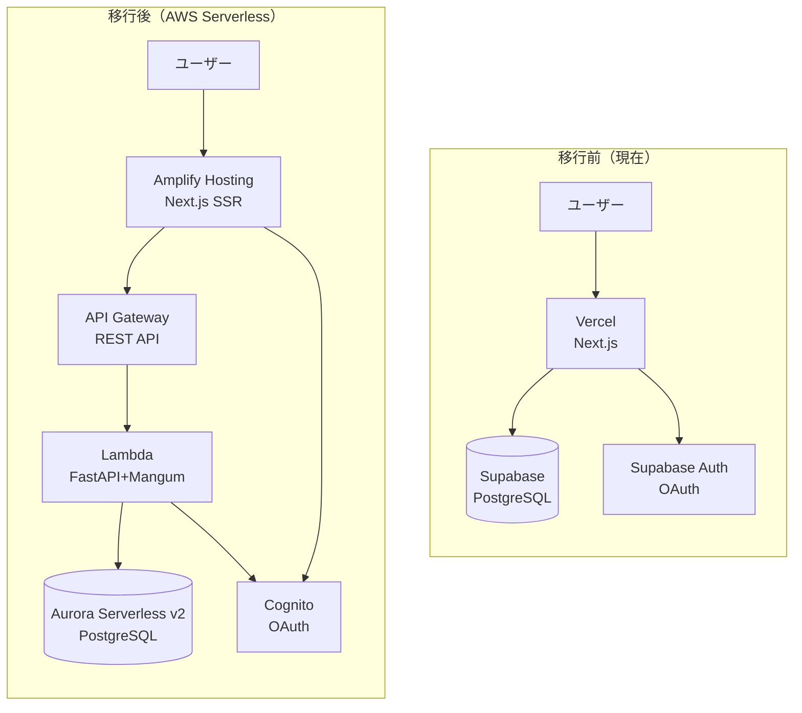
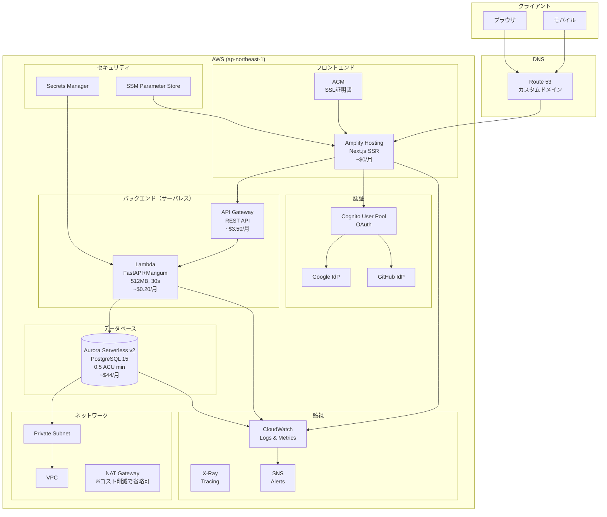
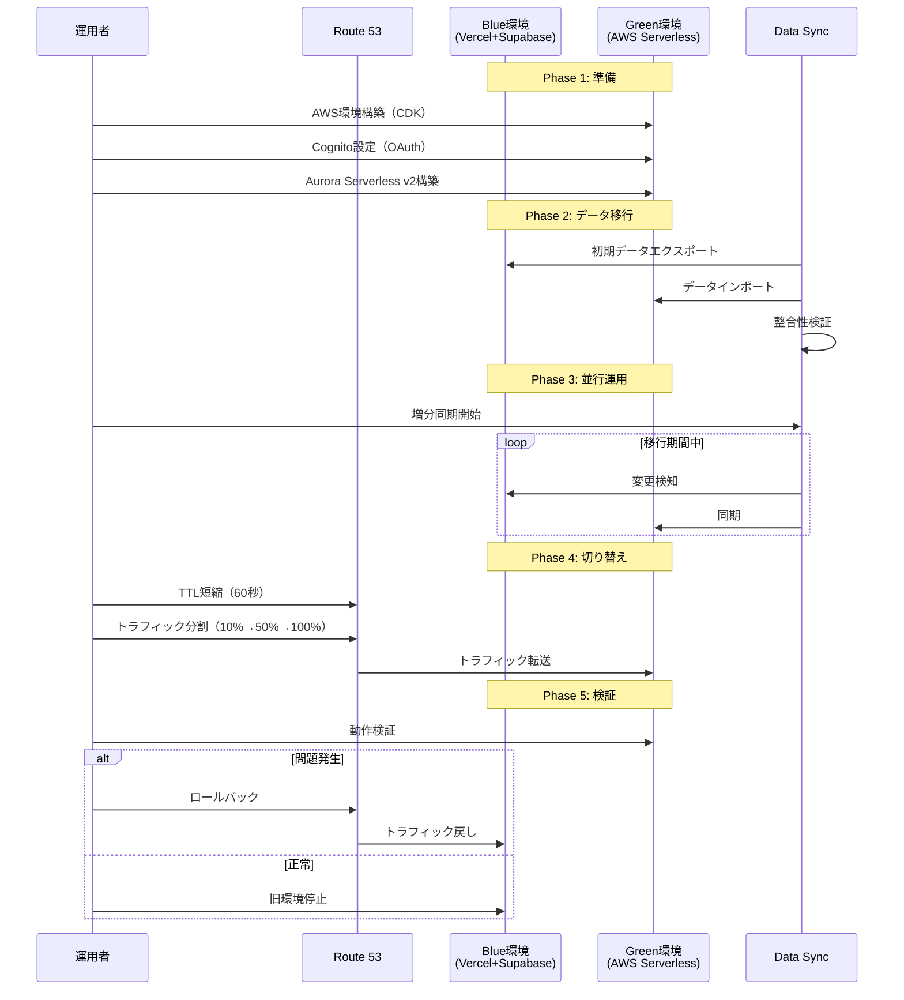
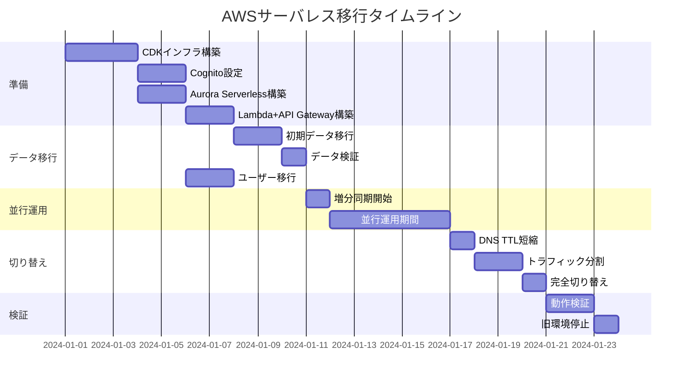

# 設計ドキュメント

## 概要

本設計書は、習慣管理ダッシュボードアプリケーションの本番環境をVercel + SupabaseからAWSサーバレス構成に移行するためのアーキテクチャと実装方針を定義します。

主な特徴：
- コスト優先設計（月額~$48目標）
- AWS Lambda + API Gateway（FastAPI with Mangum）によるサーバレスバックエンド
- Aurora Serverless v2（0.5 ACU最小）によるコスト最適化データベース
- AWS Amplify Hosting（無料枠）によるフロントエンド
- Amazon Cognitoによる認証（Google/GitHub OAuth対応）
- Blue-Green Deploymentによるゼロダウンタイム移行
- 将来のSlack/OpenAI連携を考慮した拡張性

## アーキテクチャ

### 移行前後の構成比較




### 本番環境アーキテクチャ（移行後）



### コスト内訳

| サービス | 仕様 | 月額コスト |
|---------|------|-----------|
| Lambda | 512MB, 1M requests | ~$0.20 |
| API Gateway | REST API, 1M requests | ~$3.50 |
| Aurora Serverless v2 | 0.5 ACU minimum | ~$44.00 |
| Amplify Hosting | 無料枠内 | ~$0.00 |
| Cognito | 無料枠内 | ~$0.00 |
| Secrets Manager | 2 secrets | ~$0.80 |
| CloudWatch | Logs & Metrics | ~$0.00 |
| **合計** | | **~$48.50/月** |

### 移行フロー（Blue-Green Deployment）




## コンポーネントとインターフェース

### プロジェクト構成（追加・更新ファイル）

```
vow/
├── backend/                     # FastAPIバックエンド（既存）
│   ├── app/
│   │   ├── main.py             # Mangumアダプター追加
│   │   ├── middleware/
│   │   │   └── auth.py         # Cognito JWT対応に更新
│   │   └── ...
│   ├── lambda_handler.py       # Lambda用エントリーポイント（新規）
│   └── ...
├── infra/                       # AWS CDK (Python)
│   ├── app.py                  # CDKエントリーポイント（更新）
│   ├── stacks/
│   │   ├── __init__.py
│   │   ├── database_stack.py   # Aurora Serverless v2（新規）
│   │   ├── backend_stack.py    # Lambda + API Gateway（新規）
│   │   ├── frontend_stack.py   # 本番Amplify（新規）
│   │   ├── auth_stack.py       # Cognito（新規）
│   │   ├── monitoring_stack.py # 監視（新規）
│   │   └── network_stack.py    # VPC（更新）
│   └── ...
├── scripts/                     # 移行スクリプト
│   ├── migration/
│   │   ├── export_supabase.py  # Supabaseデータエクスポート
│   │   ├── import_aurora.py    # Auroraデータインポート
│   │   ├── sync_incremental.py # 増分同期
│   │   ├── verify_data.py      # データ検証
│   │   ├── migrate_users.py    # ユーザー移行
│   │   └── rollback.py         # ロールバック
│   └── ...
├── docs/
│   └── SERVERLESS_MIGRATION.md # 移行手順書（新規）
└── .github/
    └── workflows/
        ├── deploy-frontend-prod.yml  # 本番フロントエンドCI/CD（新規）
        └── deploy-lambda-prod.yml    # Lambda CI/CD（新規）
```

### Lambda + Mangum設定

```python
# backend/lambda_handler.py
"""
Lambda用エントリーポイント
FastAPIをMangumアダプターでラップ
"""
from mangum import Mangum
from app.main import app

# Mangumアダプター
handler = Mangum(app, lifespan="off")
```

```python
# backend/app/main.py（更新）
from fastapi import FastAPI
from fastapi.middleware.cors import CORSMiddleware
from contextlib import asynccontextmanager
import os

@asynccontextmanager
async def lifespan(app: FastAPI):
    # Lambda環境ではコネクションプールを小さく
    if os.environ.get("AWS_LAMBDA_FUNCTION_NAME"):
        # Lambda用の初期化
        pass
    yield
    # クリーンアップ

app = FastAPI(
    title="Vow API",
    version="1.0.0",
    lifespan=lifespan
)

# CORS設定
app.add_middleware(
    CORSMiddleware,
    allow_origins=[
        "https://your-domain.com",
        "http://localhost:3000"
    ],
    allow_credentials=True,
    allow_methods=["*"],
    allow_headers=["*"],
)

@app.get("/health")
async def health_check():
    return {"status": "healthy"}
```


### Cognito認証設定

```python
# infra/stacks/auth_stack.py
from aws_cdk import (
    Stack,
    Duration,
    RemovalPolicy,
    CfnOutput,
    aws_cognito as cognito,
    aws_ssm as ssm,
)
from constructs import Construct

class AuthStack(Stack):
    """Cognito認証スタック"""
    
    def __init__(self, scope: Construct, construct_id: str, **kwargs) -> None:
        super().__init__(scope, construct_id, **kwargs)
        
        # User Pool
        self.user_pool = cognito.UserPool(
            self,
            "VowUserPool",
            user_pool_name="vow-production-users",
            self_sign_up_enabled=True,
            sign_in_aliases=cognito.SignInAliases(
                email=True,
                username=False
            ),
            auto_verify=cognito.AutoVerifiedAttrs(email=True),
            standard_attributes=cognito.StandardAttributes(
                email=cognito.StandardAttribute(required=True, mutable=True),
                fullname=cognito.StandardAttribute(required=False, mutable=True)
            ),
            password_policy=cognito.PasswordPolicy(
                min_length=8,
                require_lowercase=True,
                require_uppercase=True,
                require_digits=True,
                require_symbols=False
            ),
            account_recovery=cognito.AccountRecovery.EMAIL_ONLY,
            removal_policy=RemovalPolicy.RETAIN
        )
        
        # Google Identity Provider
        google_provider = cognito.UserPoolIdentityProviderGoogle(
            self,
            "GoogleProvider",
            user_pool=self.user_pool,
            client_id=ssm.StringParameter.value_for_string_parameter(
                self, "/vow/prod/google-client-id"
            ),
            client_secret_value=ssm.StringParameter.value_for_secure_string_parameter(
                self, "/vow/prod/google-client-secret", version=1
            ),
            scopes=["profile", "email", "openid"],
            attribute_mapping=cognito.AttributeMapping(
                email=cognito.ProviderAttribute.GOOGLE_EMAIL,
                fullname=cognito.ProviderAttribute.GOOGLE_NAME,
                profile_picture=cognito.ProviderAttribute.GOOGLE_PICTURE
            )
        )
        
        # GitHub Identity Provider (Custom OIDC)
        github_provider = cognito.UserPoolIdentityProviderOidc(
            self,
            "GitHubProvider",
            user_pool=self.user_pool,
            name="GitHub",
            client_id=ssm.StringParameter.value_for_string_parameter(
                self, "/vow/prod/github-client-id"
            ),
            client_secret=ssm.StringParameter.value_for_secure_string_parameter(
                self, "/vow/prod/github-client-secret", version=1
            ),
            issuer_url="https://token.actions.githubusercontent.com",
            endpoints=cognito.OidcEndpoints(
                authorization="https://github.com/login/oauth/authorize",
                token="https://github.com/login/oauth/access_token",
                user_info="https://api.github.com/user"
            ),
            scopes=["read:user", "user:email"],
            attribute_mapping=cognito.AttributeMapping(
                email=cognito.ProviderAttribute.other("email"),
                fullname=cognito.ProviderAttribute.other("name")
            )
        )
        
        # App Client
        self.app_client = self.user_pool.add_client(
            "VowAppClient",
            user_pool_client_name="vow-web-client",
            generate_secret=False,
            auth_flows=cognito.AuthFlow(
                user_srp=True,
                custom=True
            ),
            o_auth=cognito.OAuthSettings(
                flows=cognito.OAuthFlows(
                    authorization_code_grant=True,
                    implicit_code_grant=True
                ),
                scopes=[
                    cognito.OAuthScope.EMAIL,
                    cognito.OAuthScope.OPENID,
                    cognito.OAuthScope.PROFILE
                ],
                callback_urls=[
                    "https://your-domain.com/auth/callback",
                    "http://localhost:3000/auth/callback"
                ],
                logout_urls=[
                    "https://your-domain.com",
                    "http://localhost:3000"
                ]
            ),
            supported_identity_providers=[
                cognito.UserPoolClientIdentityProvider.GOOGLE,
                cognito.UserPoolClientIdentityProvider.custom("GitHub")
            ],
            access_token_validity=Duration.hours(1),
            id_token_validity=Duration.hours(1),
            refresh_token_validity=Duration.days(30)
        )
        
        # Domain
        self.domain = self.user_pool.add_domain(
            "VowDomain",
            cognito_domain=cognito.CognitoDomainOptions(
                domain_prefix="vow-auth"
            )
        )
        
        # Outputs
        CfnOutput(self, "UserPoolId", value=self.user_pool.user_pool_id)
        CfnOutput(self, "UserPoolClientId", value=self.app_client.user_pool_client_id)
        CfnOutput(self, "CognitoDomain", value=self.domain.domain_name)
```


### Aurora Serverless v2設定

```python
# infra/stacks/database_stack.py
from aws_cdk import (
    Stack,
    Duration,
    RemovalPolicy,
    CfnOutput,
    aws_ec2 as ec2,
    aws_rds as rds,
    aws_secretsmanager as secretsmanager,
)
from constructs import Construct

class DatabaseStack(Stack):
    """Aurora Serverless v2データベーススタック"""
    
    def __init__(
        self,
        scope: Construct,
        construct_id: str,
        vpc: ec2.IVpc,
        **kwargs
    ) -> None:
        super().__init__(scope, construct_id, **kwargs)
        
        # Security Group
        self.security_group = ec2.SecurityGroup(
            self,
            "AuroraSecurityGroup",
            vpc=vpc,
            description="Security group for Aurora Serverless v2",
            allow_all_outbound=False
        )
        
        # Aurora Serverless v2 Cluster
        self.cluster = rds.DatabaseCluster(
            self,
            "VowAuroraCluster",
            engine=rds.DatabaseClusterEngine.aurora_postgres(
                version=rds.AuroraPostgresEngineVersion.VER_15_4
            ),
            serverless_v2_min_capacity=0.5,  # コスト最適化: 最小0.5 ACU
            serverless_v2_max_capacity=2.0,  # 最大2 ACU
            writer=rds.ClusterInstance.serverless_v2(
                "Writer",
                auto_minor_version_upgrade=True
            ),
            vpc=vpc,
            vpc_subnets=ec2.SubnetSelection(
                subnet_type=ec2.SubnetType.PRIVATE_ISOLATED
            ),
            security_groups=[self.security_group],
            default_database_name="vow",
            backup=rds.BackupProps(
                retention=Duration.days(7)
            ),
            storage_encrypted=True,
            removal_policy=RemovalPolicy.SNAPSHOT,
            deletion_protection=True
        )
        
        # Database Secret
        self.secret = self.cluster.secret
        
        # Outputs
        CfnOutput(
            self,
            "ClusterEndpoint",
            value=self.cluster.cluster_endpoint.hostname
        )
        CfnOutput(
            self,
            "SecretArn",
            value=self.secret.secret_arn
        )
```

### Lambda + API Gateway設定

```python
# infra/stacks/backend_stack.py
from aws_cdk import (
    Stack,
    Duration,
    CfnOutput,
    aws_lambda as lambda_,
    aws_apigateway as apigw,
    aws_ec2 as ec2,
    aws_iam as iam,
    aws_logs as logs,
    aws_secretsmanager as secretsmanager,
)
from constructs import Construct

class BackendStack(Stack):
    """Lambda + API Gatewayバックエンドスタック"""
    
    def __init__(
        self,
        scope: Construct,
        construct_id: str,
        vpc: ec2.IVpc,
        database_secret: secretsmanager.ISecret,
        database_security_group: ec2.ISecurityGroup,
        cognito_user_pool_id: str,
        cognito_client_id: str,
        **kwargs
    ) -> None:
        super().__init__(scope, construct_id, **kwargs)
        
        # Lambda Security Group
        lambda_sg = ec2.SecurityGroup(
            self,
            "LambdaSecurityGroup",
            vpc=vpc,
            description="Security group for Lambda function",
            allow_all_outbound=True
        )
        
        # Allow Lambda to connect to Aurora
        database_security_group.add_ingress_rule(
            peer=lambda_sg,
            connection=ec2.Port.tcp(5432),
            description="Allow Lambda to connect to Aurora"
        )
        
        # Lambda Function
        self.function = lambda_.Function(
            self,
            "VowApiFunction",
            function_name="vow-api-prod",
            runtime=lambda_.Runtime.PYTHON_3_12,
            handler="lambda_handler.handler",
            code=lambda_.Code.from_asset("../backend"),
            memory_size=512,
            timeout=Duration.seconds(30),
            vpc=vpc,
            vpc_subnets=ec2.SubnetSelection(
                subnet_type=ec2.SubnetType.PRIVATE_WITH_EGRESS
            ),
            security_groups=[lambda_sg],
            environment={
                "ENV": "production",
                "COGNITO_USER_POOL_ID": cognito_user_pool_id,
                "COGNITO_CLIENT_ID": cognito_client_id,
                "COGNITO_REGION": "ap-northeast-1",
                "DATABASE_SECRET_ARN": database_secret.secret_arn
            },
            tracing=lambda_.Tracing.ACTIVE,
            log_retention=logs.RetentionDays.ONE_MONTH
        )
        
        # Grant Lambda access to Secrets Manager
        database_secret.grant_read(self.function)
        
        # API Gateway
        self.api = apigw.RestApi(
            self,
            "VowApi",
            rest_api_name="vow-api-prod",
            description="Vow Production API",
            deploy_options=apigw.StageOptions(
                stage_name="prod",
                throttling_rate_limit=1000,
                throttling_burst_limit=500,
                logging_level=apigw.MethodLoggingLevel.INFO,
                data_trace_enabled=True,
                tracing_enabled=True
            ),
            default_cors_preflight_options=apigw.CorsOptions(
                allow_origins=["https://your-domain.com", "http://localhost:3000"],
                allow_methods=["GET", "POST", "PUT", "DELETE", "OPTIONS"],
                allow_headers=["Content-Type", "Authorization"],
                allow_credentials=True
            )
        )
        
        # Lambda Integration
        lambda_integration = apigw.LambdaIntegration(
            self.function,
            proxy=True
        )
        
        # Proxy resource for all paths
        proxy = self.api.root.add_proxy(
            default_integration=lambda_integration,
            any_method=True
        )
        
        # Health check endpoint
        health = self.api.root.add_resource("health")
        health.add_method("GET", lambda_integration)
        
        # Outputs
        CfnOutput(
            self,
            "ApiUrl",
            value=self.api.url
        )
        CfnOutput(
            self,
            "LambdaArn",
            value=self.function.function_arn
        )
```


### 本番Amplify Hosting設定

```python
# infra/stacks/frontend_stack.py
from aws_cdk import (
    Stack,
    SecretValue,
    CfnOutput,
    aws_amplify_alpha as amplify,
)
from constructs import Construct

class FrontendStack(Stack):
    """本番フロントエンドスタック"""
    
    def __init__(
        self,
        scope: Construct,
        construct_id: str,
        cognito_user_pool_id: str,
        cognito_client_id: str,
        api_url: str,
        **kwargs
    ) -> None:
        super().__init__(scope, construct_id, **kwargs)
        
        # Amplify App
        self.amplify_app = amplify.App(
            self,
            "VowProdApp",
            app_name="vow-production",
            source_code_provider=amplify.GitHubSourceCodeProvider(
                owner="your-github-owner",
                repository="vow",
                oauth_token=SecretValue.secrets_manager("github-token")
            ),
            platform=amplify.Platform.WEB_COMPUTE,
            environment_variables={
                "NEXT_PUBLIC_API_URL": api_url,
                "NEXT_PUBLIC_COGNITO_USER_POOL_ID": cognito_user_pool_id,
                "NEXT_PUBLIC_COGNITO_CLIENT_ID": cognito_client_id,
                "NEXT_PUBLIC_COGNITO_DOMAIN": "vow-auth",
                "NEXT_PUBLIC_COGNITO_REGION": "ap-northeast-1",
            },
            auto_branch_deletion=False
        )
        
        # Main branch (production)
        self.main_branch = self.amplify_app.add_branch(
            "main",
            auto_build=True,
            stage=amplify.BranchStage.PRODUCTION,
            environment_variables={
                "NODE_ENV": "production"
            }
        )
        
        # Outputs
        CfnOutput(
            self,
            "AmplifyAppId",
            value=self.amplify_app.app_id
        )
        CfnOutput(
            self,
            "AmplifyUrl",
            value=f"https://main.{self.amplify_app.default_domain}"
        )
```

### 監視スタック

```python
# infra/stacks/monitoring_stack.py
from aws_cdk import (
    Stack,
    Duration,
    CfnOutput,
    aws_cloudwatch as cloudwatch,
    aws_cloudwatch_actions as cw_actions,
    aws_sns as sns,
    aws_sns_subscriptions as subscriptions,
)
from constructs import Construct

class MonitoringStack(Stack):
    """監視・アラートスタック"""
    
    def __init__(
        self,
        scope: Construct,
        construct_id: str,
        lambda_function_name: str,
        api_name: str,
        aurora_cluster_id: str,
        alert_email: str,
        **kwargs
    ) -> None:
        super().__init__(scope, construct_id, **kwargs)
        
        # SNS Topic for alerts
        self.alert_topic = sns.Topic(
            self,
            "AlertTopic",
            topic_name="vow-production-alerts"
        )
        self.alert_topic.add_subscription(
            subscriptions.EmailSubscription(alert_email)
        )
        
        # Dashboard
        self.dashboard = cloudwatch.Dashboard(
            self,
            "ProdDashboard",
            dashboard_name="vow-serverless-production"
        )
        
        # Lambda Cold Start Alarm
        cold_start_alarm = cloudwatch.Alarm(
            self,
            "ColdStartAlarm",
            alarm_name="vow-prod-cold-starts",
            metric=cloudwatch.Metric(
                namespace="AWS/Lambda",
                metric_name="Duration",
                dimensions_map={"FunctionName": lambda_function_name},
                statistic="Maximum",
                period=Duration.minutes(5)
            ),
            threshold=3000,  # 3 seconds
            evaluation_periods=3,
            comparison_operator=cloudwatch.ComparisonOperator.GREATER_THAN_THRESHOLD
        )
        cold_start_alarm.add_alarm_action(cw_actions.SnsAction(self.alert_topic))
        
        # Lambda Error Alarm
        error_alarm = cloudwatch.Alarm(
            self,
            "LambdaErrorAlarm",
            alarm_name="vow-prod-lambda-errors",
            metric=cloudwatch.Metric(
                namespace="AWS/Lambda",
                metric_name="Errors",
                dimensions_map={"FunctionName": lambda_function_name},
                statistic="Sum",
                period=Duration.minutes(5)
            ),
            threshold=5,
            evaluation_periods=2,
            comparison_operator=cloudwatch.ComparisonOperator.GREATER_THAN_THRESHOLD
        )
        error_alarm.add_alarm_action(cw_actions.SnsAction(self.alert_topic))
        
        # API Gateway 5xx Alarm
        api_error_alarm = cloudwatch.Alarm(
            self,
            "ApiErrorAlarm",
            alarm_name="vow-prod-api-5xx",
            metric=cloudwatch.Metric(
                namespace="AWS/ApiGateway",
                metric_name="5XXError",
                dimensions_map={"ApiName": api_name},
                statistic="Sum",
                period=Duration.minutes(5)
            ),
            threshold=10,
            evaluation_periods=2,
            comparison_operator=cloudwatch.ComparisonOperator.GREATER_THAN_THRESHOLD
        )
        api_error_alarm.add_alarm_action(cw_actions.SnsAction(self.alert_topic))
        
        # Aurora CPU Alarm
        aurora_cpu_alarm = cloudwatch.Alarm(
            self,
            "AuroraCpuAlarm",
            alarm_name="vow-prod-aurora-cpu",
            metric=cloudwatch.Metric(
                namespace="AWS/RDS",
                metric_name="CPUUtilization",
                dimensions_map={"DBClusterIdentifier": aurora_cluster_id},
                statistic="Average",
                period=Duration.minutes(5)
            ),
            threshold=80,
            evaluation_periods=3,
            comparison_operator=cloudwatch.ComparisonOperator.GREATER_THAN_THRESHOLD
        )
        aurora_cpu_alarm.add_alarm_action(cw_actions.SnsAction(self.alert_topic))
```


## データモデル

### データ移行スキーマ

Supabaseの既存スキーマをAurora Serverless v2に移行します。主要テーブル：

| テーブル名 | 説明 | 移行優先度 |
|-----------|------|-----------|
| users | ユーザー情報（Cognito移行） | 高 |
| habits | 習慣データ | 高 |
| habit_logs | 習慣記録 | 高 |
| goals | 目標データ | 高 |
| tasks | タスクデータ | 高 |
| activities | アクティビティログ | 中 |

### ユーザー移行マッピング

```python
# Supabase Auth → Cognito マッピング
SUPABASE_TO_COGNITO_MAPPING = {
    "id": "sub",  # Supabase UUID → Cognito sub
    "email": "email",
    "raw_user_meta_data.full_name": "name",
    "raw_user_meta_data.avatar_url": "picture",
    "created_at": "custom:created_at",
    "app_metadata.provider": "custom:auth_provider"
}
```

### データ移行スクリプト

```python
# scripts/migration/export_supabase.py
"""
Supabaseからデータをエクスポートするスクリプト
"""
import asyncio
import json
from datetime import datetime
from pathlib import Path
import asyncpg
import hashlib

class SupabaseExporter:
    """Supabaseデータエクスポーター"""
    
    TABLES = [
        "habits",
        "habit_logs", 
        "goals",
        "tasks",
        "activities"
    ]
    
    def __init__(self, connection_string: str, output_dir: str):
        self.connection_string = connection_string
        self.output_dir = Path(output_dir)
        self.output_dir.mkdir(parents=True, exist_ok=True)
    
    async def export_all(self) -> dict:
        """全テーブルをエクスポート"""
        conn = await asyncpg.connect(self.connection_string)
        results = {}
        
        try:
            for table in self.TABLES:
                data = await self._export_table(conn, table)
                results[table] = {
                    "count": len(data),
                    "checksum": self._calculate_checksum(data)
                }
                
                # JSONファイルに保存
                output_file = self.output_dir / f"{table}.json"
                with open(output_file, "w") as f:
                    json.dump(data, f, default=str, indent=2)
                
                print(f"Exported {table}: {len(data)} rows")
        finally:
            await conn.close()
        
        # メタデータ保存
        metadata = {
            "exported_at": datetime.utcnow().isoformat(),
            "tables": results
        }
        with open(self.output_dir / "metadata.json", "w") as f:
            json.dump(metadata, f, indent=2)
        
        return results
    
    async def _export_table(self, conn, table: str) -> list:
        """テーブルデータをエクスポート"""
        rows = await conn.fetch(f"SELECT * FROM {table}")
        return [dict(row) for row in rows]
    
    def _calculate_checksum(self, data: list) -> str:
        """データのチェックサムを計算"""
        content = json.dumps(data, sort_keys=True, default=str)
        return hashlib.sha256(content.encode()).hexdigest()
```

```python
# scripts/migration/import_aurora.py
"""
Aurora Serverless v2にデータをインポートするスクリプト
"""
import asyncio
import json
from pathlib import Path
import asyncpg
import boto3

class AuroraImporter:
    """Auroraデータインポーター"""
    
    def __init__(self, secret_arn: str, input_dir: str, region: str = "ap-northeast-1"):
        self.secret_arn = secret_arn
        self.input_dir = Path(input_dir)
        self.region = region
    
    def _get_connection_string(self) -> str:
        """Secrets Managerから接続文字列を取得"""
        client = boto3.client("secretsmanager", region_name=self.region)
        response = client.get_secret_value(SecretId=self.secret_arn)
        secret = json.loads(response["SecretString"])
        return f"postgresql://{secret['username']}:{secret['password']}@{secret['host']}:{secret['port']}/{secret['dbname']}"
    
    async def import_all(self) -> dict:
        """全テーブルをインポート"""
        conn_string = self._get_connection_string()
        conn = await asyncpg.connect(conn_string)
        results = {}
        
        # メタデータ読み込み
        with open(self.input_dir / "metadata.json") as f:
            metadata = json.load(f)
        
        try:
            for table in metadata["tables"].keys():
                count = await self._import_table(conn, table)
                results[table] = {"imported": count}
                print(f"Imported {table}: {count} rows")
        finally:
            await conn.close()
        
        return results
    
    async def _import_table(self, conn, table: str) -> int:
        """テーブルデータをインポート"""
        input_file = self.input_dir / f"{table}.json"
        with open(input_file) as f:
            data = json.load(f)
        
        if not data:
            return 0
        
        # バッチインサート
        columns = list(data[0].keys())
        placeholders = ", ".join([f"${i+1}" for i in range(len(columns))])
        column_names = ", ".join(columns)
        
        query = f"""
            INSERT INTO {table} ({column_names})
            VALUES ({placeholders})
            ON CONFLICT DO NOTHING
        """
        
        for row in data:
            values = [row[col] for col in columns]
            await conn.execute(query, *values)
        
        return len(data)
```

```python
# scripts/migration/verify_data.py
"""
データ整合性を検証するスクリプト
"""
import asyncio
import json
from pathlib import Path
import asyncpg
import boto3

class DataVerifier:
    """データ整合性検証"""
    
    def __init__(
        self,
        source_conn_string: str,
        target_secret_arn: str,
        region: str = "ap-northeast-1"
    ):
        self.source_conn_string = source_conn_string
        self.target_secret_arn = target_secret_arn
        self.region = region
    
    def _get_target_connection_string(self) -> str:
        """Secrets Managerから接続文字列を取得"""
        client = boto3.client("secretsmanager", region_name=self.region)
        response = client.get_secret_value(SecretId=self.target_secret_arn)
        secret = json.loads(response["SecretString"])
        return f"postgresql://{secret['username']}:{secret['password']}@{secret['host']}:{secret['port']}/{secret['dbname']}"
    
    async def verify_all(self, tables: list) -> dict:
        """全テーブルの整合性を検証"""
        source_conn = await asyncpg.connect(self.source_conn_string)
        target_conn = await asyncpg.connect(self._get_target_connection_string())
        
        results = {}
        all_passed = True
        
        try:
            for table in tables:
                result = await self._verify_table(
                    source_conn, target_conn, table
                )
                results[table] = result
                if not result["passed"]:
                    all_passed = False
                    print(f"❌ {table}: FAILED - {result['reason']}")
                else:
                    print(f"✅ {table}: PASSED")
        finally:
            await source_conn.close()
            await target_conn.close()
        
        return {
            "all_passed": all_passed,
            "tables": results
        }
    
    async def _verify_table(
        self,
        source_conn,
        target_conn,
        table: str
    ) -> dict:
        """テーブルの整合性を検証"""
        # 行数比較
        source_count = await source_conn.fetchval(
            f"SELECT COUNT(*) FROM {table}"
        )
        target_count = await target_conn.fetchval(
            f"SELECT COUNT(*) FROM {table}"
        )
        
        if source_count != target_count:
            return {
                "passed": False,
                "reason": f"Row count mismatch: {source_count} vs {target_count}",
                "source_count": source_count,
                "target_count": target_count
            }
        
        return {
            "passed": True,
            "source_count": source_count,
            "target_count": target_count
        }
```


### ユーザー移行スクリプト

```python
# scripts/migration/migrate_users.py
"""
Supabase AuthからCognitoへユーザーを移行するスクリプト
"""
import boto3
import asyncpg
from typing import Optional

class UserMigrator:
    """ユーザー移行"""
    
    def __init__(
        self,
        supabase_conn_string: str,
        cognito_user_pool_id: str,
        region: str = "ap-northeast-1"
    ):
        self.supabase_conn_string = supabase_conn_string
        self.cognito_client = boto3.client("cognito-idp", region_name=region)
        self.user_pool_id = cognito_user_pool_id
    
    async def migrate_all(self) -> dict:
        """全ユーザーを移行"""
        conn = await asyncpg.connect(self.supabase_conn_string)
        
        results = {
            "total": 0,
            "success": 0,
            "failed": 0,
            "errors": []
        }
        
        try:
            # Supabase auth.usersテーブルからユーザー取得
            users = await conn.fetch("""
                SELECT 
                    id,
                    email,
                    raw_user_meta_data,
                    created_at,
                    app_metadata
                FROM auth.users
            """)
            
            results["total"] = len(users)
            
            for user in users:
                try:
                    await self._migrate_user(user)
                    results["success"] += 1
                except Exception as e:
                    results["failed"] += 1
                    results["errors"].append({
                        "user_id": str(user["id"]),
                        "email": user["email"],
                        "error": str(e)
                    })
        finally:
            await conn.close()
        
        return results
    
    async def _migrate_user(self, user: dict) -> None:
        """単一ユーザーを移行"""
        meta = user.get("raw_user_meta_data") or {}
        
        # Cognitoにユーザー作成
        self.cognito_client.admin_create_user(
            UserPoolId=self.user_pool_id,
            Username=user["email"],
            UserAttributes=[
                {"Name": "email", "Value": user["email"]},
                {"Name": "email_verified", "Value": "true"},
                {"Name": "name", "Value": meta.get("full_name", "")},
                {"Name": "custom:supabase_id", "Value": str(user["id"])},
                {"Name": "custom:created_at", "Value": user["created_at"].isoformat()}
            ],
            MessageAction="SUPPRESS"  # ウェルカムメール送信しない
        )
```

### ロールバックスクリプト

```python
# scripts/migration/rollback.py
"""
ロールバック実行スクリプト
"""
import boto3
from datetime import datetime

class RollbackController:
    """ロールバック制御"""
    
    def __init__(
        self,
        vercel_project_id: str,
        supabase_project_ref: str,
        route53_hosted_zone_id: str,
        domain_name: str
    ):
        self.vercel_project_id = vercel_project_id
        self.supabase_project_ref = supabase_project_ref
        self.route53_hosted_zone_id = route53_hosted_zone_id
        self.domain_name = domain_name
        self.route53 = boto3.client("route53")
    
    def execute_rollback(self) -> dict:
        """ロールバック実行"""
        results = {
            "started_at": datetime.utcnow().isoformat(),
            "steps": []
        }
        
        # Step 1: DNS切り戻し
        try:
            self._revert_dns()
            results["steps"].append({
                "step": "dns_revert",
                "status": "success"
            })
        except Exception as e:
            results["steps"].append({
                "step": "dns_revert",
                "status": "failed",
                "error": str(e)
            })
            return results
        
        # Step 2: Vercel再有効化確認
        results["steps"].append({
            "step": "vercel_check",
            "status": "success",
            "message": "Vercel deployment remains active"
        })
        
        # Step 3: Supabase接続確認
        results["steps"].append({
            "step": "supabase_check",
            "status": "success",
            "message": "Supabase connection verified"
        })
        
        results["completed_at"] = datetime.utcnow().isoformat()
        return results
    
    def _revert_dns(self) -> None:
        """DNSをVercelに戻す"""
        self.route53.change_resource_record_sets(
            HostedZoneId=self.route53_hosted_zone_id,
            ChangeBatch={
                "Changes": [{
                    "Action": "UPSERT",
                    "ResourceRecordSet": {
                        "Name": self.domain_name,
                        "Type": "CNAME",
                        "TTL": 60,
                        "ResourceRecords": [{
                            "Value": "cname.vercel-dns.com"
                        }]
                    }
                }]
            }
        )
```

### GitHub Actions CI/CD

```yaml
# .github/workflows/deploy-lambda-prod.yml
name: Deploy Lambda to Production

on:
  push:
    branches: [main]
    paths:
      - 'backend/**'
      - '.github/workflows/deploy-lambda-prod.yml'

permissions:
  id-token: write
  contents: read

env:
  AWS_REGION: ap-northeast-1
  FUNCTION_NAME: vow-api-prod

jobs:
  test:
    runs-on: ubuntu-latest
    steps:
      - uses: actions/checkout@v4
      
      - name: Set up Python
        uses: actions/setup-python@v5
        with:
          python-version: '3.12'
      
      - name: Install dependencies
        run: |
          cd backend
          pip install -r requirements.txt -r requirements-dev.txt
      
      - name: Run tests
        run: |
          cd backend
          pytest tests/ -v --cov=app

  deploy:
    needs: test
    runs-on: ubuntu-latest
    environment: production
    
    steps:
      - uses: actions/checkout@v4
      
      - name: Set up Python
        uses: actions/setup-python@v5
        with:
          python-version: '3.12'
      
      - name: Configure AWS credentials
        uses: aws-actions/configure-aws-credentials@v4
        with:
          role-to-assume: ${{ secrets.AWS_ROLE_ARN_PROD }}
          aws-region: ${{ env.AWS_REGION }}
      
      - name: Install dependencies
        run: |
          cd backend
          pip install -r requirements.txt -t package/
          cp -r app package/
          cp lambda_handler.py package/
      
      - name: Create deployment package
        run: |
          cd backend/package
          zip -r ../deployment.zip .
      
      - name: Deploy to Lambda
        run: |
          aws lambda update-function-code \
            --function-name ${{ env.FUNCTION_NAME }} \
            --zip-file fileb://backend/deployment.zip
      
      - name: Wait for update
        run: |
          aws lambda wait function-updated \
            --function-name ${{ env.FUNCTION_NAME }}
```

```yaml
# .github/workflows/deploy-frontend-prod.yml
name: Deploy Frontend to Production

on:
  push:
    branches: [main]
    paths:
      - 'frontend/**'
      - '.github/workflows/deploy-frontend-prod.yml'

permissions:
  id-token: write
  contents: read

env:
  AWS_REGION: ap-northeast-1

jobs:
  deploy:
    runs-on: ubuntu-latest
    environment: production
    
    steps:
      - uses: actions/checkout@v4
      
      - name: Configure AWS credentials
        uses: aws-actions/configure-aws-credentials@v4
        with:
          role-to-assume: ${{ secrets.AWS_ROLE_ARN_PROD }}
          aws-region: ${{ env.AWS_REGION }}
      
      - name: Trigger Amplify Build
        run: |
          aws amplify start-job \
            --app-id ${{ secrets.AMPLIFY_APP_ID }} \
            --branch-name main \
            --job-type RELEASE
```


## 正確性プロパティ

*正確性プロパティとは、システムのすべての有効な実行において真であるべき特性や振る舞いのことです。これらは人間が読める仕様と機械で検証可能な正確性保証の橋渡しとなります。*

### Property 1: Data Migration Round-Trip

*For any* dataset exported from Supabase PostgreSQL, importing to Aurora Serverless v2 and then comparing row counts and checksums SHALL produce identical results, verifying that all data, relationships, and constraints are preserved.

**Validates: Requirements 2.1, 2.2, 2.3, 6.6, 6.7**

### Property 2: User Migration Preservation

*For any* user account in Supabase Auth, after migration to Cognito, the user SHALL exist in Cognito with correctly mapped attributes (email, name, custom attributes), and the user SHALL be able to authenticate successfully.

**Validates: Requirements 3.3, 3.4, 3.6**

### Property 3: Cognito JWT Validation

*For any* valid JWT token issued by Cognito, the Lambda backend SHALL successfully validate the token and extract the correct user identity, enabling authenticated API access through API Gateway.

**Validates: Requirements 3.5, 4.4**

### Property 4: Incremental Sync Consistency

*For any* data changes made in Supabase during the migration period, the incremental sync process SHALL capture all changes and apply them to Aurora, with conflicts resolved using "last write wins" strategy, resulting in consistent data between source and target.

**Validates: Requirements 6.1, 6.3**

### Property 5: CRUD Operations Verification

*For any* entity type (habits, goals, tasks, activities), all CRUD operations (Create, Read, Update, Delete) performed through the new AWS serverless infrastructure SHALL succeed and maintain data consistency with the Aurora database.

**Validates: Requirements 14.2, 14.5**

## エラーハンドリング

### 移行エラー

| エラー種別 | 原因 | 対処方法 |
|-----------|------|---------|
| データエクスポート失敗 | Supabase接続エラー | 接続設定を確認、リトライ |
| データインポート失敗 | Aurora接続エラー、制約違反 | エラーログ確認、データ修正 |
| チェックサム不一致 | データ破損、同期漏れ | 差分確認、再同期 |
| ユーザー移行失敗 | 重複メール、属性エラー | エラーログ確認、手動修正 |

### Lambda/API Gatewayエラー

| エラー種別 | 原因 | 対処方法 |
|-----------|------|---------|
| コールドスタート遅延 | 初回起動 | Provisioned Concurrency検討 |
| タイムアウト | 処理時間超過 | タイムアウト値調整、処理最適化 |
| メモリ不足 | メモリ設定不足 | メモリサイズ増加 |
| VPC接続エラー | セキュリティグループ設定 | SG設定確認 |

### 認証エラー

| エラー種別 | 原因 | 対処方法 |
|-----------|------|---------|
| OAuth認証失敗 | IdP設定エラー | Cognito IdP設定を確認 |
| JWT検証失敗 | 署名不一致、期限切れ | トークン再取得、設定確認 |
| ユーザー未発見 | 移行漏れ | 手動でユーザー作成 |

### ロールバックトリガー

| 条件 | 閾値 | アクション |
|------|------|-----------|
| エラー率上昇 | 5%以上 | 自動ロールバック検討 |
| レイテンシ上昇 | p99 > 3秒 | 調査、必要に応じてロールバック |
| 認証失敗率 | 10%以上 | 即座にロールバック |
| コールドスタート | > 5秒 | Provisioned Concurrency有効化 |

## テスト戦略

### テストの種類

本プロジェクトでは、ユニットテストとプロパティベーステストの両方を使用します。

**ユニットテスト**: 特定の例、エッジケース、エラー条件を検証
**プロパティテスト**: すべての入力に対して普遍的なプロパティを検証

### プロパティベーステスト設定

- ライブラリ: `hypothesis` (Python)
- 各プロパティテストは最低100回のイテレーションを実行
- 各テストは設計ドキュメントのプロパティを参照するコメントでタグ付け
- タグ形式: `# Feature: aws-serverless-migration, Property N: {property_text}`

### テスト構成

```python
# scripts/migration/tests/conftest.py
import pytest
from hypothesis import settings, Verbosity

# Hypothesisのデフォルト設定
settings.register_profile("ci", max_examples=100)
settings.register_profile("dev", max_examples=10)
settings.load_profile("ci")

@pytest.fixture
def supabase_connection():
    """Supabase接続フィクスチャ"""
    import asyncpg
    # テスト用Supabase接続
    pass

@pytest.fixture
def aurora_connection():
    """Aurora接続フィクスチャ"""
    import asyncpg
    # テスト用Aurora接続
    pass

@pytest.fixture
def cognito_client():
    """Cognitoクライアントフィクスチャ"""
    import boto3
    return boto3.client("cognito-idp", region_name="ap-northeast-1")
```


### プロパティテスト例

```python
# scripts/migration/tests/test_migration_properties.py
from hypothesis import given, strategies as st
import pytest
import hashlib
import json

# Feature: aws-serverless-migration, Property 1: Data Migration Round-Trip
@given(
    table_name=st.sampled_from(["habits", "habit_logs", "goals", "tasks"]),
    row_count=st.integers(min_value=1, max_value=100)
)
def test_data_migration_roundtrip(
    supabase_connection,
    aurora_connection,
    table_name,
    row_count
):
    """
    Property 1: For any dataset exported from Supabase,
    importing to Aurora should produce identical checksums.
    """
    # Export from Supabase
    source_data = export_table(supabase_connection, table_name, row_count)
    source_checksum = calculate_checksum(source_data)
    
    # Import to Aurora
    import_table(aurora_connection, table_name, source_data)
    
    # Export from Aurora and compare
    target_data = export_table(aurora_connection, table_name, row_count)
    target_checksum = calculate_checksum(target_data)
    
    assert source_checksum == target_checksum


# Feature: aws-serverless-migration, Property 2: User Migration Preservation
@given(
    email=st.emails(),
    full_name=st.text(min_size=1, max_size=100),
    provider=st.sampled_from(["google", "github", "email"])
)
def test_user_migration_preservation(
    cognito_client,
    email,
    full_name,
    provider
):
    """
    Property 2: For any user in Supabase Auth,
    migration to Cognito should preserve identity and attributes.
    """
    # Create mock Supabase user
    supabase_user = {
        "email": email,
        "raw_user_meta_data": {"full_name": full_name},
        "app_metadata": {"provider": provider}
    }
    
    # Migrate to Cognito
    cognito_user = migrate_user_to_cognito(cognito_client, supabase_user)
    
    # Verify attributes preserved
    assert cognito_user["email"] == email
    assert cognito_user["name"] == full_name


# Feature: aws-serverless-migration, Property 3: Cognito JWT Validation
@given(
    user_id=st.uuids(),
    email=st.emails()
)
def test_cognito_jwt_validation(
    test_client,
    cognito_client,
    user_id,
    email
):
    """
    Property 3: For any valid Cognito JWT,
    the Lambda backend should successfully validate it.
    """
    # Generate valid Cognito JWT
    token = generate_cognito_token(cognito_client, str(user_id), email)
    
    # Call protected endpoint via API Gateway
    response = test_client.get(
        "/api/v1/habits",
        headers={"Authorization": f"Bearer {token}"}
    )
    
    # Should not return 401
    assert response.status_code != 401


# Feature: aws-serverless-migration, Property 4: Incremental Sync Consistency
@given(
    initial_data=st.lists(st.dictionaries(
        keys=st.text(min_size=1, max_size=10),
        values=st.text(min_size=1, max_size=50)
    ), min_size=1, max_size=10),
    changes=st.lists(st.tuples(
        st.sampled_from(["insert", "update", "delete"]),
        st.integers(min_value=0, max_value=9)
    ), min_size=1, max_size=5)
)
def test_incremental_sync_consistency(
    supabase_connection,
    aurora_connection,
    initial_data,
    changes
):
    """
    Property 4: For any data changes during migration,
    incremental sync should capture all changes.
    """
    # Initial sync
    sync_data(supabase_connection, aurora_connection, initial_data)
    
    # Apply changes to source
    apply_changes(supabase_connection, changes)
    
    # Run incremental sync
    run_incremental_sync(supabase_connection, aurora_connection)
    
    # Verify target matches source
    source_state = get_current_state(supabase_connection)
    target_state = get_current_state(aurora_connection)
    
    assert source_state == target_state


# Feature: aws-serverless-migration, Property 5: CRUD Operations Verification
@given(
    entity_type=st.sampled_from(["habits", "goals", "tasks"]),
    entity_data=st.dictionaries(
        keys=st.text(min_size=1, max_size=20),
        values=st.text(min_size=1, max_size=100),
        min_size=1,
        max_size=5
    )
)
def test_crud_operations(
    test_client,
    auth_token,
    entity_type,
    entity_data
):
    """
    Property 5: For any entity type, all CRUD operations
    should succeed and maintain data consistency.
    """
    headers = {"Authorization": f"Bearer {auth_token}"}
    
    # Create
    create_response = test_client.post(
        f"/api/v1/{entity_type}",
        json=entity_data,
        headers=headers
    )
    assert create_response.status_code == 201
    entity_id = create_response.json()["id"]
    
    # Read
    read_response = test_client.get(
        f"/api/v1/{entity_type}/{entity_id}",
        headers=headers
    )
    assert read_response.status_code == 200
    
    # Update
    update_response = test_client.put(
        f"/api/v1/{entity_type}/{entity_id}",
        json={"name": "updated"},
        headers=headers
    )
    assert update_response.status_code == 200
    
    # Delete
    delete_response = test_client.delete(
        f"/api/v1/{entity_type}/{entity_id}",
        headers=headers
    )
    assert delete_response.status_code == 204
```

### ユニットテスト例

```python
# scripts/migration/tests/test_migration_unit.py
import pytest

def test_export_empty_table(supabase_connection):
    """空テーブルのエクスポートが正常に動作すること"""
    result = export_table(supabase_connection, "empty_table")
    assert result == []
    assert calculate_checksum(result) is not None

def test_import_with_constraint_violation(aurora_connection):
    """制約違反時にエラーがログされること"""
    invalid_data = [{"id": "duplicate", "name": "test"}]
    with pytest.raises(ConstraintViolationError):
        import_table(aurora_connection, "test_table", invalid_data)

def test_user_migration_with_missing_email(cognito_client):
    """メールなしユーザーの移行がスキップされること"""
    user = {"id": "123", "raw_user_meta_data": {}}
    result = migrate_user_to_cognito(cognito_client, user)
    assert result["status"] == "skipped"
    assert "missing email" in result["reason"]

def test_lambda_health_check(test_client):
    """Lambdaヘルスチェックエンドポイントが正常に応答すること"""
    response = test_client.get("/health")
    assert response.status_code == 200
    assert response.json()["status"] == "healthy"

def test_lambda_cold_start_time(lambda_client):
    """Lambdaコールドスタートが3秒以内であること"""
    import time
    start = time.time()
    response = lambda_client.invoke(
        FunctionName="vow-api-prod",
        InvocationType="RequestResponse"
    )
    duration = time.time() - start
    assert duration < 3.0

def test_rollback_reverts_dns(route53_client):
    """ロールバックがDNSを正しく戻すこと"""
    controller = RollbackController(...)
    result = controller.execute_rollback()
    assert result["steps"][0]["step"] == "dns_revert"
    assert result["steps"][0]["status"] == "success"
```

## 移行タイムライン



## コスト比較

### Vercel + Supabase vs AWS Serverless

| 項目 | Vercel + Supabase | AWS Serverless |
|------|-------------------|----------------|
| フロントエンド | ~$20/月 (Pro) | ~$0/月 (無料枠) |
| データベース | ~$25/月 (Pro) | ~$44/月 (Aurora) |
| 認証 | 含む | $0 (Cognito無料枠) |
| バックエンドAPI | - | ~$3.70/月 (Lambda+APIGW) |
| **合計** | **~$45/月** | **~$48/月** |

**注意**: AWS構成はバックエンドAPIが追加されているため、機能的には拡張されています。

## 制限事項

1. **Lambdaコールドスタート**: 初回リクエストで1-3秒の遅延が発生する可能性
2. **Aurora Serverless v2最小ACU**: 0.5 ACUでも月額~$44のコストが発生
3. **移行期間中のデータ整合性**: 増分同期中は若干の遅延が発生する可能性
4. **OAuth再認証**: 一部ユーザーは移行後に再ログインが必要な場合あり
5. **Supabase固有機能**: Realtime、Edge Functionsは移行対象外

## 将来の拡張

1. **Provisioned Concurrency**: コールドスタート削減のための設定
2. **Lambda Layers**: 共通ライブラリの分離
3. **SQS/SNS統合**: Slack/OpenAI連携のための非同期処理
4. **CloudFront追加**: グローバルCDNによるレイテンシ改善
5. **Aurora Auto Pause**: 開発環境でのコスト削減（本番では非推奨）
