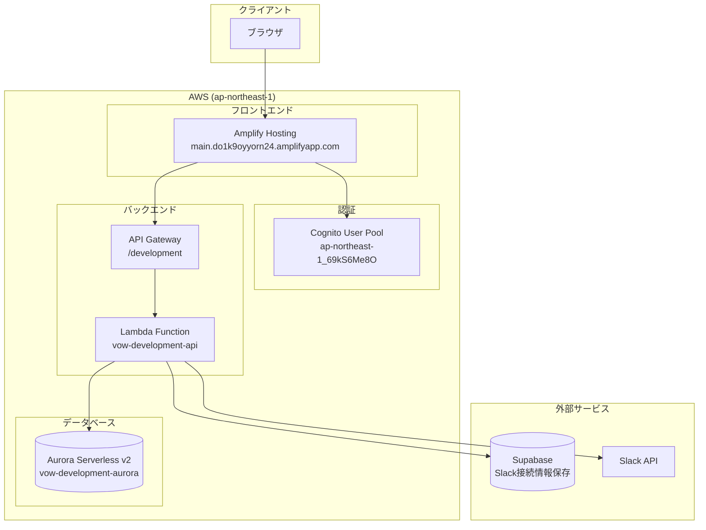
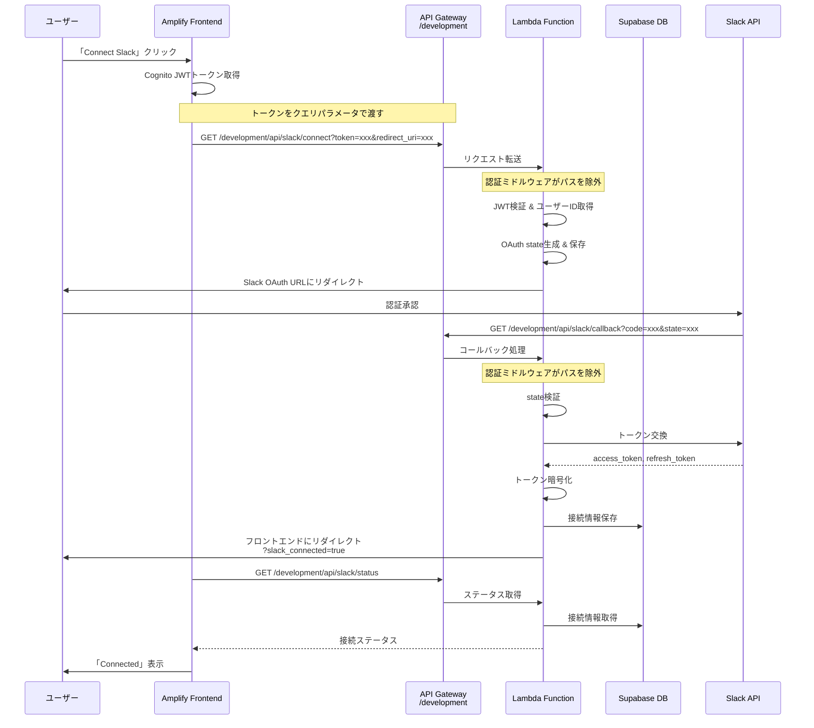
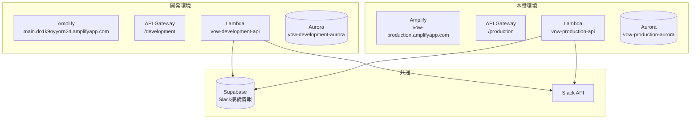

# 設計ドキュメント

## 概要

本設計書は、VOWアプリのAWS本番環境セットアップとSlack連携修正の技術設計を定義します。主に以下の3つのフェーズで構成されます：

1. **Phase 1: Slack OAuth修正** - Lambda環境変数の追加、認証ミドルウェアの修正
2. **Phase 2: AWS本番環境構築** - Terraform本番ワークスペース、本番Lambda/Amplify設定
3. **Phase 3: Slack連携機能確認** - コマンド、インタラクション、週次レポートの動作確認

### 現在の問題点と解決策

| 問題 | 原因 | 解決策 |
|------|------|--------|
| Slack OAuth 500エラー | Lambda環境変数不足 | `SUPABASE_URL`、`SUPABASE_ANON_KEY`を追加 |
| コールバックURL不一致 | `SLACK_CALLBACK_URI`が間違っている | 正しいパス`/api/slack/callback`に修正 |
| 認証バイパス失敗 | ステージプレフィックス未考慮 | ミドルウェアでプレフィックスを除去 |
| 本番環境未構築 | Terraformワークスペース未作成 | `production`ワークスペースを作成 |

## アーキテクチャ

### 現在のAWS開発環境構成



### Slack OAuthフロー（修正後）



### 本番環境構成（構築後）



## コンポーネントとインターフェース

### 1. Lambda環境変数設定（Terraform修正）

**ファイル**: `infra/terraform/lambda.tf`

**現在の環境変数**:
```hcl
environment {
  variables = {
    ENV                  = var.environment
    DATABASE_SECRET_ARN  = aws_rds_cluster.aurora.master_user_secret[0].secret_arn
    DATABASE_HOST        = aws_rds_cluster.aurora.endpoint
    DATABASE_PORT        = aws_rds_cluster.aurora.port
    DATABASE_NAME        = var.database_name
    COGNITO_USER_POOL_ID = aws_cognito_user_pool.main.id
    COGNITO_CLIENT_ID    = aws_cognito_user_pool_client.main.id
    COGNITO_REGION       = var.aws_region
  }
}
```

**修正後の環境変数**:
```hcl
environment {
  variables = {
    # 既存
    ENV                  = var.environment
    DATABASE_SECRET_ARN  = aws_rds_cluster.aurora.master_user_secret[0].secret_arn
    DATABASE_HOST        = aws_rds_cluster.aurora.endpoint
    DATABASE_PORT        = aws_rds_cluster.aurora.port
    DATABASE_NAME        = var.database_name
    COGNITO_USER_POOL_ID = aws_cognito_user_pool.main.id
    COGNITO_CLIENT_ID    = aws_cognito_user_pool_client.main.id
    COGNITO_REGION       = var.aws_region
    
    # Slack連携（新規追加）
    SLACK_CLIENT_ID      = var.slack_client_id
    SLACK_CLIENT_SECRET  = var.slack_client_secret
    SLACK_SIGNING_SECRET = var.slack_signing_secret
    SLACK_CALLBACK_URI   = "https://${aws_api_gateway_rest_api.main[0].id}.execute-api.${var.aws_region}.amazonaws.com/${var.environment}/api/slack/callback"
    TOKEN_ENCRYPTION_KEY = var.token_encryption_key
    
    # Supabase（Slack接続情報保存用）
    SUPABASE_URL         = var.supabase_url
    SUPABASE_ANON_KEY    = var.supabase_anon_key
    
    # CORS
    CORS_ORIGINS         = jsonencode(var.cors_origins)
    
    # 認証プロバイダー
    AUTH_PROVIDER        = "cognito"
  }
}
```

### 2. 認証ミドルウェア修正

**ファイル**: `backend/app/middleware/auth.py`

**問題**: API Gatewayのステージプレフィックス（`/development`）が考慮されていない

**修正内容**:

```python
class JWTAuthMiddleware(BaseHTTPMiddleware):
    """JWT Authentication Middleware with API Gateway stage prefix support."""
    
    # Paths that don't require authentication (without stage prefix)
    EXCLUDED_PATHS: List[str] = [
        "/health",
        "/docs",
        "/redoc",
        "/openapi.json",
        "/",
        "/api/slack/connect",
        "/api/slack/commands",
        "/api/slack/interactions",
        "/api/slack/events",
        "/api/slack/callback",
    ]
    
    # Known API Gateway stage prefixes
    STAGE_PREFIXES: List[str] = [
        "/development",
        "/production",
        "/staging",
    ]
    
    def _strip_stage_prefix(self, path: str) -> str:
        """Strip API Gateway stage prefix from path."""
        for prefix in self.STAGE_PREFIXES:
            if path.startswith(prefix):
                return path[len(prefix):] or "/"
        return path
    
    def _is_excluded_path(self, path: str) -> bool:
        """Check if path is excluded from authentication."""
        # Strip stage prefix first
        normalized_path = self._strip_stage_prefix(path)
        
        for excluded in self.EXCLUDED_PATHS:
            if normalized_path == excluded or normalized_path.startswith(f"{excluded}/"):
                return True
        return False
```

### 3. Terraform変数追加

**ファイル**: `infra/terraform/variables.tf`

```hcl
# Slack Integration
variable "slack_client_id" {
  description = "Slack App Client ID"
  type        = string
  default     = ""
  sensitive   = true
}

variable "slack_client_secret" {
  description = "Slack App Client Secret"
  type        = string
  default     = ""
  sensitive   = true
}

variable "slack_signing_secret" {
  description = "Slack Signing Secret"
  type        = string
  default     = ""
  sensitive   = true
}

variable "token_encryption_key" {
  description = "Fernet key for token encryption"
  type        = string
  default     = ""
  sensitive   = true
}

# Supabase (for Slack connection storage)
variable "supabase_url" {
  description = "Supabase project URL"
  type        = string
  default     = ""
}

variable "supabase_anon_key" {
  description = "Supabase anonymous key"
  type        = string
  default     = ""
  sensitive   = true
}

# CORS
variable "cors_origins" {
  description = "Allowed CORS origins"
  type        = list(string)
  default     = ["http://localhost:3000"]
}
```

### 4. 本番環境Terraform設定

**ファイル**: `infra/terraform/terraform.production.tfvars`

```hcl
# Environment
environment  = "production"
project_name = "vow"
aws_region   = "ap-northeast-1"

# Network
vpc_cidr           = "10.1.0.0/16"  # 開発環境と異なるCIDR
availability_zones = ["ap-northeast-1a", "ap-northeast-1c"]

# Aurora (本番設定)
aurora_min_capacity = 0.5
aurora_max_capacity = 4.0
database_name       = "vow"

# Lambda
lambda_memory_size = 512
lambda_timeout     = 30
lambda_s3_bucket   = "vow-lambda-deployments"
lambda_s3_key      = "production/lambda.zip"

# Cognito OAuth
google_client_id     = "YOUR_GOOGLE_CLIENT_ID"
google_client_secret = "YOUR_GOOGLE_CLIENT_SECRET"
github_client_id     = "YOUR_GITHUB_CLIENT_ID"
github_client_secret = "YOUR_GITHUB_CLIENT_SECRET"

callback_urls = [
  "https://vow-production.amplifyapp.com/auth/callback",
  "http://localhost:3000/auth/callback"
]
logout_urls = [
  "https://vow-production.amplifyapp.com",
  "http://localhost:3000"
]

# Slack Integration
slack_client_id      = "YOUR_SLACK_CLIENT_ID"
slack_client_secret  = "YOUR_SLACK_CLIENT_SECRET"
slack_signing_secret = "YOUR_SLACK_SIGNING_SECRET"
token_encryption_key = "YOUR_FERNET_KEY"

# Supabase
supabase_url      = "https://YOUR_PROJECT.supabase.co"
supabase_anon_key = "YOUR_SUPABASE_ANON_KEY"

# CORS
cors_origins = [
  "https://vow-production.amplifyapp.com",
  "http://localhost:3000"
]
```

### 5. Aurora本番設定

**ファイル**: `infra/terraform/aurora.tf` (条件追加)

```hcl
resource "aws_rds_cluster" "aurora" {
  # ... 既存設定 ...
  
  # 本番環境では削除保護を有効化
  deletion_protection = var.environment == "production" ? true : false
  
  # 本番環境ではスナップショットを保持
  skip_final_snapshot       = var.environment == "production" ? false : true
  final_snapshot_identifier = var.environment == "production" ? "${var.project_name}-${var.environment}-final-snapshot" : null
  
  # 本番環境ではバックアップ保持期間を延長
  backup_retention_period = var.environment == "production" ? 14 : 7
}
```

## データモデル

### slack_connections テーブル（Supabase）

```sql
CREATE TABLE slack_connections (
    id UUID PRIMARY KEY DEFAULT gen_random_uuid(),
    owner_type VARCHAR(50) NOT NULL DEFAULT 'user',
    owner_id UUID NOT NULL,
    slack_user_id VARCHAR(50) NOT NULL,
    slack_team_id VARCHAR(50) NOT NULL,
    slack_team_name VARCHAR(255),
    slack_user_name VARCHAR(255),
    access_token TEXT NOT NULL,      -- 暗号化済み
    refresh_token TEXT,              -- 暗号化済み
    bot_access_token TEXT,           -- 暗号化済み
    token_expires_at TIMESTAMPTZ,
    is_valid BOOLEAN DEFAULT TRUE,
    connected_at TIMESTAMPTZ DEFAULT NOW(),
    updated_at TIMESTAMPTZ DEFAULT NOW(),
    UNIQUE(owner_type, owner_id)
);

-- インデックス
CREATE INDEX idx_slack_connections_owner ON slack_connections(owner_type, owner_id);
CREATE INDEX idx_slack_connections_slack_user ON slack_connections(slack_user_id);
```

### notification_preferences テーブル（Supabase）

```sql
CREATE TABLE notification_preferences (
    id UUID PRIMARY KEY DEFAULT gen_random_uuid(),
    owner_type VARCHAR(50) NOT NULL DEFAULT 'user',
    owner_id UUID NOT NULL,
    slack_notifications_enabled BOOLEAN DEFAULT FALSE,
    weekly_slack_report_enabled BOOLEAN DEFAULT FALSE,
    weekly_report_day INTEGER DEFAULT 0,  -- 0=Sunday
    weekly_report_time TIME DEFAULT '09:00',
    created_at TIMESTAMPTZ DEFAULT NOW(),
    updated_at TIMESTAMPTZ DEFAULT NOW(),
    UNIQUE(owner_type, owner_id)
);
```


## エラーハンドリング

### Lambda起動時の環境変数検証

**ファイル**: `backend/app/config.py`

```python
def validate_slack_settings(self) -> list[str]:
    """Validate Slack-related settings."""
    errors = []
    
    if not self.slack_client_id:
        errors.append("SLACK_CLIENT_ID is required for Slack integration")
    if not self.slack_client_secret:
        errors.append("SLACK_CLIENT_SECRET is required for Slack integration")
    if not self.slack_signing_secret:
        errors.append("SLACK_SIGNING_SECRET is required for Slack integration")
    if not self.token_encryption_key:
        errors.append("TOKEN_ENCRYPTION_KEY is required for Slack integration")
    if not self.supabase_url:
        errors.append("SUPABASE_URL is required for Slack connection storage")
    if not self.supabase_anon_key:
        errors.append("SUPABASE_ANON_KEY is required for Slack connection storage")
    
    return errors

def validate_on_startup(self) -> None:
    """Validate all required settings on startup."""
    import logging
    logger = logging.getLogger(__name__)
    
    # 必須設定の検証
    self.validate_required_settings()
    
    # Slack設定の検証（警告のみ）
    slack_errors = self.validate_slack_settings()
    if slack_errors:
        for error in slack_errors:
            logger.warning(f"Slack configuration warning: {error}")
```

### エラーコード一覧

| コード | 説明 | 対処法 |
|--------|------|--------|
| 401 | 認証エラー | 再ログインを促す |
| 403 | 権限エラー | 管理者に連絡 |
| 500 | サーバーエラー | ログを確認、環境変数を検証 |
| `slack_oauth_denied` | ユーザーがSlack認証を拒否 | 再試行を促す |
| `invalid_state` | OAuth stateが無効 | 再度Connect Slackを実行 |
| `state_expired` | OAuth stateが期限切れ | 再度Connect Slackを実行 |
| `token_exchange_failed` | トークン交換失敗 | Slack App設定を確認 |
| `connection_failed` | 接続保存失敗 | Supabase接続を確認 |

### ログ出力

```python
import logging

logger = logging.getLogger(__name__)

# OAuth開始時
logger.info(f"Slack OAuth initiated for user {user_id}")

# OAuth成功時
logger.info(f"Slack connection created for user {user_id}, team {team_name}")

# エラー時
logger.error(f"Slack OAuth failed: {error}", extra={
    "user_id": user_id,
    "error_type": type(error).__name__,
    "error_message": str(error),
})
```


## 正確性プロパティ

*正確性プロパティとは、システムのすべての有効な実行において真であるべき特性や動作のことです。プロパティは、人間が読める仕様と機械で検証可能な正確性保証の橋渡しとなります。*

### Property 1: ステージプレフィックス処理

*For any* リクエストパス（ステージプレフィックス付きまたはなし）に対して、THE JWTAuthMiddleware SHALL ステージプレフィックスを正しく除去し、除外パスリストと照合する。`/development/api/slack/callback` と `/api/slack/callback` は同じ除外パスとして認識される。

**Validates: Requirements 2.1, 2.2, 2.3**

### Property 2: OAuth トークン保存の整合性

*For any* 有効なSlack OAuthトークンレスポンスに対して、THE Slack_OAuth_Handler SHALL トークンを暗号化してSupabaseデータベースに保存し、保存後に同じユーザーIDで取得すると元のトークン情報が復元できる。

**Validates: Requirements 3.3**

### Property 3: Slackコマンド応答

*For any* 有効なSlackコマンド（`/habit-status`、`/habit-list`、`/habit-done`）に対して、THE Slack_Bot SHALL ユーザーの習慣データに基づいた適切なレスポンスを返す。レスポンスには要求されたデータ（ステータス、リスト、完了確認）が含まれる。

**Validates: Requirements 7.1, 7.2, 7.3**

### Property 4: Slack経由の習慣完了

*For any* 有効なSlackインタラクション（ボタンクリック）に対して、THE Habit_Completion_Reporter SHALL 対象の習慣をデータベースで完了としてマークし、確認メッセージを返す。完了後、同じ習慣の当日のステータスは「完了」となる。

**Validates: Requirements 8.1, 8.2**

### Property 5: 署名検証

*For any* Slackからのリクエストに対して、THE Slack_Webhook_Handler SHALL 署名を検証し、有効な署名のリクエストのみを処理する。無効な署名のリクエストには401 Unauthorizedを返す。

**Validates: Requirements 8.4, 8.5**

### Property 6: 週次レポート内容

*For any* 週次レポート生成において、THE Weekly_Report_Generator SHALL 完了した習慣数、完了率、最長ストリーク、注意が必要な習慣を含むレポートを生成する。

**Validates: Requirements 9.2**

### Property 7: 週次レポート条件付き送信

*For any* ユーザーの通知設定において、`weekly_slack_report_enabled`がfalseの場合、THE Weekly_Report_Generator SHALL そのユーザーにレポートを送信しない。

**Validates: Requirements 9.4**

### Property 8: 環境変数検証

*For any* Lambda関数の起動において、必須環境変数（SLACK_CLIENT_ID, SLACK_CLIENT_SECRET, SLACK_SIGNING_SECRET, TOKEN_ENCRYPTION_KEY, SUPABASE_URL, SUPABASE_ANON_KEY）のいずれかが欠けている場合、THE Lambda_Function SHALL 明確なエラーメッセージをログに記録する。

**Validates: Requirements 1.6**

## テスト戦略

### ユニットテストとプロパティベーステストの併用

本プロジェクトでは、ユニットテストとプロパティベーステストを併用します：

- **ユニットテスト**: 特定の例、エッジケース、エラー条件の検証
- **プロパティベーステスト**: 普遍的なプロパティの検証（多数の入力に対して）

### プロパティベーステストライブラリ

Python: `hypothesis`

```python
from hypothesis import given, strategies as st
```

### テスト設定

- 各プロパティテストは最低100回のイテレーションを実行
- 各テストにはデザインドキュメントのプロパティ番号をタグ付け
- タグ形式: `Feature: aws-slack-production-setup, Property N: [property_text]`

### ユニットテスト

1. **環境変数検証テスト**
   - すべての必須環境変数が設定されている場合、エラーなしで起動
   - 各必須環境変数が欠けている場合、適切なエラーメッセージ

2. **ステージプレフィックス除去テスト**
   - `/development/api/slack/callback` → `/api/slack/callback`
   - `/production/api/slack/callback` → `/api/slack/callback`
   - `/api/slack/callback` → `/api/slack/callback`（変更なし）

3. **OAuth コールバックテスト**
   - 有効なstate → 成功リダイレクト
   - 無効なstate → エラーリダイレクト
   - 期限切れstate → エラーリダイレクト

4. **署名検証テスト**
   - 有効な署名 → リクエスト処理
   - 無効な署名 → 401エラー
   - タイムスタンプ期限切れ → 401エラー

### プロパティベーステスト

```python
from hypothesis import given, strategies as st
import pytest

# Property 1: ステージプレフィックス処理
# Feature: aws-slack-production-setup, Property 1: Stage prefix handling
@given(
    prefix=st.sampled_from(["", "/development", "/production", "/staging"]),
    path=st.sampled_from([
        "/api/slack/callback",
        "/api/slack/connect",
        "/api/slack/commands",
        "/api/slack/interactions",
        "/api/slack/events",
        "/health",
    ])
)
def test_stage_prefix_handling(prefix: str, path: str):
    """任意のステージプレフィックスとパスの組み合わせで、除外パスが正しく認識される"""
    middleware = JWTAuthMiddleware(app=None)
    full_path = f"{prefix}{path}"
    
    # プレフィックス付きでも除外パスとして認識される
    assert middleware._is_excluded_path(full_path) == True


# Property 5: 署名検証
# Feature: aws-slack-production-setup, Property 5: Signature verification
@given(
    body=st.binary(min_size=1, max_size=1000),
    timestamp=st.integers(min_value=0, max_value=2**31)
)
def test_signature_verification(body: bytes, timestamp: int):
    """任意のリクエストボディとタイムスタンプで、署名検証が正しく動作する"""
    import hmac
    import hashlib
    
    signing_secret = "test_secret"
    
    # 正しい署名を生成
    sig_basestring = f"v0:{timestamp}:{body.decode('utf-8', errors='ignore')}"
    correct_signature = "v0=" + hmac.new(
        signing_secret.encode(),
        sig_basestring.encode(),
        hashlib.sha256
    ).hexdigest()
    
    # 正しい署名は検証を通過
    assert verify_slack_signature(body, timestamp, correct_signature, signing_secret) == True
    
    # 間違った署名は検証を通過しない
    wrong_signature = "v0=invalid"
    assert verify_slack_signature(body, timestamp, wrong_signature, signing_secret) == False


# Property 7: 週次レポート条件付き送信
# Feature: aws-slack-production-setup, Property 7: Weekly report conditional sending
@given(
    enabled=st.booleans(),
    user_id=st.uuids()
)
def test_weekly_report_conditional_sending(enabled: bool, user_id):
    """週次レポート設定に基づいて、レポートが送信されるかどうかが決まる"""
    preferences = {"weekly_slack_report_enabled": enabled}
    
    should_send = should_send_weekly_report(str(user_id), preferences)
    
    assert should_send == enabled
```

### 統合テスト

1. **Slack OAuthフロー全体テスト**
   - Connect Slack → Slack認証 → コールバック → 設定ページ
   - エラーケース（認証拒否、トークン交換失敗）

2. **Slackコマンドテスト**
   - `/habit-status` → ステータス応答
   - `/habit-list` → リスト応答
   - `/habit-done` → 完了確認応答

3. **Slackインタラクションテスト**
   - ボタンクリック → 習慣完了 → 確認メッセージ

