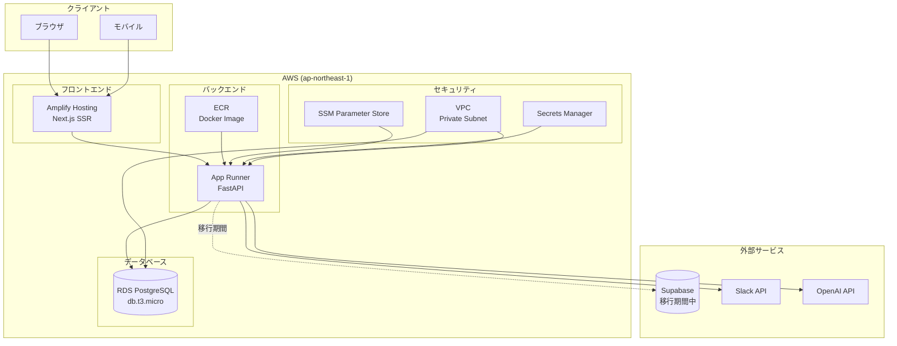
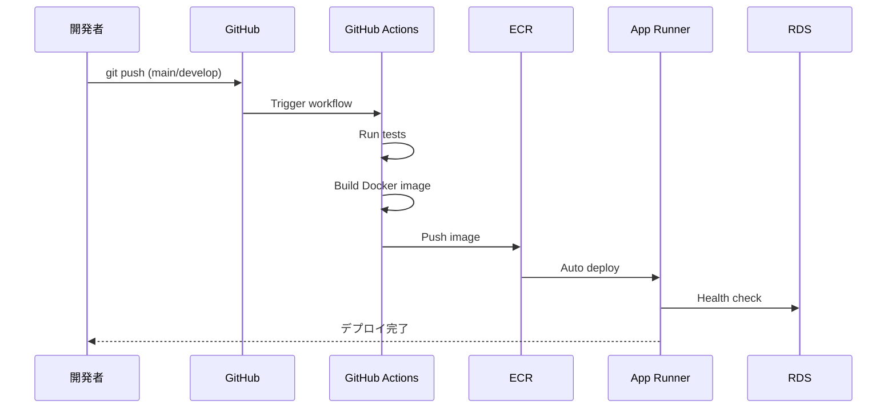
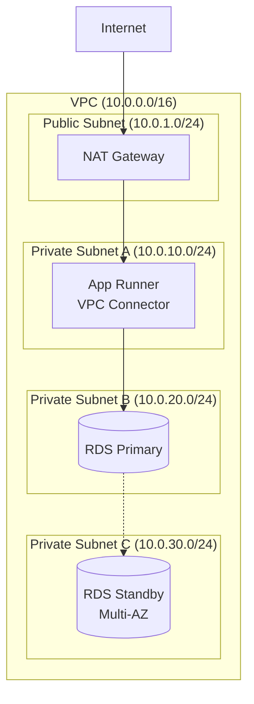

# 設計ドキュメント

## 概要

本設計書は、習慣管理ダッシュボードアプリケーションのバックエンドAPIをコンテナ化し、AWS App Runnerにデプロイするためのアーキテクチャと実装方針を定義します。将来的なSupabase脱却の準備として、Amazon RDS PostgreSQLを構築し、Slack/OpenAI連携の基盤を整備します。

主な特徴：
- FastAPI + SQLAlchemy + Pydanticによる型安全なバックエンドAPI
- Dockerコンテナ化とAWS App Runnerによるサーバーレスデプロイ
- Amazon RDS PostgreSQLによるデータベース移行準備
- JWT認証ミドルウェア（Supabase互換）
- Slack/OpenAI連携の基盤構築
- AWS CDK（Python）によるインフラのコード化

## アーキテクチャ

### 全体構成図



### デプロイフロー



### VPCネットワーク構成



## コンポーネントとインターフェース

### プロジェクト構成

```
vow/
├── backend/                     # FastAPIバックエンド
│   ├── app/
│   │   ├── __init__.py
│   │   ├── main.py             # FastAPIエントリーポイント
│   │   ├── config.py           # 設定管理
│   │   ├── routers/            # APIルーター
│   │   │   ├── __init__.py
│   │   │   ├── health.py       # ヘルスチェック
│   │   │   ├── habits.py       # 習慣API
│   │   │   ├── goals.py        # 目標API
│   │   │   └── tasks.py        # タスクAPI
│   │   ├── services/           # ビジネスロジック
│   │   │   ├── __init__.py
│   │   │   ├── habit_service.py
│   │   │   ├── slack_service.py
│   │   │   └── openai_service.py
│   │   ├── repositories/       # データアクセス
│   │   │   ├── __init__.py
│   │   │   └── base.py
│   │   ├── models/             # SQLAlchemyモデル
│   │   │   ├── __init__.py
│   │   │   └── habit.py
│   │   ├── schemas/            # Pydanticスキーマ
│   │   │   ├── __init__.py
│   │   │   └── habit.py
│   │   └── middleware/         # ミドルウェア
│   │       ├── __init__.py
│   │       └── auth.py         # JWT認証
│   ├── tests/                  # テスト
│   │   ├── __init__.py
│   │   ├── conftest.py
│   │   └── test_health.py
│   ├── migrations/             # Alembicマイグレーション
│   │   └── versions/
│   ├── scripts/                # 移行スクリプト
│   │   └── migrate_from_supabase.py
│   ├── Dockerfile
│   ├── requirements.txt
│   ├── requirements-dev.txt
│   └── alembic.ini
├── infra/                       # AWS CDK (Python)
│   ├── app.py                  # CDKエントリーポイント
│   ├── stacks/
│   │   ├── __init__.py
│   │   ├── backend_stack.py    # バックエンドスタック
│   │   └── database_stack.py   # データベーススタック
│   ├── requirements.txt
│   └── cdk.json
├── frontend/                    # 既存Next.js
├── docker-compose.yml          # ローカル開発用
├── docker-compose.dev.yml      # 開発環境オーバーライド
└── .github/
    └── workflows/
        └── deploy-backend.yml  # バックエンドCI/CD
```

### FastAPIアプリケーション設計

```python
# backend/app/main.py
from fastapi import FastAPI
from fastapi.middleware.cors import CORSMiddleware
from contextlib import asynccontextmanager

from app.config import settings
from app.routers import health, habits, goals, tasks
from app.middleware.auth import JWTAuthMiddleware

@asynccontextmanager
async def lifespan(app: FastAPI):
    # Startup
    await init_database()
    yield
    # Shutdown
    await close_database()

app = FastAPI(
    title="Vow Backend API",
    version="1.0.0",
    lifespan=lifespan
)

# CORS設定
app.add_middleware(
    CORSMiddleware,
    allow_origins=settings.cors_origins,
    allow_credentials=True,
    allow_methods=["*"],
    allow_headers=["*"],
)

# JWT認証ミドルウェア
app.add_middleware(JWTAuthMiddleware)

# ルーター登録
app.include_router(health.router, tags=["health"])
app.include_router(habits.router, prefix="/api/v1", tags=["habits"])
app.include_router(goals.router, prefix="/api/v1", tags=["goals"])
app.include_router(tasks.router, prefix="/api/v1", tags=["tasks"])
```

### JWT認証ミドルウェア設計

```python
# backend/app/middleware/auth.py
from fastapi import Request, HTTPException
from starlette.middleware.base import BaseHTTPMiddleware
from jose import jwt, JWTError
from typing import Optional

from app.config import settings

class JWTAuthMiddleware(BaseHTTPMiddleware):
    """JWT認証ミドルウェア（Supabase JWT互換）"""
    
    EXCLUDED_PATHS = ["/health", "/docs", "/openapi.json"]
    
    async def dispatch(self, request: Request, call_next):
        if self._is_excluded_path(request.url.path):
            return await call_next(request)
        
        token = self._extract_token(request)
        if not token:
            raise HTTPException(status_code=401, detail="Missing authentication token")
        
        try:
            payload = self._verify_token(token)
            request.state.user = payload
        except JWTError:
            raise HTTPException(status_code=401, detail="Invalid authentication token")
        
        return await call_next(request)
    
    def _is_excluded_path(self, path: str) -> bool:
        return any(path.startswith(excluded) for excluded in self.EXCLUDED_PATHS)
    
    def _extract_token(self, request: Request) -> Optional[str]:
        auth_header = request.headers.get("Authorization")
        if auth_header and auth_header.startswith("Bearer "):
            return auth_header[7:]
        return None
    
    def _verify_token(self, token: str) -> dict:
        return jwt.decode(
            token,
            settings.jwt_secret,
            algorithms=[settings.jwt_algorithm],
            audience=settings.jwt_audience
        )
```

### 設定管理

```python
# backend/app/config.py
from pydantic_settings import BaseSettings
from typing import List, Optional

class Settings(BaseSettings):
    """アプリケーション設定"""
    
    # アプリケーション
    app_name: str = "Vow Backend API"
    debug: bool = False
    
    # データベース
    database_url: str
    supabase_url: Optional[str] = None  # 移行期間中
    migration_mode: bool = False  # デュアルライト有効化
    
    # JWT認証
    jwt_secret: str
    jwt_algorithm: str = "HS256"
    jwt_audience: str = "authenticated"
    
    # CORS
    cors_origins: List[str] = ["http://localhost:3000"]
    
    # 外部サービス
    slack_webhook_url: Optional[str] = None
    slack_enabled: bool = False
    openai_api_key: Optional[str] = None
    openai_enabled: bool = False
    openai_model: str = "gpt-4o-mini"
    
    class Config:
        env_file = ".env"

settings = Settings()
```

### Dockerfile設計

```dockerfile
# backend/Dockerfile
# Multi-stage build for optimized image size

# Stage 1: Builder
FROM python:3.12-slim AS builder

WORKDIR /app

# Install build dependencies
RUN apt-get update && apt-get install -y --no-install-recommends \
    build-essential \
    && rm -rf /var/lib/apt/lists/*

# Install Python dependencies
COPY requirements.txt .
RUN pip install --no-cache-dir --user -r requirements.txt

# Stage 2: Runner
FROM python:3.12-slim AS runner

WORKDIR /app

# Create non-root user
RUN groupadd --gid 1001 appgroup \
    && useradd --uid 1001 --gid appgroup --shell /bin/bash appuser

# Copy Python packages from builder
COPY --from=builder /root/.local /home/appuser/.local
ENV PATH=/home/appuser/.local/bin:$PATH

# Copy application code
COPY --chown=appuser:appgroup app/ ./app/
COPY --chown=appuser:appgroup alembic.ini .
COPY --chown=appuser:appgroup migrations/ ./migrations/

# Switch to non-root user
USER appuser

# Expose port
EXPOSE 8000

# Health check
HEALTHCHECK --interval=30s --timeout=10s --start-period=5s --retries=3 \
    CMD python -c "import urllib.request; urllib.request.urlopen('http://localhost:8000/health')"

# Run application
CMD ["uvicorn", "app.main:app", "--host", "0.0.0.0", "--port", "8000"]
```

### docker-compose設計

```yaml
# docker-compose.yml
version: '3.8'

services:
  backend:
    build:
      context: ./backend
      dockerfile: Dockerfile
    ports:
      - "8000:8000"
    environment:
      - DATABASE_URL=postgresql://postgres:postgres@db:5432/vow_dev
      - JWT_SECRET=${JWT_SECRET:-dev-secret-key}
      - DEBUG=true
      - CORS_ORIGINS=["http://localhost:3000"]
    depends_on:
      db:
        condition: service_healthy
    volumes:
      - ./backend/app:/app/app:ro
    command: uvicorn app.main:app --host 0.0.0.0 --port 8000 --reload

  db:
    image: postgres:15-alpine
    environment:
      - POSTGRES_USER=postgres
      - POSTGRES_PASSWORD=postgres
      - POSTGRES_DB=vow_dev
    ports:
      - "5432:5432"
    volumes:
      - postgres_data:/var/lib/postgresql/data
      - ./backend/scripts/init.sql:/docker-entrypoint-initdb.d/init.sql
    healthcheck:
      test: ["CMD-SHELL", "pg_isready -U postgres"]
      interval: 5s
      timeout: 5s
      retries: 5

volumes:
  postgres_data:
```

## データモデル

### SQLAlchemyモデル

```python
# backend/app/models/habit.py
from sqlalchemy import Column, String, Boolean, DateTime, ForeignKey, Integer
from sqlalchemy.dialects.postgresql import UUID
from sqlalchemy.orm import relationship
from datetime import datetime
import uuid

from app.models.base import Base

class Habit(Base):
    __tablename__ = "habits"
    
    id = Column(UUID(as_uuid=True), primary_key=True, default=uuid.uuid4)
    user_id = Column(UUID(as_uuid=True), nullable=False, index=True)
    name = Column(String(255), nullable=False)
    description = Column(String(1000))
    frequency = Column(String(50), default="daily")
    is_active = Column(Boolean, default=True)
    created_at = Column(DateTime, default=datetime.utcnow)
    updated_at = Column(DateTime, default=datetime.utcnow, onupdate=datetime.utcnow)
    
    # リレーション
    logs = relationship("HabitLog", back_populates="habit", cascade="all, delete-orphan")

class HabitLog(Base):
    __tablename__ = "habit_logs"
    
    id = Column(UUID(as_uuid=True), primary_key=True, default=uuid.uuid4)
    habit_id = Column(UUID(as_uuid=True), ForeignKey("habits.id"), nullable=False)
    user_id = Column(UUID(as_uuid=True), nullable=False, index=True)
    completed_at = Column(DateTime, default=datetime.utcnow)
    notes = Column(String(500))
    
    # リレーション
    habit = relationship("Habit", back_populates="logs")
```

### Pydanticスキーマ

```python
# backend/app/schemas/habit.py
from pydantic import BaseModel, Field
from typing import Optional, List
from datetime import datetime
from uuid import UUID

class HabitBase(BaseModel):
    name: str = Field(..., min_length=1, max_length=255)
    description: Optional[str] = Field(None, max_length=1000)
    frequency: str = Field(default="daily")

class HabitCreate(HabitBase):
    pass

class HabitUpdate(BaseModel):
    name: Optional[str] = Field(None, min_length=1, max_length=255)
    description: Optional[str] = Field(None, max_length=1000)
    frequency: Optional[str] = None
    is_active: Optional[bool] = None

class HabitResponse(HabitBase):
    id: UUID
    user_id: UUID
    is_active: bool
    created_at: datetime
    updated_at: datetime
    
    class Config:
        from_attributes = True

class HabitListResponse(BaseModel):
    habits: List[HabitResponse]
    total: int
```

## CDKスタック設計

### バックエンドスタック

```python
# infra/stacks/backend_stack.py
from aws_cdk import (
    Stack,
    Duration,
    RemovalPolicy,
    CfnOutput,
    aws_ecr as ecr,
    aws_apprunner_alpha as apprunner,
    aws_ec2 as ec2,
    aws_iam as iam,
    aws_ssm as ssm,
    aws_secretsmanager as secretsmanager,
)
from constructs import Construct

class BackendStack(Stack):
    """FastAPIバックエンド用CDKスタック"""
    
    def __init__(
        self,
        scope: Construct,
        construct_id: str,
        vpc: ec2.IVpc,
        database_secret: secretsmanager.ISecret,
        **kwargs
    ) -> None:
        super().__init__(scope, construct_id, **kwargs)
        
        # ECRリポジトリ
        self.ecr_repository = ecr.Repository(
            self,
            "BackendRepository",
            repository_name="vow-backend",
            removal_policy=RemovalPolicy.RETAIN,
            lifecycle_rules=[
                ecr.LifecycleRule(
                    max_image_count=10,
                    description="Keep only 10 images"
                )
            ],
            image_scan_on_push=True
        )
        
        # VPCコネクター
        vpc_connector = apprunner.VpcConnector(
            self,
            "VpcConnector",
            vpc=vpc,
            vpc_subnets=ec2.SubnetSelection(
                subnet_type=ec2.SubnetType.PRIVATE_WITH_EGRESS
            )
        )
        
        # App Runnerサービス
        self.app_runner_service = apprunner.Service(
            self,
            "BackendService",
            source=apprunner.Source.from_ecr(
                repository=self.ecr_repository,
                tag_or_digest="latest",
                image_configuration=apprunner.ImageConfiguration(
                    port=8000,
                    environment_variables={
                        "DEBUG": "false",
                        "CORS_ORIGINS": '["https://your-frontend.amplifyapp.com"]'
                    },
                    environment_secrets={
                        "DATABASE_URL": apprunner.Secret.from_secrets_manager(
                            database_secret, "connection_string"
                        ),
                        "JWT_SECRET": apprunner.Secret.from_ssm_parameter(
                            ssm.StringParameter.from_string_parameter_name(
                                self, "JwtSecret", "/vow/jwt-secret"
                            )
                        )
                    }
                )
            ),
            cpu=apprunner.Cpu.ONE_VCPU,
            memory=apprunner.Memory.TWO_GB,
            vpc_connector=vpc_connector,
            health_check=apprunner.HealthCheck.http(
                path="/health",
                interval=Duration.seconds(10),
                timeout=Duration.seconds(5),
                healthy_threshold=1,
                unhealthy_threshold=3
            ),
            auto_deployments_enabled=True
        )
        
        # 出力
        CfnOutput(
            self,
            "EcrRepositoryUri",
            value=self.ecr_repository.repository_uri,
            description="ECR Repository URI"
        )
        
        CfnOutput(
            self,
            "AppRunnerServiceUrl",
            value=f"https://{self.app_runner_service.service_url}",
            description="App Runner Service URL"
        )
```

### データベーススタック

```python
# infra/stacks/database_stack.py
from aws_cdk import (
    Stack,
    Duration,
    RemovalPolicy,
    CfnOutput,
    aws_ec2 as ec2,
    aws_rds as rds,
    aws_secretsmanager as secretsmanager,
)
from constructs import Construct

class DatabaseStack(Stack):
    """RDS PostgreSQL用CDKスタック"""
    
    def __init__(self, scope: Construct, construct_id: str, **kwargs) -> None:
        super().__init__(scope, construct_id, **kwargs)
        
        # VPC
        self.vpc = ec2.Vpc(
            self,
            "BackendVpc",
            max_azs=2,
            nat_gateways=1,
            subnet_configuration=[
                ec2.SubnetConfiguration(
                    name="Public",
                    subnet_type=ec2.SubnetType.PUBLIC,
                    cidr_mask=24
                ),
                ec2.SubnetConfiguration(
                    name="Private",
                    subnet_type=ec2.SubnetType.PRIVATE_WITH_EGRESS,
                    cidr_mask=24
                ),
                ec2.SubnetConfiguration(
                    name="Isolated",
                    subnet_type=ec2.SubnetType.PRIVATE_ISOLATED,
                    cidr_mask=24
                )
            ]
        )
        
        # セキュリティグループ
        self.db_security_group = ec2.SecurityGroup(
            self,
            "DatabaseSecurityGroup",
            vpc=self.vpc,
            description="Security group for RDS PostgreSQL",
            allow_all_outbound=False
        )
        
        # App Runnerからのアクセスを許可
        self.db_security_group.add_ingress_rule(
            peer=ec2.Peer.ipv4(self.vpc.vpc_cidr_block),
            connection=ec2.Port.tcp(5432),
            description="Allow PostgreSQL from VPC"
        )
        
        # データベース認証情報
        self.database_secret = secretsmanager.Secret(
            self,
            "DatabaseSecret",
            secret_name="/vow/database-credentials",
            generate_secret_string=secretsmanager.SecretStringGenerator(
                secret_string_template='{"username": "vowadmin"}',
                generate_string_key="password",
                exclude_punctuation=True,
                password_length=32
            )
        )
        
        # RDSインスタンス
        self.database = rds.DatabaseInstance(
            self,
            "Database",
            engine=rds.DatabaseInstanceEngine.postgres(
                version=rds.PostgresEngineVersion.VER_15
            ),
            instance_type=ec2.InstanceType.of(
                ec2.InstanceClass.T3,
                ec2.InstanceSize.MICRO
            ),
            vpc=self.vpc,
            vpc_subnets=ec2.SubnetSelection(
                subnet_type=ec2.SubnetType.PRIVATE_ISOLATED
            ),
            security_groups=[self.db_security_group],
            credentials=rds.Credentials.from_secret(self.database_secret),
            database_name="vow",
            allocated_storage=20,
            max_allocated_storage=100,
            storage_encrypted=True,
            backup_retention=Duration.days(7),
            deletion_protection=False,  # 開発環境用
            removal_policy=RemovalPolicy.SNAPSHOT,
            publicly_accessible=False
        )
        
        # 出力
        CfnOutput(
            self,
            "DatabaseEndpoint",
            value=self.database.db_instance_endpoint_address,
            description="RDS Endpoint"
        )
        
        CfnOutput(
            self,
            "DatabaseSecretArn",
            value=self.database_secret.secret_arn,
            description="Database Secret ARN"
        )
```


### 外部サービス連携

```python
# backend/app/services/slack_service.py
import httpx
from typing import Optional
from app.config import settings

class SlackService:
    """Slack通知サービス"""
    
    def __init__(self):
        self.webhook_url = settings.slack_webhook_url
        self.enabled = settings.slack_enabled and self.webhook_url is not None
    
    async def send_notification(
        self,
        message: str,
        channel: Optional[str] = None
    ) -> bool:
        """Slack通知を送信"""
        if not self.enabled:
            return False
        
        try:
            async with httpx.AsyncClient() as client:
                payload = {"text": message}
                if channel:
                    payload["channel"] = channel
                
                response = await client.post(
                    self.webhook_url,
                    json=payload,
                    timeout=10.0
                )
                return response.status_code == 200
        except Exception as e:
            # エラーをログに記録するが、メイン処理はブロックしない
            print(f"Slack notification failed: {e}")
            return False

# backend/app/services/openai_service.py
from openai import AsyncOpenAI
from typing import Optional, List
from app.config import settings

class OpenAIService:
    """OpenAI APIサービス"""
    
    def __init__(self):
        self.enabled = settings.openai_enabled and settings.openai_api_key is not None
        if self.enabled:
            self.client = AsyncOpenAI(api_key=settings.openai_api_key)
        self.model = settings.openai_model
        self._request_count = 0
        self._max_requests_per_minute = 60
    
    async def generate_completion(
        self,
        prompt: str,
        max_tokens: int = 500,
        temperature: float = 0.7
    ) -> Optional[str]:
        """テキスト生成"""
        if not self.enabled:
            return None
        
        if self._request_count >= self._max_requests_per_minute:
            raise Exception("Rate limit exceeded")
        
        try:
            self._request_count += 1
            response = await self.client.chat.completions.create(
                model=self.model,
                messages=[{"role": "user", "content": prompt}],
                max_tokens=max_tokens,
                temperature=temperature
            )
            return response.choices[0].message.content
        except Exception as e:
            print(f"OpenAI API call failed: {e}")
            return None
```

### データベース移行スクリプト

```python
# backend/scripts/migrate_from_supabase.py
"""
Supabase から RDS への データ移行スクリプト

使用方法:
    python migrate_from_supabase.py --source-url <supabase_url> --target-url <rds_url>
"""
import asyncio
import argparse
from sqlalchemy.ext.asyncio import create_async_engine, AsyncSession
from sqlalchemy.orm import sessionmaker
from sqlalchemy import text

async def migrate_table(
    source_session: AsyncSession,
    target_session: AsyncSession,
    table_name: str,
    batch_size: int = 1000
) -> int:
    """テーブルデータを移行"""
    offset = 0
    total_migrated = 0
    
    while True:
        # ソースからデータ取得
        result = await source_session.execute(
            text(f"SELECT * FROM {table_name} LIMIT {batch_size} OFFSET {offset}")
        )
        rows = result.fetchall()
        
        if not rows:
            break
        
        # ターゲットにデータ挿入
        columns = result.keys()
        for row in rows:
            values = dict(zip(columns, row))
            placeholders = ", ".join([f":{k}" for k in values.keys()])
            column_names = ", ".join(values.keys())
            
            await target_session.execute(
                text(f"INSERT INTO {table_name} ({column_names}) VALUES ({placeholders}) ON CONFLICT DO NOTHING"),
                values
            )
        
        await target_session.commit()
        total_migrated += len(rows)
        offset += batch_size
        print(f"Migrated {total_migrated} rows from {table_name}")
    
    return total_migrated

async def main(source_url: str, target_url: str):
    """メイン移行処理"""
    tables = ["habits", "habit_logs", "goals", "tasks", "activities"]
    
    source_engine = create_async_engine(source_url)
    target_engine = create_async_engine(target_url)
    
    async with AsyncSession(source_engine) as source_session:
        async with AsyncSession(target_engine) as target_session:
            for table in tables:
                print(f"Migrating {table}...")
                count = await migrate_table(source_session, target_session, table)
                print(f"Completed {table}: {count} rows")

if __name__ == "__main__":
    parser = argparse.ArgumentParser()
    parser.add_argument("--source-url", required=True)
    parser.add_argument("--target-url", required=True)
    args = parser.parse_args()
    
    asyncio.run(main(args.source_url, args.target_url))
```

### GitHub Actions CI/CD

```yaml
# .github/workflows/deploy-backend.yml
name: Deploy Backend

on:
  push:
    branches: [main, develop]
    paths:
      - 'backend/**'
      - '.github/workflows/deploy-backend.yml'

permissions:
  id-token: write
  contents: read

env:
  AWS_REGION: ap-northeast-1
  ECR_REPOSITORY: vow-backend

jobs:
  test:
    runs-on: ubuntu-latest
    steps:
      - uses: actions/checkout@v4
      
      - name: Set up Python
        uses: actions/setup-python@v5
        with:
          python-version: '3.12'
      
      - name: Install dependencies
        run: |
          cd backend
          pip install -r requirements.txt -r requirements-dev.txt
      
      - name: Run tests
        run: |
          cd backend
          pytest tests/ -v --cov=app

  build-and-deploy:
    needs: test
    runs-on: ubuntu-latest
    steps:
      - uses: actions/checkout@v4
      
      - name: Configure AWS credentials
        uses: aws-actions/configure-aws-credentials@v4
        with:
          role-to-assume: ${{ secrets.AWS_ROLE_ARN }}
          aws-region: ${{ env.AWS_REGION }}
      
      - name: Login to Amazon ECR
        id: login-ecr
        uses: aws-actions/amazon-ecr-login@v2
      
      - name: Build, tag, and push image to Amazon ECR
        env:
          ECR_REGISTRY: ${{ steps.login-ecr.outputs.registry }}
          IMAGE_TAG: ${{ github.sha }}
        run: |
          cd backend
          docker build -t $ECR_REGISTRY/$ECR_REPOSITORY:$IMAGE_TAG .
          docker build -t $ECR_REGISTRY/$ECR_REPOSITORY:latest .
          docker push $ECR_REGISTRY/$ECR_REPOSITORY:$IMAGE_TAG
          docker push $ECR_REGISTRY/$ECR_REPOSITORY:latest
      
      - name: Deploy to App Runner
        run: |
          aws apprunner start-deployment \
            --service-arn ${{ secrets.APP_RUNNER_SERVICE_ARN }}
```


## 正確性プロパティ

*正確性プロパティとは、システムのすべての有効な実行において真であるべき特性や振る舞いのことです。これらは人間が読める仕様と機械で検証可能な正確性保証の橋渡しとなります。*

### Property 1: JWT Token Validation

*For any* JWT token provided in the Authorization header, valid tokens with correct signature and non-expired claims SHALL be accepted, while invalid tokens (malformed, wrong signature, or expired) SHALL result in a 401 Unauthorized response.

**Validates: Requirements 2.1, 2.3**

### Property 2: JWT User Extraction Round-Trip

*For any* valid JWT token containing user claims (user_id, email, role), the extracted user information attached to the request context SHALL match the original claims encoded in the token.

**Validates: Requirements 2.2**

### Property 3: Data Migration Integrity

*For any* dataset migrated from Supabase to RDS, the target database SHALL contain equivalent data to the source, with all records, relationships, and field values preserved.

**Validates: Requirements 7.3**

### Property 4: Dual Database Write Consistency

*For any* write operation performed while in migration mode, both Supabase and RDS databases SHALL receive the same data, ensuring consistency between the two systems.

**Validates: Requirements 7.5**

### Property 5: CORS Header Presence

*For any* HTTP request originating from an allowed origin (as configured in CORS settings), the response SHALL include appropriate CORS headers (Access-Control-Allow-Origin, Access-Control-Allow-Methods, Access-Control-Allow-Headers).

**Validates: Requirements 8.2**

### Property 6: API Response Schema Compatibility

*For any* API endpoint response, the JSON structure SHALL conform to the expected frontend data schema, ensuring field names, types, and nesting match the existing frontend data structures.

**Validates: Requirements 8.5**

## エラーハンドリング

### 認証エラー

| エラー種別 | HTTPステータス | レスポンス | 対処方法 |
|-----------|---------------|-----------|---------|
| トークンなし | 401 | `{"detail": "Missing authentication token"}` | Authorization headerを確認 |
| 無効なトークン | 401 | `{"detail": "Invalid authentication token"}` | トークンの形式・署名を確認 |
| 期限切れトークン | 401 | `{"detail": "Token has expired"}` | トークンを再取得 |

### データベースエラー

| エラー種別 | HTTPステータス | レスポンス | 対処方法 |
|-----------|---------------|-----------|---------|
| 接続エラー | 503 | `{"detail": "Database connection failed"}` | DB接続設定を確認 |
| 一意制約違反 | 409 | `{"detail": "Resource already exists"}` | 重複データを確認 |
| 外部キー違反 | 400 | `{"detail": "Referenced resource not found"}` | 関連リソースを確認 |

### 外部サービスエラー

| エラー種別 | HTTPステータス | レスポンス | 対処方法 |
|-----------|---------------|-----------|---------|
| Slack送信失敗 | - | ログ記録のみ（メイン処理継続） | Webhook URLを確認 |
| OpenAI API失敗 | 503 | `{"detail": "AI service temporarily unavailable"}` | API keyとレート制限を確認 |
| OpenAIレート制限 | 429 | `{"detail": "Rate limit exceeded"}` | 待機後に再試行 |

## テスト戦略

### テストの種類

本プロジェクトでは、ユニットテストとプロパティベーステストの両方を使用します。

**ユニットテスト**: 特定の例、エッジケース、エラー条件を検証
**プロパティテスト**: すべての入力に対して普遍的なプロパティを検証

### プロパティベーステスト設定

- ライブラリ: `hypothesis` (Python)
- 各プロパティテストは最低100回のイテレーションを実行
- 各テストは設計ドキュメントのプロパティを参照するコメントでタグ付け
- タグ形式: `# Feature: backend-containerization, Property N: {property_text}`

### テスト構成

```python
# backend/tests/conftest.py
import pytest
from hypothesis import settings, Verbosity

# Hypothesisのデフォルト設定
settings.register_profile("ci", max_examples=100)
settings.register_profile("dev", max_examples=10)
settings.load_profile("ci")

@pytest.fixture
def test_client():
    from fastapi.testclient import TestClient
    from app.main import app
    return TestClient(app)

@pytest.fixture
def valid_jwt_token():
    """テスト用の有効なJWTトークンを生成"""
    from jose import jwt
    from datetime import datetime, timedelta
    
    payload = {
        "sub": "test-user-id",
        "email": "test@example.com",
        "role": "authenticated",
        "exp": datetime.utcnow() + timedelta(hours=1)
    }
    return jwt.encode(payload, "test-secret", algorithm="HS256")
```

### プロパティテスト例

```python
# backend/tests/test_jwt_properties.py
from hypothesis import given, strategies as st
import pytest

# Feature: backend-containerization, Property 1: JWT Token Validation
@given(
    token_content=st.text(min_size=1, max_size=100),
    is_valid_signature=st.booleans()
)
def test_jwt_validation_property(test_client, token_content, is_valid_signature):
    """
    Property 1: For any JWT token, valid tokens should be accepted,
    invalid tokens should return 401.
    """
    if is_valid_signature:
        # 有効な署名でトークンを生成
        token = create_valid_token(token_content)
        response = test_client.get(
            "/api/v1/habits",
            headers={"Authorization": f"Bearer {token}"}
        )
        assert response.status_code in [200, 404]  # 認証成功
    else:
        # 無効なトークン
        response = test_client.get(
            "/api/v1/habits",
            headers={"Authorization": f"Bearer {token_content}"}
        )
        assert response.status_code == 401

# Feature: backend-containerization, Property 2: JWT User Extraction Round-Trip
@given(
    user_id=st.uuids(),
    email=st.emails(),
    role=st.sampled_from(["authenticated", "admin"])
)
def test_jwt_user_extraction_roundtrip(user_id, email, role):
    """
    Property 2: For any valid JWT with user claims, extracted user info
    should match the original claims.
    """
    from app.middleware.auth import JWTAuthMiddleware
    
    # トークン生成
    claims = {"sub": str(user_id), "email": email, "role": role}
    token = create_token_with_claims(claims)
    
    # トークン検証・抽出
    middleware = JWTAuthMiddleware(app=None)
    extracted = middleware._verify_token(token)
    
    # ラウンドトリップ検証
    assert extracted["sub"] == str(user_id)
    assert extracted["email"] == email
    assert extracted["role"] == role

# Feature: backend-containerization, Property 5: CORS Header Presence
@given(
    origin=st.sampled_from([
        "http://localhost:3000",
        "https://your-frontend.amplifyapp.com"
    ]),
    method=st.sampled_from(["GET", "POST", "PUT", "DELETE"])
)
def test_cors_headers_property(test_client, origin, method):
    """
    Property 5: For any request from allowed origin, CORS headers
    should be present.
    """
    response = test_client.options(
        "/api/v1/habits",
        headers={"Origin": origin, "Access-Control-Request-Method": method}
    )
    
    assert "access-control-allow-origin" in response.headers
    assert response.headers["access-control-allow-origin"] in [origin, "*"]
```

### ユニットテスト例

```python
# backend/tests/test_health.py
def test_health_endpoint_returns_200(test_client):
    """ヘルスチェックエンドポイントが200を返すこと"""
    response = test_client.get("/health")
    assert response.status_code == 200
    assert "status" in response.json()

def test_health_endpoint_returns_service_status(test_client):
    """ヘルスチェックがサービスステータスを含むこと"""
    response = test_client.get("/health")
    data = response.json()
    assert data["status"] == "healthy"
    assert "version" in data

# backend/tests/test_auth.py
def test_missing_token_returns_401(test_client):
    """トークンなしで401が返ること"""
    response = test_client.get("/api/v1/habits")
    assert response.status_code == 401
    assert response.json()["detail"] == "Missing authentication token"

def test_expired_token_returns_401(test_client, expired_jwt_token):
    """期限切れトークンで401が返ること"""
    response = test_client.get(
        "/api/v1/habits",
        headers={"Authorization": f"Bearer {expired_jwt_token}"}
    )
    assert response.status_code == 401
```

## コスト見積もり

### 月額コスト概算（開発環境）

| サービス | 仕様 | 月額コスト |
|---------|------|-----------|
| App Runner | 1 vCPU, 2GB, ~100時間/月 | ~$10 |
| RDS PostgreSQL | db.t3.micro (Free Tier) | $0 (1年間) |
| ECR | ~500MB × 10イメージ | ~$0.50 |
| NAT Gateway | 1 AZ, ~10GB転送 | ~$35 |
| Secrets Manager | 2シークレット | ~$0.80 |
| SSM Parameter Store | 5パラメータ | $0 (Standard) |
| **合計** | | **~$46/月** |

### コスト最適化オプション

1. **NAT Gateway削除**: VPCエンドポイントを使用（~$10/月削減）
2. **App Runner最小化**: アイドル時の自動スケールダウン
3. **RDS停止**: 開発時間外は停止（~50%削減）

## 制限事項

1. **App Runner**: コールドスタート時に数秒の遅延が発生する可能性
2. **RDS Free Tier**: 12ヶ月間のみ、その後は課金開始
3. **移行期間**: Supabaseとの並行運用中はデータ整合性に注意
4. **OpenAI**: レート制限とコスト管理が必要

## 将来の拡張

1. **認証の完全移行**: Supabase AuthからCognitoまたはカスタム認証へ
2. **キャッシュ層**: ElastiCache (Redis) の追加
3. **CDN**: CloudFront によるAPI応答のキャッシュ
4. **監視強化**: CloudWatch Logs Insights、X-Ray トレーシング
5. **マルチリージョン**: 災害復旧のためのリージョン冗長化
