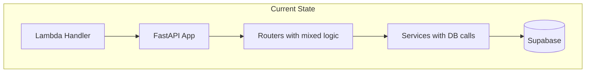
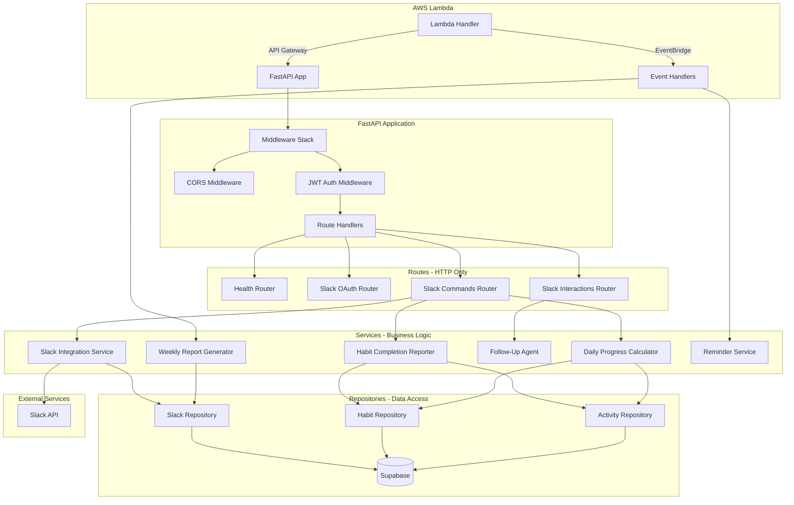

# Design Document: Backend Refactoring and TypeScript Migration

## Overview

This design document describes a two-phase approach to improving the Vow habit tracking backend:

**Phase 1: Python Refactoring** - Improve the existing Python codebase by implementing proper separation of concerns, dependency injection, comprehensive error handling, and test coverage.

**Phase 2: TypeScript Migration** - Migrate the refactored Python backend to TypeScript using Hono, Zod, and the Supabase JavaScript client.

This phased approach ensures that the codebase is well-structured and thoroughly tested before migration, reducing risk and making the TypeScript implementation cleaner.

## Architecture

### Current Architecture (Before Refactoring)



### Target Architecture (After Phase 1)



## Phase 1: Python Refactoring Design

### 1. Repository Layer

Create dedicated repository classes for each database table to encapsulate all data access logic.

```python
# app/repositories/base.py
from abc import ABC, abstractmethod
from typing import Generic, TypeVar, Optional, List
from supabase import Client

T = TypeVar('T')

class BaseRepository(ABC, Generic[T]):
    """Base repository with common CRUD operations."""
    
    def __init__(self, supabase: Client, table_name: str):
        self.supabase = supabase
        self.table_name = table_name
    
    async def get_by_id(self, id: str) -> Optional[T]:
        result = self.supabase.table(self.table_name).select("*").eq("id", id).execute()
        return result.data[0] if result.data else None
    
    async def create(self, data: dict) -> T:
        result = self.supabase.table(self.table_name).insert(data).execute()
        return result.data[0]
    
    async def update(self, id: str, data: dict) -> Optional[T]:
        result = self.supabase.table(self.table_name).update(data).eq("id", id).execute()
        return result.data[0] if result.data else None
    
    async def delete(self, id: str) -> bool:
        result = self.supabase.table(self.table_name).delete().eq("id", id).execute()
        return len(result.data) > 0 if result.data else False
```

```python
# app/repositories/habit.py
from typing import List, Optional
from .base import BaseRepository
from ..schemas.habit import Habit

class HabitRepository(BaseRepository[Habit]):
    """Repository for habit database operations."""
    
    def __init__(self, supabase):
        super().__init__(supabase, "habits")
    
    async def get_active_do_habits(
        self, owner_type: str, owner_id: str
    ) -> List[Habit]:
        """Get active habits with type='do' for an owner."""
        result = self.supabase.table(self.table_name).select("*").eq(
            "owner_type", owner_type
        ).eq("owner_id", owner_id).eq("active", True).eq("type", "do").execute()
        return result.data if result.data else []
    
    async def find_by_name(
        self, owner_type: str, owner_id: str, name: str
    ) -> Optional[Habit]:
        """Find habit by exact name match."""
        result = self.supabase.table(self.table_name).select("*").eq(
            "owner_type", owner_type
        ).eq("owner_id", owner_id).ilike("name", name).execute()
        return result.data[0] if result.data else None
    
    async def search_by_name(
        self, owner_type: str, owner_id: str, query: str, limit: int = 5
    ) -> List[Habit]:
        """Search habits by partial name match for suggestions."""
        result = self.supabase.table(self.table_name).select("*").eq(
            "owner_type", owner_type
        ).eq("owner_id", owner_id).ilike("name", f"%{query}%").limit(limit).execute()
        return result.data if result.data else []
```

```python
# app/repositories/activity.py
from datetime import datetime
from typing import List
from .base import BaseRepository
from ..schemas.activity import Activity

class ActivityRepository(BaseRepository[Activity]):
    """Repository for activity database operations."""
    
    def __init__(self, supabase):
        super().__init__(supabase, "activities")
    
    async def get_activities_in_range(
        self,
        owner_type: str,
        owner_id: str,
        start: datetime,
        end: datetime,
        kind: str = "complete"
    ) -> List[Activity]:
        """Get activities within a time range."""
        result = self.supabase.table(self.table_name).select("*").eq(
            "owner_type", owner_type
        ).eq("owner_id", owner_id).eq("kind", kind).gte(
            "timestamp", start.isoformat()
        ).lte("timestamp", end.isoformat()).execute()
        return result.data if result.data else []
    
    async def get_habit_activities(
        self, habit_id: str, kind: str = "complete", limit: int = 365
    ) -> List[Activity]:
        """Get activities for a specific habit."""
        result = self.supabase.table(self.table_name).select("*").eq(
            "habit_id", habit_id
        ).eq("kind", kind).order("timestamp", desc=True).limit(limit).execute()
        return result.data if result.data else []
    
    async def has_completion_today(
        self, habit_id: str, start: datetime, end: datetime
    ) -> bool:
        """Check if habit was completed today."""
        result = self.supabase.table(self.table_name).select("id").eq(
            "habit_id", habit_id
        ).eq("kind", "complete").gte(
            "timestamp", start.isoformat()
        ).lte("timestamp", end.isoformat()).limit(1).execute()
        return len(result.data) > 0 if result.data else False
```


### 2. Error Handling

Define a hierarchy of custom exceptions for consistent error handling.

```python
# app/errors/__init__.py
from typing import Optional

class AppError(Exception):
    """Base application error."""
    
    def __init__(
        self,
        message: str,
        status_code: int = 500,
        code: Optional[str] = None,
        is_retryable: bool = False
    ):
        super().__init__(message)
        self.message = message
        self.status_code = status_code
        self.code = code
        self.is_retryable = is_retryable

class AuthenticationError(AppError):
    """Authentication failed."""
    
    def __init__(self, message: str = "Authentication failed"):
        super().__init__(message, 401, "AUTHENTICATION_ERROR", False)

class TokenExpiredError(AuthenticationError):
    """JWT token has expired."""
    
    def __init__(self):
        super().__init__("Token has expired")

class SlackAPIError(AppError):
    """Slack API error."""
    
    def __init__(self, message: str, error_code: Optional[str] = None):
        super().__init__(message, 502, error_code, True)

class RateLimitError(SlackAPIError):
    """Rate limited by Slack API."""
    
    def __init__(self, retry_after: int = 1):
        super().__init__(f"Rate limited. Retry after {retry_after} seconds")
        self.retry_after = retry_after

class DataFetchError(AppError):
    """Failed to fetch data from database."""
    
    def __init__(self, message: str, original_error: Optional[Exception] = None):
        super().__init__(message, 500, "DATA_FETCH_ERROR", True)
        self.original_error = original_error

class ConnectionError(AppError):
    """Database connection error."""
    
    def __init__(self, message: str):
        super().__init__(message, 503, "CONNECTION_ERROR", True)

class ValidationError(AppError):
    """Input validation error."""
    
    def __init__(self, message: str):
        super().__init__(message, 400, "VALIDATION_ERROR", False)
```

```python
# app/errors/handler.py
from typing import Dict, Any
from fastapi import Request
from fastapi.responses import JSONResponse
from .errors import AppError
from ..utils.structured_logger import get_logger

logger = get_logger(__name__)

async def app_error_handler(request: Request, exc: AppError) -> JSONResponse:
    """Handle application errors with structured logging."""
    logger.error(
        f"Application error: {exc.message}",
        error_type=type(exc).__name__,
        error_code=exc.code,
        status_code=exc.status_code,
        path=request.url.path,
    )
    
    return JSONResponse(
        status_code=exc.status_code,
        content={
            "error": exc.code or "ERROR",
            "message": exc.message,
        }
    )

def get_user_friendly_message(error: Exception) -> str:
    """Get user-friendly error message in Japanese."""
    if isinstance(error, DataFetchError):
        return "データの取得に失敗しました。しばらくしてからもう一度お試しください。"
    if isinstance(error, ConnectionError):
        return "接続エラーが発生しました。しばらくしてからもう一度お試しください。"
    if isinstance(error, RateLimitError):
        return "リクエストが多すぎます。しばらくしてからもう一度お試しください。"
    if isinstance(error, SlackAPIError):
        return "Slack APIエラーが発生しました。しばらくしてからもう一度お試しください。"
    return "予期しないエラーが発生しました。しばらくしてからもう一度お試しください。"
```

### 3. Dependency Injection

Use FastAPI's dependency injection for services and repositories.

```python
# app/dependencies.py
from functools import lru_cache
from typing import Generator
from fastapi import Depends
from supabase import Client

from .config import settings, get_supabase_client
from .repositories.slack import SlackRepository
from .repositories.habit import HabitRepository
from .repositories.activity import ActivityRepository
from .repositories.goal import GoalRepository
from .services.slack_service import SlackIntegrationService
from .services.habit_completion_reporter import HabitCompletionReporter
from .services.daily_progress_calculator import DailyProgressCalculator

def get_supabase() -> Client:
    """Get Supabase client dependency."""
    return get_supabase_client()

def get_slack_repository(supabase: Client = Depends(get_supabase)) -> SlackRepository:
    """Get Slack repository dependency."""
    return SlackRepository(supabase)

def get_habit_repository(supabase: Client = Depends(get_supabase)) -> HabitRepository:
    """Get Habit repository dependency."""
    return HabitRepository(supabase)

def get_activity_repository(supabase: Client = Depends(get_supabase)) -> ActivityRepository:
    """Get Activity repository dependency."""
    return ActivityRepository(supabase)

def get_goal_repository(supabase: Client = Depends(get_supabase)) -> GoalRepository:
    """Get Goal repository dependency."""
    return GoalRepository(supabase)

@lru_cache()
def get_slack_service() -> SlackIntegrationService:
    """Get Slack integration service (singleton)."""
    return SlackIntegrationService()

def get_habit_completion_reporter(
    habit_repo: HabitRepository = Depends(get_habit_repository),
    activity_repo: ActivityRepository = Depends(get_activity_repository),
    goal_repo: GoalRepository = Depends(get_goal_repository),
) -> HabitCompletionReporter:
    """Get Habit completion reporter with injected dependencies."""
    return HabitCompletionReporter(habit_repo, activity_repo, goal_repo)

def get_daily_progress_calculator(
    habit_repo: HabitRepository = Depends(get_habit_repository),
    activity_repo: ActivityRepository = Depends(get_activity_repository),
    goal_repo: GoalRepository = Depends(get_goal_repository),
) -> DailyProgressCalculator:
    """Get Daily progress calculator with injected dependencies."""
    return DailyProgressCalculator(habit_repo, activity_repo, goal_repo)
```

### 4. Refactored Service Layer

Services should only contain business logic, with data access delegated to repositories.

```python
# app/services/habit_completion_reporter.py
from datetime import datetime, date, timedelta
from typing import Optional, Tuple, Dict, Any, List
from zoneinfo import ZoneInfo

from ..repositories.habit import HabitRepository
from ..repositories.activity import ActivityRepository
from ..repositories.goal import GoalRepository
from ..errors import DataFetchError

class HabitCompletionReporter:
    """Service for habit completion and streak tracking."""
    
    def __init__(
        self,
        habit_repo: HabitRepository,
        activity_repo: ActivityRepository,
        goal_repo: GoalRepository,
    ):
        self.habit_repo = habit_repo
        self.activity_repo = activity_repo
        self.goal_repo = goal_repo
        self.jst = ZoneInfo("Asia/Tokyo")
    
    async def complete_habit_by_id(
        self,
        owner_id: str,
        habit_id: str,
        source: str = "api",
        owner_type: str = "user",
    ) -> Tuple[bool, str, Optional[Dict[str, Any]]]:
        """Complete a habit by ID."""
        try:
            habit = await self.habit_repo.get_by_id(habit_id)
            if not habit:
                return False, "Habit not found", None
            
            # Check if already completed today
            start, end = self._get_jst_day_boundaries()
            if await self.activity_repo.has_completion_today(habit_id, start, end):
                return False, "Already completed today", {
                    "already_completed": True,
                    "habit": habit,
                }
            
            # Create completion activity
            activity = await self.activity_repo.create({
                "owner_type": owner_type,
                "owner_id": owner_id,
                "habit_id": habit_id,
                "kind": "complete",
                "amount": habit.get("workload_per_count", 1),
                "timestamp": datetime.now(self.jst).isoformat(),
                "source": source,
            })
            
            # Calculate streak
            streak = await self.get_habit_streak(habit_id, owner_type, owner_id)
            
            return True, "Habit completed", {
                "habit": habit,
                "activity": activity,
                "streak": streak,
            }
        except Exception as e:
            raise DataFetchError(f"Failed to complete habit: {e}", e)
    
    async def get_habit_streak(
        self, habit_id: str, owner_type: str, owner_id: str
    ) -> int:
        """Calculate current streak for a habit."""
        activities = await self.activity_repo.get_habit_activities(habit_id)
        
        if not activities:
            return 0
        
        streak = 0
        expected_date = date.today()
        
        for activity in activities:
            activity_date = datetime.fromisoformat(
                activity["timestamp"].replace("Z", "+00:00")
            ).date()
            
            if streak == 0:
                if activity_date == expected_date:
                    streak = 1
                    expected_date -= timedelta(days=1)
                elif activity_date == expected_date - timedelta(days=1):
                    streak = 1
                    expected_date = activity_date - timedelta(days=1)
                else:
                    break
            elif activity_date == expected_date:
                streak += 1
                expected_date -= timedelta(days=1)
            else:
                break
        
        return streak
    
    def _get_jst_day_boundaries(self) -> Tuple[datetime, datetime]:
        """Get JST day start and end times."""
        now_jst = datetime.now(self.jst)
        start = now_jst.replace(hour=0, minute=0, second=0, microsecond=0)
        end = now_jst.replace(hour=23, minute=59, second=59, microsecond=999999)
        return start, end
```


### 5. Refactored Router Layer

Routers should only handle HTTP concerns, delegating business logic to services.

```python
# app/routers/slack_webhook.py
import time
from fastapi import APIRouter, Request, Depends, HTTPException, Response
from urllib.parse import parse_qs

from ..dependencies import (
    get_slack_service,
    get_slack_repository,
    get_habit_completion_reporter,
    get_daily_progress_calculator,
)
from ..services.slack_service import SlackIntegrationService
from ..services.habit_completion_reporter import HabitCompletionReporter
from ..services.slack_block_builder import SlackBlockBuilder
from ..services.slack_error_handler import SlackErrorHandler
from ..repositories.slack import SlackRepository
from ..utils.structured_logger import get_logger

router = APIRouter(prefix="/api/slack", tags=["slack"])
logger = get_logger(__name__)

async def verify_slack_request(
    request: Request,
    slack_service: SlackIntegrationService = Depends(get_slack_service),
) -> bytes:
    """Verify Slack request signature."""
    timestamp = request.headers.get("X-Slack-Request-Timestamp", "")
    signature = request.headers.get("X-Slack-Signature", "")
    body = await request.body()
    
    if not slack_service.verify_signature(timestamp, body, signature):
        raise HTTPException(status_code=401, detail="Invalid signature")
    
    return body

@router.post("/commands")
async def handle_slash_command(
    request: Request,
    body: bytes = Depends(verify_slack_request),
    slack_repo: SlackRepository = Depends(get_slack_repository),
    habit_reporter: HabitCompletionReporter = Depends(get_habit_completion_reporter),
    slack_service: SlackIntegrationService = Depends(get_slack_service),
) -> dict:
    """Handle Slack slash commands."""
    start_time = time.time()
    
    # Parse form data
    form_data = parse_qs(body.decode())
    command = form_data.get("command", [""])[0]
    text = form_data.get("text", [""])[0].strip()
    user_id = form_data.get("user_id", [""])[0]
    team_id = form_data.get("team_id", [""])[0]
    response_url = form_data.get("response_url", [""])[0]
    
    logger.info("Slack command received", command=command, slack_user_id=user_id)
    
    try:
        # Find user connection
        connection = await slack_repo.get_connection_by_slack_user(user_id, team_id)
        if not connection:
            return {"response_type": "ephemeral", "blocks": SlackBlockBuilder.not_connected()}
        
        owner_type = connection.owner_type
        owner_id = connection.owner_id
        
        # Route to command handler
        result = await _route_command(
            command, text, owner_id, owner_type, response_url,
            habit_reporter, slack_service
        )
        
        # Log completion
        processing_time_ms = (time.time() - start_time) * 1000
        logger.log_slack_command(
            command=command,
            processing_time_ms=processing_time_ms,
            result_status="success",
            slack_user_id=user_id,
            owner_id=owner_id,
        )
        
        return result
        
    except Exception as e:
        processing_time_ms = (time.time() - start_time) * 1000
        logger.log_slack_command(
            command=command,
            processing_time_ms=processing_time_ms,
            result_status="error",
            slack_user_id=user_id,
        )
        return SlackErrorHandler.handle_error(e, {"command": command})

async def _route_command(
    command: str,
    text: str,
    owner_id: str,
    owner_type: str,
    response_url: str,
    habit_reporter: HabitCompletionReporter,
    slack_service: SlackIntegrationService,
) -> dict:
    """Route command to appropriate handler."""
    if command == "/habit-done":
        return await _handle_habit_done(habit_reporter, owner_id, owner_type, text)
    elif command == "/habit-status":
        return await _handle_habit_status(habit_reporter, owner_id, owner_type)
    elif command == "/habit-list":
        return await _handle_habit_list(habit_reporter, owner_id, owner_type)
    elif command == "/habit-dashboard":
        # Dashboard handler sends response via response_url
        return Response(status_code=200)
    else:
        return {"response_type": "ephemeral", "blocks": SlackBlockBuilder.available_commands()}
```

## Phase 2: TypeScript Migration Design

### 1. Project Structure

```
backend-ts/
├── src/
│   ├── index.ts              # Hono app entry point
│   ├── lambda.ts             # Lambda handler
│   ├── config.ts             # Configuration with Zod
│   ├── middleware/
│   │   ├── auth.ts           # JWT authentication
│   │   └── cors.ts           # CORS middleware
│   ├── routers/
│   │   ├── health.ts
│   │   ├── slackOAuth.ts
│   │   ├── slackCommands.ts
│   │   └── slackInteractions.ts
│   ├── services/
│   │   ├── slackService.ts
│   │   ├── habitCompletionReporter.ts
│   │   ├── dailyProgressCalculator.ts
│   │   ├── weeklyReportGenerator.ts
│   │   └── followUpAgent.ts
│   ├── repositories/
│   │   ├── base.ts
│   │   ├── slackRepository.ts
│   │   ├── habitRepository.ts
│   │   └── activityRepository.ts
│   ├── schemas/
│   │   ├── slack.ts
│   │   ├── habit.ts
│   │   └── activity.ts
│   ├── errors/
│   │   └── index.ts
│   └── utils/
│       ├── retry.ts
│       ├── logger.ts
│       └── encryption.ts
├── tests/
│   ├── unit/
│   └── integration/
├── package.json
├── tsconfig.json
└── vitest.config.ts
```

### 2. TypeScript Interfaces

```typescript
// src/schemas/slack.ts
import { z } from 'zod';

export const slackConnectionSchema = z.object({
  id: z.string().uuid(),
  ownerType: z.string(),
  ownerId: z.string(),
  slackUserId: z.string(),
  slackTeamId: z.string(),
  slackTeamName: z.string().optional(),
  slackUserName: z.string().optional(),
  accessToken: z.string(),
  refreshToken: z.string().optional(),
  connectedAt: z.date(),
  isValid: z.boolean(),
});

export type SlackConnection = z.infer<typeof slackConnectionSchema>;

export const slashCommandPayloadSchema = z.object({
  command: z.string(),
  text: z.string().default(''),
  user_id: z.string(),
  team_id: z.string(),
  channel_id: z.string(),
  response_url: z.string().url(),
  trigger_id: z.string().optional(),
});

export type SlashCommandPayload = z.infer<typeof slashCommandPayloadSchema>;
```

```typescript
// src/schemas/habit.ts
import { z } from 'zod';

export const habitSchema = z.object({
  id: z.string().uuid(),
  ownerType: z.string(),
  ownerId: z.string(),
  name: z.string(),
  type: z.enum(['do', 'avoid']),
  active: z.boolean(),
  goalId: z.string().uuid().optional(),
  workloadTotal: z.number().optional(),
  workloadPerCount: z.number().default(1),
  workloadUnit: z.string().optional(),
  must: z.number().optional(),
});

export type Habit = z.infer<typeof habitSchema>;

export const habitProgressSchema = z.object({
  habitId: z.string().uuid(),
  habitName: z.string(),
  goalName: z.string(),
  currentCount: z.number(),
  totalCount: z.number(),
  progressRate: z.number(),
  workloadUnit: z.string().nullable(),
  workloadPerCount: z.number(),
  streak: z.number(),
  completed: z.boolean(),
});

export type HabitProgress = z.infer<typeof habitProgressSchema>;
```


## Data Models

### Database Table Mappings

| Interface | Supabase Table | Key Fields |
|-----------|----------------|------------|
| SlackConnection | slack_connections | owner_type, owner_id, slack_user_id, slack_team_id |
| SlackPreferences | notification_preferences | owner_type, owner_id, weekly_report_day, weekly_report_time |
| SlackFollowUpStatus | slack_follow_up_status | owner_type, owner_id, habit_id, date |
| Habit | habits | id, owner_type, owner_id, name, type, active |
| Activity | activities | id, habit_id, kind, amount, timestamp |
| Goal | goals | id, owner_type, owner_id, name |
| User | users | id, timezone |

## Correctness Properties

*A property is a characteristic or behavior that should hold true across all valid executions of a system—essentially, a formal statement about what the system should do. Properties serve as the bridge between human-readable specifications and machine-verifiable correctness guarantees.*

### Property 1: Repository CRUD Consistency

*For any* entity created via a repository, retrieving it by ID should return the same data. Updating an entity should persist the changes. Deleting an entity should make it unretrievable.

**Validates: Requirements 3.1, 3.2, 3.3, 3.4, 3.5, 3.6**

### Property 2: Service Dependency Isolation

*For any* service method call, the service should only interact with its injected dependencies (repositories, other services) and never directly access the database or external APIs.

**Validates: Requirements 2.1, 2.2, 2.3, 2.4, 2.5, 2.6**

### Property 3: Error Classification

*For any* exception thrown, it should be classifiable as either retryable or non-retryable. Retryable errors should have is_retryable=True, and non-retryable errors should have is_retryable=False.

**Validates: Requirements 4.1, 4.2, 4.3**

### Property 4: User-Friendly Error Messages

*For any* error returned to Slack users, the message should be in Japanese and should not contain technical details (stack traces, internal error codes, database errors).

**Validates: Requirements 4.4, 4.5**

### Property 5: Structured Log Format

*For any* log entry, it should be valid JSON containing timestamp (ISO 8601), level, logger name, and message fields. Lambda context should be included when available.

**Validates: Requirements 5.1, 5.2, 5.3, 5.4, 5.5, 5.6**

### Property 6: Slack Signature Verification

*For any* Slack request with timestamp and signature, if the signature is valid HMAC-SHA256 of "v0:{timestamp}:{body}" and timestamp is within 5 minutes, verification should succeed. Otherwise, verification should fail.

**Validates: Requirements 4.7, 4.8 (from original requirements)**

### Property 7: Daily Progress Calculation - Time Boundaries

*For any* set of activities, only activities with timestamps within JST 0:00:00 to JST 23:59:59 of the current day should be included in the progress calculation.

**Validates: Requirements 7.1 (from original requirements)**

### Property 8: Daily Progress Calculation - Amount Summation

*For any* habit with activities, the currentCount should equal the sum of amount fields from activities with kind="complete". When amount is null, workload_per_count should be used as the default.

**Validates: Requirements 7.2, 7.3 (from original requirements)**

### Property 9: Streak Calculation

*For any* habit with activities, the streak should equal the count of consecutive days (ending today or yesterday) with at least one completion activity.

**Validates: Requirements 8.2 (from original requirements)**

### Property 10: Duplicate Completion Detection

*For any* habit that has been completed today, attempting to complete it again should return already_completed=true without creating a new activity.

**Validates: Requirements 8.3 (from original requirements)**

### Property 11: Retry Behavior

*For any* retryable error (connection errors, timeouts), the system should retry up to 3 times with exponential backoff (100ms, 200ms, 400ms). *For any* non-retryable error, the system should return immediately without retry.

**Validates: Requirements 11.1, 11.2 (from original requirements)**

### Property 12: API Contract Compatibility (Phase 2)

*For any* API endpoint, the request/response schema, HTTP status codes, and error format should match the Python backend implementation.

**Validates: Requirements 10.1, 10.2, 10.3, 10.4, 10.5**

### Property 13: Token Encryption Round-Trip

*For any* Slack access token, encrypting then decrypting should produce the original token value.

**Validates: Requirements 14.1, 14.2 (from original requirements)**

## Error Handling

### Error Hierarchy

```
AppError (base)
├── AuthenticationError
│   └── TokenExpiredError
├── SlackAPIError
│   └── RateLimitError
├── DataFetchError
├── ConnectionError
└── ValidationError
```

### Retry Configuration

```python
@dataclass
class RetryConfig:
    max_retries: int = 3
    base_delay_ms: int = 100
    max_delay_ms: int = 1000
    
    def calculate_delay(self, attempt: int) -> int:
        """Exponential backoff: 100ms, 200ms, 400ms"""
        delay = self.base_delay_ms * (2 ** attempt)
        return min(delay, self.max_delay_ms)
```

## Testing Strategy

### Phase 1: Python Tests

**Unit Tests (pytest)**
- Repository methods with mocked Supabase client
- Service methods with mocked repositories
- Error handling and classification
- Retry logic with various error scenarios
- Slack signature verification
- JWT token validation
- Daily progress calculation
- Streak calculation

**Property-Based Tests (hypothesis)**
- Streak calculation with random activity patterns
- Progress calculation with random amounts
- Error classification consistency
- Token encryption round-trip

**Test Configuration**
- Minimum 100 examples per property test
- Each test tagged with: **Feature: backend-refactoring, Property {number}: {property_text}**

### Phase 2: TypeScript Tests

**Unit Tests (vitest)**
- Same coverage as Python tests
- Zod schema validation
- TypeScript type safety verification

**Property-Based Tests (fast-check)**
- Same properties as Python tests
- Minimum 100 iterations per property

### Coverage Target

- Phase 1: 80% code coverage
- Phase 2: 80% code coverage
- All correctness properties must have corresponding tests
