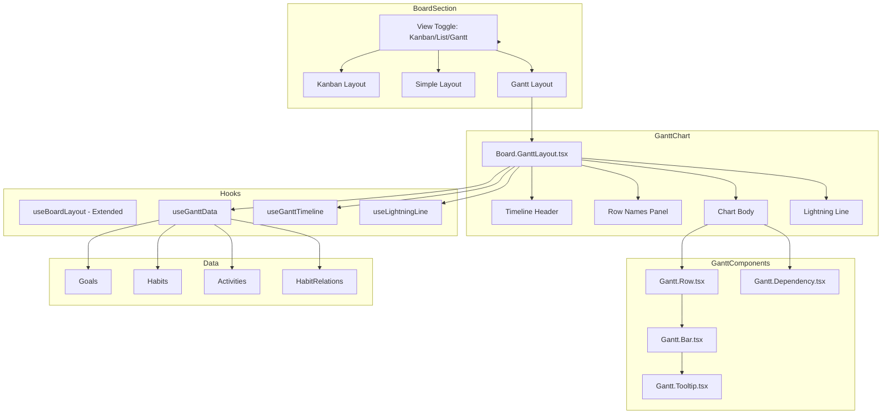

# Design Document: Board Gantt Chart

## Overview

Board セクションにガントチャートビューを追加する機能。既存のカンバン/リストビューに加えて、Goals と Habits の時間軸ベースの可視化を提供する。

主な設計方針:
- 既存の `Section.Board.tsx` を拡張し、3つのビューモード（カンバン/リスト/ガント）をサポート
- カスタム SVG ベースのガントチャートコンポーネントを実装（軽量で柔軟性が高い）
- 既存の `useBoardLayout` フックを拡張してガントビューをサポート
- HabitRelation データを活用して先行/後続関係を可視化
- 稲妻線（Lightning Line）で計画対実績の進捗差異を表示

## Architecture



## Components and Interfaces

### コンポーネント階層

```
Section.Board.tsx (既存を拡張)
├── ViewToggle (カンバン/リスト/ガント切り替え)
├── Board.KanbanLayout.tsx (既存)
├── Board.SimpleLayout.tsx (既存)
└── Board.GanttLayout.tsx (新規)
    ├── Gantt.TimelineHeader.tsx
    ├── Gantt.RowNames.tsx
    ├── Gantt.ChartBody.tsx
    │   ├── Gantt.Row.tsx[]
    │   │   └── Gantt.Bar.tsx
    │   └── Gantt.Dependency.tsx[]
    ├── Gantt.LightningLine.tsx
    └── Gantt.Tooltip.tsx
```

### Board.GanttLayout.tsx (メインコンポーネント)

```typescript
// frontend/app/dashboard/components/Board.GanttLayout.tsx

interface GanttLayoutProps {
  goals: Goal[];
  habits: Habit[];
  activities: Activity[];
  habitRelations: HabitRelation[];
  onGoalEdit: (goalId: string) => void;
  onHabitEdit: (habitId: string) => void;
}

type ViewMode = 'day' | 'week' | 'month';

interface GanttConfig {
  viewMode: ViewMode;
  showLightningLine: boolean;
  startDate: Date;
  endDate: Date;
  rowHeight: number;
  barHeight: number;
  dayWidth: number; // pixels per day
}
```

### Gantt.Row.tsx

```typescript
// frontend/app/dashboard/components/Gantt.Row.tsx

interface GanttRowData {
  id: string;
  type: 'goal' | 'habit';
  name: string;
  depth: number; // 階層の深さ (0 = root goal)
  isExpanded: boolean;
  hasChildren: boolean;
  startDate: Date | null;
  endDate: Date | null;
  progress: number; // 0-100
  isCompleted: boolean;
  parentId: string | null;
}

interface GanttRowProps {
  row: GanttRowData;
  config: GanttConfig;
  onToggleExpand: (id: string) => void;
  onClick: () => void;
  isHighlighted: boolean;
}
```

### Gantt.Bar.tsx

```typescript
// frontend/app/dashboard/components/Gantt.Bar.tsx

interface GanttBarProps {
  startDate: Date;
  endDate: Date;
  progress: number; // 0-100
  isCompleted: boolean;
  config: GanttConfig;
  onHover: (show: boolean) => void;
}
```

### Gantt.Dependency.tsx

```typescript
// frontend/app/dashboard/components/Gantt.Dependency.tsx

interface DependencyData {
  id: string;
  fromRowId: string;
  toRowId: string;
  fromEndDate: Date;
  toStartDate: Date;
}

interface GanttDependencyProps {
  dependency: DependencyData;
  fromRowIndex: number;
  toRowIndex: number;
  config: GanttConfig;
  isHighlighted: boolean;
  onHover: (show: boolean) => void;
}
```

### Gantt.LightningLine.tsx

```typescript
// frontend/app/dashboard/components/Gantt.LightningLine.tsx

interface LightningPoint {
  rowIndex: number;
  xOffset: number; // deviation from today line (positive = ahead, negative = behind)
}

interface GanttLightningLineProps {
  points: LightningPoint[];
  todayX: number;
  config: GanttConfig;
  visible: boolean;
}
```

### useGanttData フック

```typescript
// frontend/app/dashboard/hooks/useGanttData.ts

interface UseGanttDataProps {
  goals: Goal[];
  habits: Habit[];
  activities: Activity[];
  habitRelations: HabitRelation[];
}

interface UseGanttDataReturn {
  rows: GanttRowData[];
  dependencies: DependencyData[];
  toggleExpand: (id: string) => void;
  expandedIds: Set<string>;
}
```

### useGanttTimeline フック

```typescript
// frontend/app/dashboard/hooks/useGanttTimeline.ts

interface UseGanttTimelineProps {
  rows: GanttRowData[];
  viewMode: ViewMode;
}

interface TimelineCell {
  date: Date;
  label: string;
  isToday: boolean;
  isWeekend: boolean;
}

interface UseGanttTimelineReturn {
  startDate: Date;
  endDate: Date;
  cells: TimelineCell[];
  todayPosition: number; // x position in pixels
  scrollToToday: () => void;
  dayWidth: number;
}
```

### useLightningLine フック

```typescript
// frontend/app/dashboard/hooks/useLightningLine.ts

interface UseLightningLineProps {
  rows: GanttRowData[];
  activities: Activity[];
  todayDate: Date;
}

interface UseLightningLineReturn {
  points: LightningPoint[];
  isVisible: boolean;
  toggleVisibility: () => void;
}
```

### useBoardLayout 拡張

```typescript
// frontend/app/dashboard/hooks/useBoardLayout.ts (拡張)

type LayoutMode = 'simple' | 'detailed' | 'gantt';

// 既存の 'simple' | 'detailed' に 'gantt' を追加
// ローカルストレージキーは同じ 'board-layout-mode' を使用
```

## Data Models

### 行データの構築ロジック

```typescript
// frontend/app/dashboard/utils/ganttDataUtils.ts

/**
 * Goals と Habits から階層的な行データを構築
 */
function buildGanttRows(
  goals: Goal[],
  habits: Habit[],
  activities: Activity[],
  expandedIds: Set<string>
): GanttRowData[] {
  const rows: GanttRowData[] = [];
  
  // 1. ルートレベルの Goals を取得 (parentId が null)
  const rootGoals = goals.filter(g => !g.parentId);
  
  // 2. 各 Goal を再帰的に処理
  for (const goal of rootGoals) {
    addGoalRow(goal, 0, rows, goals, habits, activities, expandedIds);
  }
  
  return rows;
}

function addGoalRow(
  goal: Goal,
  depth: number,
  rows: GanttRowData[],
  allGoals: Goal[],
  allHabits: Habit[],
  activities: Activity[],
  expandedIds: Set<string>
): void {
  const childGoals = allGoals.filter(g => g.parentId === goal.id);
  const childHabits = allHabits.filter(h => h.goalId === goal.id);
  const hasChildren = childGoals.length > 0 || childHabits.length > 0;
  const isExpanded = expandedIds.has(goal.id);
  
  // Goal の進捗を計算 (子 Habits の平均)
  const progress = calculateGoalProgress(goal.id, allHabits, activities);
  
  rows.push({
    id: goal.id,
    type: 'goal',
    name: goal.name,
    depth,
    isExpanded,
    hasChildren,
    startDate: goal.createdAt ? new Date(goal.createdAt) : null,
    endDate: goal.dueDate ? new Date(goal.dueDate) : null,
    progress,
    isCompleted: goal.isCompleted ?? false,
    parentId: goal.parentId ?? null
  });
  
  if (isExpanded) {
    // 子 Goals を追加
    for (const childGoal of childGoals) {
      addGoalRow(childGoal, depth + 1, rows, allGoals, allHabits, activities, expandedIds);
    }
    // 子 Habits を追加
    for (const habit of childHabits) {
      addHabitRow(habit, depth + 1, rows, activities);
    }
  }
}

function addHabitRow(
  habit: Habit,
  depth: number,
  rows: GanttRowData[],
  activities: Activity[]
): void {
  const progress = calculateHabitProgress(habit, activities);
  
  rows.push({
    id: habit.id,
    type: 'habit',
    name: habit.name,
    depth,
    isExpanded: false,
    hasChildren: false,
    startDate: habit.createdAt ? new Date(habit.createdAt) : null,
    endDate: habit.dueDate ? new Date(habit.dueDate) : null,
    progress,
    isCompleted: habit.completed,
    parentId: habit.goalId
  });
}
```

### 進捗計算ロジック

```typescript
/**
 * Habit の進捗を計算 (workload ベース)
 */
function calculateHabitProgress(habit: Habit, activities: Activity[]): number {
  if (habit.completed) return 100;
  
  const workloadTotal = habit.workloadTotal || habit.must || 0;
  if (workloadTotal <= 0) return 0;
  
  const completedWorkload = activities
    .filter(a => a.habitId === habit.id && a.kind === 'complete')
    .reduce((sum, a) => sum + (a.amount || 1), 0);
  
  return Math.min(100, (completedWorkload / workloadTotal) * 100);
}

/**
 * Goal の進捗を計算 (子 Habits の平均)
 */
function calculateGoalProgress(
  goalId: string,
  habits: Habit[],
  activities: Activity[]
): number {
  const childHabits = habits.filter(h => h.goalId === goalId);
  if (childHabits.length === 0) return 0;
  
  const totalProgress = childHabits.reduce(
    (sum, h) => sum + calculateHabitProgress(h, activities),
    0
  );
  
  return totalProgress / childHabits.length;
}
```

### 依存関係データの構築

```typescript
/**
 * HabitRelation から依存関係データを構築
 */
function buildDependencies(
  habitRelations: HabitRelation[],
  rows: GanttRowData[]
): DependencyData[] {
  const rowMap = new Map(rows.map(r => [r.id, r]));
  
  return habitRelations
    .filter(rel => rel.relation === 'next')
    .map(rel => {
      const fromRow = rowMap.get(rel.habitId);
      const toRow = rowMap.get(rel.relatedHabitId);
      
      if (!fromRow || !toRow) return null;
      
      return {
        id: rel.id,
        fromRowId: rel.habitId,
        toRowId: rel.relatedHabitId,
        fromEndDate: fromRow.endDate || new Date(),
        toStartDate: toRow.startDate || new Date()
      };
    })
    .filter((d): d is DependencyData => d !== null);
}
```

### 稲妻線の計算ロジック

```typescript
/**
 * 稲妻線のポイントを計算
 * 各行で計画進捗と実績進捗の差分を計算し、x方向のオフセットを決定
 */
function calculateLightningPoints(
  rows: GanttRowData[],
  todayDate: Date,
  dayWidth: number
): LightningPoint[] {
  return rows.map((row, index) => {
    if (!row.startDate || !row.endDate) {
      return { rowIndex: index, xOffset: 0 };
    }
    
    const totalDuration = row.endDate.getTime() - row.startDate.getTime();
    const elapsedDuration = todayDate.getTime() - row.startDate.getTime();
    
    // 計画進捗率 (0-100)
    const plannedProgress = Math.min(100, Math.max(0, 
      (elapsedDuration / totalDuration) * 100
    ));
    
    // 実績進捗率
    const actualProgress = row.progress;
    
    // 差分をピクセルオフセットに変換
    // 正の値 = 実績が計画より進んでいる (右にシフト)
    // 負の値 = 実績が計画より遅れている (左にシフト)
    const progressDiff = actualProgress - plannedProgress;
    const daysOffset = (progressDiff / 100) * (totalDuration / (24 * 60 * 60 * 1000));
    const xOffset = daysOffset * dayWidth;
    
    return { rowIndex: index, xOffset };
  });
}
```

## Correctness Properties

*A property is a characteristic or behavior that should hold true across all valid executions of a system—essentially, a formal statement about what the system should do. Properties serve as the bridge between human-readable specifications and machine-verifiable correctness guarantees.*

### Property 1: Row Hierarchy Correctness
**Statement:** For any valid Goals and Habits input, the generated rows must maintain correct parent-child relationships where each row's depth equals its parent's depth + 1, and root Goals have depth 0.

**Validates:** Requirements 2.1, 2.2, 2.3, 5.1, 5.2

### Property 2: Schedule Bar Position Correctness
**Statement:** For any row with valid startDate and endDate, the Schedule_Bar's horizontal position must be proportional to the date range relative to the timeline, where `barStartX = (startDate - timelineStart) * dayWidth` and `barWidth = (endDate - startDate) * dayWidth`.

**Validates:** Requirements 3.1, 3.2, 3.5

### Property 3: Progress Calculation Correctness
**Statement:** For any Habit with workloadTotal > 0, the progress percentage must equal `min(100, (completedWorkload / workloadTotal) * 100)`. For any Goal, progress must equal the average of its child Habits' progress values.

**Validates:** Requirements 4.1, 4.2, 4.5

### Property 4: Dependency Arrow Correctness
**Statement:** For any HabitRelation with relation='next', a dependency arrow must exist connecting the predecessor's bar end to the successor's bar start, and both connected rows must be visible.

**Validates:** Requirements 6.1, 6.2

### Property 5: Lightning Line Deviation Correctness
**Statement:** For any row at the current date, the lightning line's x-offset must equal `(actualProgress - plannedProgress) / 100 * totalDuration * dayWidth`, where plannedProgress is the expected progress based on elapsed time.

**Validates:** Requirements 7.2, 7.3, 7.4

### Property 6: Collapse/Expand State Correctness
**Statement:** When a row is collapsed, all its descendant rows (children, grandchildren, etc.) must be hidden from the visible rows array. When expanded, all direct children must be visible.

**Validates:** Requirements 2.4, 2.5

### Property 7: Timeline Scale Correctness
**Statement:** For any ViewMode (day/week/month), the timeline cells must cover the entire date range of all visible rows, with appropriate granularity: day view shows individual days, week view shows 7-day periods, month view shows calendar months.

**Validates:** Requirements 8.1, 8.2, 8.3, 8.4, 8.5

### Property 8: Touch Target Size Constraint
**Statement:** All interactive elements (rows, bars, toggle buttons) must have minimum dimensions of 44x44 pixels to meet accessibility requirements.

**Validates:** Requirements 10.5

### Property 9: View Preference Persistence
**Statement:** When a user selects a view mode (Kanban/List/Gantt), the preference must be persisted to localStorage and restored on subsequent page loads.

**Validates:** Requirements 1.3, 1.4

