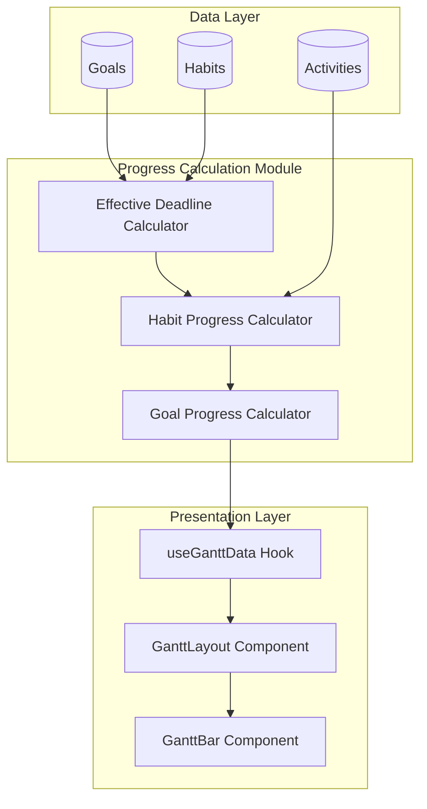
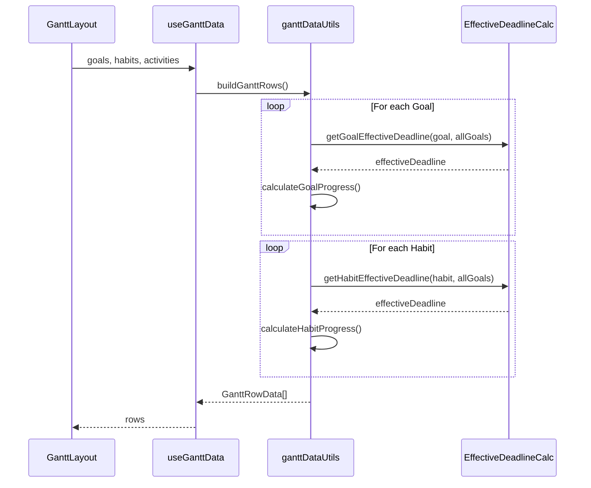

# Design Document: Board Progress Calculation

## Overview

本設計は、BoardセクションのGanttチャートにおける進捗率計算ロジックの改善を定義します。主な変更点は以下の通りです：

1. **実効期限計算モジュール**: Goal/Habitの期限継承ロジックを実装
2. **進捗率計算の改善**: 時間ベースの進捗率計算を導入
3. **既存コードとの統合**: `ganttDataUtils.ts`の`calculateHabitProgress`関数を拡張

## Architecture



## Components and Interfaces

### 1. Effective Deadline Calculator

Goalの実効期限を計算するユーティリティ関数群。

```typescript
/**
 * Goalの実効期限を計算する
 * @param goal - 対象のGoal
 * @param allGoals - 全てのGoal（親Goalの探索用）
 * @returns 実効期限（Date）
 */
function getGoalEffectiveDeadline(goal: Goal, allGoals: Goal[]): Date;

/**
 * Habitの実効期限を計算する
 * @param habit - 対象のHabit
 * @param allGoals - 全てのGoal
 * @returns 実効期限（Date）
 */
function getHabitEffectiveDeadline(habit: Habit, allGoals: Goal[]): Date;
```

### 2. Progress Calculator

進捗率を計算するユーティリティ関数群。

```typescript
/**
 * Habitの進捗率を計算する（時間ベース考慮）
 * @param habit - 対象のHabit
 * @param activities - 全てのActivity
 * @param allGoals - 全てのGoal（実効期限計算用）
 * @returns 進捗率（0-100）
 */
function calculateHabitProgress(
  habit: Habit,
  activities: Activity[],
  allGoals: Goal[]
): number;

/**
 * Goalの進捗率を計算する
 * @param goalId - 対象のGoal ID
 * @param habits - 全てのHabit
 * @param activities - 全てのActivity
 * @param allGoals - 全てのGoal
 * @returns 進捗率（0-100）
 */
function calculateGoalProgress(
  goalId: string,
  habits: Habit[],
  activities: Activity[],
  allGoals: Goal[]
): number;
```

### 3. Updated GanttRowData Interface

既存のインターフェースに実効期限情報を追加。

```typescript
interface GanttRowData {
  // 既存フィールド
  id: string;
  type: 'goal' | 'habit';
  name: string;
  depth: number;
  isExpanded: boolean;
  hasChildren: boolean;
  startDate: Date | null;
  endDate: Date | null;  // 実効期限を反映
  progress: number;      // 改善された進捗率
  isCompleted: boolean;
  parentId: string | null;
}
```

## Data Models

### Input Data

```typescript
// Goal（既存）
interface Goal {
  id: string;
  name: string;
  dueDate?: string | Date | null;  // 期限（オプション）
  parentId?: string | null;         // 親Goal ID
  isCompleted?: boolean;
  createdAt: string;                // 登録日
}

// Habit（既存）
interface Habit {
  id: string;
  goalId: string;                   // 紐づくGoal ID
  name: string;
  dueDate?: string;                 // 期限（オプション）
  workloadTotal?: number;           // 総作業量
  completed: boolean;
  createdAt: string;                // 登録日
}

// Activity（既存）
interface Activity {
  id: string;
  habitId: string;
  kind: 'start' | 'complete' | 'skip' | 'pause';
  amount?: number;                  // 完了量
}
```

### Calculation Flow



## Algorithm Details

### 1. Goal Effective Deadline Algorithm

```
function getGoalEffectiveDeadline(goal, allGoals):
    // Step 1: 自身に期限があればそれを使用
    if goal.dueDate exists:
        return parseDate(goal.dueDate)
    
    // Step 2: 親Goalを再帰的に探索
    if goal.parentId exists:
        parentGoal = findGoalById(goal.parentId, allGoals)
        if parentGoal exists:
            return getGoalEffectiveDeadline(parentGoal, allGoals)
    
    // Step 3: 祖先にも期限がない場合、登録日+1年
    return addYears(parseDate(goal.createdAt), 1)
```

### 2. Habit Effective Deadline Algorithm

```
function getHabitEffectiveDeadline(habit, allGoals):
    // Step 1: 自身に期限があればそれを使用
    if habit.dueDate exists:
        return parseDate(habit.dueDate)
    
    // Step 2: 紐づくGoalの実効期限を使用
    if habit.goalId exists:
        goal = findGoalById(habit.goalId, allGoals)
        if goal exists:
            return getGoalEffectiveDeadline(goal, allGoals)
    
    // Step 3: Goalがない場合、登録日+1年
    return addYears(parseDate(habit.createdAt), 1)
```

### 3. Habit Progress Calculation Algorithm

```
function calculateHabitProgress(habit, activities, allGoals):
    // Step 1: 完了済みなら100%
    if habit.completed:
        return 100
    
    // Step 2: workloadTotalが無効なら0%
    workloadTotal = habit.workloadTotal || habit.must || 0
    if workloadTotal <= 0:
        return 0
    
    // Step 3: 完了workloadを集計
    completedWorkload = sum(
        activities
            .filter(a => a.habitId == habit.id && a.kind == 'complete')
            .map(a => a.amount || 1)
    )
    
    // Step 4: 実際の進捗率を計算
    actualProgress = min(100, (completedWorkload / workloadTotal) * 100)
    
    return actualProgress
```


## Correctness Properties

*A property is a characteristic or behavior that should hold true across all valid executions of a system—essentially, a formal statement about what the system should do. Properties serve as the bridge between human-readable specifications and machine-verifiable correctness guarantees.*

### Property 1: 自身の期限使用

*For any* Goal または Habit に期限（dueDate）が設定されている場合、実効期限計算関数は入力された期限と同じ日付を返す。

**Validates: Requirements 1.1, 2.1**

### Property 2: 親Goalの期限継承

*For any* Goal に期限が設定されておらず、親Goalに期限が設定されている場合、子Goalの実効期限は親Goalの期限と一致する。

**Validates: Requirements 1.2**

### Property 3: 祖先Goalの期限継承

*For any* Goal階層において、自身と直接の親に期限がなく、祖先Goalに期限がある場合、その祖先の期限が継承される。

**Validates: Requirements 1.3**

### Property 4: デフォルト期限（登録日+1年）

*For any* Goal または Habit において、自身および全ての祖先に期限が設定されていない場合、実効期限は登録日（createdAt）から1年後となる。

**Validates: Requirements 1.4, 2.3**

### Property 5: Habitの期限継承

*For any* Habit に期限が設定されておらず、紐づくGoalが存在する場合、Habitの実効期限はGoalの実効期限と一致する。

**Validates: Requirements 2.2**

### Property 6: 進捗率計算

*For any* Habit において、workloadTotal > 0 かつ completed = false の場合、進捗率は `min(100, (completedWorkload / workloadTotal) * 100)` で計算される。

**Validates: Requirements 3.3**

### Property 7: 完了済みアイテムの進捗率

*For any* Goal（isCompleted=true）または Habit（completed=true）において、進捗率は常に100となる。

**Validates: Requirements 3.5, 4.3**

### Property 8: Goalの進捗率集計

*For any* Goal において、紐づくHabitが1つ以上存在する場合、Goalの進捗率は全ての子Habitの進捗率の算術平均となる。

**Validates: Requirements 4.1**

## Error Handling

### 無効なデータの処理

| 条件 | 処理 |
|------|------|
| `dueDate`が無効な日付文字列 | `createdAt + 1年`をフォールバックとして使用 |
| `createdAt`が無効な日付文字列 | 現在日時をフォールバックとして使用 |
| `workloadTotal <= 0` | 進捗率を0として扱う |
| `completedWorkload < 0` | 0として扱う |
| `parentId`が存在しないGoalを参照 | 親なしとして扱う |
| `goalId`が存在しないGoalを参照 | Goalなしとして扱う |

### 循環参照の防止

Goal階層で循環参照が発生した場合、無限ループを防ぐために訪問済みGoal IDを追跡し、循環を検出した時点で探索を終了する。

```typescript
function getGoalEffectiveDeadline(
  goal: Goal,
  allGoals: Goal[],
  visitedIds: Set<string> = new Set()
): Date {
  // 循環参照チェック
  if (visitedIds.has(goal.id)) {
    return addYears(new Date(goal.createdAt), 1);
  }
  visitedIds.add(goal.id);
  
  // ... 通常の処理
}
```

## Testing Strategy

### テストフレームワーク

- **Unit Tests**: Vitest
- **Property-Based Tests**: fast-check

### テスト構成

```
frontend/__tests__/
└── dashboard/
    └── utils/
        └── ganttDataUtils.test.ts
            ├── Unit Tests
            │   ├── getGoalEffectiveDeadline
            │   ├── getHabitEffectiveDeadline
            │   ├── calculateHabitProgress
            │   └── calculateGoalProgress
            └── Property Tests
                ├── Property 1: 自身の期限使用
                ├── Property 2: 親Goalの期限継承
                ├── Property 3: 祖先Goalの期限継承
                ├── Property 4: デフォルト期限
                ├── Property 5: Habitの期限継承
                ├── Property 6: 進捗率計算
                ├── Property 7: 完了済みアイテムの進捗率
                └── Property 8: Goalの進捗率集計
```

### Property-Based Testing Configuration

- 各プロパティテストは最低100回のイテレーションを実行
- 各テストには設計ドキュメントのプロパティ番号をタグ付け
- タグ形式: `Feature: board-progress-calculation, Property N: {property_text}`

### Unit Tests vs Property Tests

| テスト種別 | 対象 |
|-----------|------|
| Unit Tests | 特定の入力値に対する期待出力の検証、エッジケース |
| Property Tests | 全ての有効な入力に対して成り立つべき普遍的な性質 |

### エッジケースのテスト

以下のエッジケースはジェネレータに含めるか、個別のユニットテストで検証：

- `workloadTotal = 0`
- `workloadTotal < 0`
- `completedWorkload < 0`
- 登録日 > 期限
- 現在日時 > 期限
- 現在日時 < 登録日
- Habitが存在しないGoal
- Goalが存在しないHabit
- 循環参照を持つGoal階層
