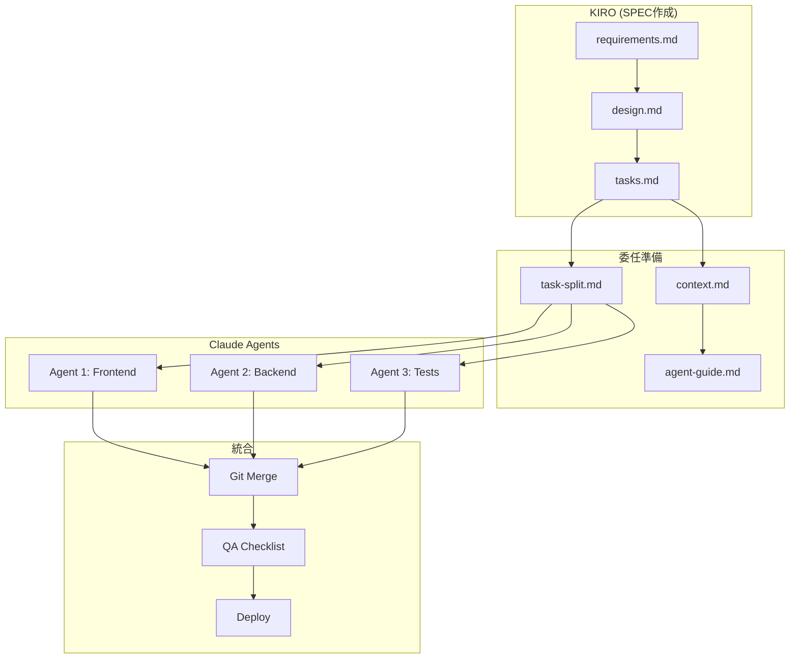
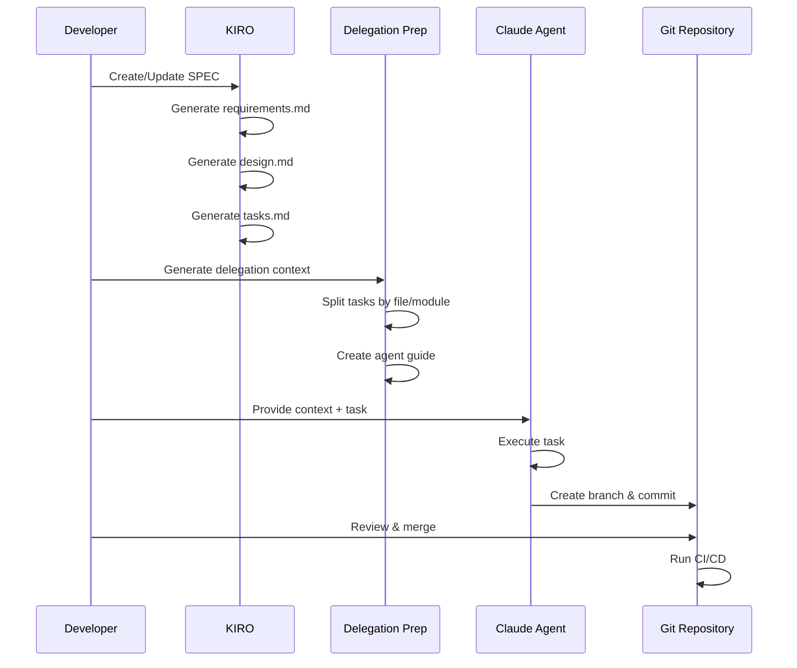

# Design Document: Claude Agent Delegation Workflow

## Overview

本設計では、KIROで作成したSPECをClaude AIエージェント（Claude Code等）に効率的に委任するためのワークフローを定義します。KIROはSPEC作成に特化し、実装作業は複数のClaude AIエージェントが並行して実行できる形式に整備します。

### Key Design Decisions

1. **ドキュメントベースの委任**: コードではなくMarkdownドキュメントでワークフローを定義
2. **ファイルベースの分離**: エージェント間の競合を防ぐためファイル単位でタスクを分割
3. **Git統合**: 既存のdevelop→mainブランチ戦略を活用
4. **テンプレート駆動**: 再利用可能なテンプレートで効率化

## Architecture



### Workflow Phases



## Components and Interfaces

### 1. Delegation Context Template

```markdown
# Delegation Context: {task_name}

## Task Overview
- **Task ID**: {task_id}
- **SPEC Reference**: .kiro/specs/{spec_name}/
- **Estimated Complexity**: {low|medium|high}
- **Dependencies**: {list of dependent tasks}

## Project Context
- **Tech Stack**: Next.js 16, React 19, TypeScript, Tailwind CSS 4
- **Backend**: TypeScript Lambda, Supabase
- **Deployment**: AWS Amplify (frontend), Lambda (backend)

## Files to Modify
- {file_path_1}: {description}
- {file_path_2}: {description}

## Files to Reference (Read-Only)
- {reference_file_1}: {why needed}
- {reference_file_2}: {why needed}

## Coding Conventions
- Component naming: PascalCase (e.g., Modal.Habit.tsx)
- Hook naming: use prefix (e.g., useAuth.ts)
- Use design tokens, not hardcoded colors
- Minimum touch target: 44x44px

## Acceptance Criteria
1. {criterion_1}
2. {criterion_2}

## Test Requirements
- [ ] Unit tests for new functions
- [ ] Property tests for {specific_property}
- [ ] Integration test for {flow}

## Completion Checklist
- [ ] Code compiles without errors
- [ ] All tests pass
- [ ] Linting passes
- [ ] Changes committed to feature branch
```

### 2. Task Split Document Structure

```typescript
interface TaskSplit {
  specName: string;
  totalTasks: number;
  parallelGroups: ParallelGroup[];
  syncPoints: SyncPoint[];
}

interface ParallelGroup {
  groupId: string;
  tasks: DelegatedTask[];
  canRunInParallel: boolean;
  estimatedDuration: string;
}

interface DelegatedTask {
  taskId: string;
  originalTaskRef: string;  // Reference to tasks.md
  assignedFiles: string[];
  readOnlyFiles: string[];
  dependencies: string[];
  complexity: 'low' | 'medium' | 'high';
  suggestedBranch: string;
}

interface SyncPoint {
  afterGroups: string[];
  action: 'merge' | 'review' | 'test';
  description: string;
}
```

### 3. Agent Guide Template

```markdown
# Agent Guide: {project_name}

## Quick Start
1. Read the delegation context for your assigned task
2. Create a feature branch: `git checkout -b {branch_name}`
3. Implement the task following the acceptance criteria
4. Run tests: `npm test`
5. Commit with message: `feat({scope}): {description}`

## Project Structure
```
frontend/           # Next.js frontend
├── app/           # App router pages
├── components/    # Shared components
├── hooks/         # Custom hooks
└── lib/           # Utilities

backend/           # TypeScript Lambda
├── src/           # Source code
└── tests/         # Test files

.kiro/specs/       # SPEC documents
```

## Common Patterns

### Creating a New Component
{code example}

### Adding an API Endpoint
{code example}

### Writing Tests
{code example}

## Do's and Don'ts
### Do
- Use existing components from `frontend/components/`
- Follow the design system tokens
- Write tests for new functionality
- Keep commits atomic and focused

### Don't
- Modify files outside your assigned scope
- Use hardcoded colors or values
- Skip tests for "simple" changes
- Merge directly to develop without review
```

### 4. Work Session Tracker

```markdown
# Work Session: {session_id}

## Session Info
- **Started**: {timestamp}
- **Agent**: Claude Code / Claude API
- **Task**: {task_id}
- **Branch**: {branch_name}

## Progress Log
| Time | Action | Status |
|------|--------|--------|
| {t1} | Started task | ✅ |
| {t2} | Created files | ✅ |
| {t3} | Ran tests | ⚠️ 2 failures |
| {t4} | Fixed tests | ✅ |
| {t5} | Committed | ✅ |

## Files Changed
- `frontend/components/NewComponent.tsx` (created)
- `frontend/hooks/useNewHook.ts` (created)
- `frontend/__tests__/NewComponent.test.tsx` (created)

## Issues Encountered
- {issue_1}: {resolution}

## Handoff Notes
{notes for next agent or developer}
```

### 5. Conflict Prevention Matrix

```typescript
interface ConflictMatrix {
  files: FileConflictInfo[];
  recommendations: ConflictRecommendation[];
}

interface FileConflictInfo {
  filePath: string;
  assignedTo: string[];
  conflictRisk: 'none' | 'low' | 'medium' | 'high';
  mitigation: string;
}

interface ConflictRecommendation {
  type: 'sequential' | 'file-lock' | 'interface-first';
  affectedTasks: string[];
  reason: string;
}
```

## Data Models

### Delegation State

```typescript
interface DelegationState {
  specName: string;
  status: 'preparing' | 'delegating' | 'in-progress' | 'reviewing' | 'complete';
  tasks: TaskState[];
  syncPoints: SyncPointState[];
  createdAt: string;
  updatedAt: string;
}

interface TaskState {
  taskId: string;
  status: 'not-started' | 'assigned' | 'in-progress' | 'review' | 'complete' | 'blocked';
  assignedAgent?: string;
  branch?: string;
  startedAt?: string;
  completedAt?: string;
  notes: string[];
}

interface SyncPointState {
  syncPointId: string;
  status: 'pending' | 'ready' | 'complete';
  blockedBy: string[];
}
```

### Quality Checklist

```typescript
interface QualityChecklist {
  taskId: string;
  checks: QualityCheck[];
  overallStatus: 'pass' | 'fail' | 'pending';
}

interface QualityCheck {
  name: string;
  category: 'compile' | 'lint' | 'test' | 'review';
  status: 'pass' | 'fail' | 'skip' | 'pending';
  details?: string;
}
```


## Correctness Properties

*A property is a characteristic or behavior that should hold true across all valid executions of a system—essentially, a formal statement about what the system should do. Properties serve as the bridge between human-readable specifications and machine-verifiable correctness guarantees.*

### Property 1: SPEC Format Completeness

*For any* generated SPEC document, it SHALL contain: (a) a machine-readable task checklist with markdown checkboxes, (b) explicit file paths for each task, (c) relative file paths for cross-references, and (d) dependency information between tasks.

**Validates: Requirements 1.1, 1.2, 1.4, 1.6**

### Property 2: Task Independence Detection

*For any* task marked as independent in the task decomposition, it SHALL have no file-level dependencies with other tasks (i.e., no shared files to modify).

**Validates: Requirements 2.1, 2.2**

### Property 3: Task Grouping Consistency

*For any* task group in the decomposition, all tasks within the group SHALL affect files in the same directory or module.

**Validates: Requirements 2.3**

### Property 4: Dependency Order Validity

*For any* set of tasks with dependencies, there SHALL exist a valid topological ordering where no task executes before its dependencies.

**Validates: Requirements 2.4**

### Property 5: Sync Point Placement

*For any* parallel task group, there SHALL exist a sync point after the group where parallel work converges before dependent tasks begin.

**Validates: Requirements 2.6**

### Property 6: Context-Task Reference Integrity

*For any* delegation context document, the referenced SPEC sections SHALL exist and match the assigned task. *For any* API-related task, the context SHALL include API documentation references.

**Validates: Requirements 3.1, 3.6**

### Property 7: Session State Consistency

*For any* work session, it SHALL have a unique identifier, and completing the session SHALL update the corresponding task status in the task checklist.

**Validates: Requirements 4.1, 4.2, 4.4**

### Property 8: Conflict Matrix Correctness

*For any* file assigned to multiple agents, the conflict matrix SHALL identify it as high-risk. *For any* high-conflict task pair, the system SHALL recommend sequential execution (not parallel).

**Validates: Requirements 5.1, 5.2, 5.4, 5.5**

### Property 9: Handoff Completeness

*For any* agent handoff, it SHALL include the list of changed files with their locations, and a context refresh document SHALL be generated.

**Validates: Requirements 6.4, 6.5**

### Property 10: Convention Compliance

*For any* generated branch name, it SHALL follow the project's Git branching strategy (feature branches from develop). *For any* code example in templates, it SHALL use design system tokens (not hardcoded values). *For any* new file path suggested, it SHALL follow existing naming conventions (PascalCase for components, use prefix for hooks).

**Validates: Requirements 10.1, 10.4, 10.6**

## Error Handling

### Document Generation Errors

| Error Condition | Handling Strategy | User Feedback |
|-----------------|-------------------|---------------|
| Missing SPEC files | Abort delegation prep | "SPEC not found: {spec_name}. Create SPEC first." |
| Invalid task references | Warn and skip | "Task {id} references non-existent task {ref}" |
| Circular dependencies | Abort with details | "Circular dependency detected: {task_chain}" |
| File path not found | Warn and continue | "Referenced file not found: {path}" |

### Conflict Resolution Errors

| Error Condition | Handling Strategy | User Feedback |
|-----------------|-------------------|---------------|
| Unresolvable merge conflict | Escalate to developer | "Manual merge required for {files}" |
| Missing rollback info | Warn before proceeding | "No rollback info for session {id}" |
| Test failures after merge | Block deployment | "Integration tests failed. Review changes." |

### Session Management Errors

```markdown
## Error Recovery Checklist

### Session Interrupted
1. Check last committed state: `git log --oneline -5`
2. Review uncommitted changes: `git status`
3. Either commit partial work or stash: `git stash`
4. Update session log with interruption note
5. Generate handoff document for next agent

### Failed Tests
1. Review test output in session log
2. Identify failing tests and affected code
3. Options:
   - Fix and re-run tests
   - Rollback to last passing state
   - Escalate to developer with details
```

## Testing Strategy

### Dual Testing Approach

本機能はドキュメント生成とワークフロー定義が中心のため、テストは主にドキュメント構造の検証とワークフローの整合性チェックに焦点を当てます。

- **Unit tests**: テンプレート生成、パース処理、バリデーション
- **Property tests**: ドキュメント構造の普遍的なプロパティ検証

### Property-Based Testing Configuration

- **Library**: fast-check (TypeScript)
- **Iterations**: 各プロパティテストで最低100回実行
- **Tag format**: `Feature: claude-agent-delegation-workflow, Property {number}: {property_text}`

### Test Categories

#### Unit Tests

1. **Template Generation**
   - Delegation context template renders correctly
   - Task split document contains required sections
   - Agent guide includes all mandatory sections

2. **Validation**
   - SPEC format validation catches missing elements
   - Dependency cycle detection works correctly
   - File path validation identifies invalid references

3. **Integration**
   - Generated documents reference correct files
   - Session updates propagate to task checklist

#### Property Tests

```typescript
// Example: Property 2 - Task Independence Detection
describe('Feature: claude-agent-delegation-workflow, Property 2: Task independence', () => {
  it('independent tasks have no shared files', () => {
    fc.assert(
      fc.property(
        fc.array(taskArbitrary, { minLength: 2, maxLength: 10 }),
        (tasks) => {
          const independentTasks = tasks.filter(t => t.dependencies.length === 0);
          const fileAssignments = new Map<string, string[]>();
          
          independentTasks.forEach(task => {
            task.assignedFiles.forEach(file => {
              const assigned = fileAssignments.get(file) || [];
              assigned.push(task.taskId);
              fileAssignments.set(file, assigned);
            });
          });
          
          // No file should be assigned to multiple independent tasks
          return Array.from(fileAssignments.values())
            .every(assignees => assignees.length <= 1);
        }
      ),
      { numRuns: 100 }
    );
  });
});

// Example: Property 4 - Dependency Order Validity
describe('Feature: claude-agent-delegation-workflow, Property 4: Dependency order', () => {
  it('tasks can be topologically sorted', () => {
    fc.assert(
      fc.property(
        taskGraphArbitrary,
        (taskGraph) => {
          const sorted = topologicalSort(taskGraph);
          if (sorted === null) return false; // Cycle detected
          
          // Verify order: each task appears after its dependencies
          const position = new Map(sorted.map((t, i) => [t.taskId, i]));
          return taskGraph.every(task =>
            task.dependencies.every(dep =>
              position.get(dep)! < position.get(task.taskId)!
            )
          );
        }
      ),
      { numRuns: 100 }
    );
  });
});

// Example: Property 8 - Conflict Matrix Correctness
describe('Feature: claude-agent-delegation-workflow, Property 8: Conflict matrix', () => {
  it('multi-assigned files are marked high-risk', () => {
    fc.assert(
      fc.property(
        fc.array(taskArbitrary, { minLength: 2, maxLength: 10 }),
        (tasks) => {
          const matrix = generateConflictMatrix(tasks);
          const multiAssigned = findMultiAssignedFiles(tasks);
          
          return multiAssigned.every(file =>
            matrix.files.find(f => f.filePath === file)?.conflictRisk === 'high'
          );
        }
      ),
      { numRuns: 100 }
    );
  });
});
```

### Test File Structure

```
.kiro/specs/claude-agent-delegation-workflow/
├── requirements.md
├── design.md
├── tasks.md
└── templates/           # Generated templates
    ├── delegation-context.template.md
    ├── task-split.template.md
    ├── agent-guide.template.md
    ├── work-session.template.md
    └── project-context.md
```

### Validation Scripts

```bash
# Validate SPEC format
scripts/validate-spec.sh {spec_name}

# Check for dependency cycles
scripts/check-dependencies.sh {spec_name}

# Generate conflict matrix
scripts/generate-conflict-matrix.sh {spec_name}

# Validate delegation context
scripts/validate-context.sh {context_file}
```

