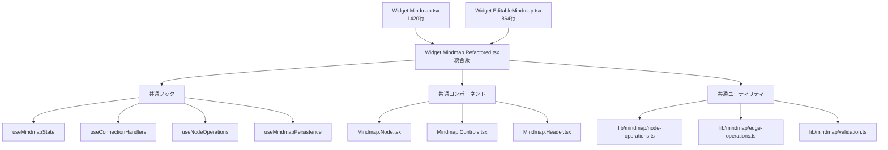

# Design Document: Codebase Refactoring

## Overview

本設計書は、フロントエンドコードベース全体のリファクタリングを行うための詳細な設計を定義します。主な目標は、可読性、保守性、パフォーマンス、型安全性の向上です。Next.jsのベストプラクティスに沿ったディレクトリ構造への移行も含みます。

**重要な制約**: 既存の挙動は一切変更しません。

### 現状分析

#### 問題点
1. **巨大なコンポーネント**: `Widget.Mindmap.tsx` (1420行)、`Widget.EditableMindmap.tsx` (864行)
2. **重複コード**: 2つのMindmapコンポーネント間で類似ロジックが存在
3. **部分的リファクタリング**: `Widget.Mindmap.Refactored.tsx`が存在するが、統合されていない
4. **未使用インポート**: 一部ファイルに未使用のインポートが存在
5. **any型の使用**: 型安全性が不十分な箇所がある
6. **ディレクトリ構造**: Next.js App Routerのベストプラクティスに完全には沿っていない

#### 既存の良い設計パターン
1. **命名規則**: `Widget.*.tsx`, `Modal.*.tsx`, `Section.*.tsx`などの一貫したパターン
2. **カスタムフック**: `use*Manager.ts`, `use*State.ts`, `use*Handlers.ts`の分離
3. **型定義**: `types/`ディレクトリに集約された型定義
4. **ユーティリティ**: `lib/mindmap/`に分離されたユーティリティ関数

### Next.js ベストプラクティス参照

[SwiftAce: How to Structure a Next.js Application](https://swiftace.org/posts/how-to-structure-a-nextjs-application) および [Vercel: React Best Practices](https://vercel.com/blog/introducing-react-best-practices) を参照。

Content was rephrased for compliance with licensing restrictions.

## Architecture

### Next.js App Router ベストプラクティスに基づくディレクトリ構造

#### 現在の構造
```
frontend/
├── app/                    # App Router (ルーティング)
│   ├── api/               # API Routes
│   ├── components/        # ❌ ルート外の共通コンポーネント（移動推奨）
│   ├── contexts/          # ❌ コンテキスト（移動推奨）
│   ├── dashboard/         # ダッシュボードルート
│   │   ├── components/    # ✅ ルート固有コンポーネント（コロケーション）
│   │   ├── hooks/         # ✅ ルート固有フック（コロケーション）
│   │   ├── types/         # ✅ ルート固有型定義
│   │   └── utils/         # ✅ ルート固有ユーティリティ
│   ├── hooks/             # ❌ ルート外のフック（移動推奨）
│   └── login/             # ログインルート
├── lib/                   # ✅ 共通ユーティリティ
└── public/                # ✅ 静的アセット
```

#### 推奨構造（Next.js ベストプラクティス準拠）
```
frontend/
├── app/                    # App Router (ルーティングのみ)
│   ├── api/               # API Routes
│   ├── dashboard/         # ダッシュボードルート
│   │   ├── components/    # ルート固有クライアントコンポーネント
│   │   ├── page.tsx       # サーバーコンポーネント
│   │   └── layout.tsx     # レイアウト
│   ├── login/             # ログインルート
│   ├── layout.tsx         # ルートレイアウト
│   └── page.tsx           # ホームページ
├── components/            # 共通UIコンポーネント（複数ルートで使用）
│   └── ui/                # UIプリミティブ
├── hooks/                 # 共通カスタムフック
├── lib/                   # ユーティリティ、定数、型
│   ├── types.ts           # 共通型定義
│   ├── constants.ts       # 定数
│   ├── utils.ts           # ユーティリティ関数
│   └── mindmap/           # Mindmap関連ユーティリティ
├── contexts/              # React Context
└── public/                # 静的アセット
```

### 移行方針（挙動を変えない）

**重要**: ファイルの移動は段階的に行い、各ステップで既存のテストがパスすることを確認します。

1. **Phase 1**: 型定義の統合（`lib/types.ts`への集約）
2. **Phase 2**: 共通コンポーネントの移動（`app/components/` → `components/`）
3. **Phase 3**: 共通フックの移動（`app/hooks/` → `hooks/`）
4. **Phase 4**: コンテキストの移動（`app/contexts/` → `contexts/`）
5. **Phase 5**: インポートパスの更新（エイリアス使用）

### コロケーション原則

Next.jsのコロケーション原則に従い：
- **ルート固有のコード**: `app/{route}/components/`, `app/{route}/hooks/`に配置
- **共通コード**: トップレベルの`components/`, `hooks/`, `lib/`に配置
- **ページコンポーネント**: サーバーコンポーネントとして`page.tsx`に配置
- **クライアントコンポーネント**: `"use client"`ディレクティブを使用し、別ファイルに分離

### リファクタリング戦略

### Mindmapコンポーネント統合戦略



### フェーズ分割

1. **Phase 1**: 型安全性の向上（any型の排除）
2. **Phase 2**: ディレクトリ構造の整理（Next.jsベストプラクティス準拠）
3. **Phase 3**: 重複コードの統合（Mindmapコンポーネント）
4. **Phase 4**: 関数の分割と簡素化
5. **Phase 5**: パフォーマンス最適化
6. **Phase 6**: 未使用コードの削除とクリーンアップ

## Components and Interfaces

### パスエイリアス設定

`tsconfig.json`に以下のエイリアスを設定（既存の`@/*`を活用）：

```json
{
  "compilerOptions": {
    "paths": {
      "@/*": ["./*"],
      "@/components/*": ["./components/*"],
      "@/hooks/*": ["./hooks/*"],
      "@/lib/*": ["./lib/*"],
      "@/contexts/*": ["./contexts/*"]
    }
  }
}
```

### 統合後のMindmapコンポーネント構造

```typescript
// Widget.Mindmap.tsx (統合版)
interface MindmapProps {
  mode: 'view' | 'edit';  // 閲覧/編集モードの統合
  onClose: () => void;
  onRegisterAsHabit: (data: CreateHabitPayload) => Promise<Habit>;
  onRegisterAsGoal: (data: CreateGoalPayload) => Promise<Goal>;
  goals?: Goal[];
  habits?: Habit[];
  mindmap?: MindmapData;
  onSave?: (mindmapData: MindmapSavePayload) => Promise<void>;
}
```

### 共通フックインターフェース

```typescript
// useMindmapCore - 統合された状態管理フック
interface UseMindmapCoreOptions {
  mindmap?: MindmapData;
  goals: Goal[];
  habits: Habit[];
  mode: 'view' | 'edit';
}

interface UseMindmapCoreReturn {
  // ノード・エッジ状態
  nodes: Node<CustomNodeData>[];
  edges: Edge[];
  setNodes: Dispatch<SetStateAction<Node<CustomNodeData>[]>>;
  setEdges: Dispatch<SetStateAction<Edge[]>>;
  onNodesChange: OnNodesChange;
  onEdgesChange: OnEdgesChange;
  
  // UI状態
  selectedNodes: Node<CustomNodeData>[];
  hasUnsavedChanges: boolean;
  isEditMode: boolean;
  
  // アクション
  markChanges: () => void;
  clearChanges: () => void;
}
```

### 型定義の統合

```typescript
// types/mindmap.types.ts に統合
export interface CustomNodeData {
  label: string;
  isEditing: boolean;
  nodeType: NodeType;
  habitId?: string;
  goalId?: string;
}

export type NodeType = 'default' | 'habit' | 'goal';

export interface MindmapSavePayload {
  id?: string;
  name: string;
  nodes: SerializedNode[];
  edges: SerializedEdge[];
}

export interface SerializedNode {
  id: string;
  label: string;
  x: number;
  y: number;
  nodeType: NodeType;
  habitId?: string;
  goalId?: string;
}

export interface SerializedEdge {
  id: string;
  source: string;
  target: string;
  sourceHandle?: string | null;
  targetHandle?: string | null;
  data?: EdgeData;
}
```

## Data Models

### 状態管理の統合

現在の状態:
- `useMindmapState.ts`: 基本状態管理
- `useEditableMindmapState.ts`: 編集可能版の状態管理（重複）

統合後:
```typescript
// hooks/useMindmapCore.ts
export function useMindmapCore(options: UseMindmapCoreOptions): UseMindmapCoreReturn {
  const { mindmap, goals, habits, mode } = options;
  
  // React Flow状態
  const [nodes, setNodes, onNodesChange] = useNodesState<CustomNodeData>(
    convertNodesToReactFlow(mindmap?.nodes)
  );
  const [edges, setEdges, onEdgesChange] = useEdgesState(
    convertEdgesToReactFlow(mindmap?.edges, nodes)
  );
  
  // 選択状態
  const [selectedNodes, setSelectedNodes] = useState<Node<CustomNodeData>[]>([]);
  
  // 変更追跡
  const [hasUnsavedChanges, setHasUnsavedChanges] = useState(false);
  
  // 編集モード
  const isEditMode = mode === 'edit';
  
  // アクション
  const markChanges = useCallback(() => setHasUnsavedChanges(true), []);
  const clearChanges = useCallback(() => setHasUnsavedChanges(false), []);
  
  return {
    nodes, edges, setNodes, setEdges,
    onNodesChange, onEdgesChange,
    selectedNodes, setSelectedNodes,
    hasUnsavedChanges, isEditMode,
    markChanges, clearChanges,
  };
}
```


## Correctness Properties

*A property is a characteristic or behavior that should hold true across all valid executions of a system—essentially, a formal statement about what the system should do. Properties serve as the bridge between human-readable specifications and machine-verifiable correctness guarantees.*

### Property 1: Naming Convention Compliance

*For any* file in the codebase, the file name SHALL follow the established naming conventions:
- Components: `{Category}.{Name}.tsx` (e.g., Widget.Calendar.tsx, Modal.Goal.tsx)
- Hooks: `use{Feature}{Purpose}.ts` (e.g., useMindmapState.ts)
- Types: `{feature}.types.ts` or `index.ts`
- Utils: `{feature}.utils.ts` or `{feature}.{purpose}.ts`

*For any* exported function, variable, or type, the naming SHALL follow:
- Functions: camelCase
- Components: PascalCase
- Constants: UPPER_SNAKE_CASE
- Types/Interfaces: PascalCase

**Validates: Requirements 1.1, 1.2**

### Property 2: Code Duplication Reduction

*For any* pair of files in the codebase, if similar logic blocks (>10 lines) exist in both files, they SHALL be extracted into a shared utility, hook, or component.

**Validates: Requirements 2.1, 2.2, 2.3**

### Property 3: Code Size Limits

*For any* function in the codebase, the function body SHALL NOT exceed 50 lines (excluding comments and blank lines).

*For any* component file in the codebase, the file SHALL NOT exceed 300 lines (excluding comments and blank lines).

**Validates: Requirements 3.1, 3.2**

### Property 4: Type Safety

*For any* exported function in the codebase, the function SHALL have an explicit return type annotation.

*For any* variable or parameter in the codebase, the type SHALL NOT be `any` unless explicitly justified with a comment.

**Validates: Requirements 4.1, 4.2, 4.4**

### Property 5: React Optimization Hooks

*For any* expensive computation (array operations, object transformations) in a React component, the computation SHALL be wrapped in `useMemo`.

*For any* callback function passed to a child component, the callback SHALL be wrapped in `useCallback`.

**Validates: Requirements 5.1, 5.2**

### Property 6: Modern Syntax Compliance

*For any* JavaScript/TypeScript file in the codebase:
- No `var` declarations SHALL exist (use `const` or `let`)
- Arrow functions SHALL be used for callbacks
- Template literals SHALL be used for string interpolation
- Optional chaining (`?.`) and nullish coalescing (`??`) SHALL be used where appropriate

**Validates: Requirements 6.1, 6.2**

### Property 7: API Contract Preservation (Round-Trip)

*For any* exported interface or function signature that existed before refactoring, the same interface or signature SHALL exist after refactoring with identical type definitions.

**Validates: Requirements 7.1, 7.2**

### Property 8: Dependency Preservation

*For any* dependency in `package.json` before refactoring, the same set of dependencies SHALL exist after refactoring (no additions, no removals of used dependencies).

**Validates: Requirements 8.1, 8.2**

## Error Handling

### リファクタリング中のエラー処理

1. **型エラー**: TypeScriptコンパイラエラーが発生した場合、リファクタリングを中断し、型定義を修正
2. **テスト失敗**: 既存テストが失敗した場合、リファクタリングをロールバックし、原因を調査
3. **ランタイムエラー**: 開発サーバーでエラーが発生した場合、変更を段階的に適用して原因を特定

### エラー回復戦略

```typescript
// リファクタリング前のバックアップ
// 各フェーズ完了時にコミットを作成
// テスト失敗時は前のコミットに戻る
```

## Testing Strategy

### デュアルテストアプローチ

#### ユニットテスト
- 各ユーティリティ関数の個別テスト
- 各カスタムフックの個別テスト
- エッジケースと境界値のテスト

#### プロパティベーステスト
- 命名規則の検証（Property 1）
- コードサイズ制限の検証（Property 3）
- 型安全性の検証（Property 4）
- モダン構文の検証（Property 6）

### テスト設定

```typescript
// jest.config.js
module.exports = {
  // 既存設定を維持
  testMatch: ['**/__tests__/**/*.test.ts?(x)'],
  // プロパティテスト用の設定
  testTimeout: 30000, // プロパティテストは時間がかかる可能性
};
```

### プロパティテストライブラリ

既存の依存関係を確認し、`fast-check`が利用可能であればそれを使用。
なければ、手動でプロパティテストを実装。

### テスト実行

```bash
# 全テスト実行
npm test

# プロパティテストのみ
npm test -- --testPathPattern="property"

# 特定のプロパティテスト
npm test -- --testPathPattern="naming-convention"
```

### 回帰テスト

リファクタリング後、以下を確認:
1. 既存の全テストがパス
2. TypeScriptコンパイルエラーなし
3. ESLintエラーなし
4. 開発サーバーが正常に起動

