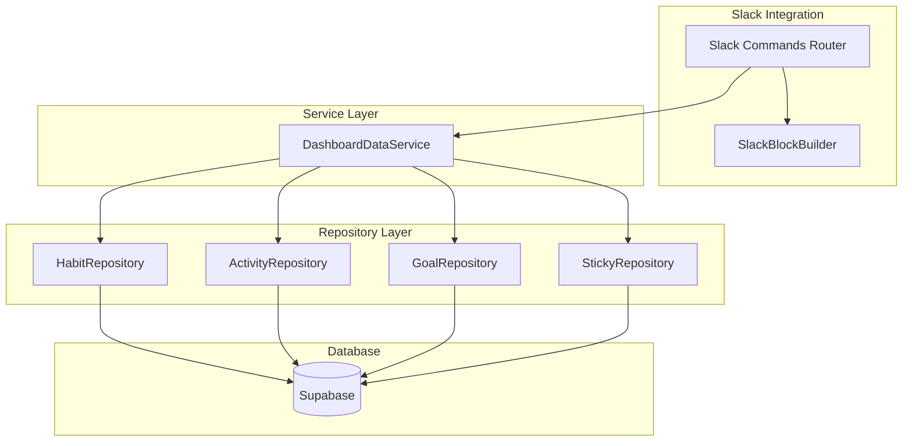

# Design Document: Dashboard Section Commands

## Overview

This feature implements a platform-independent `DashboardDataService` that provides dashboard data (daily progress, statistics, next habits, stickies) to various integrations. The initial integration is with Slack via slash commands (`/progress`, `/stats`, `/next`, `/stickies`).

The architecture follows the existing patterns in the codebase:
- Repository pattern for database access
- Dependency injection for testability
- Zod schemas for validation
- Slack Block Kit for rich message formatting

## Architecture



### Data Flow

1. User invokes Slack command (e.g., `/progress`)
2. `slackCommands.ts` router verifies signature and resolves user
3. Router calls `DashboardDataService` method
4. Service fetches data via repositories
5. Service calculates and returns platform-agnostic data
6. Router formats data using `SlackBlockBuilder`
7. Response sent to Slack

## Components and Interfaces

### DashboardDataService

Location: `backend/src/services/dashboardDataService.ts`

```typescript
export class DashboardDataService {
  constructor(
    habitRepo: HabitRepository,
    activityRepo: ActivityRepository,
    goalRepo: GoalRepository,
    stickyRepo: StickyRepository
  );

  // Daily Progress (Requirement 2)
  async getDailyProgress(ownerId: string, ownerType?: string): Promise<DailyProgressData>;

  // Statistics (Requirement 3)
  async getStatistics(ownerId: string, ownerType?: string): Promise<StatisticsData>;

  // Next Habits (Requirement 4)
  async getNextHabits(ownerId: string, ownerType?: string): Promise<NextHabitsData>;

  // Stickies (Requirement 5)
  async getStickies(ownerId: string, ownerType?: string): Promise<StickiesData>;

  // JST time utilities
  getJstDayBoundaries(): [Date, Date];
  formatJstDateDisplay(): string;
}
```

### StickyRepository

Location: `backend/src/repositories/stickyRepository.ts`

```typescript
export class StickyRepository extends BaseRepository<Sticky> {
  constructor(supabase: SupabaseClient);

  async getByOwner(ownerType: string, ownerId: string): Promise<Sticky[]>;
  async getIncomplete(ownerType: string, ownerId: string): Promise<Sticky[]>;
}
```

### Slack Command Handlers

Location: `backend/src/routers/slackCommands.ts` (update existing)

New command handlers:
- `handleProgress()` - `/progress` or `/habit-progress`
- `handleStats()` - `/stats` or `/habit-stats`
- `handleNext()` - `/next` or `/habit-next`
- `handleStickies()` - `/stickies`

### SlackBlockBuilder Extensions

Location: `backend/src/services/slackBlockBuilder.ts` (update existing)

New methods:
- `progressDashboard()` - Format daily progress
- `statisticsSummary()` - Format statistics
- `nextHabitsList()` - Format upcoming habits
- `stickiesList()` - Format stickies

## Data Models

### DailyProgressData

```typescript
interface HabitProgressItem {
  habitId: string;
  habitName: string;
  goalName: string;
  currentCount: number;
  totalCount: number;
  progressRate: number;      // 0-100+
  workloadUnit: string | null;
  workloadPerCount: number;
  streak: number;
  completed: boolean;
}

interface DailyProgressData {
  date: string;              // YYYY-MM-DD
  dateDisplay: string;       // "2026年1月20日（月）"
  totalHabits: number;
  completedHabits: number;
  completionRate: number;    // 0-100
  habits: HabitProgressItem[];
}
```

### StatisticsData

```typescript
interface Top3Habit {
  habitId: string;
  habitName: string;
  progressRate: number;
}

interface StatisticsData {
  totalActiveHabits: number;
  todayAchievementRate: number;      // 0-100
  todayAchieved: number;
  todayTotal: number;
  cumulativeAchievementRate: number; // 0-100
  cumulativeAchieved: number;
  cumulativeTotal: number;
  top3Habits: Top3Habit[];
  dateDisplay: string;
}
```

### NextHabitsData

```typescript
interface NextHabitItem {
  habitId: string;
  habitName: string;
  startTime: string;         // ISO datetime
  startTimeDisplay: string;  // "14:30" or "明日 09:00"
  workloadUnit: string | null;
  targetAmount: number;
}

interface NextHabitsData {
  habits: NextHabitItem[];
  count: number;
}
```

### StickiesData

```typescript
interface StickyItem {
  id: string;
  name: string;
  description: string | null;
  completed: boolean;
  displayOrder: number;
}

interface StickiesData {
  stickies: StickyItem[];
  incompleteCount: number;
  completedCount: number;
}
```

### Sticky Schema (Database)

```typescript
interface Sticky {
  id: string;
  owner_type: string;
  owner_id: string;
  name: string;
  description: string | null;
  completed: boolean;
  completed_at: string | null;
  display_order: number;
  created_at: string;
  updated_at: string;
}
```


## Correctness Properties

*A property is a characteristic or behavior that should hold true across all valid executions of a system—essentially, a formal statement about what the system should do. Properties serve as the bridge between human-readable specifications and machine-verifiable correctness guarantees.*

### Property 1: JST Day Boundary Calculation

*For any* timestamp, the `getJstDayBoundaries()` method should return start and end dates such that:
- The start represents JST 00:00:00 of the current JST day
- The end represents JST 23:59:59 of the current JST day
- Any timestamp within these boundaries when converted to JST falls on the same calendar day

**Validates: Requirements 1.4, 2.7, 3.6**

### Property 2: Daily Progress Filtering

*For any* set of habits with mixed `active` status and `type` values, the `getDailyProgress()` method should return only habits where `active === true` AND `type === "do"`. The result set should never contain inactive habits or habits with `type === "avoid"`.

**Validates: Requirements 2.1, 2.5**

### Property 3: Daily Progress Schema Completeness

*For any* habit progress item returned by `getDailyProgress()`, all required fields must be present and valid:
- `habitId`: non-empty string
- `habitName`: non-empty string
- `goalName`: string (may be "No Goal")
- `currentCount`: number >= 0
- `totalCount`: number > 0
- `progressRate`: number >= 0
- `workloadUnit`: string or null
- `workloadPerCount`: number > 0
- `streak`: number >= 0
- `completed`: boolean

**Validates: Requirements 2.2, 2.3, 2.4**

### Property 4: Daily Progress Sorting

*For any* result from `getDailyProgress()` with multiple habits, the habits array should be sorted alphabetically by `goalName` in ascending order.

**Validates: Requirements 2.6**

### Property 5: Achievement Rate Calculation

*For any* set of habits and activities, the achievement rates in `getStatistics()` should satisfy:
- `todayAchievementRate` = (`todayAchieved` / `todayTotal`) * 100 when `todayTotal` > 0, else 0
- `cumulativeAchievementRate` = (`cumulativeAchieved` / `cumulativeTotal`) * 100 when `cumulativeTotal` > 0, else 0
- All rates should be between 0 and 100 inclusive

**Validates: Requirements 3.2, 3.3, 3.4**

### Property 6: Statistics TOP3 Selection

*For any* result from `getStatistics()`, the `top3Habits` array should:
- Contain at most 3 items
- Be sorted by `progressRate` in descending order
- Contain the habits with the highest progress rates from the active habit set

**Validates: Requirements 3.5**

### Property 7: Next Habits Time Window Filtering

*For any* set of habits with various scheduled start times, `getNextHabits()` should return only habits whose start time falls within the next 24 hours from the current time.

**Validates: Requirements 4.1**

### Property 8: Next Habits Exclusion Rules

*For any* set of habits, `getNextHabits()` should exclude:
- Habits with `completed === true`
- Habits with `type === "avoid"`
- Habits that have reached their cumulative workload end (`workloadTotalEnd`)

**Validates: Requirements 4.4, 4.5**

### Property 9: Next Habits Sorting and Limit

*For any* result from `getNextHabits()`:
- The habits array should be sorted by `startTime` in ascending order
- The habits array should contain at most 10 items

**Validates: Requirements 4.6, 4.7**

### Property 10: Stickies Schema and Ordering

*For any* result from `getStickies()`:
- Each sticky item must have `id`, `name`, `completed`, and `displayOrder` fields
- The stickies should be sorted by `displayOrder` in ascending order
- Incomplete stickies should appear before completed stickies in the final display

**Validates: Requirements 5.2, 5.3, 5.4, 5.5**

### Property 11: Schema Round-Trip

*For any* valid data object conforming to the dashboard schemas (DailyProgressData, StatisticsData, NextHabitsData, StickiesData), serializing to JSON and parsing back should produce an equivalent object.

**Validates: Requirements 7.1-7.6**

## Error Handling

### Service Layer Errors

1. **DataFetchError**: Thrown when repository operations fail
   - Wraps underlying database errors
   - Includes context about which operation failed
   - Logged with structured logging

2. **ValidationError**: Thrown when data doesn't conform to schemas
   - Includes details about which fields failed validation
   - Should not occur in production if data is properly stored

### Slack Command Error Handling

1. **Timeout Handling**: Slack requires response within 3 seconds
   - For long operations, return immediate acknowledgment
   - Send detailed response via `response_url` asynchronously

2. **User Not Connected**: Return friendly message with connection instructions
   - Use existing `SlackBlockBuilder.notConnected()` pattern

3. **General Errors**: Return user-friendly Japanese error message
   - Log detailed error for debugging
   - Use existing `SlackBlockBuilder.errorMessage()` pattern

### Error Response Format

```typescript
// User-friendly error response
{
  response_type: 'ephemeral',
  blocks: SlackBlockBuilder.errorMessage('データの取得に失敗しました。しばらくしてからお試しください。')
}
```

## Testing Strategy

### Unit Tests

Unit tests should cover:
- Individual service methods with mocked repositories
- JST date boundary calculations
- Data transformation and filtering logic
- Schema validation
- SlackBlockBuilder formatting methods

### Property-Based Tests

Property-based tests using a library like `fast-check` should verify:
- **Property 1**: JST boundary calculations for random timestamps
- **Property 2**: Filtering logic with random habit sets
- **Property 3-4**: Schema completeness and sorting
- **Property 5-6**: Statistics calculations with random data
- **Property 7-9**: Next habits filtering, exclusion, and sorting
- **Property 10**: Stickies ordering
- **Property 11**: Schema round-trip serialization

Configuration:
- Minimum 100 iterations per property test
- Use `fast-check` library for TypeScript
- Tag format: **Feature: dashboard-section-commands, Property N: [property description]**

### Integration Tests

Integration tests should cover:
- Slack command routing with mocked Supabase
- End-to-end command flow with test data
- Error handling scenarios
- Signature verification

### Test File Structure

```
backend/tests/
├── services/
│   └── dashboardDataService.test.ts
├── repositories/
│   └── stickyRepository.test.ts
├── routers/
│   └── slackCommands.dashboard.test.ts
└── schemas/
    └── dashboard.test.ts
```
