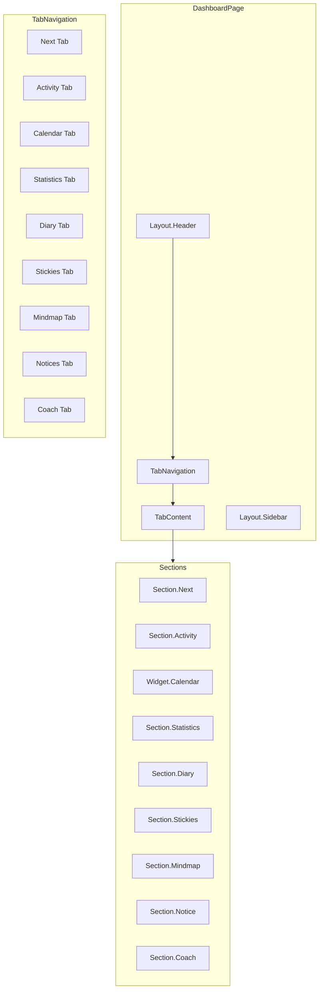

# Design Document: Dashboard Tab Navigation

## Overview

ダッシュボードのタブナビゲーション化機能の設計。現在の縦並びセクション表示をタブ切り替え方式に変更し、UIのごちゃつきを防止する。既存のセクションコンポーネント（Section.*.tsx, Widget.*.tsx）は変更せず、新しいタブナビゲーションコンポーネントでラップする。

### 設計方針

1. **既存コンポーネントの再利用**: 各セクションの内部実装は維持
2. **状態管理の最小化**: React useStateでアクティブタブを管理
3. **デザインシステム準拠**: CSS変数とTailwindクラスを使用
4. **段階的な実装**: タブUIを追加し、既存のpageSections配列を活用

## Architecture



### コンポーネント階層

```
DashboardPage
├── LocaleProvider
│   └── HandednessProvider
│       └── DashboardLayout
│           ├── DashboardHeader
│           ├── TabNavigation (新規)
│           │   └── Tab[] (各セクション用)
│           ├── TabContent (新規)
│           │   └── 選択されたSection
│           └── DashboardSidebar
```

## Components and Interfaces

### 1. TabNavigation コンポーネント

```typescript
// frontend/app/dashboard/components/TabNavigation.tsx

interface TabConfig {
  id: string;           // セクションID (e.g., 'next', 'mindmap')
  label: string;        // 表示ラベル
  icon?: React.ReactNode; // オプショナルアイコン
  supportsFullView?: boolean; // フルビューモード対応
}

interface TabNavigationProps {
  tabs: TabConfig[];
  activeTab: string;
  onTabChange: (tabId: string) => void;
  className?: string;
}

export function TabNavigation({ 
  tabs, 
  activeTab, 
  onTabChange, 
  className 
}: TabNavigationProps): JSX.Element;
```

### 2. TabContent コンポーネント

```typescript
// frontend/app/dashboard/components/TabContent.tsx

interface TabContentProps {
  activeTab: string;
  isFullView: boolean;
  onToggleFullView: () => void;
  // 各セクションに渡すprops
  sectionProps: {
    habits: Habit[];
    goals: Goal[];
    activities: Activity[];
    // ... その他のprops
  };
}

export function TabContent({ 
  activeTab, 
  isFullView, 
  onToggleFullView,
  sectionProps 
}: TabContentProps): JSX.Element;
```

### 3. useTabNavigation フック

```typescript
// frontend/app/dashboard/hooks/useTabNavigation.ts

interface UseTabNavigationReturn {
  activeTab: string;
  setActiveTab: (tabId: string) => void;
  isFullView: boolean;
  toggleFullView: () => void;
  exitFullView: () => void;
}

export function useTabNavigation(
  initialTab?: string,
  availableTabs?: string[]
): UseTabNavigationReturn;
```

### 4. タブ設定定義

```typescript
// frontend/app/dashboard/constants/tabConfig.ts

export const TAB_CONFIGS: TabConfig[] = [
  { id: 'next', label: 'Next', icon: '⏰' },
  { id: 'activity', label: 'Activity', icon: '📊' },
  { id: 'calendar', label: 'Calendar', icon: '📅', supportsFullView: true },
  { id: 'statics', label: 'Statistics', icon: '📈' },
  { id: 'diary', label: 'Diary', icon: '📝' },
  { id: 'stickies', label: 'Stickies', icon: '📌' },
  { id: 'mindmap', label: 'Mindmap', icon: '🗺️', supportsFullView: true },
  { id: 'notices', label: 'Notices', icon: '🔔' },
  { id: 'coach', label: 'Coach', icon: '🤖' },
];

export const DEFAULT_TAB = 'next';
```

## Data Models

### タブ状態

```typescript
interface TabState {
  activeTab: string;      // 現在選択されているタブID
  isFullView: boolean;    // フルビューモードかどうか
  previousTab?: string;   // フルビュー前のタブ（復帰用）
}
```

### セクション表示設定

既存の`pageSections`配列を活用し、タブとして表示するセクションを決定：

```typescript
// 既存のpageSections配列
const pageSections: string[] = [
  'next', 'activity', 'calendar', 'statics', 
  'diary', 'stickies', 'mindmap', 'notices', 'coach'
];

// タブとして表示するセクションをフィルタリング
const visibleTabs = TAB_CONFIGS.filter(tab => 
  pageSections.includes(tab.id)
);
```


## Correctness Properties

*A property is a characteristic or behavior that should hold true across all valid executions of a system—essentially, a formal statement about what the system should do. Properties serve as the bridge between human-readable specifications and machine-verifiable correctness guarantees.*

### Property 1: Tab Rendering Completeness

*For any* set of tab configurations and pageSections array, the TabNavigation component SHALL render exactly the tabs that are both configured and included in pageSections.

**Validates: Requirements 1.1**

### Property 2: Active Tab State Consistency

*For any* tab in the navigation, when clicked, the activeTab state SHALL equal the clicked tab's ID, and the clicked tab SHALL have the active visual styling class applied.

**Validates: Requirements 1.2, 2.2**

### Property 3: Single Section Display

*For any* activeTab value, the TabContent component SHALL render exactly one section component corresponding to that activeTab, and no other section components SHALL be rendered.

**Validates: Requirements 2.1**

### Property 4: Tab State Persistence

*For any* sequence of tab selections within a session, the activeTab state SHALL always reflect the most recently selected tab until explicitly changed.

**Validates: Requirements 2.4**

### Property 5: Full View Mode Toggle

*For any* section that supports full view mode, toggling full view SHALL correctly transition between isFullView=true and isFullView=false states, and the UI SHALL reflect the current state (fullscreen overlay when true, normal layout when false).

**Validates: Requirements 4.1, 4.2, 4.3, 4.4**

### Property 6: Touch Target Accessibility

*For any* tab element in the TabNavigation, the rendered element SHALL have minimum dimensions of 44x44 pixels to meet accessibility requirements.

**Validates: Requirements 5.3**

## Error Handling

### タブ切り替えエラー

1. **無効なタブID**: 存在しないタブIDが指定された場合、デフォルトタブ（'next'）にフォールバック
2. **空のpageSections**: pageSectionsが空の場合、「セクションがありません」メッセージを表示
3. **セクションコンポーネントエラー**: 個別セクションでエラーが発生した場合、エラーバウンダリでキャッチし、他のタブは正常に動作

### フルビューモードエラー

1. **ESCキー**: フルビューモード中にESCキーで通常モードに戻る
2. **ブラウザバック**: フルビューモード中のブラウザバックは通常モードに戻る

## Testing Strategy

### Unit Tests

1. **TabNavigation コンポーネント**
   - タブの正しいレンダリング
   - クリックイベントのハンドリング
   - アクティブタブのスタイリング

2. **useTabNavigation フック**
   - 初期状態の設定
   - タブ切り替え
   - フルビューモードのトグル

### Property-Based Tests

Property-based testing library: **fast-check** (TypeScript/JavaScript用)

各プロパティテストは最低100回のイテレーションで実行。

1. **Property 1**: ランダムなタブ設定とpageSectionsの組み合わせで、正しいタブがレンダリングされることを検証
2. **Property 2**: ランダムなタブクリックシーケンスで、状態が正しく更新されることを検証
3. **Property 3**: ランダムなactiveTab値で、単一セクションのみがレンダリングされることを検証
4. **Property 5**: ランダムなフルビュートグル操作で、状態が正しく遷移することを検証

### Integration Tests

1. **ダッシュボードページ全体**
   - タブナビゲーションとセクションの連携
   - サイドバーとの共存
   - モーダルとの相互作用

### Visual Regression Tests

1. **デスクトップ表示**
2. **モバイル表示**
3. **ダークモード**
