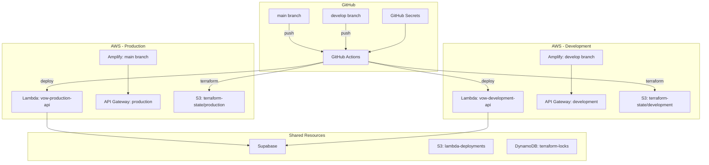
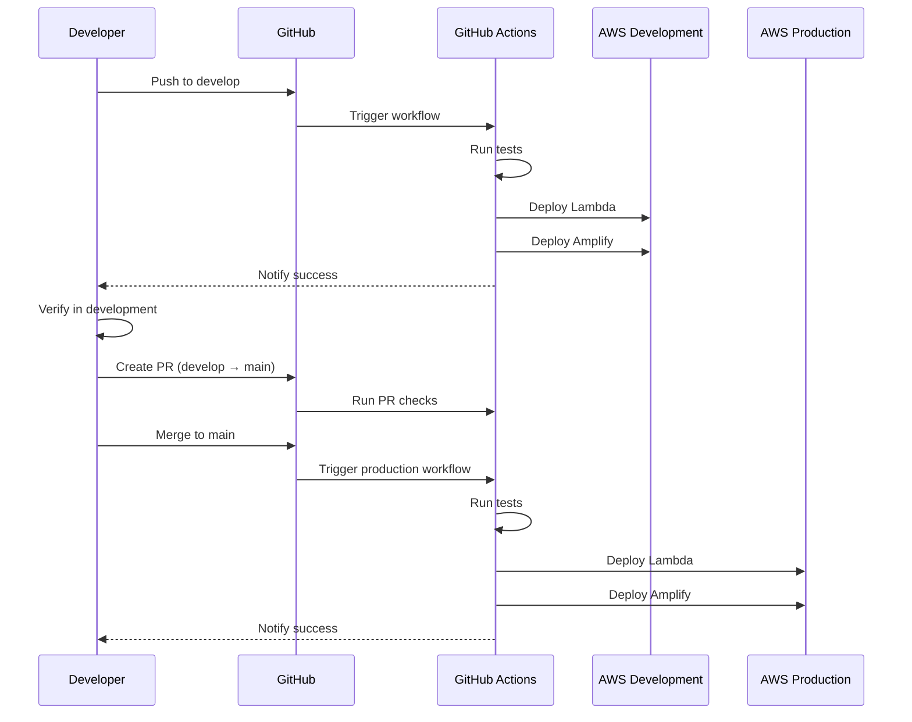

# 設計ドキュメント

## 概要

本設計は、開発環境の再構築とデプロイフローの整備を実現するためのアーキテクチャと実装方針を定義します。Terraform Workspaceによる環境分離、GitHub Actionsによるブランチベースのデプロイ、およびAWS Amplifyの開発環境ブランチ設定を含みます。

## アーキテクチャ

### 全体構成図



### デプロイフロー図



## コンポーネントとインターフェース

### 1. Terraform設定

#### S3バックエンド設定

```hcl
# infra/terraform/backend.tf
terraform {
  backend "s3" {
    bucket         = "vow-terraform-state"
    key            = "terraform.tfstate"
    region         = "ap-northeast-1"
    encrypt        = true
    dynamodb_table = "vow-terraform-locks"
  }
}
```

#### Workspace切り替えスクリプト

```bash
# infra/terraform/scripts/switch-env.sh
#!/bin/bash
ENV=$1
terraform workspace select $ENV || terraform workspace new $ENV
terraform plan -var-file="terraform.${ENV}.tfvars"
```

### 2. GitHub Actions ワークフロー

#### 開発環境デプロイワークフロー

```yaml
# .github/workflows/deploy-lambda-dev.yml
name: Deploy Lambda to AWS (Development)

on:
  push:
    branches: [develop]
    paths:
      - 'backend/**'

env:
  AWS_REGION: ap-northeast-1
  LAMBDA_FUNCTION_NAME: vow-development-api
  ENVIRONMENT: development
```

#### 本番環境デプロイワークフロー

```yaml
# .github/workflows/deploy-lambda-prod.yml (既存を更新)
name: Deploy Lambda to AWS (Production)

on:
  push:
    branches: [main]
    paths:
      - 'backend/**'

env:
  AWS_REGION: ap-northeast-1
  LAMBDA_FUNCTION_NAME: vow-production-api
  ENVIRONMENT: production
```

### 3. Amplify設定

#### 開発環境ブランチ設定

```hcl
# infra/terraform/amplify.tf (追加)
resource "aws_amplify_branch" "develop" {
  count = var.github_access_token != "" ? 1 : 0

  app_id      = aws_amplify_app.frontend[0].id
  branch_name = "develop"

  framework = "Next.js - SSR"
  stage     = "DEVELOPMENT"

  enable_auto_build = true

  environment_variables = {
    NODE_ENV                    = "development"
    NEXT_PUBLIC_BACKEND_API_URL = "https://${var.dev_api_gateway_id}.execute-api.${var.aws_region}.amazonaws.com/development"
    NEXT_PUBLIC_SUPABASE_URL    = var.supabase_url
    NEXT_PUBLIC_SUPABASE_ANON_KEY = var.supabase_anon_key
  }
}
```

## データモデル

### GitHub Secrets構成

| シークレット名 | 用途 | 環境 |
|--------------|------|------|
| `AWS_LAMBDA_DEPLOY_ROLE_ARN` | Lambda デプロイ用IAMロール | 共通 |
| `SUPABASE_URL` | Supabase URL | 共通 |
| `SUPABASE_ANON_KEY` | Supabase匿名キー | 共通 |
| `SLACK_CLIENT_ID` | Slack OAuth Client ID | 共通 |
| `SLACK_CLIENT_SECRET` | Slack OAuth Client Secret | 共通 |
| `SLACK_SIGNING_SECRET` | Slack署名シークレット | 共通 |
| `TOKEN_ENCRYPTION_KEY` | トークン暗号化キー | 共通 |
| `DEV_API_GATEWAY_URL` | 開発環境API Gateway URL | 開発 |
| `PROD_API_GATEWAY_URL` | 本番環境API Gateway URL | 本番 |

### Terraform変数構成

```hcl
# 環境固有の変数
variable "environment" {
  type = string
  validation {
    condition     = contains(["development", "production"], var.environment)
    error_message = "Environment must be development or production."
  }
}

# リソース命名規則
locals {
  resource_prefix = "${var.project_name}-${var.environment}"
  lambda_name     = "${local.resource_prefix}-api"
  api_gateway_name = "${local.resource_prefix}-api"
}
```


## 正確性プロパティ

*正確性プロパティとは、システムのすべての有効な実行において真であるべき特性や振る舞いを定義するものです。これらは人間が読める仕様と機械で検証可能な正確性保証の橋渡しとなります。*


prework分析の結果、本機能はインフラ設定とCI/CDワークフローの構築が主であり、ほとんどの要件は設定ファイルの静的検証（example）で確認されます。プロパティベーステストに適した普遍的なプロパティは限定的ですが、以下の検証可能なプロパティを定義します。

### Property 1: 環境名の一貫性

*任意の*Terraformリソースに対して、リソース名には必ず環境名（development または production）が含まれ、tfvarsファイルの`environment`変数と一致する。

**Validates: Requirements 1.2, 1.3, 2.1**

### Property 2: ブランチとデプロイ環境の対応

*任意の*GitHub Actionsワークフロー実行に対して、トリガーされたブランチ（develop/main）と対象環境（development/production）が正しく対応する。

**Validates: Requirements 3.1, 3.2**

### Property 3: 環境変数の環境分離

*任意の*Lambda関数またはAmplifyアプリに対して、設定された環境変数（API URL、フロントエンドURL等）は対象環境に対応した値を持つ。

**Validates: Requirements 2.4, 6.3, 6.4**

## エラーハンドリング

### Terraformエラー

| エラー状況 | 対応 |
|-----------|------|
| S3バックエンドアクセス失敗 | IAMロール権限を確認、バケットポリシーを検証 |
| DynamoDBロック取得失敗 | 既存ロックの解除を確認、タイムアウト設定を調整 |
| リソース作成失敗 | terraform planで事前検証、エラーログを確認 |
| tfvarsファイル不在 | 環境名を確認、ファイルパスを検証 |

### GitHub Actionsエラー

| エラー状況 | 対応 |
|-----------|------|
| シークレット未設定 | GitHub Secretsの設定を確認 |
| AWS認証失敗 | OIDCロール設定を確認、信頼ポリシーを検証 |
| Lambdaデプロイ失敗 | パッケージサイズ、ランタイム設定を確認 |
| Amplifyビルド失敗 | ビルドログを確認、依存関係を検証 |

### ロールバック手順

1. **Lambdaロールバック**: `workflow_dispatch`でrollback=trueを指定
2. **Amplifyロールバック**: Amplifyコンソールから前回のビルドを再デプロイ
3. **Terraformロールバック**: `terraform state`から前回の状態を復元

## テスト戦略

### 単体テスト

インフラコードの検証には以下のアプローチを使用：

1. **Terraform Validate**: 構文エラーの検出
2. **Terraform Plan**: 変更内容の事前確認
3. **tflint**: Terraformベストプラクティスの検証

### 統合テスト

1. **デプロイ後のヘルスチェック**: Lambda関数の`/health`エンドポイント呼び出し
2. **API Gateway疎通確認**: 各環境のエンドポイントへのリクエスト
3. **Amplifyビルド確認**: ブランチデプロイ後のURL疎通

### プロパティベーステスト設定

本機能はインフラ設定が主であるため、プロパティベーステストは設定ファイルの静的解析に限定：

- **テストフレームワーク**: シェルスクリプト + jq/yq
- **検証対象**: tfvars、GitHub Actionsワークフロー、Terraform出力
- **実行タイミング**: CI/CDパイプライン内でのpre-deployチェック

```bash
# 例: 環境名一貫性の検証
#!/bin/bash
ENV=$1
TFVARS_ENV=$(grep 'environment' terraform.${ENV}.tfvars | cut -d'"' -f2)
if [ "$TFVARS_ENV" != "$ENV" ]; then
  echo "Error: Environment mismatch in tfvars"
  exit 1
fi
```
