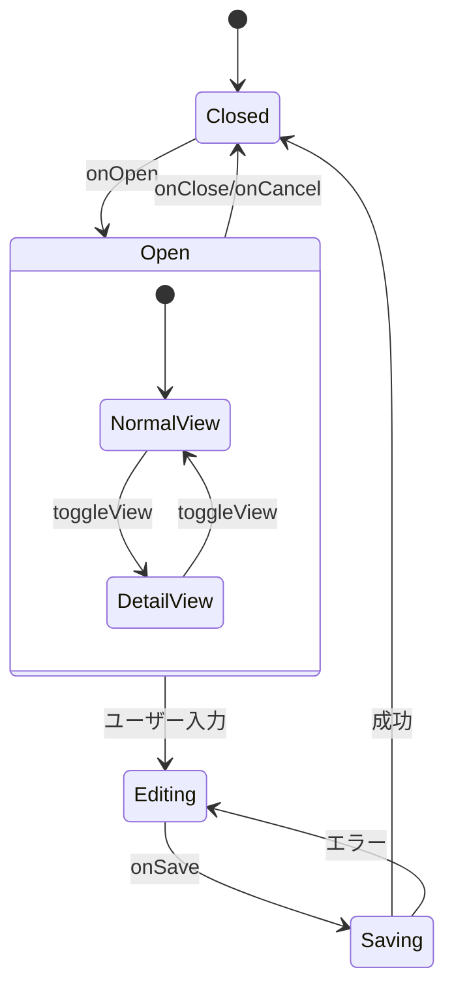

# 設計ドキュメント

## 概要

本設計は、vow習慣管理アプリケーションの編集モーダル（Habit、Goal、Sticky）のUI/UXを改善するためのものです。データスキーマを変更せず、以下の改善を実現します：

- **情報過多の解消**: 全候補のフラット表示から、検索ベースのCombobox UIへ移行
- **認知負荷の軽減**: 選択済みアイテムのみをChipで表示し、視覚的優先度を確立
- **操作性の向上**: 固定フッターによるアクションボタンの常時表示、折りたたみセクションによる縦スクロールの削減

## アーキテクチャ

### コンポーネント階層

```
Modal.Habit.tsx / Modal.Goal.tsx / Modal.Sticky.tsx
├── ModalHeader (タイトル、ビュー切り替え、閉じるボタン)
├── ModalContent (スクロール可能なコンテンツ領域)
│   ├── PrimarySection (名前、説明など主要項目)
│   ├── SmartSelector (タグ、関連エンティティ選択)
│   │   ├── SelectedChips (選択済みアイテム表示)
│   │   ├── SearchInput (検索入力)
│   │   └── DropdownList (候補リスト)
│   └── CollapsibleSection (詳細設定)
│       ├── WorkloadSection (Habitのみ)
│       └── TimingsSection (Habitのみ)
└── StickyFooter (保存、キャンセル、削除ボタン)
```

### 状態管理



## コンポーネントとインターフェース

### 1. SmartSelector コンポーネント

汎用的な検索可能マルチセレクトコンポーネント。タグ、関連Goal、関連Habitの選択に使用。

```typescript
interface SmartSelectorProps<T> {
  // 選択可能なアイテムのリスト
  items: T[];
  // 選択済みアイテムのIDリスト
  selectedIds: string[];
  // アイテムからID、名前、色を取得する関数
  getItemId: (item: T) => string;
  getItemName: (item: T) => string;
  getItemColor?: (item: T) => string | undefined;
  // 選択・解除時のコールバック
  onSelect: (id: string) => void;
  onDeselect: (id: string) => void;
  // 最近使用したアイテムのIDリスト（オプション）
  recentIds?: string[];
  // プレースホルダーテキスト
  placeholder?: string;
  // 空状態のメッセージ
  emptyMessage?: string;
  // ラベル
  label?: string;
}

interface SmartSelectorState {
  isOpen: boolean;
  searchQuery: string;
  highlightedIndex: number;
}
```

### 2. CollapsibleSection コンポーネント

展開・折りたたみ可能なセクション。既存のCollapsibleSectionを拡張。

```typescript
interface CollapsibleSectionProps {
  title: string;
  isExpanded: boolean;
  onToggle: () => void;
  children: React.ReactNode;
  // オプション: デフォルトで折りたたむかどうか
  defaultCollapsed?: boolean;
  // オプション: セクションのID（aria-controls用）
  sectionId?: string;
}
```

### 3. StickyFooter コンポーネント

固定フッターコンポーネント。

```typescript
interface StickyFooterProps {
  onSave: () => void;
  onCancel: () => void;
  onDelete?: () => void;
  onComplete?: () => void;
  // 保存ボタンの無効化
  saveDisabled?: boolean;
  // ローディング状態
  isLoading?: boolean;
  // 削除確認が必要かどうか
  confirmDelete?: boolean;
}
```

### 4. SelectedChip コンポーネント

選択済みアイテムを表示するChipコンポーネント。

```typescript
interface SelectedChipProps {
  label: string;
  color?: string;
  onRemove: () => void;
  // アクセシビリティ用のラベル
  removeAriaLabel?: string;
}
```

## データモデル

### 既存データモデル（変更なし）

本設計ではデータスキーマを変更しません。以下は参照用の既存モデルです。

```typescript
// Habit
type Habit = {
  id: string;
  goalId: string;
  name: string;
  active: boolean;
  type: "do" | "avoid";
  count: number;
  must?: number;
  duration?: number;
  reminders?: Reminder[];
  dueDate?: string;
  time?: string;
  endTime?: string;
  repeat?: string;
  allDay?: boolean;
  notes?: string;
  createdAt: string;
  updatedAt: string;
  workloadUnit?: string;
  workloadTotal?: number;
  workloadTotalEnd?: number;
  workloadPerCount?: number;
};

// Goal
type Goal = {
  id: string;
  name: string;
  details?: string;
  dueDate?: string | Date | null;
  parentId?: string | null;
  isCompleted?: boolean;
};

// Sticky
type Sticky = {
  id: string;
  name: string;
  description?: string;
};

// Tag
type Tag = {
  id: string;
  name: string;
  color?: string;
};
```

### UI状態モデル（新規）

```typescript
// SmartSelector の内部状態
interface SelectorState {
  isOpen: boolean;
  searchQuery: string;
  highlightedIndex: number;
}

// モーダルの展開状態
interface ExpandedSections {
  workload: boolean;
  timings: boolean;
  outdates: boolean;
  type: boolean;
  goal: boolean;
  relatedHabits: boolean;
  relatedGoals: boolean;
  tags: boolean;
}

// 最近使用したアイテムのキャッシュ
interface RecentItemsCache {
  tags: string[];      // 最大5件
  goals: string[];     // 最大5件
  habits: string[];    // 最大5件
}
```

## 正当性プロパティ

*プロパティとは、システムのすべての有効な実行において真であるべき特性や振る舞いです。プロパティは、人間が読める仕様と機械で検証可能な正当性保証の橋渡しをします。*

### Property 1: 選択状態の一貫性
*任意の*SmartSelectorにおいて、selectedIdsに含まれるIDは、選択済みChipとして表示され、ドロップダウンの候補リストには表示されないSHALL
**Validates: Requirements 1.1, 1.3**

### Property 2: 検索フィルタリングの正確性
*任意の*検索クエリに対して、ドロップダウンに表示される候補は、クエリ文字列を含むアイテムのみであるSHALL
**Validates: Requirements 1.2**

### Property 3: 折りたたみ状態の保持
*任意の*CollapsibleSectionにおいて、isExpandedがfalseの場合、子要素は非表示であり、trueの場合は表示されるSHALL
**Validates: Requirements 2.1, 2.2**

### Property 4: 固定フッターの可視性
*任意の*スクロール位置において、StickyFooterは常にビューポート内に表示されるSHALL
**Validates: Requirements 4.1, 4.3**

### Property 5: 視覚的区別の一貫性
*任意の*選択済みChipは、アクセントカラーが適用され、未選択アイテムとは異なるスタイルで表示されるSHALL
**Validates: Requirements 3.1, 3.2**

### Property 6: キーボードナビゲーションの完全性
*任意の*SmartSelectorにおいて、上下矢印キーでhighlightedIndexが変更され、Enterキーで選択、Escapeキーでドロップダウンが閉じるSHALL
**Validates: Requirements 7.1**

### Property 7: レスポンシブレイアウトの適応
*任意の*画面幅768px未満において、2カラムレイアウトは1カラムに変更されるSHALL
**Validates: Requirements 6.1**

### Property 8: ビューモード切り替えの永続性
*任意の*ビューモード切り替え後、選択されたモードはlocalStorageに保存され、次回モーダル表示時に復元されるSHALL
**Validates: Requirements 8.4**

## エラーハンドリング

### 1. 選択エラー

| エラー状況 | 対応 |
|-----------|------|
| 選択対象が存在しない | エラーをログに記録し、UIは変更しない |
| 選択解除対象が選択されていない | 何もしない（冪等性を保証） |
| API呼び出し失敗 | エラーメッセージを表示し、ローカル状態をロールバック |

### 2. 検索エラー

| エラー状況 | 対応 |
|-----------|------|
| 検索結果が0件 | 「一致するアイテムがありません」メッセージを表示 |
| 検索クエリが空 | 全候補を表示（最近使用アイテムを優先） |

### 3. 保存エラー

| エラー状況 | 対応 |
|-----------|------|
| 必須フィールドが空 | 保存ボタンを無効化し、バリデーションメッセージを表示 |
| API保存失敗 | エラーメッセージを表示し、モーダルを開いたままにする |
| ネットワークエラー | リトライオプション付きのエラーメッセージを表示 |

## テスト戦略

### ユニットテスト

1. **SmartSelector コンポーネント**
   - 検索フィルタリングのロジック
   - 選択・解除のコールバック呼び出し
   - キーボードナビゲーションのハンドリング

2. **CollapsibleSection コンポーネント**
   - 展開・折りたたみ状態の切り替え
   - aria属性の正しい設定

3. **StickyFooter コンポーネント**
   - ボタンクリックのコールバック呼び出し
   - 無効化状態の表示

### プロパティベーステスト

プロパティベーステストには `fast-check` ライブラリを使用します。

1. **Property 1: 選択状態の一貫性**
   - 任意のアイテムリストと選択IDリストに対して、選択済みアイテムがChipに表示され、ドロップダウンに表示されないことを検証

2. **Property 2: 検索フィルタリングの正確性**
   - 任意の検索クエリに対して、フィルタリング結果が正しいことを検証

3. **Property 6: キーボードナビゲーションの完全性**
   - 任意のキー入力シーケンスに対して、状態遷移が正しいことを検証

4. **Property 8: ビューモード切り替えの永続性**
   - 任意のビューモード切り替えに対して、localStorageへの保存と復元が正しいことを検証

### 統合テスト

1. **モーダル全体のフロー**
   - 開く → 編集 → 保存 → 閉じる
   - 開く → 編集 → キャンセル → 閉じる
   - 開く → 削除確認 → 削除 → 閉じる

2. **レスポンシブ動作**
   - 画面幅変更時のレイアウト切り替え

### テスト設定

- 各プロパティテストは最低100回のイテレーションを実行
- テストタグ形式: **Feature: edit-modal-ux-redesign, Property {number}: {property_text}**
