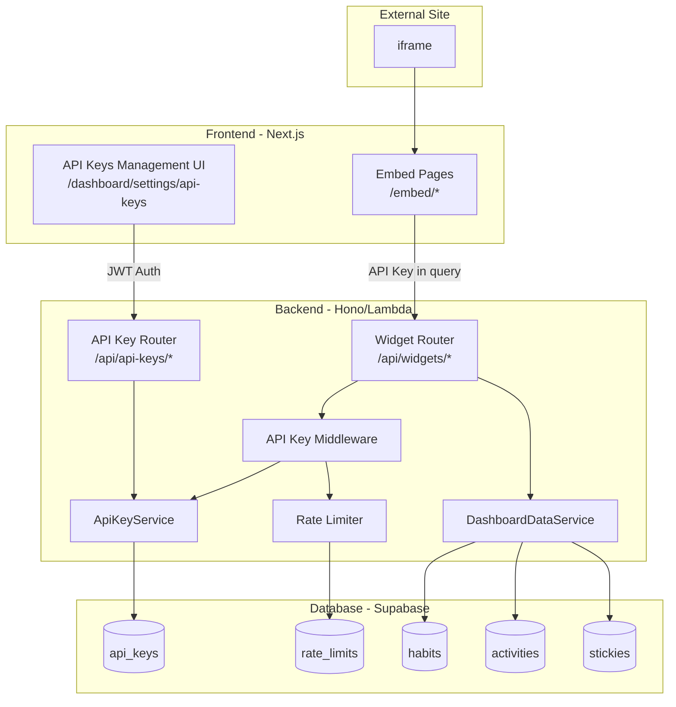

# Design Document: Embeddable Dashboard Widgets

## Overview

This design enables dashboard sections to be embedded in external websites as interactive widgets. The system consists of three main components:

1. **API Key Management**: Backend service for generating, storing, and validating API keys
2. **Widget API**: REST endpoints for fetching widget data and performing interactive operations
3. **Embed Pages**: Standalone Next.js pages optimized for iframe embedding

The design leverages the existing `DashboardDataService` for data consistency and follows the established repository pattern for database operations.

## Architecture



## Components and Interfaces

### 1. API Key Service (`backend/src/services/apiKeyService.ts`)

Handles API key generation, validation, and management.

```typescript
interface ApiKey {
  id: string;
  userId: string;
  keyHash: string;
  keyPrefix: string;  // First 8 chars for display
  name: string;
  createdAt: Date;
  lastUsedAt: Date | null;
  revokedAt: Date | null;
  isActive: boolean;
}

interface CreateApiKeyResult {
  id: string;
  key: string;  // Full key, only returned once at creation
  keyPrefix: string;
  name: string;
  createdAt: Date;
}

class ApiKeyService {
  constructor(
    private readonly apiKeyRepo: ApiKeyRepository,
    private readonly crypto: CryptoService
  );

  // Generate a new API key for a user
  async createKey(userId: string, name: string): Promise<CreateApiKeyResult>;
  
  // Validate an API key and return the associated user ID
  async validateKey(key: string): Promise<{ userId: string; keyId: string } | null>;
  
  // List all active keys for a user (masked)
  async listKeys(userId: string): Promise<ApiKey[]>;
  
  // Revoke an API key
  async revokeKey(userId: string, keyId: string): Promise<boolean>;
  
  // Update last used timestamp
  async updateLastUsed(keyId: string): Promise<void>;
  
  // Count active keys for a user
  async countActiveKeys(userId: string): Promise<number>;
}
```

### 2. API Key Repository (`backend/src/repositories/apiKeyRepository.ts`)

Database operations for API keys.

```typescript
class ApiKeyRepository extends BaseRepository<ApiKeyDb> {
  constructor(supabase: SupabaseClient);
  
  async findByKeyHash(keyHash: string): Promise<ApiKeyDb | null>;
  async findActiveByUserId(userId: string): Promise<ApiKeyDb[]>;
  async countActiveByUserId(userId: string): Promise<number>;
  async markRevoked(id: string): Promise<ApiKeyDb | null>;
  async updateLastUsed(id: string): Promise<void>;
}
```

### 3. Rate Limiter (`backend/src/middleware/rateLimiter.ts`)

Sliding window rate limiting per API key.

```typescript
interface RateLimitConfig {
  windowMs: number;      // Time window in milliseconds (60000 for 1 minute)
  maxRequests: number;   // Max requests per window (100)
}

interface RateLimitResult {
  allowed: boolean;
  remaining: number;
  resetAt: Date;
}

class RateLimiter {
  constructor(
    private readonly supabase: SupabaseClient,
    private readonly config: RateLimitConfig
  );
  
  async checkLimit(keyId: string): Promise<RateLimitResult>;
  async recordRequest(keyId: string): Promise<void>;
}

// Middleware factory
function createRateLimitMiddleware(config: RateLimitConfig): MiddlewareHandler;
```

### 4. API Key Authentication Middleware (`backend/src/middleware/apiKeyAuth.ts`)

Validates API keys from request headers.

```typescript
interface ApiKeyAuthContext {
  apiKeyUserId: string;
  apiKeyId: string;
}

// Middleware that validates X-API-Key header
function apiKeyAuthMiddleware(): MiddlewareHandler;

// Helper to get authenticated user ID from API key
function getApiKeyUserId(c: Context): string;
```

### 5. Widget Router (`backend/src/routers/widgets.ts`)

REST endpoints for widget data and operations.

```typescript
// GET /api/widgets/progress - Daily progress data
// GET /api/widgets/stats - Statistics data
// GET /api/widgets/next - Next habits data
// GET /api/widgets/stickies - Stickies data
// POST /api/widgets/habits/:habitId/complete - Complete a habit
// POST /api/widgets/stickies/:stickyId/toggle - Toggle sticky completion

const widgetRouter = new Hono();

// All routes require API key authentication
widgetRouter.use('*', apiKeyAuthMiddleware());
widgetRouter.use('*', createRateLimitMiddleware({ windowMs: 60000, maxRequests: 100 }));
```

### 6. API Key Management Router (`backend/src/routers/apiKeys.ts`)

REST endpoints for managing API keys (requires JWT auth).

```typescript
// GET /api/api-keys - List user's API keys
// POST /api/api-keys - Create new API key
// DELETE /api/api-keys/:keyId - Revoke an API key

const apiKeyRouter = new Hono();

// All routes require JWT authentication
apiKeyRouter.use('*', jwtAuthMiddleware());
```

### 7. Embed Pages (`frontend/app/embed/`)

Standalone pages for iframe embedding.

```
frontend/app/embed/
├── layout.tsx          # Minimal layout without navigation
├── progress/page.tsx   # Daily progress widget
├── stats/page.tsx      # Statistics widget
├── next/page.tsx       # Next habits widget
└── stickies/page.tsx   # Stickies widget
```

Each embed page:
- Reads `apiKey` and `theme` from query parameters
- Fetches data from Widget API using the API key
- Renders a self-contained, styled widget
- Handles interactive operations (complete habit, toggle sticky)

### 8. Widget Components (`frontend/app/embed/components/`)

Reusable widget components for embed pages.

```typescript
interface WidgetProps {
  apiKey: string;
  theme: 'light' | 'dark';
}

// Widget.Progress.tsx - Daily progress display with completion buttons
// Widget.Stats.tsx - Statistics summary display
// Widget.Next.tsx - Next habits list with completion buttons
// Widget.Stickies.tsx - Stickies list with toggle buttons
```

## Data Models

### API Key Database Schema

```sql
CREATE TABLE api_keys (
  id UUID PRIMARY KEY DEFAULT gen_random_uuid(),
  user_id UUID NOT NULL REFERENCES auth.users(id) ON DELETE CASCADE,
  key_hash TEXT NOT NULL UNIQUE,
  key_prefix VARCHAR(8) NOT NULL,
  name VARCHAR(100) NOT NULL,
  created_at TIMESTAMPTZ NOT NULL DEFAULT NOW(),
  last_used_at TIMESTAMPTZ,
  revoked_at TIMESTAMPTZ,
  is_active BOOLEAN NOT NULL DEFAULT TRUE,
  
  CONSTRAINT api_keys_user_id_idx UNIQUE (user_id, key_hash)
);

-- Index for fast key lookup
CREATE INDEX api_keys_key_hash_idx ON api_keys(key_hash) WHERE is_active = TRUE;

-- Index for user's keys listing
CREATE INDEX api_keys_user_id_active_idx ON api_keys(user_id) WHERE is_active = TRUE;

-- RLS policies
ALTER TABLE api_keys ENABLE ROW LEVEL SECURITY;

CREATE POLICY "Users can view own API keys"
  ON api_keys FOR SELECT
  USING (auth.uid() = user_id);

CREATE POLICY "Users can insert own API keys"
  ON api_keys FOR INSERT
  WITH CHECK (auth.uid() = user_id);

CREATE POLICY "Users can update own API keys"
  ON api_keys FOR UPDATE
  USING (auth.uid() = user_id);
```

### Rate Limit Database Schema

```sql
CREATE TABLE rate_limits (
  id UUID PRIMARY KEY DEFAULT gen_random_uuid(),
  key_id UUID NOT NULL REFERENCES api_keys(id) ON DELETE CASCADE,
  window_start TIMESTAMPTZ NOT NULL,
  request_count INTEGER NOT NULL DEFAULT 1,
  
  CONSTRAINT rate_limits_key_window_unique UNIQUE (key_id, window_start)
);

-- Index for fast rate limit checks
CREATE INDEX rate_limits_key_window_idx ON rate_limits(key_id, window_start);

-- Cleanup old rate limit records (run periodically)
-- DELETE FROM rate_limits WHERE window_start < NOW() - INTERVAL '1 hour';
```

### Zod Schemas (`backend/src/schemas/apiKey.ts`)

```typescript
import { z } from 'zod';

export const apiKeyDbSchema = z.object({
  id: z.string().uuid(),
  user_id: z.string().uuid(),
  key_hash: z.string(),
  key_prefix: z.string().length(8),
  name: z.string().min(1).max(100),
  created_at: z.string().datetime(),
  last_used_at: z.string().datetime().nullable(),
  revoked_at: z.string().datetime().nullable(),
  is_active: z.boolean(),
});

export type ApiKeyDb = z.infer<typeof apiKeyDbSchema>;

export const createApiKeyRequestSchema = z.object({
  name: z.string().min(1).max(100),
});

export const apiKeyResponseSchema = z.object({
  id: z.string().uuid(),
  keyPrefix: z.string(),
  name: z.string(),
  createdAt: z.string().datetime(),
  lastUsedAt: z.string().datetime().nullable(),
  isActive: z.boolean(),
});

export const createApiKeyResponseSchema = z.object({
  id: z.string().uuid(),
  key: z.string(),  // Full key, only at creation
  keyPrefix: z.string(),
  name: z.string(),
  createdAt: z.string().datetime(),
});
```

### Widget Request/Response Schemas

```typescript
// Habit completion request
export const habitCompleteRequestSchema = z.object({
  amount: z.number().positive().default(1),
});

// Sticky toggle response
export const stickyToggleResponseSchema = z.object({
  id: z.string().uuid(),
  name: z.string(),
  completed: z.boolean(),
  completedAt: z.string().datetime().nullable(),
});
```


## Correctness Properties

*A property is a characteristic or behavior that should hold true across all valid executions of a system—essentially, a formal statement about what the system should do. Properties serve as the bridge between human-readable specifications and machine-verifiable correctness guarantees.*

### Property 1: API Key Uniqueness

*For any* user generating multiple API keys, each generated key SHALL be unique and cryptographically distinct from all other keys in the system.

**Validates: Requirements 1.1**

### Property 2: API Key Lifecycle Round-Trip

*For any* API key that is created, stored, and then validated, the validation SHALL succeed and return the correct user ID. After revocation, the same key SHALL fail validation.

**Validates: Requirements 1.2, 1.4**

### Property 3: API Key Listing Masks Full Keys

*For any* user with active API keys, listing their keys SHALL return only active keys with masked values (key prefix only, not full key) and SHALL NOT expose the full key or key hash.

**Validates: Requirements 1.3**

### Property 4: API Key Limit Enforcement

*For any* user, attempting to create more than 5 active API keys SHALL fail, while creating up to 5 keys SHALL succeed.

**Validates: Requirements 1.5**

### Property 5: Valid API Key Authentication

*For any* valid, non-revoked API key included in the X-API-Key header, the Widget API SHALL authenticate the request and associate it with the correct owner user ID.

**Validates: Requirements 2.1**

### Property 6: Invalid API Key Rejection

*For any* request with an invalid, malformed, or revoked API key, the Widget API SHALL return a 401 Unauthorized response.

**Validates: Requirements 2.2**

### Property 7: API Key Hash Determinism

*For any* API key string, hashing it multiple times SHALL produce the same hash value (deterministic hashing).

**Validates: Requirements 2.4**

### Property 8: Rate Limit Enforcement

*For any* API key within a 1-minute window, the first 100 requests SHALL succeed, and subsequent requests SHALL return 429 Too Many Requests until the window resets.

**Validates: Requirements 3.1, 3.3**

### Property 9: Widget Endpoints Schema Validation

*For any* authenticated request to widget data endpoints (/api/widgets/progress, /api/widgets/stats, /api/widgets/next, /api/widgets/stickies), the response SHALL conform to the corresponding Zod schema (DailyProgressData, StatisticsData, NextHabitsData, StickiesData).

**Validates: Requirements 4.1, 4.2, 4.3, 4.4, 4.5**

### Property 10: Habit Completion Activity Creation

*For any* valid habit ID belonging to the API key owner and a positive amount, posting to /api/widgets/habits/:habitId/complete SHALL create an activity record and return the updated habit progress data.

**Validates: Requirements 5.1, 5.4**

### Property 11: Sticky Toggle Round-Trip

*For any* sticky belonging to the API key owner, toggling its completion status twice SHALL return it to its original state.

**Validates: Requirements 5.2**

### Property 12: Cross-User Resource Access Forbidden

*For any* habit ID or sticky ID that does NOT belong to the API key owner, attempting to perform operations SHALL return a 403 Forbidden response.

**Validates: Requirements 5.3**

### Property 13: Embed Page Authentication Behavior

*For any* embed page loaded with a valid API key, the page SHALL render widget content. *For any* embed page loaded without an API key or with an invalid key, the page SHALL display an authentication error.

**Validates: Requirements 6.2, 6.3**

### Property 14: Theme Parameter Rendering

*For any* embed page loaded with theme="dark", the rendered HTML SHALL include dark theme CSS classes. *For any* embed page loaded with theme="light" or no theme, the rendered HTML SHALL include light theme CSS classes.

**Validates: Requirements 6.5**

### Property 15: CORS Headers Present

*For any* response from /api/widgets/* endpoints, the response SHALL include Access-Control-Allow-Origin header allowing cross-origin requests.

**Validates: Requirements 7.1**

## Error Handling

### API Key Errors

| Error Condition | HTTP Status | Error Code | Message |
|----------------|-------------|------------|---------|
| Missing X-API-Key header | 401 | MISSING_API_KEY | API key is required |
| Invalid API key format | 401 | INVALID_API_KEY | Invalid API key format |
| API key not found | 401 | API_KEY_NOT_FOUND | API key not found |
| API key revoked | 401 | API_KEY_REVOKED | API key has been revoked |
| Rate limit exceeded | 429 | RATE_LIMIT_EXCEEDED | Rate limit exceeded. Retry after {seconds} seconds |
| Max keys reached | 400 | MAX_KEYS_REACHED | Maximum of 5 API keys allowed |

### Resource Errors

| Error Condition | HTTP Status | Error Code | Message |
|----------------|-------------|------------|---------|
| Habit not found | 404 | HABIT_NOT_FOUND | Habit not found |
| Sticky not found | 404 | STICKY_NOT_FOUND | Sticky not found |
| Resource not owned | 403 | FORBIDDEN | You do not have access to this resource |
| Invalid amount | 400 | INVALID_AMOUNT | Amount must be a positive number |

### Error Response Format

```typescript
interface ErrorResponse {
  error: string;      // Error code
  message: string;    // Human-readable message
  retryAfter?: number; // Seconds until retry (for rate limiting)
}
```

## Testing Strategy

### Dual Testing Approach

This feature requires both unit tests and property-based tests for comprehensive coverage:

- **Unit tests**: Verify specific examples, edge cases, and error conditions
- **Property tests**: Verify universal properties across all inputs using randomized testing

### Property-Based Testing Configuration

- **Library**: fast-check (TypeScript property-based testing library)
- **Minimum iterations**: 100 per property test
- **Tag format**: `Feature: embeddable-dashboard-widgets, Property {number}: {property_text}`

### Test Categories

#### 1. API Key Service Tests

**Unit Tests:**
- Key generation produces valid format (prefix + random)
- Key hashing uses SHA-256
- Revoked keys are marked inactive
- Key listing excludes revoked keys

**Property Tests:**
- Property 1: Key uniqueness across generations
- Property 2: Create-validate-revoke lifecycle
- Property 3: Listing never exposes full keys
- Property 4: 5-key limit enforcement
- Property 7: Hash determinism

#### 2. Authentication Middleware Tests

**Unit Tests:**
- Missing header returns 401
- Malformed key returns 401
- Valid key sets context correctly

**Property Tests:**
- Property 5: Valid key authentication
- Property 6: Invalid key rejection

#### 3. Rate Limiter Tests

**Unit Tests:**
- First request in window succeeds
- 101st request fails
- Window reset allows new requests
- Retry-After header is correct

**Property Tests:**
- Property 8: Rate limit enforcement with sliding window

#### 4. Widget API Tests

**Unit Tests:**
- Each endpoint returns correct schema
- Habit completion creates activity
- Sticky toggle changes status
- Cross-user access returns 403

**Property Tests:**
- Property 9: Schema validation for all endpoints
- Property 10: Habit completion round-trip
- Property 11: Sticky toggle round-trip
- Property 12: Cross-user access forbidden

#### 5. Embed Page Tests

**Unit Tests:**
- Pages render without errors
- Invalid key shows error message
- Theme parameter applies correct classes

**Property Tests:**
- Property 13: Authentication behavior
- Property 14: Theme parameter rendering

#### 6. CORS Tests

**Unit Tests:**
- OPTIONS preflight returns correct headers
- X-API-Key is in allowed headers

**Property Tests:**
- Property 15: CORS headers present on all widget responses

### Test File Structure

```
backend/tests/
├── services/
│   └── apiKeyService.test.ts
├── middleware/
│   ├── apiKeyAuth.test.ts
│   └── rateLimiter.test.ts
├── routers/
│   ├── widgets.test.ts
│   └── apiKeys.test.ts
└── properties/
    ├── apiKey.property.test.ts
    ├── authentication.property.test.ts
    ├── rateLimit.property.test.ts
    └── widgetApi.property.test.ts

frontend/__tests__/
└── embed/
    ├── progress.test.tsx
    ├── stats.test.tsx
    ├── next.test.tsx
    └── stickies.test.tsx
```
