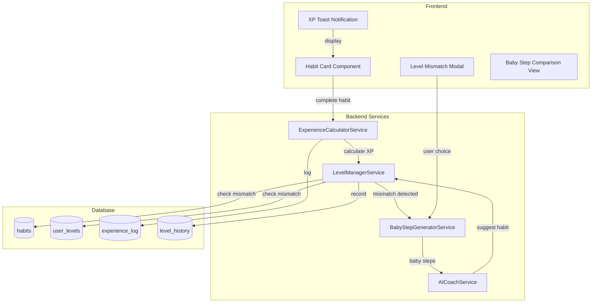

# Design Document: Gamification XP Balance

## Overview

本設計ドキュメントは、ゲーミフィケーション機能の改善を実現するための技術設計を定義します。主な改善点は以下の3つです：

1. **行動科学に基づく経験値倍率システム**: 達成度に応じた6段階の倍率で、計画遵守を最大報酬とし、過剰達成を抑制
2. **ユーザーレベルと習慣レベルの比較ロジック**: `detectLevelMismatch()` メソッドによるレベル適合性チェック
3. **AIコーチングでのベビーステップ提案トリガー**: レベルミスマッチ検出時の自動ベビーステップ提案

## Architecture



## Components and Interfaces

### 1. XP Multiplier Calculator

経験値倍率を計算するための純粋関数。

```typescript
// backend/src/services/xpMultiplierService.ts

/**
 * XP Multiplier tiers based on behavioral science
 */
export type XPMultiplierTier = 
  | 'minimal'      // 0-49%: 0.3x
  | 'partial'      // 50-79%: 0.6x
  | 'near'         // 80-99%: 0.8x
  | 'optimal'      // 100-120%: 1.0x
  | 'mild_over'    // 121-150%: 0.9x
  | 'over';        // 151%+: 0.7x

/**
 * XP Multiplier result with rationale
 */
export interface XPMultiplierResult {
  multiplier: number;
  tier: XPMultiplierTier;
  completionRate: number;
  rationale: string;
  rationaleKey: 'minimal_effort' | 'partial_reinforcement' | 'near_completion' | 'plan_adherence' | 'mild_overachievement' | 'burnout_prevention';
}

/**
 * Calculate XP multiplier based on completion rate.
 * 
 * Behavioral Science Rationale:
 * - Implementation Intentions: Plan adherence (100-120%) gets maximum reward
 * - Sustainable Behavior: Over-achievement (>120%) is mildly discouraged
 * - Partial Reinforcement: Partial completion still receives positive reinforcement
 * 
 * @param actualValue - Actual completed value (count or duration)
 * @param targetValue - Target value (count or duration)
 * @returns XP multiplier result with tier and rationale
 */
export function calculateXPMultiplier(
  actualValue: number,
  targetValue: number
): XPMultiplierResult;

/**
 * Get localized rationale message for display
 */
export function getMultiplierRationale(tier: XPMultiplierTier, locale: 'ja' | 'en'): string;
```

### 2. Level Mismatch Detector

ユーザーレベルと習慣レベルの比較ロジック。

```typescript
// backend/src/services/levelManagerService.ts (extension)

/**
 * Level mismatch severity classification
 */
export type MismatchSeverity = 'none' | 'mild' | 'moderate' | 'severe';

/**
 * Level mismatch detection result
 */
export interface LevelMismatchResult {
  isMismatch: boolean;
  userLevel: number;
  habitLevel: number;
  levelGap: number;
  severity: MismatchSeverity;
  recommendation: 'proceed' | 'suggest_baby_steps' | 'strongly_suggest_baby_steps';
}

/**
 * Detect level mismatch between user and habit.
 * 
 * Mismatch Thresholds:
 * - None: gap < 50
 * - Mild: 50 <= gap < 75
 * - Moderate: 75 <= gap < 100
 * - Severe: gap >= 100
 * 
 * @param userId - User ID to check
 * @param habitLevel - Habit's THLI-24 level
 * @returns Level mismatch analysis result
 */
async detectLevelMismatch(
  userId: string,
  habitLevel: number
): Promise<LevelMismatchResult>;

/**
 * Check level compatibility for habit creation.
 * Returns mismatch result with baby step suggestions if needed.
 */
async checkHabitLevelCompatibility(
  userId: string,
  habitLevel: number,
  habitName: string
): Promise<{
  mismatch: LevelMismatchResult;
  babyStepPlans?: BabyStepPlans;
}>;
```

### 3. AI Coach Integration

AIコーチでのレベルチェック統合。

```typescript
// backend/src/services/aiCoachService.ts (extension)

/**
 * New AI Coach tool for level compatibility check
 */
const CHECK_HABIT_LEVEL_COMPATIBILITY_TOOL: ChatCompletionTool = {
  type: 'function',
  function: {
    name: 'check_habit_level_compatibility',
    description: '習慣のレベルがユーザーのレベルに適しているかチェックする。習慣を提案する前に使用して、必要に応じてベビーステップを提案する。',
    parameters: {
      type: 'object',
      properties: {
        habit_name: {
          type: 'string',
          description: '習慣の名前',
        },
        estimated_level: {
          type: 'number',
          description: '習慣の推定レベル（THLI-24スケール: 0-199）',
        },
      },
      required: ['habit_name', 'estimated_level'],
    },
  },
};
```

### 4. API Endpoints

新規APIエンドポイント。

```typescript
// backend/src/routes/levelRoutes.ts

/**
 * GET /api/habits/:id/level-compatibility
 * Check level compatibility for an existing habit
 */
interface LevelCompatibilityResponse {
  habitId: string;
  habitLevel: number | null;
  userLevel: number;
  mismatch: LevelMismatchResult;
  workloadConsistency?: WorkloadConsistencyResult;
}

/**
 * POST /api/users/:id/check-habit-compatibility
 * Check compatibility for a proposed habit level
 */
interface CheckHabitCompatibilityRequest {
  proposedLevel: number;
  habitName?: string;
}

interface CheckHabitCompatibilityResponse {
  mismatch: LevelMismatchResult;
  babyStepPlans?: BabyStepPlans;
}

/**
 * GET /api/habits/:id/workload-level-consistency
 * Check workload and level consistency
 */
interface WorkloadConsistencyResult {
  isConsistent: boolean;
  assessedLevel: number | null;
  estimatedLevelFromWorkload: number;
  levelDifference: number;
  recommendation: 'consistent' | 'reassess_level' | 'adjust_workload';
}
```

## Data Models

### 1. Experience Log Extension

```sql
-- Add new columns to experience_log table
ALTER TABLE experience_log ADD COLUMN IF NOT EXISTS completion_rate DECIMAL(5,2);
ALTER TABLE experience_log ADD COLUMN IF NOT EXISTS applied_multiplier DECIMAL(3,2);
ALTER TABLE experience_log ADD COLUMN IF NOT EXISTS multiplier_tier VARCHAR(20);
ALTER TABLE experience_log ADD COLUMN IF NOT EXISTS multiplier_reason VARCHAR(50);

COMMENT ON COLUMN experience_log.completion_rate IS '達成率（0-200+%）';
COMMENT ON COLUMN experience_log.applied_multiplier IS '適用された経験値倍率（0.3-1.0）';
COMMENT ON COLUMN experience_log.multiplier_tier IS '倍率ティア（minimal/partial/near/optimal/mild_over/over）';
COMMENT ON COLUMN experience_log.multiplier_reason IS '倍率の理由キー（plan_adherence等）';
```

### 2. Habit Metadata Extension

```sql
-- Add mismatch acknowledgment fields to habits table
ALTER TABLE habits ADD COLUMN IF NOT EXISTS mismatch_acknowledged BOOLEAN DEFAULT FALSE;
ALTER TABLE habits ADD COLUMN IF NOT EXISTS mismatch_acknowledged_at TIMESTAMPTZ;
ALTER TABLE habits ADD COLUMN IF NOT EXISTS original_level_gap INTEGER;

COMMENT ON COLUMN habits.mismatch_acknowledged IS 'ユーザーがレベルミスマッチを承認したか';
COMMENT ON COLUMN habits.mismatch_acknowledged_at IS 'ミスマッチ承認日時';
COMMENT ON COLUMN habits.original_level_gap IS '作成時のレベルギャップ';
```

### 3. Level Mismatch Detection Log

```sql
-- Create table for tracking mismatch detection history
CREATE TABLE IF NOT EXISTS level_mismatch_log (
  id UUID PRIMARY KEY DEFAULT gen_random_uuid(),
  user_id UUID NOT NULL REFERENCES auth.users(id) ON DELETE CASCADE,
  habit_id UUID NOT NULL REFERENCES habits(id) ON DELETE CASCADE,
  user_level INTEGER NOT NULL,
  habit_level INTEGER NOT NULL,
  level_gap INTEGER NOT NULL,
  severity VARCHAR(20) NOT NULL,
  action_taken VARCHAR(50), -- 'proceeded', 'baby_step_lv50', 'baby_step_lv10', 'cancelled'
  detected_at TIMESTAMPTZ NOT NULL DEFAULT NOW(),
  created_at TIMESTAMPTZ NOT NULL DEFAULT NOW()
);

CREATE INDEX idx_level_mismatch_log_user ON level_mismatch_log(user_id);
CREATE INDEX idx_level_mismatch_log_habit ON level_mismatch_log(habit_id);
CREATE INDEX idx_level_mismatch_log_detected ON level_mismatch_log(detected_at);
```


## Correctness Properties

*A property is a characteristic or behavior that should hold true across all valid executions of a system—essentially, a formal statement about what the system should do. Properties serve as the bridge between human-readable specifications and machine-verifiable correctness guarantees.*

### Property 1: XP Multiplier Tier Mapping

*For any* completion rate value, the system shall return the correct XP multiplier according to the defined tiers:
- 0-49% → 0.3x
- 50-79% → 0.6x
- 80-99% → 0.8x
- 100-120% → 1.0x
- 121-150% → 0.9x
- 151%+ → 0.7x

**Validates: Requirements 1.1, 1.2, 1.3, 1.4, 1.5, 1.6**

### Property 2: Completion Rate Calculation

*For any* habit with actual and target values (count or duration), the completion rate shall be calculated as `(actual / target) * 100`, and the result shall be a non-negative number.

**Validates: Requirements 1.7, 1.8**

### Property 3: Level Mismatch Detection Threshold

*For any* user level and habit level combination, if `habitLevel - userLevel > 50`, then `isMismatch` shall be `true`; otherwise `isMismatch` shall be `false`.

**Validates: Requirements 2.2**

### Property 4: Mismatch Severity Classification

*For any* level gap value:
- If gap is in [50, 75], severity shall be 'mild'
- If gap is in [76, 100], severity shall be 'moderate'
- If gap > 100, severity shall be 'severe'
- If gap < 50, severity shall be 'none'

**Validates: Requirements 2.4, 2.5, 2.6**

### Property 5: Mismatch Result Structure Completeness

*For any* call to `detectLevelMismatch()`, the returned object shall contain all required fields: `isMismatch` (boolean), `userLevel` (number), `habitLevel` (number), `levelGap` (number), `severity` (MismatchSeverity).

**Validates: Requirements 2.3**

### Property 6: Habit Creation Mismatch Acknowledgment

*For any* habit created with a detected level mismatch where the user proceeds anyway, the habit record shall have `mismatch_acknowledged = true`, `mismatch_acknowledged_at` set to current timestamp, and `original_level_gap` set to the detected gap.

**Validates: Requirements 3.6, 3.7**

### Property 7: Experience Log Field Completeness

*For any* experience point award logged to `experience_log`, the record shall contain: `completion_rate`, `applied_multiplier`, `multiplier_tier`, and `multiplier_reason` fields with valid values.

**Validates: Requirements 6.4**

### Property 8: XP Multiplier Monotonicity in Optimal Range

*For any* two completion rates `r1` and `r2` where both are in the optimal range [100%, 120%], the applied multiplier shall be equal (both 1.0x), demonstrating that plan adherence is consistently rewarded.

**Validates: Requirements 1.4**

### Property 9: Workload-Level Consistency Detection

*For any* habit where the estimated level from workload differs from the assessed level by more than 20 points, the system shall flag `isConsistent = false`.

**Validates: Requirements 5.3**

### Property 10: Scheduled Job Mismatch State Transitions

*For any* habit that transitions from compatible to mismatched (due to user level decrease), the system shall create a notification. *For any* habit that transitions from mismatched to compatible (due to user level increase), the system shall update the habit metadata.

**Validates: Requirements 7.2, 7.3**

## Error Handling

### XP Multiplier Calculation Errors

1. **Invalid completion rate**: If `targetValue <= 0`, return completion rate of 0% and apply minimal multiplier (0.3x)
2. **Negative actual value**: Treat as 0 and apply minimal multiplier
3. **Overflow protection**: Cap completion rate at 500% to prevent extreme values

### Level Mismatch Detection Errors

1. **User level not found**: If user has no level record, assume level 0 (new user)
2. **Habit level null**: If habit has no THLI-24 assessment, skip mismatch check and return `isMismatch: false`
3. **Database errors**: Log error and return safe default (no mismatch detected)

### AI Coach Integration Errors

1. **Tool execution failure**: Return fallback message explaining the feature is temporarily unavailable
2. **Baby step generation failure**: Offer manual baby step creation as alternative
3. **Rate limiting**: Queue requests and process with exponential backoff

### Scheduled Job Errors

1. **Batch processing failure**: Log failed batch, continue with next batch
2. **Individual habit check failure**: Log error, skip habit, continue processing
3. **Job timeout**: Save progress, allow resume on next run

## Testing Strategy

### Unit Tests

Unit tests focus on specific examples and edge cases:

1. **XP Multiplier boundary tests**: Test exact boundary values (49%, 50%, 79%, 80%, etc.)
2. **Level mismatch edge cases**: Test gap values at exact thresholds (50, 75, 76, 100, 101)
3. **Completion rate edge cases**: Test with 0 target, negative values, very large values

### Property-Based Tests

Property-based tests verify universal properties across many generated inputs. Each test runs minimum 100 iterations.

**Testing Framework**: fast-check (TypeScript property-based testing library)

**Test Files**:
- `backend/tests/unit/gamification/xpMultiplier.property.test.ts`
- `backend/tests/unit/gamification/levelMismatch.property.test.ts`
- `backend/tests/unit/gamification/experienceLog.property.test.ts`

**Property Test Implementation Pattern**:

```typescript
import fc from 'fast-check';

describe('XP Multiplier Properties', () => {
  /**
   * Feature: gamification-xp-balance, Property 1: XP Multiplier Tier Mapping
   * For any completion rate, the correct multiplier tier is applied
   */
  it('should apply correct multiplier for any completion rate', () => {
    fc.assert(
      fc.property(
        fc.float({ min: 0, max: 500 }), // completion rate 0-500%
        (completionRate) => {
          const result = calculateXPMultiplier(completionRate, 100);
          return verifyMultiplierTier(completionRate, result.multiplier);
        }
      ),
      { numRuns: 100 }
    );
  });
});
```

### Integration Tests

1. **Habit creation flow**: Test complete flow from habit creation through mismatch detection to baby step suggestion
2. **AI Coach integration**: Test that AI coach correctly triggers level compatibility checks
3. **Scheduled job**: Test batch processing with mock data

### Test Coverage Requirements

- Unit tests: 90% line coverage for new code
- Property tests: All 10 correctness properties implemented
- Integration tests: All API endpoints tested
