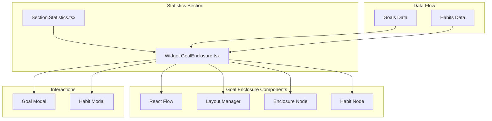

# Design Document: Goal Enclosure Diagram

## Overview

The Goal Enclosure Diagram is a new visualization component for the Statistics section that displays Goals as rectangular enclosures containing their associated Habits. The diagram visualizes hierarchical Goal relationships through nested rectangles, providing users with an intuitive understanding of how their Goals and Habits are organized.

This feature leverages React Flow (already used in the mindmap feature) to provide interactive pan/zoom capabilities and consistent interaction patterns. The component will be implemented as a new widget (`Widget.GoalEnclosure.tsx`) and integrated into the Statistics section carousel.

## Architecture



### Key Architectural Decisions

1. **React Flow Integration**: Reuse React Flow for pan/zoom and node rendering, consistent with the existing mindmap implementation
2. **Custom Node Types**: Create custom node components for Goal enclosures and Habit elements
3. **Automatic Layout**: Implement a layout algorithm that calculates enclosure sizes and positions based on content
4. **Nested Enclosures**: Use React Flow's grouping/nesting capabilities to represent Goal hierarchy

## Components and Interfaces

### Widget.GoalEnclosure.tsx (Main Component)

```typescript
interface GoalEnclosureProps {
  goals: Goal[];
  habits: Habit[];
  visibleGoalIds?: string[];
  onGoalEdit: (goalId: string) => void;
  onHabitEdit: (habitId: string) => void;
  onEditGraph?: () => void;
}
```

The main component that:
- Receives Goals and Habits data from the Statistics section
- Transforms data into React Flow nodes and edges
- Manages visibility filtering
- Handles user interactions (click, hover)

### GoalEnclosureNode (Custom React Flow Node)

```typescript
interface GoalEnclosureNodeData {
  goal: Goal;
  habitCount: number;
  isCompleted: boolean;
  depth: number; // Nesting level (0 = root, 1 = child, etc.)
}
```

A custom React Flow node that:
- Renders as a rectangular enclosure with rounded corners
- Displays the Goal name as a header
- Applies completion styling when Goal is completed
- Supports nesting for parent-child relationships

### HabitNode (Custom React Flow Node)

```typescript
interface HabitNodeData {
  habit: Habit;
  isCompleted: boolean;
  parentGoalId: string;
}
```

A custom React Flow node that:
- Renders as a compact element inside Goal enclosures
- Displays the Habit name
- Shows completion status visually

### Layout Manager

```typescript
interface LayoutConfig {
  padding: number;        // Padding inside enclosures
  habitHeight: number;    // Height of habit elements
  habitGap: number;       // Gap between habits
  minEnclosureWidth: number;
  minEnclosureHeight: number;
  nestedPadding: number;  // Additional padding for nested goals
}

interface LayoutResult {
  nodes: Node[];
  edges: Edge[];
  dimensions: { width: number; height: number };
}

function calculateLayout(
  goals: Goal[],
  habits: Habit[],
  visibleGoalIds: string[],
  config: LayoutConfig
): LayoutResult;
```

The layout manager:
- Builds a tree structure from Goals based on parentId relationships
- Calculates enclosure sizes based on contained Habits and child Goals
- Positions nodes to minimize overlap
- Returns React Flow compatible nodes and edges

## Data Models

### Goal (Existing Type)

```typescript
interface Goal {
  id: string;
  name: string;
  details?: string;
  dueDate?: string | Date | null;
  parentId?: string | null;  // Reference to parent Goal for hierarchy
  isCompleted?: boolean;
  tags?: Tag[];
  createdAt: string;
  updatedAt: string;
}
```

### Habit (Existing Type)

```typescript
interface Habit {
  id: string;
  goalId: string;           // Reference to parent Goal
  name: string;
  active: boolean;
  type: "do" | "avoid";
  completed: boolean;
  // ... other fields
}
```

### Internal Layout Types

```typescript
// Tree node for layout calculation
interface GoalTreeNode {
  goal: Goal;
  habits: Habit[];
  children: GoalTreeNode[];
  depth: number;
  // Calculated dimensions
  width: number;
  height: number;
  x: number;
  y: number;
}

// React Flow node for Goal enclosure
interface EnclosureNode extends Node {
  type: 'goalEnclosure';
  data: GoalEnclosureNodeData;
  style: {
    width: number;
    height: number;
  };
  parentNode?: string; // For nested enclosures
  extent?: 'parent';
}

// React Flow node for Habit
interface HabitFlowNode extends Node {
  type: 'habitNode';
  data: HabitNodeData;
  parentNode: string; // Always inside a Goal enclosure
  extent: 'parent';
}
```

### Visibility State

```typescript
interface VisibilityState {
  visibleGoalIds: string[];
  showUnassignedHabits: boolean;
}
```


## Correctness Properties

*A property is a characteristic or behavior that should hold true across all valid executions of a system—essentially, a formal statement about what the system should do. Properties serve as the bridge between human-readable specifications and machine-verifiable correctness guarantees.*

Based on the acceptance criteria analysis, the following properties must hold for the Goal Enclosure Diagram:

### Property 1: Visibility Filtering Correctness

*For any* set of Goals, Habits, and visibility filter (visibleGoalIds), the layout output SHALL contain exactly one enclosure node for each Goal whose id is in visibleGoalIds, and no enclosure nodes for Goals not in visibleGoalIds.

**Validates: Requirements 1.1, 5.2, 5.3**

### Property 2: Label Correctness

*For any* Goal or Habit with a non-empty name, the corresponding node in the layout output SHALL have a data.label or data.goal.name/data.habit.name property that exactly matches the original name.

**Validates: Requirements 1.2, 2.2**

### Property 3: Completion Status Data Correctness

*For any* Goal with isCompleted set to true or false, the corresponding enclosure node's data.isCompleted property SHALL match the Goal's isCompleted value.

**Validates: Requirements 1.3**

### Property 4: Hierarchy Correctness

*For any* Goal with a valid parentId referencing another visible Goal, the corresponding enclosure node SHALL have its parentNode property set to the parent Goal's node id, AND the depth property SHALL be exactly one greater than the parent's depth.

**Validates: Requirements 2.1, 3.1, 3.2, 3.3, 3.4**

### Property 5: Orphan Habit Handling

*For any* Habit whose goalId does not reference a visible Goal, the Habit SHALL either be excluded from the layout output OR placed in a designated "unassigned" container node.

**Validates: Requirements 2.3**

### Property 6: Non-Overlap Constraint

*For any* two sibling nodes (nodes with the same parentNode or both at root level), their bounding boxes (x, y, width, height) SHALL NOT overlap.

**Validates: Requirements 2.4, 7.4**

### Property 7: Size Constraints

*For any* Goal enclosure node, its dimensions (width, height) SHALL be greater than or equal to the minimum required to contain all its child nodes (Habits and nested Goals) plus the configured padding.

**Validates: Requirements 7.1, 7.2, 7.3**

### Property 8: Touch Target Minimum Size

*For any* interactive node (Goal enclosure or Habit node), its dimensions SHALL be at least 44x44 pixels to meet accessibility touch target requirements.

**Validates: Requirements 6.3**

## Error Handling

### Invalid Data Handling

1. **Missing Goal Name**: If a Goal has an empty or undefined name, display a placeholder text (e.g., "Unnamed Goal")
2. **Circular Parent References**: If Goal A references Goal B as parent, and Goal B references Goal A, break the cycle by treating one as a root Goal
3. **Invalid parentId**: If a Goal's parentId references a non-existent Goal, treat the Goal as a root-level Goal
4. **Empty Data**: If no Goals are provided, display an empty state message

### Layout Edge Cases

1. **Very Deep Hierarchies**: Limit nesting depth to 5 levels to prevent performance issues; flatten deeper levels
2. **Large Number of Habits**: If a Goal has more than 50 Habits, implement pagination or scrolling within the enclosure
3. **Long Names**: Truncate names with ellipsis if they exceed the enclosure width

### React Flow Error Handling

1. **Render Failures**: Wrap React Flow in an error boundary and display a fallback message
2. **Performance**: Use React.memo and useMemo to prevent unnecessary re-renders

## Testing Strategy

### Unit Tests

Unit tests should focus on specific examples and edge cases:

1. **Layout Calculation Tests**
   - Empty Goals array returns empty layout
   - Single Goal with no Habits produces one enclosure
   - Goal with multiple Habits produces correctly sized enclosure
   - Nested Goals produce correct parent-child node relationships

2. **Data Transformation Tests**
   - Goal data correctly maps to node data
   - Habit data correctly maps to node data
   - Visibility filtering excludes non-visible Goals

3. **Edge Case Tests**
   - Circular parent references are handled
   - Invalid parentId references are handled
   - Empty names display placeholder text

### Property-Based Tests

Property-based tests validate universal properties across randomly generated inputs. Each test should run a minimum of 100 iterations.

**Testing Library**: fast-check (TypeScript property-based testing library)

**Test Configuration**:
```typescript
import fc from 'fast-check';

// Minimum 100 iterations per property
const testConfig = { numRuns: 100 };
```

**Property Test Implementation Plan**:

1. **Feature: goal-enclosure-diagram, Property 1: Visibility Filtering Correctness**
   - Generate random Goals and visibility filters
   - Verify output nodes match visibility filter exactly

2. **Feature: goal-enclosure-diagram, Property 2: Label Correctness**
   - Generate random Goals and Habits with various names
   - Verify all names appear correctly in output

3. **Feature: goal-enclosure-diagram, Property 3: Completion Status Data Correctness**
   - Generate Goals with random completion states
   - Verify isCompleted propagates correctly

4. **Feature: goal-enclosure-diagram, Property 4: Hierarchy Correctness**
   - Generate random Goal hierarchies (up to 3 levels)
   - Verify parentNode and depth are correct

5. **Feature: goal-enclosure-diagram, Property 5: Orphan Habit Handling**
   - Generate Habits with invalid/missing goalIds
   - Verify they are excluded or in unassigned container

6. **Feature: goal-enclosure-diagram, Property 6: Non-Overlap Constraint**
   - Generate various Goal/Habit configurations
   - Verify no sibling nodes overlap

7. **Feature: goal-enclosure-diagram, Property 7: Size Constraints**
   - Generate Goals with varying numbers of Habits
   - Verify enclosure sizes meet minimum requirements

8. **Feature: goal-enclosure-diagram, Property 8: Touch Target Minimum Size**
   - Generate various node configurations
   - Verify all nodes meet 44x44px minimum

### Integration Tests

1. **Statistics Section Integration**
   - Verify Goal Enclosure Diagram appears in carousel
   - Verify data flows correctly from Statistics section

2. **Modal Integration**
   - Verify Goal click triggers onGoalEdit callback
   - Verify Habit click triggers onHabitEdit callback

3. **Visibility Filter Integration**
   - Verify Edit Graph button opens visibility configuration
   - Verify visibility changes update the diagram
