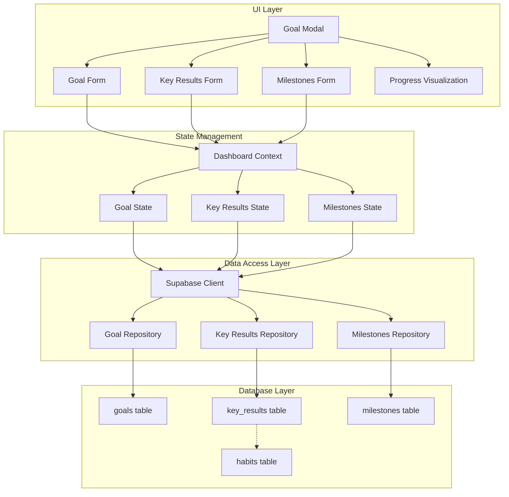
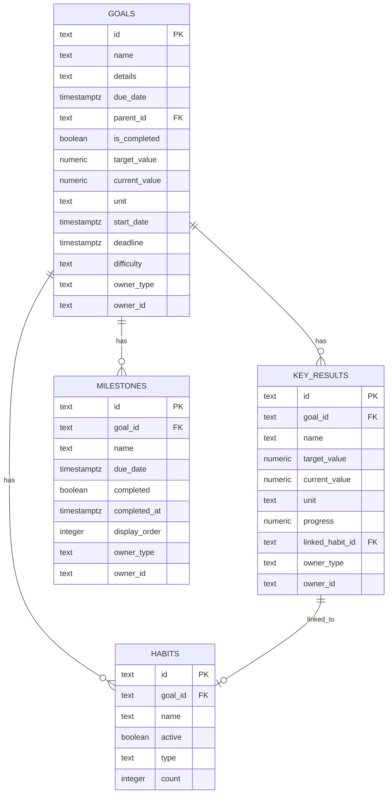
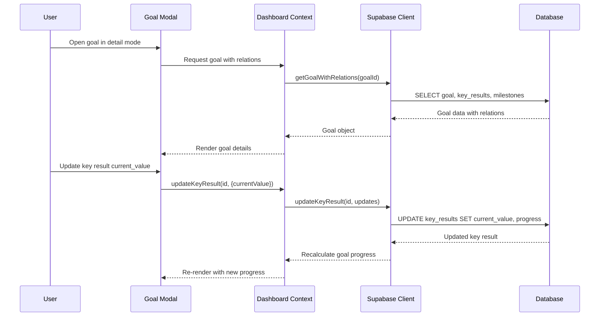

# Design Document: Goal OKR Milestones

## Overview

This design document describes the technical implementation for enhancing the Goal functionality with SMART framework, OKR structure, milestones, and KPI tracking. The solution extends the existing goal management system while maintaining backward compatibility and minimal impact on the current UI/UX.

The implementation follows a layered approach:
1. **Database Layer**: Schema migrations to extend goals table and create new tables
2. **Data Access Layer**: Supabase client extensions for CRUD operations
3. **State Management Layer**: React context updates for new data types
4. **UI Layer**: Enhanced Goal Modal with detail view mode

## Architecture



## Components and Interfaces

### Database Schema

#### Goals Table Extension

```sql
-- Migration: Extend goals table for SMART framework
ALTER TABLE goals ADD COLUMN IF NOT EXISTS target_value NUMERIC;
ALTER TABLE goals ADD COLUMN IF NOT EXISTS current_value NUMERIC DEFAULT 0;
ALTER TABLE goals ADD COLUMN IF NOT EXISTS unit TEXT;
ALTER TABLE goals ADD COLUMN IF NOT EXISTS start_date TIMESTAMPTZ;
ALTER TABLE goals ADD COLUMN IF NOT EXISTS deadline TIMESTAMPTZ;
ALTER TABLE goals ADD COLUMN IF NOT EXISTS difficulty TEXT CHECK (difficulty IN ('easy', 'medium', 'hard', 'stretch'));
```

#### Key Results Table

```sql
CREATE TABLE IF NOT EXISTS key_results (
    id TEXT PRIMARY KEY DEFAULT gen_random_uuid()::text,
    goal_id TEXT NOT NULL REFERENCES goals(id) ON DELETE CASCADE,
    name TEXT NOT NULL,
    target_value NUMERIC NOT NULL,
    current_value NUMERIC DEFAULT 0,
    unit TEXT,
    progress NUMERIC DEFAULT 0 CHECK (progress >= 0 AND progress <= 100),
    linked_habit_id TEXT REFERENCES habits(id) ON DELETE SET NULL,
    owner_type TEXT,
    owner_id TEXT,
    created_at TIMESTAMPTZ NOT NULL DEFAULT now(),
    updated_at TIMESTAMPTZ NOT NULL DEFAULT now()
);

CREATE INDEX IF NOT EXISTS idx_key_results_goal_id ON key_results(goal_id);
CREATE INDEX IF NOT EXISTS idx_key_results_owner ON key_results(owner_type, owner_id);
CREATE INDEX IF NOT EXISTS idx_key_results_linked_habit ON key_results(linked_habit_id);
```

#### Milestones Table

```sql
CREATE TABLE IF NOT EXISTS milestones (
    id TEXT PRIMARY KEY DEFAULT gen_random_uuid()::text,
    goal_id TEXT NOT NULL REFERENCES goals(id) ON DELETE CASCADE,
    name TEXT NOT NULL,
    due_date TIMESTAMPTZ,
    completed BOOLEAN DEFAULT FALSE,
    completed_at TIMESTAMPTZ,
    display_order INTEGER DEFAULT 0,
    owner_type TEXT,
    owner_id TEXT,
    created_at TIMESTAMPTZ NOT NULL DEFAULT now(),
    updated_at TIMESTAMPTZ NOT NULL DEFAULT now()
);

CREATE INDEX IF NOT EXISTS idx_milestones_goal_id ON milestones(goal_id);
CREATE INDEX IF NOT EXISTS idx_milestones_owner ON milestones(owner_type, owner_id);
```

### TypeScript Interfaces

```typescript
// Extended Goal interface
interface Goal {
  id: string;
  name: string;
  details?: string;
  dueDate?: string | Date | null;
  parentId?: string | null;
  isCompleted?: boolean;
  // SMART fields
  targetValue?: number | null;
  currentValue?: number;
  unit?: string;
  startDate?: string | Date | null;
  deadline?: string | Date | null;
  difficulty?: 'easy' | 'medium' | 'hard' | 'stretch';
  // Computed
  progress?: number;
  tags?: Tag[];
  keyResults?: KeyResult[];
  milestones?: Milestone[];
  createdAt: string;
  updatedAt: string;
}

interface KeyResult {
  id: string;
  goalId: string;
  name: string;
  targetValue: number;
  currentValue: number;
  unit?: string;
  progress: number;
  linkedHabitId?: string | null;
  linkedHabit?: Habit;
  createdAt: string;
  updatedAt: string;
}

interface Milestone {
  id: string;
  goalId: string;
  name: string;
  dueDate?: string | Date | null;
  completed: boolean;
  completedAt?: string | null;
  displayOrder: number;
  createdAt: string;
  updatedAt: string;
}

type DifficultyLevel = 'easy' | 'medium' | 'hard' | 'stretch';

interface CreateKeyResultPayload {
  goalId: string;
  name: string;
  targetValue: number;
  unit?: string;
  linkedHabitId?: string;
}

interface CreateMilestonePayload {
  goalId: string;
  name: string;
  dueDate?: string;
  displayOrder?: number;
}
```

### Component Structure

#### Modal.Goal.tsx Enhancement

The existing Goal Modal will be enhanced with a view mode toggle and additional sections:

```typescript
type GoalViewMode = 'basic' | 'detail';

interface GoalModalProps {
  open: boolean;
  onClose: () => void;
  goal: Goal | null;
  goals?: Goal[];
  habits?: Habit[];
  tags?: Tag[];
  onUpdate?: (goal: Goal) => void;
  onDelete?: (id: string) => void;
  onCreate?: (payload: CreateGoalPayload) => void;
  onComplete?: (goalId: string) => void;
  onTagsChange?: (goalId: string, tagIds: string[]) => Promise<void>;
  initial?: { name?: string; parentId?: string | null };
}
```

#### Form.KeyResults.tsx (New Component)

```typescript
interface KeyResultsFormProps {
  goalId: string;
  keyResults: KeyResult[];
  habits: Habit[];
  onAdd: (payload: CreateKeyResultPayload) => Promise<void>;
  onUpdate: (id: string, updates: Partial<KeyResult>) => Promise<void>;
  onDelete: (id: string) => Promise<void>;
}
```

#### Form.Milestones.tsx (New Component)

```typescript
interface MilestonesFormProps {
  goalId: string;
  milestones: Milestone[];
  onAdd: (payload: CreateMilestonePayload) => Promise<void>;
  onUpdate: (id: string, updates: Partial<Milestone>) => Promise<void>;
  onDelete: (id: string) => Promise<void>;
  onReorder: (milestones: Milestone[]) => Promise<void>;
  onToggleComplete: (id: string) => Promise<void>;
}
```

#### Widget.ProgressRing.tsx (New Component)

```typescript
interface ProgressRingProps {
  progress: number; // 0-100
  size?: 'sm' | 'md' | 'lg';
  showLabel?: boolean;
  color?: string;
}
```

### Progress Calculation

```typescript
// Progress Calculator utility
function calculateGoalProgress(goal: Goal): number {
  // If goal has explicit target/current values
  if (goal.targetValue && goal.targetValue > 0) {
    return Math.min(100, ((goal.currentValue || 0) / goal.targetValue) * 100);
  }
  
  // If goal has key results, average their progress
  if (goal.keyResults && goal.keyResults.length > 0) {
    const totalProgress = goal.keyResults.reduce((sum, kr) => sum + kr.progress, 0);
    return totalProgress / goal.keyResults.length;
  }
  
  // If goal has milestones, calculate completion percentage
  if (goal.milestones && goal.milestones.length > 0) {
    const completedCount = goal.milestones.filter(m => m.completed).length;
    return (completedCount / goal.milestones.length) * 100;
  }
  
  // No measurable progress
  return goal.isCompleted ? 100 : 0;
}

function calculateKeyResultProgress(kr: KeyResult): number {
  if (kr.targetValue <= 0) return 0;
  return Math.min(100, (kr.currentValue / kr.targetValue) * 100);
}
```

### Supabase Client Extensions

```typescript
// Add to supabase-direct.ts
interface SupabaseDirectClient {
  // Existing methods...
  
  // Key Results
  getKeyResults(goalId: string): Promise<KeyResult[]>;
  createKeyResult(payload: CreateKeyResultPayload): Promise<KeyResult>;
  updateKeyResult(id: string, updates: Partial<KeyResult>): Promise<KeyResult>;
  deleteKeyResult(id: string): Promise<void>;
  
  // Milestones
  getMilestones(goalId: string): Promise<Milestone[]>;
  createMilestone(payload: CreateMilestonePayload): Promise<Milestone>;
  updateMilestone(id: string, updates: Partial<Milestone>): Promise<Milestone>;
  deleteMilestone(id: string): Promise<void>;
  reorderMilestones(goalId: string, orderedIds: string[]): Promise<void>;
  
  // Goal SMART fields
  updateGoalSmart(id: string, smartFields: Partial<Goal>): Promise<Goal>;
}
```

## Data Models

### Entity Relationship Diagram



### State Flow




## Correctness Properties

*A property is a characteristic or behavior that should hold true across all valid executions of a system—essentially, a formal statement about what the system should do. Properties serve as the bridge between human-readable specifications and machine-verifiable correctness guarantees.*

### Property 1: SMART Fields Round-Trip

*For any* goal with valid SMART field values (target_value, current_value, unit, start_date, deadline, difficulty), saving the goal and then retrieving it SHALL return the same field values.

**Validates: Requirements 1.2, 1.3, 1.5**

### Property 2: Progress Calculation from Target/Current Values

*For any* goal with target_value > 0 and any non-negative current_value, the calculated progress SHALL equal `min(100, (current_value / target_value) * 100)`.

**Validates: Requirements 1.6**

### Property 3: Key Result Creation and Linking

*For any* valid key result payload with goalId, name, and target_value, creating the key result SHALL result in a record where goal_id matches the provided goalId.

**Validates: Requirements 2.2**

### Property 4: Key Result Validation

*For any* key result creation attempt missing name or target_value, the system SHALL reject the creation with a validation error.

**Validates: Requirements 2.3**

### Property 5: Key Result Progress Calculation

*For any* key result with target_value > 0 and any non-negative current_value, updating current_value SHALL result in progress equal to `min(100, (current_value / target_value) * 100)`.

**Validates: Requirements 2.4**

### Property 6: Goal Progress from Key Results Average

*For any* goal with one or more key results, the goal's computed progress SHALL equal the arithmetic mean of all key result progress values.

**Validates: Requirements 2.5, 4.2, 5.3**

### Property 7: Key Result Deletion and Progress Recalculation

*For any* goal with multiple key results, deleting one key result SHALL remove that record AND recalculate the goal's progress based on remaining key results.

**Validates: Requirements 2.6**

### Property 8: Milestone Creation Round-Trip

*For any* valid milestone payload with goalId, name, and optional due_date, creating the milestone and retrieving it SHALL return the same field values with goal_id matching the provided goalId.

**Validates: Requirements 3.2, 3.4**

### Property 9: Milestone Validation

*For any* milestone creation attempt missing the name field, the system SHALL reject the creation with a validation error.

**Validates: Requirements 3.3**

### Property 10: Milestone Completion State Transition

*For any* milestone, marking it as completed SHALL set completed to true AND set completed_at to a timestamp within a reasonable tolerance of the current time.

**Validates: Requirements 3.5**

### Property 11: Milestone Ordering Preservation

*For any* sequence of milestones with distinct display_order values, retrieving milestones for a goal SHALL return them sorted by display_order in ascending order. After reordering, the new display_order values SHALL reflect the requested order.

**Validates: Requirements 3.6, 3.7**

### Property 12: Habit-KeyResult Integration

*For any* key result linked to a habit, completing that habit SHALL increment the key result's current_value by the appropriate amount (typically 1 or the habit's count increment).

**Validates: Requirements 5.2**

### Property 13: Habit Deletion Preserves Key Result

*For any* key result with a linked_habit_id, deleting the linked habit SHALL set linked_habit_id to null but SHALL NOT delete the key result record.

**Validates: Requirements 5.5**

### Property 14: Cascade Delete Behavior

*For any* goal with associated key results and milestones, deleting the goal SHALL also delete all associated key results and milestones.

**Validates: Requirements 6.4**

### Property 15: Row Level Security

*For any* user, querying key_results or milestones SHALL only return records where owner_id matches the authenticated user's ID.

**Validates: Requirements 6.6**

### Property 16: View Mode State Preservation

*For any* unsaved form state in the Goal Modal, switching between basic and detail view modes SHALL preserve all field values.

**Validates: Requirements 7.4**

### Property 17: View Mode Preference Persistence

*For any* user who sets a preferred view mode (basic or detail), closing and reopening the Goal Modal SHALL restore the previously selected view mode.

**Validates: Requirements 7.5**

## Error Handling

### Database Errors

| Error Scenario | Handling Strategy |
|----------------|-------------------|
| Foreign key violation (invalid goal_id) | Return 400 Bad Request with descriptive message |
| Unique constraint violation | Return 409 Conflict with field identification |
| RLS policy denial | Return 403 Forbidden |
| Connection timeout | Retry with exponential backoff, max 3 attempts |
| Invalid data type | Return 400 Bad Request with validation details |

### Validation Errors

| Field | Validation Rule | Error Message |
|-------|-----------------|---------------|
| key_result.name | Required, non-empty | "Key result name is required" |
| key_result.target_value | Required, positive number | "Target value must be a positive number" |
| milestone.name | Required, non-empty | "Milestone name is required" |
| goal.difficulty | Must be one of: easy, medium, hard, stretch | "Invalid difficulty level" |
| goal.target_value | If provided, must be non-negative | "Target value cannot be negative" |

### UI Error States

```typescript
interface ErrorState {
  field?: string;
  message: string;
  type: 'validation' | 'network' | 'permission';
}

// Display inline validation errors near form fields
// Display toast notifications for network/permission errors
// Provide retry actions for transient failures
```

### Edge Cases

1. **Division by zero**: When target_value is 0 or null, progress calculation returns 0
2. **Empty key results**: Goal with no key results falls back to milestone-based or manual progress
3. **Circular parent references**: Validate that parent_id does not create cycles
4. **Concurrent updates**: Use optimistic locking with updated_at timestamp comparison

## Testing Strategy

### Dual Testing Approach

This feature requires both unit tests and property-based tests for comprehensive coverage:

- **Unit tests**: Verify specific examples, edge cases, and error conditions
- **Property tests**: Verify universal properties across all valid inputs

### Property-Based Testing Configuration

- **Library**: fast-check (TypeScript property-based testing library)
- **Minimum iterations**: 100 per property test
- **Tag format**: `Feature: goal-okr-milestones, Property {number}: {property_text}`

### Test Categories

#### Unit Tests

1. **Component rendering tests**
   - Goal Modal renders in basic mode by default
   - Goal Modal renders SMART fields in detail mode
   - Key Results section displays progress bars
   - Milestones section displays in order

2. **Edge case tests**
   - Progress calculation with target_value = 0
   - Progress calculation with target_value = null
   - Empty key results list
   - Empty milestones list

3. **Validation tests**
   - Key result creation without name fails
   - Key result creation without target_value fails
   - Milestone creation without name fails

#### Property-Based Tests

Each correctness property (P1-P17) will be implemented as a property-based test:

```typescript
// Example: Property 2 - Progress Calculation
// Feature: goal-okr-milestones, Property 2: Progress Calculation from Target/Current Values
test.prop([fc.float({ min: 0.01 }), fc.float({ min: 0 })], (targetValue, currentValue) => {
  const progress = calculateGoalProgress({ targetValue, currentValue });
  const expected = Math.min(100, (currentValue / targetValue) * 100);
  expect(progress).toBeCloseTo(expected, 5);
});

// Example: Property 6 - Goal Progress from Key Results Average
// Feature: goal-okr-milestones, Property 6: Goal Progress from Key Results Average
test.prop([fc.array(fc.float({ min: 0, max: 100 }), { minLength: 1 })], (progressValues) => {
  const keyResults = progressValues.map(p => ({ progress: p }));
  const goalProgress = calculateGoalProgressFromKeyResults(keyResults);
  const expected = progressValues.reduce((a, b) => a + b, 0) / progressValues.length;
  expect(goalProgress).toBeCloseTo(expected, 5);
});
```

### Integration Tests

1. **Habit-KeyResult integration flow**
   - Create goal → Create key result → Link habit → Complete habit → Verify key result updated

2. **Cascade delete flow**
   - Create goal with key results and milestones → Delete goal → Verify all related records deleted

3. **RLS policy verification**
   - Create data as user A → Query as user B → Verify no access

### Test File Structure

```
frontend/__tests__/
├── components/
│   ├── Modal.Goal.test.tsx
│   ├── Form.KeyResults.test.tsx
│   ├── Form.Milestones.test.tsx
│   └── Widget.ProgressRing.test.tsx
├── utils/
│   └── progressCalculator.test.ts
├── properties/
│   ├── goal-smart-fields.property.test.ts
│   ├── key-results.property.test.ts
│   ├── milestones.property.test.ts
│   └── progress-calculation.property.test.ts
└── integration/
    ├── habit-keyresult.integration.test.ts
    └── cascade-delete.integration.test.ts
```
