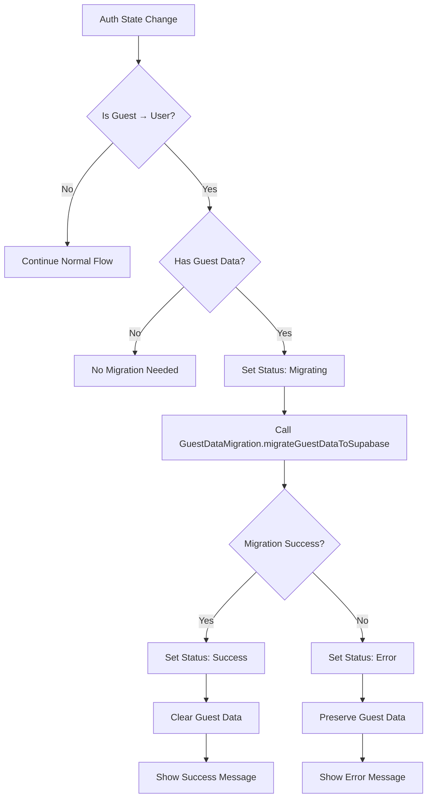

# Guest Data Migration Integration - Design

## Architecture Overview

The guest data migration integration will be implemented by modifying the existing `useAuth` hook to trigger the already-implemented `GuestDataMigration` class when a user transitions from guest to authenticated state.

## Component Integration

### 1. useAuth Hook Modifications

**File**: `frontend/app/dashboard/hooks/useAuth.ts`

**Current Flow**:
```
Guest → Authenticated → Clear guest data immediately
```

**New Flow**:
```
Guest → Authenticated → Check for guest data → Migrate data → Clear data on success
```

**Key Changes**:
- Replace the `handleGuestToUserTransition` function to include migration
- Add migration state management (loading, success, error)
- Extract user ID from Supabase session for migration
- Integrate with existing `GuestDataMigration` class

### 2. Migration State Management

**New State Variables**:
```typescript
const [migrationStatus, setMigrationStatus] = useState<'idle' | 'checking' | 'migrating' | 'success' | 'error'>('idle');
const [migrationResult, setMigrationResult] = useState<GuestDataMigrationResult | null>(null);
const [migrationError, setMigrationError] = useState<string | null>(null);
```

**AuthContext Extension**:
```typescript
export interface AuthContext {
  // ... existing properties
  migrationStatus: 'idle' | 'checking' | 'migrating' | 'success' | 'error';
  migrationResult: GuestDataMigrationResult | null;
  migrationError: string | null;
  retryMigration: () => Promise<void>;
}
```

### 3. Migration Trigger Logic

**Trigger Conditions**:
- User transitions from guest (`isGuest: true`) to authenticated (`isAuthed: true, isGuest: false`)
- Guest data exists in localStorage
- Migration is not already in progress

**Implementation**:
```typescript
const handleGuestToUserTransition = async () => {
  // Check transition conditions
  if (!isGuest && isAuthed && !migrationInProgressRef.current) {
    // Extract user ID from Supabase session
    const userId = await getUserIdFromSession();
    if (!userId) return;
    
    // Check for guest data
    if (GuestDataMigration.hasGuestData()) {
      await performMigration(userId);
    }
  }
};
```

### 4. Migration Process Flow



## User Experience Design

### 1. Migration Feedback

**Loading State**:
- Show subtle loading indicator in header or notification area
- Message: "Migrating your data to your account..."

**Success State**:
- Show success notification with migration statistics
- Message: "Successfully migrated X goals, Y habits, and Z activities to your account"
- Auto-dismiss after 5 seconds

**Error State**:
- Show error notification with retry option
- Message: "Failed to migrate some data. Your guest data has been preserved. [Retry]"
- Persist until user dismisses or retries

### 2. UI Integration Points

**Header Component** (`Layout.Header.tsx`):
- Add migration status indicator
- Show migration notifications

**Dashboard Page**:
- Access migration state from `useAuth` hook
- Display appropriate UI based on migration status

## Error Handling Strategy

### 1. Migration Failure Types

**Partial Failure**:
- Some items migrated successfully, others failed
- Show partial success message with error details
- Preserve failed items in guest data

**Complete Failure**:
- No items migrated successfully
- Show error message with retry option
- Preserve all guest data

**Network/Auth Failure**:
- Migration cannot start due to network or auth issues
- Show appropriate error message
- Retry automatically when conditions improve

### 2. Error Recovery

**Retry Mechanism**:
```typescript
const retryMigration = async () => {
  if (migrationStatus === 'error' && isAuthed && !isGuest) {
    const userId = await getUserIdFromSession();
    if (userId) {
      await performMigration(userId);
    }
  }
};
```

**Graceful Degradation**:
- If migration fails, user can continue using the app normally
- Guest data remains accessible until successful migration
- User can manually retry migration

## Implementation Details

### 1. User ID Extraction

```typescript
const getUserIdFromSession = async (): Promise<string | null> => {
  try {
    const { supabase } = await import('../../../lib/supabaseClient');
    if (!supabase) return null;
    
    const { data: { session } } = await supabase.auth.getSession();
    return session?.user?.id || null;
  } catch (error) {
    console.error('[auth] Failed to get user ID:', error);
    return null;
  }
};
```

### 2. Migration Execution

```typescript
const performMigration = async (userId: string) => {
  setMigrationStatus('migrating');
  setMigrationError(null);
  migrationInProgressRef.current = true;
  
  try {
    const result = await GuestDataMigration.migrateGuestDataToSupabase(userId);
    
    if (result.success) {
      setMigrationStatus('success');
      setMigrationResult(result);
      setAuthError(`Successfully migrated ${result.migratedGoals} goals, ${result.migratedHabits} habits, and ${result.migratedActivities} activities`);
    } else {
      setMigrationStatus('error');
      setMigrationError(result.errors.join(', '));
      setAuthError(`Migration completed with errors: ${result.errors.join(', ')}`);
    }
  } catch (error) {
    setMigrationStatus('error');
    setMigrationError((error as any)?.message || String(error));
    setAuthError(`Migration failed: ${(error as any)?.message || error}`);
  } finally {
    migrationInProgressRef.current = false;
    
    // Clear success message after 5 seconds
    if (migrationStatus === 'success') {
      setTimeout(() => {
        setAuthError(null);
        setMigrationStatus('idle');
      }, 5000);
    }
  }
};
```

### 3. UI Component Updates

**Header Component**:
```typescript
// Add migration status display
{migrationStatus === 'migrating' && (
  <div className="text-sm text-blue-600">
    Migrating your data...
  </div>
)}

{migrationStatus === 'error' && (
  <div className="text-sm text-red-600">
    Migration failed. <button onClick={retryMigration}>Retry</button>
  </div>
)}
```

## Testing Strategy

### 1. Unit Tests
- Test migration trigger conditions
- Test user ID extraction
- Test error handling scenarios
- Test state management

### 2. Integration Tests
- Test complete migration flow
- Test partial migration scenarios
- Test error recovery
- Test UI feedback

### 3. Manual Testing Scenarios
- Create guest data → Login → Verify migration
- Create duplicate data → Login → Verify deduplication
- Simulate network failure during migration
- Test retry functionality

## Performance Considerations

### 1. Migration Timing
- Trigger migration after authentication is fully established
- Use debouncing to prevent multiple migration attempts
- Non-blocking migration (user can continue using app)

### 2. Data Size Handling
- Migration handles large datasets gracefully
- Progress indication for large migrations
- Chunked processing if needed

## Security Considerations

### 1. Data Validation
- Validate guest data before migration
- Sanitize data during migration process
- Ensure proper ownership assignment

### 2. Authentication Verification
- Verify user authentication before migration
- Ensure user ID is valid and belongs to authenticated user
- Prevent migration to wrong user account

## Rollback Strategy

If issues arise after deployment:
1. Feature flag to disable automatic migration
2. Manual migration trigger option
3. Data recovery from guest localStorage backup
4. Rollback to previous clearing behavior

## Success Metrics

### 1. Functional Metrics
- Migration success rate > 95%
- Zero data loss incidents
- Error recovery success rate > 90%

### 2. User Experience Metrics
- Migration completion time < 5 seconds for typical datasets
- User satisfaction with migration feedback
- Reduced support tickets about lost data

### 3. Technical Metrics
- Migration error rate < 5%
- Retry success rate > 80%
- Performance impact on authentication flow < 500ms