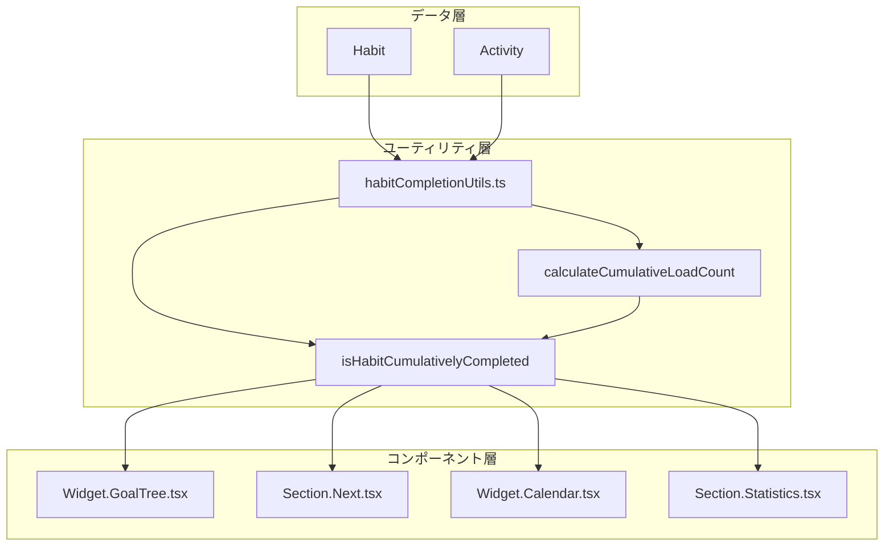

# 設計書

## 概要

本設計書は、Habitの累積Load Total(End)完了表示機能の技術的な実装方針を定義します。累積Load CountがworkloadTotalEndを超えた場合、各UIセクションで適切な表示制御を行います。

## アーキテクチャ



## コンポーネントとインターフェース

### 1. ユーティリティ関数

新規ファイル: `frontend/app/dashboard/utils/habitCompletionUtils.ts`

```typescript
import type { Habit, Activity } from '../types';

/**
 * 指定されたHabitの累積Load Countを計算する
 * @param habitId - 対象HabitのID
 * @param activities - 全Activityの配列
 * @returns 累積Load Count
 */
export function calculateCumulativeLoadCount(
  habitId: string,
  activities: Activity[]
): number;

/**
 * Habitが累積完了状態かどうかを判定する
 * @param habit - 対象Habit
 * @param activities - 全Activityの配列
 * @returns 累積完了状態の場合true
 */
export function isHabitCumulativelyCompleted(
  habit: Habit,
  activities: Activity[]
): boolean;
```

### 2. Widget.GoalTree.tsx の変更

既存の`isHabitCompletedToday`関数に加えて、累積完了判定を追加します。

```typescript
// 変更箇所: HabitItem コンポーネント
interface HabitItemProps {
  habit: Habit;
  activities: Activity[];
  goalCompleted: boolean;
  isCumulativelyCompleted: boolean; // 新規追加
  // ... 既存のprops
}

function HabitItem({
  habit,
  activities,
  goalCompleted,
  isCumulativelyCompleted, // 新規追加
  // ... 既存のprops
}: HabitItemProps) {
  // 日次完了 OR Goal完了 OR 非アクティブ OR 累積完了
  const isCompleted = isHabitCompletedToday(habit, activities) 
    || goalCompleted 
    || !habit.active
    || isCumulativelyCompleted;
  
  // スタイル適用（既存ロジックを維持）
}
```

### 3. Section.Next.tsx の変更

Habitリストのフィルタリングに累積完了判定を追加します。

```typescript
// 変更箇所: candidates生成ロジック
for (const h of habits) {
  if (h.completed) continue;
  if (h.type === 'avoid') continue;
  
  // 新規追加: 累積完了チェック
  if (isHabitCumulativelyCompleted(h, activities)) continue;
  
  // ... 既存のロジック
}
```

### 4. Widget.Calendar.tsx の変更

イベント生成時に累積完了Habitを除外します。

```typescript
// 変更箇所: events useMemo内
const events = useMemo(() => {
  const ev: any[] = [];
  // ...
  
  for (const h of (habits ?? [])) {
    if (!h.active) continue;
    if (h.type === 'avoid') continue;
    
    // 新規追加: 累積完了チェック
    if (isHabitCumulativelyCompleted(h, activities)) continue;
    
    // ... 既存のイベント生成ロジック
  }
  
  return ev;
}, [habits, goals, activities]); // activitiesを依存配列に追加
```

### 5. Section.Statistics.tsx の変更

統計計算に累積完了状態を反映します。

```typescript
// 変更箇所: stats useMemo内
const stats = React.useMemo(() => {
  // ... 既存のロジック
  
  // 累積完了Habitのカウント
  const cumulativelyCompletedHabits = habits.filter(h => 
    isHabitCumulativelyCompleted(h, activities)
  );
  
  // 達成率計算に累積完了を含める
  const habitRateTotal = {
    achieved: cumulativeAchieved + cumulativelyCompletedHabits.length,
    total: cumulativeTotal,
    pct: safePct(cumulativeAchieved + cumulativelyCompletedHabits.length, cumulativeTotal)
  };
  
  return {
    // ... 既存のプロパティ
    cumulativelyCompletedCount: cumulativelyCompletedHabits.length,
  };
}, [habits, activities, visibleHabitIds, range, activeWindow, goals]);
```

## データモデル

### Habit型の拡張（既存）

```typescript
// frontend/app/dashboard/types/index.ts
export interface Habit {
  // ... 既存のフィールド
  workloadTotalEnd?: number; // 累積目標値（既にshared.tsで定義済み）
}
```

### Activity型（既存）

```typescript
export interface Activity {
  id: string;
  kind: ActivityKind; // 'start' | 'complete' | 'skip' | 'pause'
  habitId: string;
  habitName: string;
  timestamp: string;
  amount?: number; // 完了量
  // ...
}
```


## 正確性プロパティ

*プロパティとは、システムの全ての有効な実行において真であるべき特性や振る舞いのことです。プロパティは人間が読める仕様と機械で検証可能な正確性保証の橋渡しをします。*

### Property 1: 累積Load Count計算の正確性

*For any* HabitとActivityの組み合わせにおいて、`calculateCumulativeLoadCount`関数は、当該HabitのIDを持ち、かつ`kind`が'complete'であるActivityの`amount`フィールドの合計値を返すものとする。`amount`がnull/undefinedの場合は0として扱う。

**Validates: Requirements 1.1, 1.2, 1.3**

### Property 2: 累積完了判定の正確性

*For any* Habitにおいて、`workloadTotalEnd`が正の数として設定されており、かつ累積Load Countが`workloadTotalEnd`以上である場合に限り、`isHabitCumulativelyCompleted`関数はtrueを返すものとする。

**Validates: Requirements 2.1, 2.2, 2.3**

### Property 3: GoalTreeスタイル適用の一貫性

*For any* Habitにおいて、累積完了状態の場合はGoalTreeコンポーネントが打ち消し線（line-through）と薄いグレー（text-zinc-400）のスタイルを適用し、累積完了状態でない場合は通常のスタイルを適用するものとする。

**Validates: Requirements 3.1, 3.2, 3.3**

### Property 4: Nextセクションフィルタリングの正確性

*For any* Habitリストにおいて、Nextセクションに表示されるHabitは、累積完了状態でないHabitのみを含むものとする。

**Validates: Requirements 4.1, 4.2**

### Property 5: Calendarイベント生成の正確性

*For any* Habitリストにおいて、Calendarセクションで生成されるイベントは、累積完了状態でないHabitのイベントのみを含むものとする。

**Validates: Requirements 5.1, 5.2, 5.3**

### Property 6: Statistics達成率計算の正確性

*For any* Habitリストにおいて、Statisticsセクションの達成率計算では、累積完了状態のHabitを達成済み（100%）としてカウントするものとする。

**Validates: Requirements 6.1, 6.2, 6.4**

### Property 7: ユーティリティ関数のラウンドトリップ一貫性

*For any* 有効なHabitとActivityの組み合わせにおいて、`calculateCumulativeLoadCount`で累積Load Countを計算し、その結果を`workloadTotalEnd`と比較した判定結果は、`isHabitCumulativelyCompleted`を直接呼び出した結果と一致するものとする。

**Validates: Requirements 7.4**

## エラーハンドリング

### 1. 無効なデータの処理

| シナリオ | 処理方法 |
|---------|---------|
| `activities`が空配列 | 累積Load Countを0として返す |
| `habit.workloadTotalEnd`がundefined | 累積完了と判定しない（false） |
| `habit.workloadTotalEnd`が0以下 | 累積完了と判定しない（false） |
| `activity.amount`がnull/undefined | 0として扱う |
| `activity.kind`が'complete'以外 | 累積計算から除外 |

### 2. 型安全性

- TypeScriptの型定義により、コンパイル時に型エラーを検出
- オプショナルフィールドは適切にnullチェックを実施

## テスト戦略

### ユニットテスト

1. **habitCompletionUtils.ts**
   - `calculateCumulativeLoadCount`の正確性
   - `isHabitCumulativelyCompleted`の判定ロジック
   - エッジケース（空配列、null値、0以下の値）

2. **コンポーネントテスト**
   - GoalTreeのスタイル適用
   - Nextセクションのフィルタリング
   - Calendarのイベント生成
   - Statisticsの達成率計算

### プロパティベーステスト

プロパティベーステストライブラリ: `fast-check`

各プロパティテストは最低100回のイテレーションで実行します。

```typescript
// テストタグ形式
// Feature: habit-load-completion-display, Property N: [property_text]
```

**テスト対象プロパティ:**

1. Property 1: 累積Load Count計算の正確性
2. Property 2: 累積完了判定の正確性
3. Property 7: ユーティリティ関数のラウンドトリップ一貫性

UIコンポーネントのプロパティ（Property 3-6）は、ユニットテストとインテグレーションテストで検証します。
