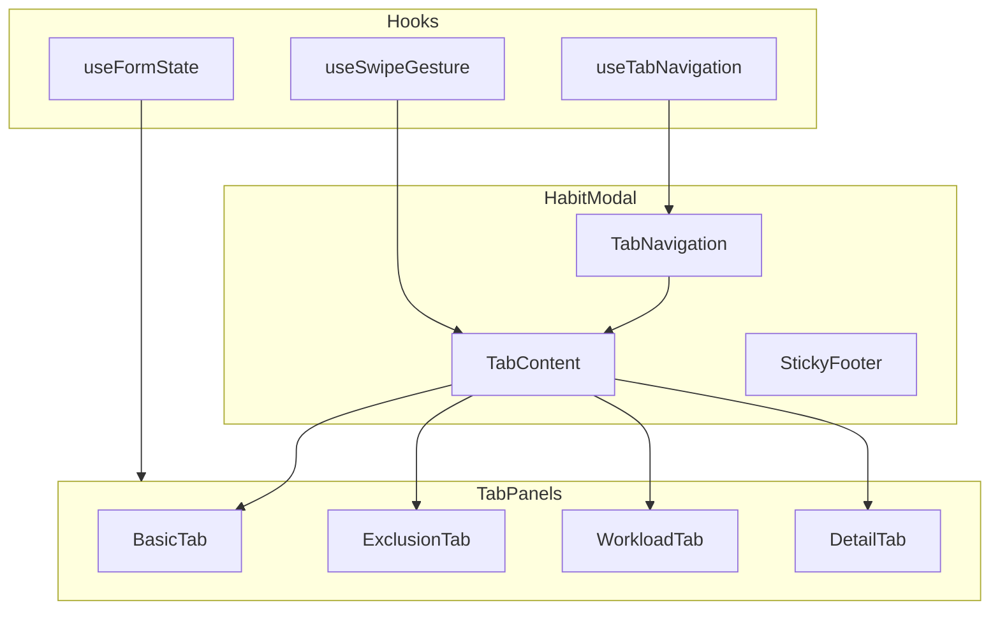
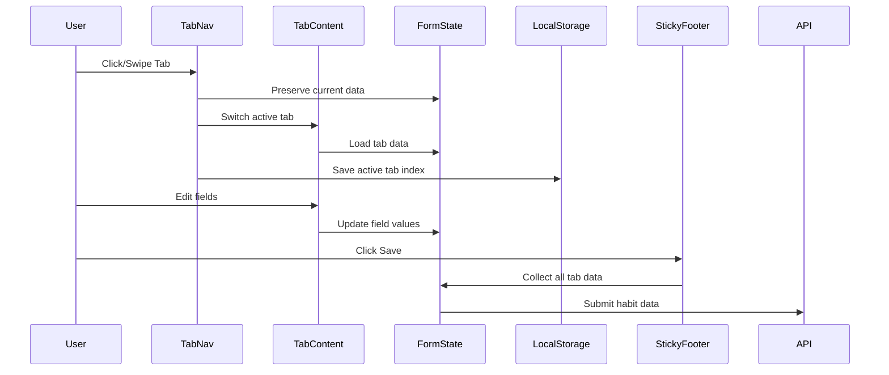

# Design Document: Habit Modal Tabs

## Overview

本設計では、Habitモーダルを4タブ構成に再編成し、モバイルファーストのUXを実現します。既存の「通常/詳細」ビューモードを廃止し、タブベースのナビゲーションに統合することで、ユーザーが必要な設定項目に素早くアクセスできるようにします。

### Key Design Decisions

1. **タブ構成**: 基本 → 除外日時 → 負荷 → 詳細 の4タブ
2. **モバイルファースト**: 44px以上のタッチターゲット、スワイプナビゲーション対応
3. **状態管理**: React useStateでタブ間のデータを保持、localStorageで最終タブを記憶
4. **アクセシビリティ**: WAI-ARIA Tabs パターンに準拠

## Architecture



### Data Flow



## Components and Interfaces

### TabNavigation Component

```typescript
interface TabConfig {
  id: string;
  label: string;
  icon?: React.ReactNode;
}

interface TabNavigationProps {
  tabs: TabConfig[];
  activeTab: number;
  onTabChange: (index: number) => void;
  hasErrors?: Record<string, boolean>; // タブごとのエラー状態
}

const HABIT_MODAL_TABS: TabConfig[] = [
  { id: 'basic', label: '基本' },
  { id: 'exclusion', label: '除外日時' },
  { id: 'workload', label: '負荷' },
  { id: 'detail', label: '詳細' },
];
```

### Tab Content Components

```typescript
// 各タブのProps共通インターフェース
interface TabPanelProps {
  isActive: boolean;
  formState: HabitFormState;
  onFieldChange: (field: string, value: any) => void;
}

// BasicTab固有のProps
interface BasicTabProps extends TabPanelProps {
  habit: Habit | null;
  onLevelAssessment: () => void;
}

// ExclusionTabProps
interface ExclusionTabProps extends TabPanelProps {
  outdates: Timing[];
  onOutdatesChange: (outdates: Timing[]) => void;
}

// WorkloadTabProps
interface WorkloadTabProps extends TabPanelProps {
  timings: Timing[];
  autoLoadPerSet: (number | null)[];
}

// DetailTabProps
interface DetailTabProps extends TabPanelProps {
  goals: { id: string; name: string }[];
  tags: any[];
  allHabits: Habit[];
  relations: HabitRelation[];
  onRelationAdd: (relation: HabitRelation) => void;
  onRelationDelete: (id: string) => void;
  onTagsChange: (tagIds: string[]) => void;
}
```

### useSwipeGesture Hook

```typescript
interface SwipeConfig {
  threshold: number;      // スワイプ判定の閾値（px）
  velocityThreshold: number; // 速度閾値
  onSwipeLeft: () => void;
  onSwipeRight: () => void;
}

interface SwipeState {
  startX: number;
  currentX: number;
  isDragging: boolean;
}

function useSwipeGesture(config: SwipeConfig): {
  handlers: {
    onTouchStart: (e: TouchEvent) => void;
    onTouchMove: (e: TouchEvent) => void;
    onTouchEnd: (e: TouchEvent) => void;
  };
  offset: number; // 現在のスワイプオフセット（アニメーション用）
};
```

### Form State Management

```typescript
interface HabitFormState {
  // Basic Tab
  name: string;
  type: 'do' | 'avoid';
  timings: Timing[];
  notes: string;
  
  // Exclusion Tab
  outdates: Timing[];
  
  // Workload Tab
  workloadUnit: string;
  workloadTotal: string;
  workloadTotalEnd: string;
  workloadPerCount: string;
  
  // Detail Tab
  goalId: string | undefined;
  selectedTagIds: string[];
  relations: HabitRelation[];
}

// フォーム状態の初期化関数
function initializeFormState(habit: Habit | null, initial?: InitialValues): HabitFormState;

// フォーム状態からペイロードへの変換
function formStateToPayload(state: HabitFormState): CreateHabitPayload | UpdateHabitPayload;
```

## Data Models

### Tab State

```typescript
interface TabState {
  activeIndex: number;
  visitedTabs: Set<number>;
  errors: Map<number, string[]>;
}

// LocalStorage key
const TAB_STATE_KEY = 'habitModalActiveTab';
```

### Timing Model (既存)

```typescript
type TimingType = 'Date' | 'Daily' | 'Weekly' | 'Monthly';

interface Timing {
  id?: string;
  type: TimingType;
  date?: string;
  start?: string;
  end?: string;
  cron?: string;
}
```


## Correctness Properties

*A property is a characteristic or behavior that should hold true across all valid executions of a system—essentially, a formal statement about what the system should do. Properties serve as the bridge between human-readable specifications and machine-verifiable correctness guarantees.*

### Property 1: Tab Click Navigation

*For any* tab index in the valid range [0, 3], clicking that tab should result in the active tab index being set to the clicked index.

**Validates: Requirements 1.3**

### Property 2: Exclusion Period Addition Invariant

*For any* initial list of exclusion periods and any valid new exclusion period, adding the new period should increase the list length by exactly 1 and the new period should be present in the resulting list.

**Validates: Requirements 3.2**

### Property 3: Auto Load Calculation

*For any* valid workloadTotal (positive number) and any list of timings with durations, the sum of autoLoadPerSet values should equal workloadTotal (within floating-point tolerance).

**Validates: Requirements 4.7**

### Property 4: Relation Add/Remove Consistency

*For any* habit relation added to the relations list, the relation should appear in the list. *For any* relation removed from the list, the relation should no longer appear in the list.

**Validates: Requirements 5.4**

### Property 5: Swipe Navigation

*For any* current tab index, swiping left should navigate to index + 1 (if not at last tab), and swiping right should navigate to index - 1 (if not at first tab). Boundary conditions: swiping left on last tab or right on first tab should not change the index.

**Validates: Requirements 7.1, 7.2, 7.3, 7.4**

### Property 6: Swipe Threshold Boundary

*For any* swipe gesture with distance below the threshold, the tab index should remain unchanged regardless of swipe direction.

**Validates: Requirements 7.6**

### Property 7: Form Data Round-Trip Preservation

*For any* form data entered in any tab, switching to a different tab and then returning to the original tab should preserve all entered values exactly.

**Validates: Requirements 8.1, 8.2**

### Property 8: Save Payload Completeness

*For any* form state with data in all tabs, the generated save payload should include all fields from all tabs (name, type, timings, notes, outdates, workload fields, goalId, tags, relations).

**Validates: Requirements 8.3**

### Property 9: LocalStorage Tab Persistence

*For any* tab selection, the active tab index should be saved to localStorage. When the modal reopens, the active tab should be restored from localStorage.

**Validates: Requirements 10.5**

### Property 10: Keyboard Navigation

*For any* focused tab, pressing ArrowRight should move focus to the next tab (if not last), pressing ArrowLeft should move focus to the previous tab (if not first), and pressing Enter or Space should activate the focused tab.

**Validates: Requirements 11.1, 11.3**

### Property 11: ARIA Selected State

*For any* active tab index, only the tab at that index should have aria-selected="true", and all other tabs should have aria-selected="false".

**Validates: Requirements 11.4**

## Error Handling

### Validation Errors

| Error Condition | Handling Strategy | User Feedback |
|-----------------|-------------------|---------------|
| Empty habit name | Prevent save, highlight field | Name field shows error border, Save button disabled |
| Invalid timing configuration | Show warning | Warning icon on Basic tab |
| Invalid workload values | Show warning | Warning icon on Workload tab |
| Tab with errors | Indicate in tab navigation | Error dot/badge on affected tab |

### State Recovery

```typescript
// LocalStorage読み込み失敗時のフォールバック
function getInitialTabIndex(): number {
  try {
    const stored = localStorage.getItem(TAB_STATE_KEY);
    const index = stored ? parseInt(stored, 10) : 0;
    return isNaN(index) || index < 0 || index > 3 ? 0 : index;
  } catch {
    return 0; // デフォルトは基本タブ
  }
}
```

### Swipe Gesture Edge Cases

- **Rapid swipes**: Debounce to prevent multiple tab changes
- **Diagonal swipes**: Only trigger if horizontal movement > vertical movement
- **Interrupted swipes**: Cancel navigation if touch moves back past threshold

## Testing Strategy

### Dual Testing Approach

本機能では、ユニットテストとプロパティベーステストの両方を使用して包括的なカバレッジを実現します。

- **Unit tests**: 特定の例、エッジケース、エラー条件の検証
- **Property tests**: すべての入力に対する普遍的なプロパティの検証

### Property-Based Testing Configuration

- **Library**: fast-check (TypeScript/JavaScript用)
- **Iterations**: 各プロパティテストで最低100回実行
- **Tag format**: `Feature: habit-modal-tabs, Property {number}: {property_text}`

### Test Categories

#### Unit Tests

1. **Component Rendering**
   - 各タブが正しいフィールドを表示することを確認
   - 条件付きレンダリング（既存habit vs 新規作成）
   - ARIA属性の存在確認

2. **Edge Cases**
   - 空のoutdates配列での空状態表示
   - 境界でのスワイプ動作
   - localStorage利用不可時のフォールバック

3. **Integration**
   - タブ間のデータフロー
   - 保存操作でのペイロード生成

#### Property Tests

```typescript
// Example: Property 1 - Tab Click Navigation
describe('Feature: habit-modal-tabs, Property 1: Tab click navigation', () => {
  it('clicking any valid tab index should set that tab as active', () => {
    fc.assert(
      fc.property(fc.integer({ min: 0, max: 3 }), (tabIndex) => {
        const { result } = renderHook(() => useTabNavigation());
        act(() => result.current.setActiveTab(tabIndex));
        expect(result.current.activeTab).toBe(tabIndex);
      }),
      { numRuns: 100 }
    );
  });
});

// Example: Property 7 - Form Data Round-Trip
describe('Feature: habit-modal-tabs, Property 7: Form data round-trip', () => {
  it('switching tabs and returning should preserve all form data', () => {
    fc.assert(
      fc.property(
        fc.record({
          name: fc.string(),
          type: fc.constantFrom('do', 'avoid'),
          notes: fc.string(),
          workloadUnit: fc.string(),
        }),
        fc.integer({ min: 0, max: 3 }),
        fc.integer({ min: 0, max: 3 }),
        (formData, startTab, intermediateTab) => {
          // Enter data in startTab
          // Switch to intermediateTab
          // Return to startTab
          // Verify data is preserved
          return true; // Implementation details in actual test
        }
      ),
      { numRuns: 100 }
    );
  });
});
```

### Test File Structure

```
frontend/__tests__/
├── components/
│   └── Modal.Habit.Tabs.test.tsx    # タブ機能のテスト
├── hooks/
│   ├── useTabNavigation.test.ts     # タブナビゲーションフック
│   └── useSwipeGesture.test.ts      # スワイプジェスチャーフック
└── properties/
    └── habitModalTabs.property.test.ts  # プロパティベーステスト
```

