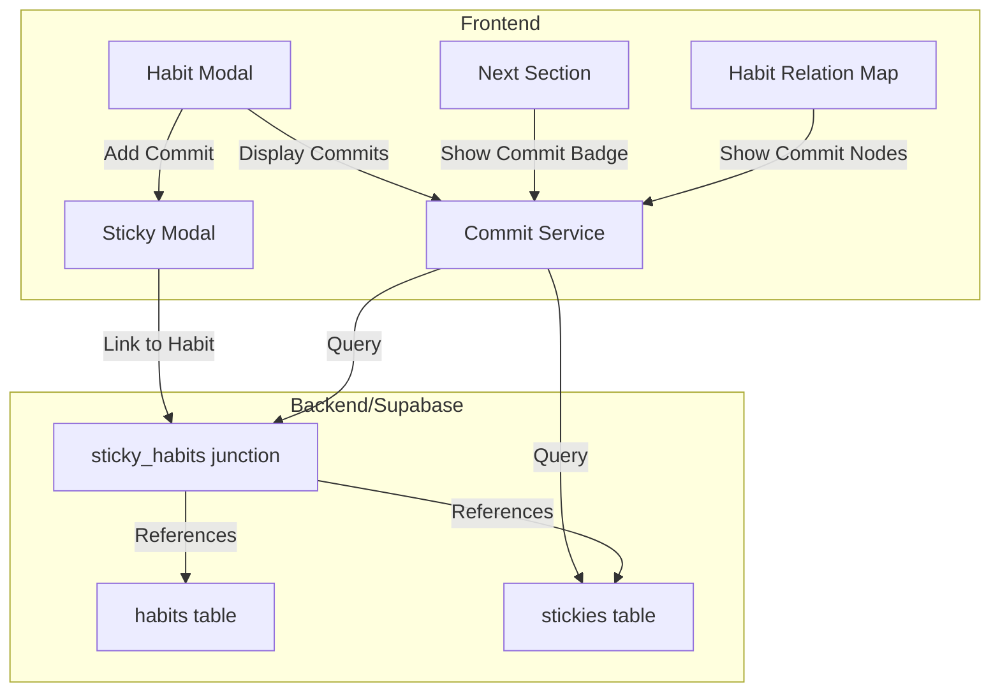

# Design Document: Habit-Sticky Commit Integration

## Overview

This design describes the implementation of the "Commit" feature that strengthens the connection between Habits and Stickies. A Commit is a Sticky (one-time task) that is linked to a Habit, representing a concrete action taken to support that habit. This feature leverages the existing `sticky_habits` junction table and adds UI components to display, create, and track Commits alongside regular habit completions.

The design follows a minimal-impact approach, reusing existing database structures and extending current UI components rather than creating new ones.

## Architecture



### Data Flow

1. **Commit Creation**: User creates Sticky → Links to Habit → Junction table updated → Commit count recalculated
2. **Commit Completion**: User completes Sticky → Sticky updated → Commit count for linked Habits recalculated
3. **Commit Display**: UI queries junction table → Fetches linked Stickies → Displays as Commits with status

## Components and Interfaces

### 1. Commit Service (`frontend/lib/commitService.ts`)

A new service module that encapsulates all Commit-related logic.

```typescript
interface CommitService {
  // Get all commits (linked stickies) for a habit
  getCommitsForHabit(habitId: string): Promise<Commit[]>;
  
  // Get commit statistics for a habit
  getCommitStats(habitId: string): Promise<CommitStats>;
  
  // Get commit statistics for multiple habits (batch)
  getCommitStatsForHabits(habitIds: string[]): Promise<Map<string, CommitStats>>;
  
  // Create a new commit (sticky linked to habit)
  createCommit(habitId: string, stickyData: CreateStickyPayload): Promise<Commit>;
}

interface Commit {
  id: string;
  name: string;
  description?: string;
  completed: boolean;
  completedAt?: string;
  habitId: string;
  createdAt: string;
}

interface CommitStats {
  total: number;
  completed: number;
  pending: number;
}
```

### 2. Habit Modal Enhancement (`Modal.Habit.tsx`)

Add a new "Commits" section to the existing Habit Modal.

```typescript
interface CommitsSectionProps {
  habitId: string;
  commits: Commit[];
  onAddCommit: () => void;
  onEditCommit: (commitId: string) => void;
  isLoading: boolean;
}
```

**UI Structure:**
```
┌─────────────────────────────────────┐
│ Habit Modal                         │
├─────────────────────────────────────┤
│ Name: [Read 30 minutes daily]       │
│ ...existing fields...               │
├─────────────────────────────────────┤
│ Commits (2/3 completed)    [+ Add]  │
│ ┌─────────────────────────────────┐ │
│ │ ☐ Organize reading list         │ │
│ │ ☑ Buy new book from Amazon      │ │
│ │ ☑ Set up reading corner         │ │
│ └─────────────────────────────────┘ │
└─────────────────────────────────────┘
```

### 3. Sticky Modal Enhancement (`Modal.Sticky.tsx`)

The existing Sticky Modal already supports linking to Habits. Minor enhancements:
- When opened from "Add Commit" in Habit Modal, pre-select the originating Habit
- Add visual indicator when Sticky is linked to Habits (showing it's a "Commit")

```typescript
interface StickyModalProps {
  // ...existing props...
  preSelectedHabitId?: string; // New: for "Add Commit" flow
}
```

### 4. Commit Badge Component (`Widget.CommitBadge.tsx`)

A small badge component to display Commit statistics on Habit cards.

```typescript
interface CommitBadgeProps {
  completed: number;
  total: number;
  size?: 'sm' | 'md';
}
```

**Visual Design:**
- Format: "2/5 commits" or just "2/5" for compact view
- Color: Default gray, green when all completed
- Position: Below habit name in Next Section cards

### 5. Habit Relation Map Enhancement (`Widget.HabitRelationMap.tsx`)

Add optional Commit node rendering to the existing relation map.

```typescript
interface CommitNodeData {
  type: 'commit';
  commit: Commit;
  parentHabitId: string;
}

// Toggle state for showing/hiding commits
interface RelationMapState {
  showCommits: boolean;
}
```

**Visual Design:**
- Commit nodes: Smaller, rounded rectangle, distinct color (yellow/amber to match Sticky styling)
- Completed commits: Muted color with checkmark icon
- Connection: Dashed line from Commit to parent Habit

## Data Models

### Existing Tables (No Changes Required)

```sql
-- stickies table (existing)
CREATE TABLE stickies (
    id TEXT PRIMARY KEY,
    name TEXT NOT NULL,
    description TEXT,
    completed BOOLEAN DEFAULT FALSE,
    completed_at TIMESTAMP WITH TIME ZONE,
    created_at TIMESTAMP WITH TIME ZONE DEFAULT NOW(),
    updated_at TIMESTAMP WITH TIME ZONE DEFAULT NOW(),
    owner_type TEXT,
    owner_id TEXT,
    display_order INTEGER DEFAULT 0
);

-- sticky_habits junction table (existing)
CREATE TABLE sticky_habits (
    id TEXT PRIMARY KEY,
    sticky_id TEXT NOT NULL REFERENCES stickies(id) ON DELETE CASCADE,
    habit_id TEXT NOT NULL REFERENCES habits(id) ON DELETE CASCADE,
    created_at TIMESTAMP WITH TIME ZONE DEFAULT NOW(),
    owner_type TEXT,
    owner_id TEXT,
    UNIQUE(sticky_id, habit_id)
);
```

### TypeScript Types

```typescript
// Extend existing Sticky type
interface Sticky {
  // ...existing fields...
  linkedHabitIds?: string[]; // Computed from junction table
}

// New Commit type (view of Sticky in Habit context)
interface Commit {
  id: string;           // Same as sticky.id
  name: string;
  description?: string;
  completed: boolean;
  completedAt?: string;
  habitId: string;      // The habit this commit belongs to
  createdAt: string;
}

// Commit statistics
interface CommitStats {
  total: number;
  completed: number;
  pending: number;
}

// Extended Habit type for UI
interface HabitWithCommits extends Habit {
  commitStats?: CommitStats;
  commits?: Commit[];
}
```

### API Functions (Extend `frontend/lib/api.ts`)

```typescript
// Get commits for a habit
async function getHabitCommits(habitId: string): Promise<Commit[]> {
  // Query sticky_habits join stickies where habit_id = habitId
  // Return stickies as Commit objects
}

// Get commit stats for a habit
async function getHabitCommitStats(habitId: string): Promise<CommitStats> {
  // Count total and completed stickies linked to habit
}

// Batch get commit stats for multiple habits
async function getHabitsCommitStats(habitIds: string[]): Promise<Map<string, CommitStats>> {
  // Single query with IN clause for efficiency
}
```

## Error Handling

### Error Scenarios

1. **Failed to load commits**: Display error message in Commits section, allow retry
2. **Failed to create commit**: Show toast notification, keep modal open
3. **Failed to link sticky to habit**: Show error, allow manual retry
4. **Orphaned junction records**: Handle gracefully (ON DELETE CASCADE handles this)

### Error Messages

```typescript
const COMMIT_ERRORS = {
  LOAD_FAILED: 'Failed to load commits. Please try again.',
  CREATE_FAILED: 'Failed to create commit. Please try again.',
  LINK_FAILED: 'Failed to link to habit. Please try again.',
};
```

## Testing Strategy

### Unit Tests

1. **CommitService tests**
   - `getCommitsForHabit` returns correct commits
   - `getCommitStats` calculates correct counts
   - `createCommit` creates sticky and links to habit

2. **CommitBadge tests**
   - Renders correct format "X/Y commits"
   - Shows green color when all completed
   - Hidden when total is 0

3. **Commits Section tests**
   - Displays commits sorted correctly (incomplete first)
   - "Add Commit" button opens Sticky Modal
   - Click on commit opens edit modal

### Integration Tests

1. **Commit creation flow**
   - Create sticky from Habit Modal
   - Verify junction table updated
   - Verify commit appears in Habit Modal

2. **Commit completion flow**
   - Complete a commit
   - Verify stats update
   - Verify badge updates in Next Section

### Property-Based Tests

See Correctness Properties section below.


## Correctness Properties

*A property is a characteristic or behavior that should hold true across all valid executions of a system—essentially, a formal statement about what the system should do. Properties serve as the bridge between human-readable specifications and machine-verifiable correctness guarantees.*

Based on the prework analysis, the following properties have been identified for property-based testing:

### Property 1: Link/Unlink Round-Trip

*For any* Sticky and Habit pair, linking the Sticky to the Habit and then querying the junction table SHALL return a record containing that relationship. Subsequently unlinking them SHALL result in no record existing for that pair.

**Validates: Requirements 1.2, 1.5**

### Property 2: Many-to-Many Linking Consistency

*For any* Sticky and any non-empty set of Habits, linking the Sticky to all Habits in the set SHALL result in exactly N junction records (where N is the number of Habits), and querying commits for each Habit SHALL include that Sticky.

**Validates: Requirements 1.4**

### Property 3: Commit Count Calculation Consistency

*For any* Habit with linked Stickies, the Commit_Count SHALL equal the count of linked Stickies where `completed = true`. Furthermore, completing an incomplete linked Sticky SHALL increase the count by 1, and uncompleting a completed linked Sticky SHALL decrease the count by 1.

**Validates: Requirements 2.1, 2.2, 2.3**

### Property 4: Commit Display Contains Required Fields

*For any* Commit (linked Sticky), the rendered display output SHALL contain the Commit's name, completion status indicator, and (if completed) the completion date.

**Validates: Requirements 3.2**

### Property 5: Commit Sorting Order

*For any* list of Commits for a Habit, the sorted list SHALL have all incomplete Commits before all completed Commits, and completed Commits SHALL be sorted by completion date in descending order (most recent first).

**Validates: Requirements 3.5**

### Property 6: Commit Badge Rendering

*For any* Habit with CommitStats where `total > 0`, the badge SHALL be visible and display the format "{completed}/{total} commits". When `completed === total`, the badge SHALL have success styling (green color). When `total === 0`, no badge SHALL be rendered.

**Validates: Requirements 5.1, 5.2, 5.3, 5.4**

### Property 7: Completed Commit Visual Indicator

*For any* Commit node in the Relation Map where `completed = true`, the node SHALL display with a completed visual indicator (checkmark icon or muted color styling).

**Validates: Requirements 6.4**

### Property 8: Habit Deletion Cascade

*For any* Habit with linked Stickies, deleting the Habit SHALL remove all junction records for that Habit, but the Stickies themselves SHALL remain in the stickies table unchanged.

**Validates: Requirements 7.3**

### Property 9: Sticky Deletion Cascade

*For any* Sticky linked to one or more Habits, deleting the Sticky SHALL remove all junction records for that Sticky from the sticky_habits table.

**Validates: Requirements 7.4**

## Error Handling

### Error Categories

| Error Type | Trigger | User Message | Recovery Action |
|------------|---------|--------------|-----------------|
| Load Error | Failed to fetch commits | "Failed to load commits. Please try again." | Retry button |
| Create Error | Failed to create commit | "Failed to create commit. Please try again." | Keep modal open |
| Link Error | Failed to link sticky to habit | "Failed to link to habit. Please try again." | Manual retry |
| Delete Error | Failed to delete commit | "Failed to delete. Please try again." | Retry button |

### Error Handling Strategy

1. **Optimistic Updates**: UI updates immediately, rolls back on error
2. **Toast Notifications**: Non-blocking error messages for transient errors
3. **Inline Errors**: Form-level errors shown in context
4. **Retry Logic**: Automatic retry for network errors (max 3 attempts)

### Graceful Degradation

- If commit loading fails, show error state but keep Habit Modal functional
- If badge stats fail to load, hide badge rather than show error
- If relation map commits fail, show habits without commit nodes

## Testing Strategy

### Unit Tests

Unit tests focus on specific examples and edge cases:

1. **CommitService**
   - Returns empty array for habit with no commits
   - Returns correct commits for habit with multiple linked stickies
   - Calculates stats correctly for mixed completed/incomplete commits

2. **CommitBadge Component**
   - Renders nothing when total is 0
   - Renders correct format "2/5 commits"
   - Applies success class when all completed

3. **Commits Section**
   - Shows "No commits yet" when empty
   - Renders all commits with correct data
   - Calls onAddCommit when button clicked

### Property-Based Tests

Property-based tests use a PBT library (fast-check for TypeScript) with minimum 100 iterations per test.

Each test is tagged with: **Feature: habit-sticky-commit-integration, Property {N}: {property_text}**

1. **Property 1 Test**: Generate random sticky/habit pairs, link them, verify junction record exists, unlink, verify record removed

2. **Property 2 Test**: Generate random sticky and random set of habits (1-10), link to all, verify all junction records exist

3. **Property 3 Test**: Generate habit with random linked stickies (various completion states), verify count equals completed count, toggle completion, verify count changes correctly

4. **Property 4 Test**: Generate random commits with various data, render, verify output contains name, status, and date (if completed)

5. **Property 5 Test**: Generate random list of commits with mixed completion states and dates, sort, verify ordering invariant

6. **Property 6 Test**: Generate random CommitStats, render badge, verify format and styling based on stats

7. **Property 7 Test**: Generate random commits, render as nodes, verify completed ones have visual indicator

8. **Property 8 Test**: Generate habit with random linked stickies, delete habit, verify junction records removed but stickies remain

9. **Property 9 Test**: Generate sticky linked to random habits, delete sticky, verify all junction records removed

### Integration Tests

1. **End-to-end commit creation flow**
   - Open Habit Modal → Click Add Commit → Fill Sticky form → Save → Verify commit appears

2. **Commit completion flow**
   - Complete a commit → Verify stats update → Verify badge updates

3. **Relation Map with commits**
   - Toggle commits on → Verify commit nodes appear → Click commit → Verify modal opens
