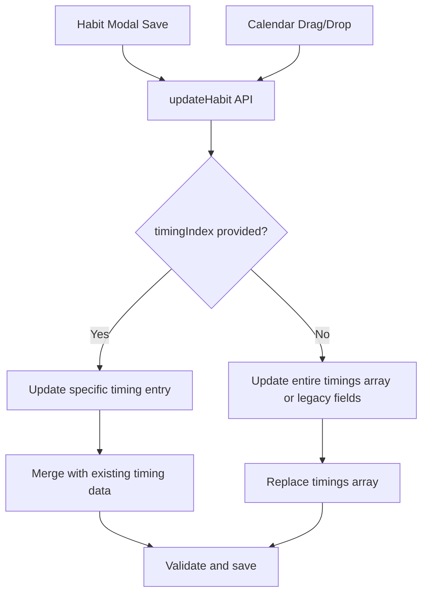

# Design Document

## Overview

This design addresses the critical issue where Habit timing data (Date/Start/End) gets reset to initial values when saving from the Habit modal or performing drag-and-drop operations in the calendar. The root cause is that the backend `updateHabit` function does not properly handle the `timingIndex` parameter, which is essential for updating specific timing entries without affecting others.

The solution involves enhancing the backend API to support selective timing entry updates while maintaining backward compatibility with existing functionality.

## Architecture

The fix involves three main components:

1. **Frontend Event Handling**: Already correctly passes `timingIndex` when available
2. **Backend API Enhancement**: Modify `updateHabit` to handle `timingIndex` parameter
3. **Data Validation**: Ensure timing updates maintain data integrity



## Components and Interfaces

### Enhanced UpdateHabit API Interface

```typescript
interface UpdateHabitPayload {
  // Existing fields
  name?: string;
  active?: boolean;
  count?: number;
  // ... other existing fields
  
  // Timing-related fields
  dueDate?: string;
  time?: string;
  endTime?: string;
  timings?: Timing[];
  outdates?: Timing[];
  
  // New field for selective updates
  timingIndex?: number;
}

interface Timing {
  id?: string;
  type: 'Date' | 'Daily' | 'Weekly' | 'Monthly';
  date?: string;
  start?: string;
  end?: string;
  cron?: string;
}
```

### Backend Processing Logic

The enhanced `updateHabit` function will follow this logic:

1. **Check for timingIndex**: If provided and valid, update only that specific timing entry
2. **Merge timing data**: Combine provided updates with existing timing entry data
3. **Fallback behavior**: If no timingIndex, use existing behavior
4. **Validation**: Ensure data integrity throughout the process

## Data Models

### Timing Entry Update Process

When `timingIndex` is provided:

```typescript
// Current timing entry
const currentTiming = existingHabit.timings[timingIndex];

// Merge updates with existing data
const updatedTiming = {
  ...currentTiming,
  ...(payload.dueDate && { date: payload.dueDate }),
  ...(payload.time && { start: payload.time }),
  ...(payload.endTime && { end: payload.endTime })
};

// Update the specific entry in the array
const updatedTimings = [...existingHabit.timings];
updatedTimings[timingIndex] = updatedTiming;
```

### Database Schema Considerations

The existing database schema supports this enhancement:
- `timings` field stores JSON array of timing objects
- `outdates` field stores JSON array of exclusion timing objects
- Legacy fields (`due_date`, `time`, `end_time`) remain for backward compatibility

## Correctness Properties

*A property is a characteristic or behavior that should hold true across all valid executions of a system-essentially, a formal statement about what the system should do. Properties serve as the bridge between human-readable specifications and machine-verifiable correctness guarantees.*

### Property-Based Testing Overview

Property-based testing validates software correctness by testing universal properties across many generated inputs. Each property is a formal specification that should hold for all valid inputs.

### Core Principles

1. **Universal Quantification**: Every property must contain an explicit "for all" statement
2. **Requirements Traceability**: Each property must reference the requirements it validates
3. **Executable Specifications**: Properties must be implementable as automated tests
4. **Comprehensive Coverage**: Properties should cover all testable acceptance criteria

Based on the prework analysis and property reflection, here are the consolidated correctness properties:

### Property 1: Timing Entry Preservation During Non-Timing Updates
*For any* habit with existing timing entries, when updating non-timing fields (name, notes, etc.), all timing entries should remain exactly unchanged in content and order.
**Validates: Requirements 1.1, 1.3**

### Property 2: Partial Timing Field Updates
*For any* habit and any subset of timing fields being updated, only the explicitly provided fields should change while all other timing fields remain unchanged.
**Validates: Requirements 1.2, 1.4**

### Property 3: Selective Timing Entry Updates
*For any* habit with multiple timing entries and any valid timingIndex, when updating with a timingIndex, only the timing entry at that specific index should be modified while all other timing entries remain unchanged.
**Validates: Requirements 2.1, 2.2, 2.3**

### Property 4: Timing Entry Data Merging
*For any* existing timing entry and any partial update data, the updated timing entry should contain the new values for provided fields and the original values for all unprovided fields.
**Validates: Requirements 3.2, 3.4**

### Property 5: Backward Compatibility Preservation
*For any* habit update without a timingIndex parameter, the system should update legacy time fields and timing arrays according to the original behavior without corrupting existing timing data.
**Validates: Requirements 2.4, 3.5, 4.5**

### Property 6: Timing Entry Structure Preservation
*For any* timing entry update, the resulting timing entry should maintain all required fields (type, date, start, end) and preserve any existing IDs or metadata.
**Validates: Requirements 2.5, 4.4**

### Property 7: Invalid TimingIndex Handling
*For any* habit and any out-of-bounds timingIndex, the update operation should fail gracefully without modifying the timing array and should return an appropriate error.
**Validates: Requirements 3.3**

### Property 8: Date Format Consistency
*For any* timing entry update involving date fields, the resulting dates should follow a consistent format (YYYY-MM-DD) regardless of input format variations.
**Validates: Requirements 4.2**

### Property 9: Time Validation
*For any* timing entry update with both start and end times, the start time should be before the end time, or the system should reject the update with a clear error.
**Validates: Requirements 4.3**

## Error Handling

The system will implement comprehensive error handling for timing updates:

1. **Validation Errors**: Invalid timing data will be rejected with descriptive error messages
2. **Index Bounds Checking**: Out-of-bounds timingIndex values will be handled gracefully
3. **Data Integrity**: All updates will be validated before application
4. **Rollback Capability**: Failed updates will not corrupt existing data

### Error Response Format

```typescript
interface TimingUpdateError {
  code: 'INVALID_TIMING_INDEX' | 'INVALID_TIME_FORMAT' | 'INVALID_DATE_FORMAT' | 'TIME_VALIDATION_ERROR';
  message: string;
  details?: {
    timingIndex?: number;
    providedValue?: any;
    expectedFormat?: string;
  };
}
```

## Testing Strategy

### Dual Testing Approach

The implementation will use both unit tests and property-based tests:

- **Unit tests**: Verify specific examples, edge cases, and error conditions
- **Property tests**: Verify universal properties across all inputs
- Both are complementary and necessary for comprehensive coverage

### Property-Based Testing Configuration

- Use a property-based testing library appropriate for TypeScript/JavaScript (e.g., fast-check)
- Configure each test to run minimum 100 iterations due to randomization
- Each property test must reference its design document property
- Tag format: **Feature: habit-timing-preservation-fix, Property {number}: {property_text}**

### Unit Testing Focus

Unit tests should focus on:
- Specific examples that demonstrate correct behavior
- Integration points between frontend and backend
- Edge cases like empty timing arrays, missing fields
- Error conditions and boundary values

### Test Data Generation

Property tests will use smart generators that:
- Create realistic habit objects with various timing configurations
- Generate valid and invalid timing updates
- Test boundary conditions (empty arrays, maximum array sizes)
- Cover all timing types (Date, Daily, Weekly, Monthly)