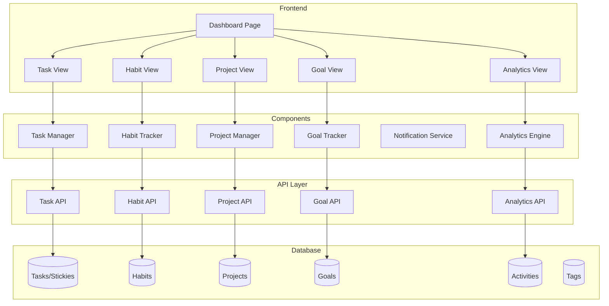

# Design Document: Integrated Productivity System

## Overview

本設計は、既存の習慣管理ダッシュボードを統合生産性システムに拡張するためのアーキテクチャを定義します。

### 設計原則

1. **既存テーブル保持**: Goals, Habits, Activities, Tags, Stickies の既存構造を維持
2. **段階的拡張**: 新しいカラムは nullable または default 値で追加
3. **後方互換性**: 既存 API エンドポイントを維持
4. **モジュラー設計**: 機能ごとに独立したコンポーネント

### 技術スタック

- Frontend: Next.js 16 + React 19 + Tailwind CSS 4
- Backend: Supabase (PostgreSQL + Auth + RLS)
- Visualization: React Flow (マインドマップ), FullCalendar (カレンダー), Recharts (チャート)
- State Management: React Hooks + Context API

## Architecture



## Components and Interfaces

### 1. Task Manager Component

既存の Stickies を拡張してタスク管理機能を提供します。

```typescript
// types/task.ts
interface Task {
  id: string;
  name: string;
  description?: string;
  
  // Eisenhower Matrix
  priority: 'urgent-important' | 'urgent-not-important' | 'not-urgent-important' | 'not-urgent-not-important';
  
  // Dates
  dueDate?: Date;
  completedAt?: Date;
  
  // Status
  completed: boolean;
  
  // Relationships
  parentTaskId?: string;  // サブタスク用
  projectId?: string;
  milestoneId?: string;
  goalId?: string;
  
  // Metadata
  displayOrder: number;
  createdAt: Date;
  updatedAt: Date;
  ownerId: string;
}

interface TaskManagerProps {
  tasks: Task[];
  onCreateTask: (task: Partial<Task>) => Promise<Task>;
  onUpdateTask: (id: string, updates: Partial<Task>) => Promise<Task>;
  onDeleteTask: (id: string) => Promise<void>;
  onCompleteTask: (id: string) => Promise<void>;
}
```

### 2. Habit Tracker Component (拡張)

既存の Habits を拡張してトリガーと Habit Stacking を追加します。

```typescript
// types/habit.ts (拡張)
interface HabitExtension {
  // Trigger (if-then format)
  trigger?: {
    condition: string;  // "IF I finish breakfast"
    action: string;     // "THEN I will meditate"
  };
  
  // Habit Stacking
  stackedAfterHabitId?: string;  // この習慣の後に実行
  stackOrder?: number;
  
  // Streak tracking
  currentStreak: number;
  longestStreak: number;
  lastStreakBrokenAt?: Date;
  
  // Feedback settings
  completionSound?: boolean;
  completionAnimation?: boolean;
}

interface HabitTrackerProps {
  habits: Habit[];
  onHabitComplete: (id: string, amount?: number) => Promise<void>;
  onStreakBroken: (id: string) => void;
  onHabitStackReorder: (habitIds: string[]) => Promise<void>;
}
```

### 3. Project Manager Component

新規コンポーネントとして工程管理機能を提供します。

```typescript
// types/project.ts
interface Project {
  id: string;
  name: string;
  description?: string;
  
  // Objectives
  objectives: string[];
  deliverables: string[];
  
  // Timeline
  startDate?: Date;
  endDate?: Date;
  
  // Status
  status: 'planning' | 'active' | 'on-hold' | 'completed' | 'cancelled';
  progress: number;  // 0-100
  
  // Relationships
  goalId?: string;
  
  // Metadata
  createdAt: Date;
  updatedAt: Date;
  ownerId: string;
}

interface Milestone {
  id: string;
  projectId: string;
  name: string;
  description?: string;
  
  // Target
  targetDate: Date;
  successCriteria: string[];
  
  // Status
  completed: boolean;
  completedAt?: Date;
  
  // Order
  displayOrder: number;
}

interface TaskDependency {
  id: string;
  taskId: string;
  dependsOnTaskId: string;
  type: 'finish-to-start' | 'start-to-start' | 'finish-to-finish';
}

interface ProjectManagerProps {
  projects: Project[];
  milestones: Milestone[];
  tasks: Task[];
  dependencies: TaskDependency[];
  onCreateProject: (project: Partial<Project>) => Promise<Project>;
  onCreateMilestone: (milestone: Partial<Milestone>) => Promise<Milestone>;
  onSetDependency: (dep: Partial<TaskDependency>) => Promise<TaskDependency>;
}
```

### 4. Goal Tracker Component (OKR拡張)

既存の Goals を OKR フレームワーク対応に拡張します。

```typescript
// types/goal.ts (拡張)
interface KeyResult {
  id: string;
  goalId: string;
  name: string;
  
  // Measurement
  targetValue: number;
  currentValue: number;
  unit: string;  // e.g., "%", "件", "時間"
  
  // Progress
  progress: number;  // currentValue / targetValue * 100
  
  // Timeline
  dueDate?: Date;
  
  // Status
  completed: boolean;
}

interface GoalExtension {
  // OKR
  isObjective: boolean;
  keyResults?: KeyResult[];
  
  // KPI
  kpiDefinition?: {
    metric: string;
    aggregation: 'sum' | 'average' | 'count' | 'max' | 'min';
    source: 'habits' | 'tasks' | 'activities';
    filter?: Record<string, any>;
  };
  
  // SMART validation
  smartScore?: {
    specific: boolean;
    measurable: boolean;
    achievable: boolean;
    relevant: boolean;
    timeBound: boolean;
  };
}

interface GoalTrackerProps {
  goals: Goal[];
  keyResults: KeyResult[];
  onCreateKeyResult: (kr: Partial<KeyResult>) => Promise<KeyResult>;
  onUpdateKeyResult: (id: string, updates: Partial<KeyResult>) => Promise<KeyResult>;
  onValidateSMART: (goalId: string) => SmartScore;
}
```

### 5. Analytics Engine Component

データ分析とレポート生成を担当します。

```typescript
// types/analytics.ts
interface ProductivityMetrics {
  // Task metrics
  taskCompletionRate: number;
  tasksCompletedToday: number;
  tasksCompletedThisWeek: number;
  overdueTasksCount: number;
  
  // Habit metrics
  habitConsistencyScore: number;
  currentStreaks: { habitId: string; streak: number }[];
  habitCompletionRateByDay: Record<string, number>;
  
  // Project metrics
  projectProgress: { projectId: string; progress: number }[];
  milestonesCompletedThisMonth: number;
  
  // Goal metrics
  okrProgress: { goalId: string; progress: number }[];
  kpiValues: { kpiId: string; value: number; trend: 'up' | 'down' | 'stable' }[];
}

interface ProductivityPattern {
  bestPerformingDays: string[];  // e.g., ["Monday", "Wednesday"]
  bestPerformingHours: number[]; // e.g., [9, 10, 14]
  averageTasksPerDay: number;
  averageHabitsPerDay: number;
}

interface WeeklyReview {
  weekStartDate: Date;
  weekEndDate: Date;
  
  achievements: string[];
  areasForImprovement: string[];
  
  metrics: ProductivityMetrics;
  patterns: ProductivityPattern;
  
  recommendations: string[];
}

interface AnalyticsEngineProps {
  dateRange: { start: Date; end: Date };
  onGenerateReport: (type: 'daily' | 'weekly' | 'monthly') => Promise<WeeklyReview>;
  onExportData: (format: 'csv' | 'json') => Promise<Blob>;
}
```

### 6. Notification Service

通知とリマインダーを管理します。

```typescript
// types/notification.ts
interface NotificationPreferences {
  // Channels
  enableBrowserNotifications: boolean;
  enableEmailNotifications: boolean;
  
  // Timing
  taskDueReminder: number;  // hours before due
  habitReminder: boolean;
  streakWarning: boolean;
  milestoneReminder: number;  // days before
  
  // Quiet hours
  quietHoursEnabled: boolean;
  quietHoursStart: string;  // "22:00"
  quietHoursEnd: string;    // "07:00"
}

interface Notification {
  id: string;
  type: 'task-due' | 'habit-reminder' | 'streak-warning' | 'milestone-due' | 'goal-progress';
  title: string;
  message: string;
  entityId: string;
  entityType: 'task' | 'habit' | 'milestone' | 'goal';
  scheduledAt: Date;
  sentAt?: Date;
  readAt?: Date;
}

interface NotificationServiceProps {
  preferences: NotificationPreferences;
  onUpdatePreferences: (prefs: Partial<NotificationPreferences>) => Promise<void>;
  onMarkAsRead: (notificationId: string) => Promise<void>;
}
```

## Data Models

### Database Schema Extensions

既存テーブルへの拡張と新規テーブルの追加を行います。

#### 1. Stickies テーブル拡張 → Tasks

```sql
-- 既存の stickies テーブルに新しいカラムを追加
ALTER TABLE stickies ADD COLUMN IF NOT EXISTS priority TEXT DEFAULT 'not-urgent-not-important';
ALTER TABLE stickies ADD COLUMN IF NOT EXISTS due_date TIMESTAMPTZ;
ALTER TABLE stickies ADD COLUMN IF NOT EXISTS parent_task_id TEXT REFERENCES stickies(id);
ALTER TABLE stickies ADD COLUMN IF NOT EXISTS project_id TEXT;
ALTER TABLE stickies ADD COLUMN IF NOT EXISTS milestone_id TEXT;
ALTER TABLE stickies ADD COLUMN IF NOT EXISTS estimated_minutes INTEGER;

-- インデックス追加
CREATE INDEX IF NOT EXISTS idx_stickies_priority ON stickies(priority);
CREATE INDEX IF NOT EXISTS idx_stickies_due_date ON stickies(due_date);
CREATE INDEX IF NOT EXISTS idx_stickies_parent_task ON stickies(parent_task_id);
CREATE INDEX IF NOT EXISTS idx_stickies_project ON stickies(project_id);
```

#### 2. Habits テーブル拡張

```sql
-- 既存の habits テーブルに新しいカラムを追加
ALTER TABLE habits ADD COLUMN IF NOT EXISTS trigger_condition TEXT;
ALTER TABLE habits ADD COLUMN IF NOT EXISTS trigger_action TEXT;
ALTER TABLE habits ADD COLUMN IF NOT EXISTS stacked_after_habit_id TEXT REFERENCES habits(id);
ALTER TABLE habits ADD COLUMN IF NOT EXISTS stack_order INTEGER;
ALTER TABLE habits ADD COLUMN IF NOT EXISTS current_streak INTEGER DEFAULT 0;
ALTER TABLE habits ADD COLUMN IF NOT EXISTS longest_streak INTEGER DEFAULT 0;
ALTER TABLE habits ADD COLUMN IF NOT EXISTS last_streak_broken_at TIMESTAMPTZ;
ALTER TABLE habits ADD COLUMN IF NOT EXISTS completion_sound BOOLEAN DEFAULT false;
ALTER TABLE habits ADD COLUMN IF NOT EXISTS completion_animation BOOLEAN DEFAULT true;

-- インデックス追加
CREATE INDEX IF NOT EXISTS idx_habits_stacked_after ON habits(stacked_after_habit_id);
CREATE INDEX IF NOT EXISTS idx_habits_current_streak ON habits(current_streak);
```

#### 3. Goals テーブル拡張 (OKR対応)

```sql
-- 既存の goals テーブルに新しいカラムを追加
ALTER TABLE goals ADD COLUMN IF NOT EXISTS is_objective BOOLEAN DEFAULT false;
ALTER TABLE goals ADD COLUMN IF NOT EXISTS kpi_metric TEXT;
ALTER TABLE goals ADD COLUMN IF NOT EXISTS kpi_aggregation TEXT;
ALTER TABLE goals ADD COLUMN IF NOT EXISTS kpi_source TEXT;
ALTER TABLE goals ADD COLUMN IF NOT EXISTS kpi_filter JSONB;
ALTER TABLE goals ADD COLUMN IF NOT EXISTS smart_specific BOOLEAN;
ALTER TABLE goals ADD COLUMN IF NOT EXISTS smart_measurable BOOLEAN;
ALTER TABLE goals ADD COLUMN IF NOT EXISTS smart_achievable BOOLEAN;
ALTER TABLE goals ADD COLUMN IF NOT EXISTS smart_relevant BOOLEAN;
ALTER TABLE goals ADD COLUMN IF NOT EXISTS smart_time_bound BOOLEAN;
```

#### 4. 新規: Key Results テーブル

```sql
CREATE TABLE IF NOT EXISTS key_results (
    id TEXT PRIMARY KEY DEFAULT gen_random_uuid()::text,
    goal_id TEXT NOT NULL REFERENCES goals(id) ON DELETE CASCADE,
    name TEXT NOT NULL,
    target_value NUMERIC NOT NULL,
    current_value NUMERIC DEFAULT 0,
    unit TEXT DEFAULT '',
    due_date TIMESTAMPTZ,
    completed BOOLEAN DEFAULT false,
    completed_at TIMESTAMPTZ,
    display_order INTEGER DEFAULT 0,
    owner_type TEXT,
    owner_id TEXT,
    created_at TIMESTAMPTZ NOT NULL DEFAULT now(),
    updated_at TIMESTAMPTZ NOT NULL DEFAULT now()
);

-- インデックス
CREATE INDEX IF NOT EXISTS idx_key_results_goal ON key_results(goal_id);
CREATE INDEX IF NOT EXISTS idx_key_results_owner ON key_results(owner_type, owner_id);

-- RLS
ALTER TABLE key_results ENABLE ROW LEVEL SECURITY;
CREATE POLICY "Users can access own key results" ON key_results
    FOR ALL USING (
        owner_type = 'user' AND owner_id = auth.uid()::text
        OR owner_type IS NULL
    );
```

#### 5. 新規: Projects テーブル

```sql
CREATE TABLE IF NOT EXISTS projects (
    id TEXT PRIMARY KEY DEFAULT gen_random_uuid()::text,
    name TEXT NOT NULL,
    description TEXT,
    objectives JSONB DEFAULT '[]',
    deliverables JSONB DEFAULT '[]',
    start_date TIMESTAMPTZ,
    end_date TIMESTAMPTZ,
    status TEXT DEFAULT 'planning',
    progress INTEGER DEFAULT 0,
    goal_id TEXT REFERENCES goals(id) ON DELETE SET NULL,
    owner_type TEXT,
    owner_id TEXT,
    created_at TIMESTAMPTZ NOT NULL DEFAULT now(),
    updated_at TIMESTAMPTZ NOT NULL DEFAULT now()
);

-- インデックス
CREATE INDEX IF NOT EXISTS idx_projects_status ON projects(status);
CREATE INDEX IF NOT EXISTS idx_projects_goal ON projects(goal_id);
CREATE INDEX IF NOT EXISTS idx_projects_owner ON projects(owner_type, owner_id);

-- RLS
ALTER TABLE projects ENABLE ROW LEVEL SECURITY;
CREATE POLICY "Users can access own projects" ON projects
    FOR ALL USING (
        owner_type = 'user' AND owner_id = auth.uid()::text
        OR owner_type IS NULL
    );
```

#### 6. 新規: Milestones テーブル

```sql
CREATE TABLE IF NOT EXISTS milestones (
    id TEXT PRIMARY KEY DEFAULT gen_random_uuid()::text,
    project_id TEXT NOT NULL REFERENCES projects(id) ON DELETE CASCADE,
    name TEXT NOT NULL,
    description TEXT,
    target_date TIMESTAMPTZ,
    success_criteria JSONB DEFAULT '[]',
    completed BOOLEAN DEFAULT false,
    completed_at TIMESTAMPTZ,
    display_order INTEGER DEFAULT 0,
    owner_type TEXT,
    owner_id TEXT,
    created_at TIMESTAMPTZ NOT NULL DEFAULT now(),
    updated_at TIMESTAMPTZ NOT NULL DEFAULT now()
);

-- インデックス
CREATE INDEX IF NOT EXISTS idx_milestones_project ON milestones(project_id);
CREATE INDEX IF NOT EXISTS idx_milestones_target_date ON milestones(target_date);
CREATE INDEX IF NOT EXISTS idx_milestones_owner ON milestones(owner_type, owner_id);

-- RLS
ALTER TABLE milestones ENABLE ROW LEVEL SECURITY;
CREATE POLICY "Users can access own milestones" ON milestones
    FOR ALL USING (
        owner_type = 'user' AND owner_id = auth.uid()::text
        OR owner_type IS NULL
    );
```

#### 7. 新規: Task Dependencies テーブル

```sql
CREATE TABLE IF NOT EXISTS task_dependencies (
    id TEXT PRIMARY KEY DEFAULT gen_random_uuid()::text,
    task_id TEXT NOT NULL REFERENCES stickies(id) ON DELETE CASCADE,
    depends_on_task_id TEXT NOT NULL REFERENCES stickies(id) ON DELETE CASCADE,
    dependency_type TEXT DEFAULT 'finish-to-start',
    owner_type TEXT,
    owner_id TEXT,
    created_at TIMESTAMPTZ NOT NULL DEFAULT now(),
    UNIQUE(task_id, depends_on_task_id)
);

-- インデックス
CREATE INDEX IF NOT EXISTS idx_task_deps_task ON task_dependencies(task_id);
CREATE INDEX IF NOT EXISTS idx_task_deps_depends_on ON task_dependencies(depends_on_task_id);

-- RLS
ALTER TABLE task_dependencies ENABLE ROW LEVEL SECURITY;
CREATE POLICY "Users can access own task dependencies" ON task_dependencies
    FOR ALL USING (
        owner_type = 'user' AND owner_id = auth.uid()::text
        OR owner_type IS NULL
    );
```

#### 8. 新規: Notification Preferences テーブル

```sql
CREATE TABLE IF NOT EXISTS notification_preferences (
    id TEXT PRIMARY KEY DEFAULT gen_random_uuid()::text,
    enable_browser BOOLEAN DEFAULT true,
    enable_email BOOLEAN DEFAULT false,
    task_due_reminder_hours INTEGER DEFAULT 24,
    habit_reminder BOOLEAN DEFAULT true,
    streak_warning BOOLEAN DEFAULT true,
    milestone_reminder_days INTEGER DEFAULT 3,
    quiet_hours_enabled BOOLEAN DEFAULT false,
    quiet_hours_start TEXT DEFAULT '22:00',
    quiet_hours_end TEXT DEFAULT '07:00',
    owner_type TEXT,
    owner_id TEXT,
    created_at TIMESTAMPTZ NOT NULL DEFAULT now(),
    updated_at TIMESTAMPTZ NOT NULL DEFAULT now(),
    UNIQUE(owner_type, owner_id)
);

-- RLS
ALTER TABLE notification_preferences ENABLE ROW LEVEL SECURITY;
CREATE POLICY "Users can access own notification preferences" ON notification_preferences
    FOR ALL USING (
        owner_type = 'user' AND owner_id = auth.uid()::text
        OR owner_type IS NULL
    );
```

