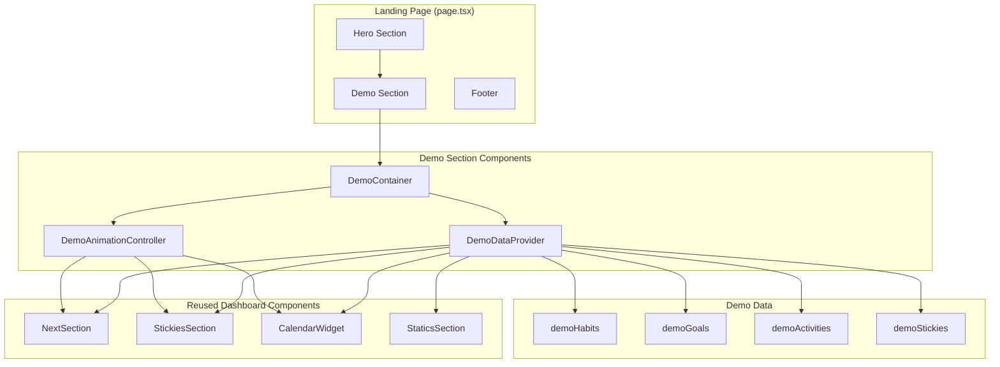

# Design Document: Landing Page Demo

## Overview

本設計ドキュメントは、VOWアプリケーションのランディングページにインタラクティブなデモセクションを追加する機能の技術設計を定義します。このデモは実際のダッシュボードコンポーネントを再利用し、静的なテストデータと自動再生アニメーションによってユーザーに典型的な操作フローを紹介します。

### 設計原則

1. **レイアウトの完全一致**: 実際のダッシュボードと同じコンポーネント配置・スペーシングを維持
2. **コンポーネント再利用**: 既存のダッシュボードコンポーネントをそのまま使用
3. **パフォーマンス優先**: 遅延読み込みとコード分割による初期ロード最適化
4. **アクセシビリティ**: prefers-reduced-motionの尊重とセマンティックHTML

## Architecture

### システム構成図



### ファイル構成

```
frontend/
├── app/
│   ├── page.tsx                          # ランディングページ（更新）
│   └── demo/
│       ├── components/
│       │   ├── Section.Demo.tsx          # デモセクションコンテナ
│       │   ├── DemoAnimationController.tsx # アニメーション制御
│       │   └── DemoOverlay.tsx           # インタラクション表示オーバーレイ
│       ├── data/
│       │   └── demoData.ts               # 静的デモデータ
│       └── hooks/
│           └── useDemoAnimation.ts       # アニメーション制御フック
```

## Components and Interfaces

### 1. DemoDataProvider

デモ用の静的データを提供するコンテキストプロバイダー。

```typescript
interface DemoDataContextValue {
  habits: Habit[];
  goals: Goal[];
  activities: Activity[];
  stickies: Sticky[];
  // アニメーション状態
  animationState: DemoAnimationState;
  // ハンドラー（デモ用のモック）
  onHabitAction: (habitId: string, action: HabitAction, amount?: number) => void;
  onStickyCreate: () => void;
  onStickyComplete: (stickyId: string) => void;
}

interface DemoAnimationState {
  currentStep: number;
  isPlaying: boolean;
  isPaused: boolean;
  highlightedElement: string | null;
  cursorPosition: { x: number; y: number } | null;
}
```

### 2. DemoAnimationController

アニメーションシーケンスを制御するコンポーネント。

```typescript
interface AnimationStep {
  id: string;
  type: 'highlight' | 'click' | 'input' | 'scroll' | 'wait';
  target?: string;  // CSS selector or element ID
  duration: number; // milliseconds
  description: string;
  action?: () => void;
}

interface DemoAnimationControllerProps {
  steps: AnimationStep[];
  onStepChange: (step: number) => void;
  onComplete: () => void;
  isPaused: boolean;
}
```

### 3. Section.Demo

デモセクションのメインコンテナ。

```typescript
interface DemoSectionProps {
  className?: string;
}

// CSS transform scaleを使用してダッシュボードを縮小表示
// 実際のダッシュボードと同じレイアウトを維持
```

### 4. DemoOverlay

アニメーション中のカーソルやハイライトを表示するオーバーレイ。

```typescript
interface DemoOverlayProps {
  cursorPosition: { x: number; y: number } | null;
  highlightedElement: string | null;
  isVisible: boolean;
}
```

## Data Models

### デモデータ構造

```typescript
// frontend/app/demo/data/demoData.ts

export const demoGoals: Goal[] = [
  {
    id: 'demo-goal-1',
    name: '健康的な生活',
    details: '毎日の運動と健康的な食事を心がける',
    dueDate: null,
    parentId: null,
    isCompleted: false,
    createdAt: '2024-01-01T00:00:00Z',
    updatedAt: '2024-01-01T00:00:00Z',
  },
  {
    id: 'demo-goal-2',
    name: 'スキルアップ',
    details: '新しい技術を学び、キャリアを発展させる',
    dueDate: null,
    parentId: null,
    isCompleted: false,
    createdAt: '2024-01-01T00:00:00Z',
    updatedAt: '2024-01-01T00:00:00Z',
  },
];

export const demoHabits: Habit[] = [
  {
    id: 'demo-habit-1',
    goalId: 'demo-goal-1',
    name: '朝の運動',
    active: true,
    type: 'do',
    count: 0,
    must: 1,
    completed: false,
    dueDate: getTodayString(),
    time: '07:00',
    endTime: '07:30',
    repeat: 'Daily',
    workloadUnit: '回',
    workloadTotal: 1,
    workloadPerCount: 1,
    timings: [{ type: 'Daily', start: '07:00', end: '07:30' }],
    createdAt: '2024-01-01T00:00:00Z',
    updatedAt: '2024-01-01T00:00:00Z',
  },
  {
    id: 'demo-habit-2',
    goalId: 'demo-goal-2',
    name: '読書',
    active: true,
    type: 'do',
    count: 0,
    must: 30,
    completed: false,
    dueDate: getTodayString(),
    time: '21:00',
    endTime: '21:30',
    repeat: 'Daily',
    workloadUnit: '分',
    workloadTotal: 30,
    workloadPerCount: 30,
    timings: [{ type: 'Daily', start: '21:00', end: '21:30' }],
    createdAt: '2024-01-01T00:00:00Z',
    updatedAt: '2024-01-01T00:00:00Z',
  },
  {
    id: 'demo-habit-3',
    goalId: 'demo-goal-1',
    name: '瞑想',
    active: true,
    type: 'do',
    count: 0,
    must: 10,
    completed: false,
    dueDate: getTodayString(),
    time: '06:30',
    endTime: '06:40',
    repeat: 'Daily',
    workloadUnit: '分',
    workloadTotal: 10,
    workloadPerCount: 10,
    timings: [{ type: 'Daily', start: '06:30', end: '06:40' }],
    createdAt: '2024-01-01T00:00:00Z',
    updatedAt: '2024-01-01T00:00:00Z',
  },
];

export const demoActivities: Activity[] = [
  // 過去7日分のアクティビティデータを生成
  ...generatePastActivities(demoHabits, 7),
];

export const demoStickies: Sticky[] = [
  {
    id: 'demo-sticky-1',
    name: '買い物リスト',
    description: '牛乳、パン、卵',
    completed: false,
    displayOrder: 0,
    createdAt: '2024-01-01T00:00:00Z',
    updatedAt: '2024-01-01T00:00:00Z',
  },
  {
    id: 'demo-sticky-2',
    name: 'ミーティング準備',
    description: '資料を確認する',
    completed: false,
    displayOrder: 1,
    createdAt: '2024-01-01T00:00:00Z',
    updatedAt: '2024-01-01T00:00:00Z',
  },
];
```

### アニメーションシーケンス定義

```typescript
export const demoAnimationSequence: AnimationStep[] = [
  // Step 1: 習慣完了フロー
  {
    id: 'highlight-next-section',
    type: 'highlight',
    target: '#demo-next-section',
    duration: 1500,
    description: 'Nextセクションをハイライト',
  },
  {
    id: 'move-to-complete-button',
    type: 'highlight',
    target: '#demo-habit-1-complete',
    duration: 1000,
    description: '完了ボタンに移動',
  },
  {
    id: 'click-complete-button',
    type: 'click',
    target: '#demo-habit-1-complete',
    duration: 500,
    description: '完了ボタンをクリック',
    action: () => { /* 習慣完了アクション */ },
  },
  {
    id: 'wait-after-complete',
    type: 'wait',
    duration: 1000,
    description: '完了後の待機',
  },
  
  // Step 2: 付箋作成フロー
  {
    id: 'highlight-stickies-section',
    type: 'highlight',
    target: '#demo-stickies-section',
    duration: 1500,
    description: 'Sticky\'nセクションをハイライト',
  },
  {
    id: 'click-add-sticky',
    type: 'click',
    target: '#demo-add-sticky',
    duration: 500,
    description: '付箋追加ボタンをクリック',
    action: () => { /* 付箋追加アクション */ },
  },
  {
    id: 'wait-after-sticky',
    type: 'wait',
    duration: 1500,
    description: '付箋追加後の待機',
  },
  
  // Step 3: カレンダー操作
  {
    id: 'highlight-calendar',
    type: 'highlight',
    target: '#demo-calendar-section',
    duration: 1500,
    description: 'カレンダーセクションをハイライト',
  },
  {
    id: 'click-week-view',
    type: 'click',
    target: '#demo-calendar-week-btn',
    duration: 500,
    description: '週表示ボタンをクリック',
    action: () => { /* カレンダービュー切り替え */ },
  },
  {
    id: 'wait-end',
    type: 'wait',
    duration: 2000,
    description: 'ループ前の待機',
  },
];
```

## Correctness Properties

*A property is a characteristic or behavior that should hold true across all valid executions of a system-essentially, a formal statement about what the system should do. Properties serve as the bridge between human-readable specifications and machine-verifiable correctness guarantees.*


Based on the prework analysis, the following properties have been identified:

### Property 1: Demo Data Completeness

*For any* demo data module, the exported data SHALL contain:
- At least 3 habits with Japanese names (containing Japanese characters)
- At least 2 goals with Japanese names
- Activities covering the past 7 days
- At least 2 stickies
- Valid timing data (HH:MM format) for all habits

**Validates: Requirements 1.1, 1.2, 1.3, 1.4, 1.6**

### Property 2: Layout Structure Consistency

*For any* rendered Demo_Section, the component hierarchy and CSS class structure SHALL match the actual dashboard (frontend/app/dashboard/page.tsx):
- Same grid layout classes
- Same component ordering (NextSection, StickiesSection, CalendarWidget, StaticsSection)
- CSS transform scale applied to container
- Same Tailwind breakpoint classes for responsiveness

**Validates: Requirements 2.2, 2.3, 2.4, 2.7**

### Property 3: API Isolation

*For any* rendering of the Demo_Section, zero API calls SHALL be made. All data SHALL come from static demo data imports.

**Validates: Requirements 3.5, 3.6**

### Property 4: Animation Loop Continuity

*For any* completed animation sequence, the animation SHALL restart from the beginning, creating a continuous loop. The transition between end and start SHALL be smooth (no visual jumps).

**Validates: Requirements 4.5**

### Property 5: Animation Interaction Response

*For any* user interaction (hover or touch) on the Demo_Section:
- The animation SHALL pause immediately
- After 3 seconds of no interaction, the animation SHALL resume from the paused position

**Validates: Requirements 4.7, 4.8**

### Property 6: Reduced Motion Respect

*For any* system with prefers-reduced-motion: reduce, the Demo_Animation SHALL be disabled and a static view SHALL be displayed instead.

**Validates: Requirements 5.2**

### Property 7: Touch Target Accessibility

*For any* interactive element within the Demo_Section, the element SHALL have minimum dimensions of 44x44 pixels.

**Validates: Requirements 5.3**

### Property 8: Design System Compliance

*For any* CSS class used in the Demo_Section:
- Color classes SHALL use CSS variables (bg-background, text-foreground, etc.)
- Spacing classes SHALL follow 8px scale (p-2, p-4, p-6, p-8)
- Border-radius classes SHALL use design system values (rounded-sm, rounded-md, rounded-lg)
- Shadow classes SHALL use design system values (shadow-sm, shadow-md, shadow-lg)
- Dark mode SHALL be supported through class strategy

**Validates: Requirements 6.1, 6.2, 6.3, 6.4, 6.5, 6.6**

## Error Handling

### 1. コンポーネント読み込みエラー

```typescript
// Suspense境界とエラーバウンダリを使用
<ErrorBoundary fallback={<DemoFallback />}>
  <Suspense fallback={<DemoSkeleton />}>
    <DemoSection />
  </Suspense>
</ErrorBoundary>
```

エラー発生時は静的なスクリーンショット画像またはプレースホルダーを表示。

### 2. アニメーションエラー

アニメーション中にエラーが発生した場合：
- エラーをログに記録
- アニメーションを停止
- 静的な状態で表示を継続

```typescript
const handleAnimationError = (error: Error) => {
  console.error('Demo animation error:', error);
  setAnimationState({ ...animationState, isPlaying: false, isPaused: true });
};
```

### 3. データ検証エラー

デモデータが型定義に合致しない場合：
- TypeScriptコンパイル時にエラーを検出
- ランタイムでは型ガードを使用して検証

```typescript
function isValidHabit(data: unknown): data is Habit {
  return (
    typeof data === 'object' &&
    data !== null &&
    'id' in data &&
    'name' in data &&
    'goalId' in data
  );
}
```

## Testing Strategy

### ユニットテスト

1. **デモデータ検証テスト**
   - データ構造の検証
   - 必須フィールドの存在確認
   - 日本語コンテンツの確認

2. **コンポーネントレンダリングテスト**
   - 各ダッシュボードコンポーネントがデモデータで正しくレンダリングされることを確認
   - エラーバウンダリの動作確認

3. **アニメーション制御テスト**
   - アニメーションステップの順序確認
   - 一時停止/再開の動作確認
   - ループ動作の確認

### プロパティベーステスト

プロパティベーステストには **fast-check** ライブラリを使用します。

各プロパティテストは最低100回のイテレーションで実行します。

```typescript
// テストタグ形式
// Feature: landing-page-demo, Property N: [property_text]
```

**Property 1: Demo Data Completeness**
- 任意のデモデータに対して、必須項目が存在することを検証

**Property 2: Layout Structure Consistency**
- レンダリング結果のDOM構造が期待通りであることを検証

**Property 3: API Isolation**
- fetch/APIモックを使用して、API呼び出しがゼロであることを検証

**Property 4: Animation Loop Continuity**
- アニメーション完了後に再開することを検証

**Property 5: Animation Interaction Response**
- インタラクションイベントに対する応答を検証

**Property 6: Reduced Motion Respect**
- メディアクエリに応じたアニメーション無効化を検証

**Property 7: Touch Target Accessibility**
- インタラクティブ要素のサイズを検証

**Property 8: Design System Compliance**
- 使用されているCSSクラスがデザインシステムに準拠していることを検証

### 統合テスト

1. **ランディングページ統合テスト**
   - デモセクションがヒーローセクションの下に表示されることを確認
   - レスポンシブ動作の確認

2. **アクセシビリティテスト**
   - axe-coreを使用したアクセシビリティ検証
   - キーボードナビゲーションの確認

### E2Eテスト（オプション）

Playwrightを使用した視覚的回帰テスト：
- デモセクションのスクリーンショット比較
- アニメーション動作の確認
