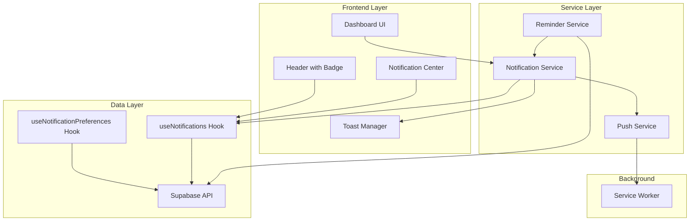
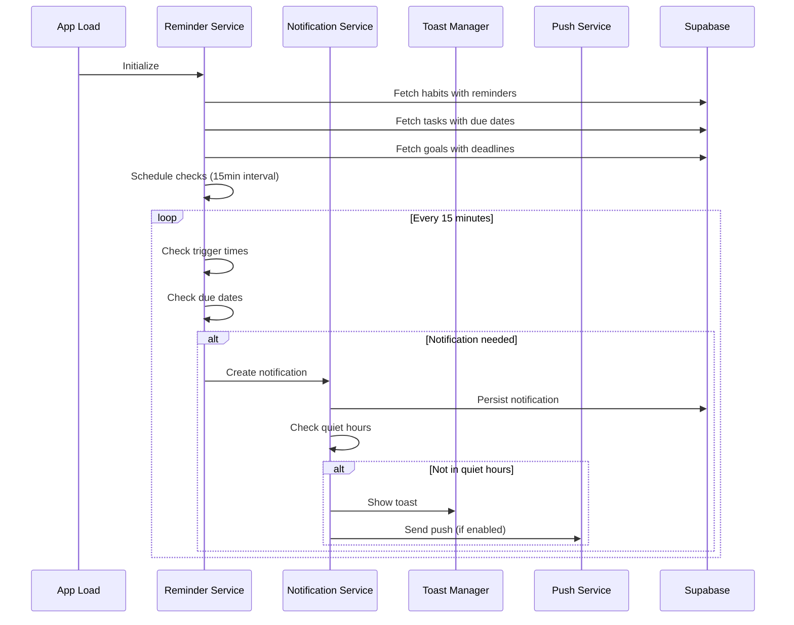

# Design Document: Notification Reminders

## Overview

This design document describes the architecture and implementation approach for the notification and reminder system in the habit management dashboard. The system enables users to set habit trigger reminders using implementation intentions, receive due date notifications for tasks and goals, manage notification preferences, and view notification history.

The notification system follows a client-side scheduling approach with Supabase as the persistence layer. Notifications are scheduled and triggered on the client when the app is active, with browser push notifications providing coverage when the app is in the background.

### Key Design Decisions

1. **Client-Side Scheduling**: Notifications are scheduled and triggered on the client using `setInterval` and `setTimeout`. This avoids the complexity of server-side cron jobs while providing adequate coverage for a personal productivity app.

2. **Service Worker for Push**: Browser push notifications use a service worker to handle background delivery and click events.

3. **Unified Notification Model**: All notification types (habit reminders, task due, goal deadline) share a common data model and display mechanism.

4. **Quiet Hours Enforcement**: Quiet hours are enforced at the notification dispatch level, not at the scheduling level, to ensure consistent behavior.

## Architecture



### Component Interaction Flow



## Components and Interfaces

### 1. Notification Service (`useNotificationService`)

The central service coordinating notification creation, display, and persistence.

```typescript
interface NotificationService {
  // Create and dispatch a notification
  createNotification(params: CreateNotificationParams): Promise<Notification>;
  
  // Mark notification(s) as read
  markAsRead(notificationId: string): Promise<void>;
  markAllAsRead(): Promise<void>;
  
  // Get unread count
  getUnreadCount(): number;
  
  // Check if currently in quiet hours
  isQuietHours(): boolean;
  
  // Navigate to entity from notification
  navigateToEntity(notification: Notification): void;
}

interface CreateNotificationParams {
  type: NotificationType;
  title: string;
  message: string;
  entityType?: EntityType;
  entityId?: string;
  showToast?: boolean;
  sendPush?: boolean;
}
```

### 2. Reminder Service (`useReminderService`)

Monitors habits, tasks, and goals to generate timely notifications.

```typescript
interface ReminderService {
  // Initialize and start monitoring
  initialize(): void;
  
  // Stop monitoring (cleanup)
  cleanup(): void;
  
  // Force check (e.g., on app focus)
  checkNow(): Promise<void>;
  
  // Get next scheduled check time
  getNextCheckTime(): Date;
}

// Internal scheduling state
interface ScheduledReminder {
  entityType: EntityType;
  entityId: string;
  scheduledTime: Date;
  notificationType: NotificationType;
  lastNotified?: Date;
}
```

### 3. Push Service (`usePushService`)

Handles browser push notification registration and delivery.

```typescript
interface PushService {
  // Request permission and register
  requestPermission(): Promise<PermissionState>;
  
  // Check current permission status
  getPermissionStatus(): PermissionState;
  
  // Send a push notification
  sendPush(notification: Notification): Promise<void>;
  
  // Check if push is supported
  isSupported(): boolean;
}

type PermissionState = 'granted' | 'denied' | 'default';
```

### 4. Notification Center Component

UI component for viewing and managing notification history.

```typescript
interface NotificationCenterProps {
  isOpen: boolean;
  onClose: () => void;
}

// Internal state
interface NotificationCenterState {
  notifications: Notification[];
  loading: boolean;
  hasMore: boolean;
  page: number;
}
```

### 5. Notification Preferences Panel

UI component for managing notification settings.

```typescript
interface NotificationPreferencesPanelProps {
  preferences: NotificationPreferences;
  onUpdate: (updates: Partial<NotificationPreferences>) => void;
}
```

### 6. Habit Form Extensions

Extensions to the existing HabitForm component.

```typescript
// Additional fields for habit trigger settings
interface HabitTriggerFields {
  triggerTime: string | null;      // HH:MM format
  triggerMessage: string | null;   // Custom reminder message
  reminderEnabled: boolean;
}
```

## Data Models

### Notification

```typescript
type NotificationType = 
  | 'habit_reminder'
  | 'task_due_tomorrow'
  | 'task_due_today'
  | 'task_overdue'
  | 'goal_deadline_week'
  | 'goal_deadline_tomorrow'
  | 'milestone_due_tomorrow';

type EntityType = 'habit' | 'sticky' | 'goal' | 'milestone';

interface Notification {
  id: string;
  ownerType: string;
  ownerId: string;
  type: NotificationType;
  title: string;
  message: string;
  entityType: EntityType | null;
  entityId: string | null;
  read: boolean;
  createdAt: string;
}

interface CreateNotificationPayload {
  type: NotificationType;
  title: string;
  message: string;
  entityType?: EntityType;
  entityId?: string;
}
```

### Notification Preferences

```typescript
interface NotificationPreferences {
  id: string;
  ownerType: string;
  ownerId: string;
  habitRemindersEnabled: boolean;
  taskDueRemindersEnabled: boolean;
  goalDeadlineRemindersEnabled: boolean;
  quietHoursStart: string | null;  // HH:MM format
  quietHoursEnd: string | null;    // HH:MM format
  pushEnabled: boolean;
  createdAt: string;
  updatedAt: string;
}

interface UpdatePreferencesPayload {
  habitRemindersEnabled?: boolean;
  taskDueRemindersEnabled?: boolean;
  goalDeadlineRemindersEnabled?: boolean;
  quietHoursStart?: string | null;
  quietHoursEnd?: string | null;
  pushEnabled?: boolean;
}
```

### Habit Extensions

```typescript
// Extended Habit interface (additions to existing)
interface HabitWithTrigger extends Habit {
  triggerTime: string | null;      // TIME stored as HH:MM
  triggerMessage: string | null;
  reminderEnabled: boolean;
}
```

### Database Schema

```sql
-- Extend habits table
ALTER TABLE habits ADD COLUMN trigger_time TIME;
ALTER TABLE habits ADD COLUMN trigger_message TEXT;
ALTER TABLE habits ADD COLUMN reminder_enabled BOOLEAN DEFAULT FALSE;

-- Notification preferences table
CREATE TABLE notification_preferences (
  id TEXT PRIMARY KEY DEFAULT gen_random_uuid()::text,
  owner_type TEXT NOT NULL,
  owner_id TEXT NOT NULL,
  habit_reminders_enabled BOOLEAN DEFAULT TRUE,
  task_due_reminders_enabled BOOLEAN DEFAULT TRUE,
  goal_deadline_reminders_enabled BOOLEAN DEFAULT TRUE,
  quiet_hours_start TIME,
  quiet_hours_end TIME,
  push_enabled BOOLEAN DEFAULT FALSE,
  created_at TIMESTAMP WITH TIME ZONE DEFAULT NOW(),
  updated_at TIMESTAMP WITH TIME ZONE DEFAULT NOW(),
  UNIQUE(owner_type, owner_id)
);

-- Notifications table
CREATE TABLE notifications (
  id TEXT PRIMARY KEY DEFAULT gen_random_uuid()::text,
  owner_type TEXT NOT NULL,
  owner_id TEXT NOT NULL,
  type TEXT NOT NULL,
  title TEXT NOT NULL,
  message TEXT NOT NULL,
  entity_type TEXT,
  entity_id TEXT,
  read BOOLEAN DEFAULT FALSE,
  created_at TIMESTAMP WITH TIME ZONE DEFAULT NOW()
);

-- Indexes
CREATE INDEX idx_notifications_owner ON notifications(owner_type, owner_id);
CREATE INDEX idx_notifications_created ON notifications(created_at DESC);
CREATE INDEX idx_notifications_read ON notifications(owner_type, owner_id, read);
CREATE INDEX idx_habits_reminder ON habits(reminder_enabled) WHERE reminder_enabled = TRUE;

-- RLS Policies
ALTER TABLE notification_preferences ENABLE ROW LEVEL SECURITY;
ALTER TABLE notifications ENABLE ROW LEVEL SECURITY;

CREATE POLICY "Users can manage own notification preferences"
  ON notification_preferences FOR ALL
  USING (owner_type = 'user' AND owner_id = auth.uid()::text);

CREATE POLICY "Users can manage own notifications"
  ON notifications FOR ALL
  USING (owner_type = 'user' AND owner_id = auth.uid()::text);

-- Guest policies
CREATE POLICY "Guests can manage own notification preferences"
  ON notification_preferences FOR ALL
  USING (owner_type = 'guest');

CREATE POLICY "Guests can manage own notifications"
  ON notifications FOR ALL
  USING (owner_type = 'guest');
```


## Correctness Properties

*A property is a characteristic or behavior that should hold true across all valid executions of a system—essentially, a formal statement about what the system should do. Properties serve as the bridge between human-readable specifications and machine-verifiable correctness guarantees.*

### Property 1: Trigger Time Persistence Round-Trip

*For any* valid time value set as a habit's trigger_time, saving and then retrieving the habit should return the same trigger_time value.

**Validates: Requirements 1.2**

### Property 2: Reminder Scheduling Consistency

*For any* habit with reminder_enabled set to true and a valid trigger_time, the Reminder Service should have that habit scheduled for notification at the specified time.

**Validates: Requirements 1.3**

### Property 3: Custom Message Propagation

*For any* habit with a non-empty trigger_message, when a reminder notification is created for that habit, the notification message should contain the trigger_message content.

**Validates: Requirements 1.4**

### Property 4: Disabled Reminder Exclusion

*For any* habit with reminder_enabled set to false, the Reminder Service should not create any reminder notifications for that habit regardless of trigger_time.

**Validates: Requirements 1.7**

### Property 5: Unique Preferences Constraint

*For any* owner (user or guest), attempting to create a second notification_preferences record with the same owner_type and owner_id should fail, ensuring exactly one preferences record per owner.

**Validates: Requirements 2.6**

### Property 6: Quiet Hours Suppression

*For any* notification triggered at a time T, if T falls between quiet_hours_start and quiet_hours_end in the user's preferences, the notification should not be displayed (toast) or sent (push).

**Validates: Requirements 3.2, 7.6**

### Property 7: Preference-Based Notification Filtering

*For any* notification type (habit_reminder, task_due_*, goal_deadline_*, milestone_due_*), if the corresponding preference (habit_reminders_enabled, task_due_reminders_enabled, goal_deadline_reminders_enabled) is false, no notifications of that type should be created.

**Validates: Requirements 3.4, 5.5, 6.5**

### Property 8: Preference Persistence Immediacy

*For any* update to notification preferences, immediately querying the preferences should return the updated values.

**Validates: Requirements 3.5**

### Property 9: Toast Content Integrity

*For any* notification that is triggered and displayed as a toast, the toast should contain the notification's title and message fields.

**Validates: Requirements 4.1**

### Property 10: Notification Navigation Consistency

*For any* notification with a non-null entityType and entityId, clicking the notification (toast or in center) should navigate to the correct entity view.

**Validates: Requirements 4.3, 8.3**

### Property 11: Unread Badge Accuracy

*For any* set of notifications where N notifications have read=false, the badge indicator should display the count N.

**Validates: Requirements 4.4**

### Property 12: Date Grouping Correctness

*For any* set of notifications displayed in the Notification Center, notifications with the same creation date should be grouped together, and groups should be ordered by date descending.

**Validates: Requirements 4.6**

### Property 13: Task Due Notification Type Selection

*For any* task with a due_date:
- If due_date is exactly 24 hours from now (±1 hour tolerance), notification type should be 'task_due_tomorrow'
- If due_date is today, notification type should be 'task_due_today'
- If due_date is in the past, notification type should be 'task_overdue'

**Validates: Requirements 5.1, 5.2, 5.3**

### Property 14: Task Notification Content Completeness

*For any* task due notification, the message should contain both the task name and the formatted due date.

**Validates: Requirements 5.4**

### Property 15: Goal/Milestone Notification Type Selection

*For any* goal with a deadline or milestone with a due_date:
- If deadline/due_date is 7 days away (±12 hours tolerance), notification type should be 'goal_deadline_week'
- If deadline/due_date is 1 day away (±1 hour tolerance), notification type should be 'goal_deadline_tomorrow' or 'milestone_due_tomorrow'

**Validates: Requirements 6.1, 6.2, 6.3**

### Property 16: Goal Notification Content Completeness

*For any* goal deadline notification, the message should contain the goal name, formatted deadline, and current progress percentage.

**Validates: Requirements 6.4**

### Property 17: Push Notification Dispatch

*For any* notification triggered when push_enabled is true and browser permission is granted, a browser push notification should be sent with matching title and message.

**Validates: Requirements 7.3**

### Property 18: Unread Visual Distinction

*For any* notification displayed in the Notification Center, if read=false, it should have a visually distinct style (e.g., different background color) compared to notifications with read=true.

**Validates: Requirements 8.2**

### Property 19: Mark As Read State Change

*For any* notification with read=false, after calling markAsRead with that notification's id, the notification's read field should be true.

**Validates: Requirements 8.3**

### Property 20: Mark All As Read Bulk Update

*For any* set of notifications belonging to a user, after calling markAllAsRead, all notifications should have read=true.

**Validates: Requirements 8.4**

### Property 21: Trigger Time Matching

*For any* habit with reminder_enabled=true and trigger_time=T, when the current time matches T (within 1-minute tolerance), a habit_reminder notification should be created.

**Validates: Requirements 9.2**

### Property 22: Duplicate Prevention (Idempotence)

*For any* event (habit trigger, task due, goal deadline), creating a notification for that event should be idempotent within a 24-hour window—calling the creation logic multiple times should result in at most one notification.

**Validates: Requirements 9.6**

### Property 23: API Filter Correctness

*For any* filter criteria (type, read status, date range) applied to the notifications API, all returned notifications should match the specified criteria, and no matching notifications should be excluded.

**Validates: Requirements 10.6**

## Error Handling

### Notification Creation Errors

| Error Condition | Handling Strategy |
|----------------|-------------------|
| Database write failure | Retry up to 3 times with exponential backoff; log error; show toast with retry option |
| Invalid notification data | Validate before creation; reject with descriptive error |
| Missing entity reference | Allow null entityType/entityId; notification still displays but without navigation |

### Push Notification Errors

| Error Condition | Handling Strategy |
|----------------|-------------------|
| Permission denied | Store push_enabled=false; show in-app guidance for enabling |
| Service worker registration failure | Fall back to in-app notifications only; log error |
| Push send failure | Log error; notification still shown in-app |

### Preference Errors

| Error Condition | Handling Strategy |
|----------------|-------------------|
| Preferences not found | Create default preferences automatically |
| Update conflict | Use optimistic update with rollback on failure |
| Invalid time format | Validate HH:MM format; reject invalid values |

### Reminder Service Errors

| Error Condition | Handling Strategy |
|----------------|-------------------|
| Failed to fetch entities | Retry on next interval; log error |
| Timezone detection failure | Default to UTC; allow manual timezone setting |
| Interval timer failure | Re-initialize on app focus |

## Testing Strategy

### Unit Tests

Unit tests focus on specific examples, edge cases, and error conditions:

1. **Notification Service**
   - Creating notification with all fields
   - Creating notification with minimal fields
   - Marking single notification as read
   - Marking all notifications as read
   - Quiet hours boundary conditions (start time, end time, midnight crossing)

2. **Reminder Service**
   - Trigger time matching at exact time
   - Due date calculations (tomorrow, today, overdue)
   - Deadline calculations (7 days, 1 day)
   - Duplicate prevention within 24 hours

3. **Push Service**
   - Permission request flow
   - Service worker registration
   - Push payload formatting

4. **Preferences**
   - Default preferences creation
   - Preference update persistence
   - Quiet hours validation

### Property-Based Tests

Property-based tests verify universal properties across generated inputs. Each test should run minimum 100 iterations.

1. **Feature: notification-reminders, Property 1: Trigger Time Persistence Round-Trip**
   - Generate random valid TIME values
   - Set as trigger_time, save, retrieve
   - Assert retrieved value equals original

2. **Feature: notification-reminders, Property 5: Unique Preferences Constraint**
   - Generate random owner identifiers
   - Attempt to create duplicate preferences
   - Assert second creation fails

3. **Feature: notification-reminders, Property 6: Quiet Hours Suppression**
   - Generate random quiet hours ranges and notification times
   - Assert notifications within range are suppressed

4. **Feature: notification-reminders, Property 11: Unread Badge Accuracy**
   - Generate random sets of notifications with varying read states
   - Assert badge count equals count of read=false

5. **Feature: notification-reminders, Property 13: Task Due Notification Type Selection**
   - Generate random due dates relative to current time
   - Assert correct notification type is selected

6. **Feature: notification-reminders, Property 22: Duplicate Prevention (Idempotence)**
   - Generate random events
   - Call creation multiple times
   - Assert only one notification exists

7. **Feature: notification-reminders, Property 23: API Filter Correctness**
   - Generate random notification sets and filter criteria
   - Assert all returned notifications match criteria

### Integration Tests

1. **End-to-End Notification Flow**
   - Create habit with trigger time
   - Simulate time passage
   - Verify notification created and displayed

2. **Preference Changes**
   - Update preferences
   - Verify notification behavior changes accordingly

3. **Push Notification Flow**
   - Enable push notifications
   - Trigger notification
   - Verify push sent (mock service worker)

### Test Configuration

- Property-based testing library: **fast-check** (TypeScript)
- Minimum iterations per property test: 100
- Test runner: Jest with React Testing Library
- Mock strategy: Mock Supabase client, browser APIs (Notification, ServiceWorker)
