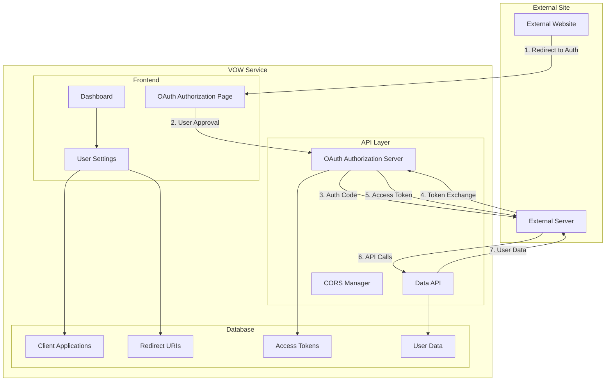
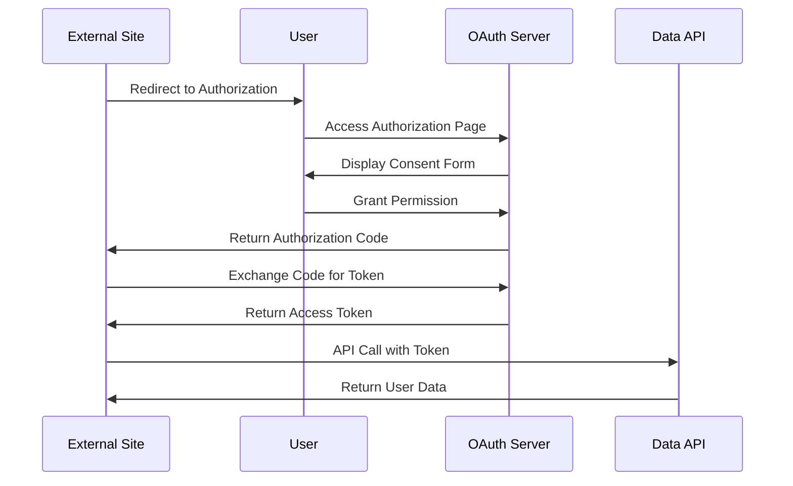

# Design Document

## Overview

OAuth 2.0認可コードフローを実装し、ダッシュボード内でユーザーがリダイレクト先を管理できる機能を設計する。既存のembed機能を拡張し、外部サイトでのセキュアなマッシュアップ表示を実現する。

**技術仕様**: Node.js v22.18.0の最新機能を活用し、OAuth識別子にはbase64url エンコーディング（RFC 4648 Section 5）を採用してURL安全性とセキュリティを両立する。

## Architecture

### システム構成図



### OAuth 2.0フロー詳細



## Components and Interfaces

### 1. OAuth Authorization Server

**責任**: OAuth 2.0プロトコルの実装とトークン管理

**主要メソッド**:
```typescript
interface OAuthServer {
  // 認可エンドポイント
  authorize(params: AuthorizeParams): Promise<AuthorizeResponse>
  
  // トークンエンドポイント
  token(params: TokenParams): Promise<TokenResponse>
  
  // トークン検証
  validateToken(token: string): Promise<TokenValidation>
  
  // トークン取り消し
  revokeToken(token: string): Promise<void>
  
  // Base64url エンコーディング/デコーディング
  encodeBase64url(data: Buffer): string
  decodeBase64url(encoded: string): Buffer
}

interface AuthorizeParams {
  client_id: string // base64url エンコード済み
  redirect_uri: string
  response_type: 'code'
  scope?: string
  state?: string
  code_challenge: string // パブリッククライアントでは必須
  code_challenge_method: 'S256' // S256のみ許可
}

interface TokenParams {
  grant_type: 'authorization_code' | 'refresh_token'
  code?: string // base64url エンコード済み認可コード
  refresh_token?: string // base64url エンコード済みリフレッシュトークン
  client_id: string // base64url エンコード済み
  client_secret?: string // confidentialクライアントのみ（base64url エンコード済み）
  redirect_uri?: string
  code_verifier: string // PKCE必須
}
```

### 2. Client Application Manager

**責任**: 外部アプリケーションの登録と管理

```typescript
interface ClientApplicationManager {
  // アプリケーション作成
  createApplication(params: CreateAppParams): Promise<ClientApplication>
  
  // アプリケーション一覧取得
  getApplications(userId: string): Promise<ClientApplication[]>
  
  // アプリケーション更新
  updateApplication(appId: string, params: UpdateAppParams): Promise<ClientApplication>
  
  // アプリケーション削除
  deleteApplication(appId: string): Promise<void>
  
  // 認証統計取得
  getAuthStats(appId: string): Promise<AuthStats>
}

interface ClientApplication {
  id: string
  user_id: string
  name: string
  description: string
  client_id: string // base64url エンコード済み
  client_secret: string // base64url エンコード済み
  redirect_uris: string[]
  created_at: Date
  updated_at: Date
}
```

### 3. Redirect URI Manager

**責任**: リダイレクトURIの管理とバリデーション

```typescript
interface RedirectURIManager {
  // URI追加
  addRedirectURI(appId: string, uri: string): Promise<RedirectURI>
  
  // URI一覧取得
  getRedirectURIs(appId: string): Promise<RedirectURI[]>
  
  // URI更新
  updateRedirectURI(uriId: string, uri: string): Promise<RedirectURI>
  
  // URI削除
  deleteRedirectURI(uriId: string): Promise<void>
  
  // URI検証
  validateURI(uri: string): Promise<ValidationResult>
}

interface RedirectURI {
  id: string
  application_id: string
  uri: string
  is_active: boolean
  created_at: Date
}
```

### 4. Dashboard User Settings UI

**責任**: ダッシュボード内のOAuth設定管理UI

```typescript
interface UserSettingsUI {
  // 設定ページ表示
  renderSettingsPage(): JSX.Element
  
  // OAuth設定タブ
  renderOAuthSettings(): JSX.Element
  
  // アプリケーション管理
  renderApplicationManager(): JSX.Element
  
  // リダイレクトURI管理
  renderRedirectURIManager(): JSX.Element
}

// ダッシュボードサイドバー拡張
interface SidebarExtension {
  // ユーザー設定アイコン追加（左下）
  addUserSettingsIcon(): void
}
```

### 5. CORS Manager

**責任**: 動的CORS設定管理

```typescript
interface CORSManager {
  // 許可オリジン追加
  addAllowedOrigin(origin: string): Promise<void>
  
  // 許可オリジン削除
  removeAllowedOrigin(origin: string): Promise<void>
  
  // オリジン検証
  validateOrigin(origin: string): boolean
  
  // CORS ヘッダー生成
  generateCORSHeaders(origin: string): Record<string, string>
}
```

## Data Models

### Database Schema

```sql
-- クライアントアプリケーション
CREATE TABLE oauth_client_applications (
  id UUID PRIMARY KEY DEFAULT gen_random_uuid(),
  user_id UUID NOT NULL REFERENCES auth.users(id) ON DELETE CASCADE,
  name VARCHAR(255) NOT NULL,
  description TEXT,
  client_id VARCHAR(255) UNIQUE NOT NULL, -- base64url エンコード済み
  client_secret_hash VARCHAR(255) NOT NULL, -- bcryptハッシュ化（base64url エンコード済みシークレットの）
  client_type VARCHAR(20) NOT NULL DEFAULT 'confidential', -- 'public' or 'confidential'
  salt VARCHAR(255) NOT NULL,
  created_at TIMESTAMP WITH TIME ZONE DEFAULT NOW(),
  updated_at TIMESTAMP WITH TIME ZONE DEFAULT NOW(),
  
  CONSTRAINT unique_app_name_per_user UNIQUE(user_id, name),
  CONSTRAINT valid_client_type CHECK (client_type IN ('public', 'confidential'))
);

-- リダイレクトURI
CREATE TABLE oauth_redirect_uris (
  id UUID PRIMARY KEY DEFAULT gen_random_uuid(),
  application_id UUID NOT NULL REFERENCES oauth_client_applications(id) ON DELETE CASCADE,
  uri VARCHAR(2048) NOT NULL,
  is_active BOOLEAN DEFAULT true,
  created_at TIMESTAMP WITH TIME ZONE DEFAULT NOW(),
  
  CONSTRAINT unique_uri_per_app UNIQUE(application_id, uri)
);

-- 認可コード
CREATE TABLE oauth_authorization_codes (
  id UUID PRIMARY KEY DEFAULT gen_random_uuid(),
  code VARCHAR(255) UNIQUE NOT NULL, -- base64url エンコード済み
  client_id VARCHAR(255) NOT NULL, -- base64url エンコード済み
  user_id UUID NOT NULL REFERENCES auth.users(id) ON DELETE CASCADE,
  redirect_uri VARCHAR(2048) NOT NULL,
  scope VARCHAR(255),
  code_challenge VARCHAR(255), -- PKCE: パブリッククライアントでは必須
  code_challenge_method VARCHAR(10) DEFAULT 'S256', -- S256のみ許可
  expires_at TIMESTAMP WITH TIME ZONE NOT NULL DEFAULT (NOW() + INTERVAL '1 minute'), -- 1分に短縮
  used_at TIMESTAMP WITH TIME ZONE,
  is_used BOOLEAN DEFAULT false, -- 使用済みフラグ追加
  created_at TIMESTAMP WITH TIME ZONE DEFAULT NOW(),
  
  CONSTRAINT valid_challenge_method CHECK (code_challenge_method = 'S256' OR code_challenge_method IS NULL)
);

-- アクセストークン
CREATE TABLE oauth_access_tokens (
  id UUID PRIMARY KEY DEFAULT gen_random_uuid(),
  token_hash VARCHAR(255) UNIQUE NOT NULL, -- base64url エンコード済みトークンのハッシュ
  refresh_token_hash VARCHAR(255) UNIQUE, -- base64url エンコード済みリフレッシュトークンのハッシュ
  client_id VARCHAR(255) NOT NULL, -- base64url エンコード済み
  user_id UUID NOT NULL REFERENCES auth.users(id) ON DELETE CASCADE,
  scope VARCHAR(255),
  expires_at TIMESTAMP WITH TIME ZONE NOT NULL DEFAULT (NOW() + INTERVAL '15 minutes'), -- 15分に短縮
  refresh_expires_at TIMESTAMP WITH TIME ZONE DEFAULT (NOW() + INTERVAL '30 days'),
  created_at TIMESTAMP WITH TIME ZONE DEFAULT NOW(),
  revoked_at TIMESTAMP WITH TIME ZONE,
  last_used_at TIMESTAMP WITH TIME ZONE -- 最終使用時刻追加
);

-- 認証ログ（改ざん防止強化）
CREATE TABLE oauth_auth_logs (
  id UUID PRIMARY KEY DEFAULT gen_random_uuid(),
  client_id VARCHAR(255),
  user_id UUID REFERENCES auth.users(id) ON DELETE SET NULL,
  action VARCHAR(50) NOT NULL, -- 'authorize', 'token', 'revoke'
  ip_address INET,
  user_agent_hash VARCHAR(255), -- User-Agentハッシュ化
  success BOOLEAN NOT NULL,
  error_message TEXT,
  log_hash VARCHAR(255) NOT NULL, -- ログ改ざん防止ハッシュ
  previous_log_hash VARCHAR(255), -- チェーン化
  created_at TIMESTAMP WITH TIME ZONE DEFAULT NOW()
);

-- レート制限テーブル追加
CREATE TABLE oauth_rate_limits (
  id UUID PRIMARY KEY DEFAULT gen_random_uuid(),
  identifier VARCHAR(255) NOT NULL, -- IP address or client_id
  endpoint VARCHAR(100) NOT NULL, -- 'authorize', 'token', 'api'
  request_count INTEGER DEFAULT 1,
  window_start TIMESTAMP WITH TIME ZONE DEFAULT NOW(),
  created_at TIMESTAMP WITH TIME ZONE DEFAULT NOW(),
  updated_at TIMESTAMP WITH TIME ZONE DEFAULT NOW(),
  
  CONSTRAINT unique_rate_limit UNIQUE(identifier, endpoint, window_start)
);
```

### TypeScript型定義

```typescript
// OAuth関連の型定義
export interface OAuthClientApplication {
  id: string
  user_id: string
  name: string
  description: string | null
  client_id: string // base64url エンコード済み
  client_secret_hash: string // base64url エンコード済みシークレットのハッシュ
  client_type: 'public' | 'confidential' // クライアントタイプ追加
  salt: string // ソルト追加
  created_at: string
  updated_at: string
  redirect_uris?: OAuthRedirectURI[]
}

export interface OAuthRedirectURI {
  id: string
  application_id: string
  uri: string
  is_active: boolean
  created_at: string
}

export interface OAuthAuthorizationCode {
  id: string
  code: string // base64url エンコード済み
  client_id: string // base64url エンコード済み
  user_id: string
  redirect_uri: string
  scope: string | null
  code_challenge: string | null // パブリッククライアントでは必須
  code_challenge_method: 'S256' | null // S256のみ許可
  expires_at: string // 1分に短縮
  used_at: string | null
  is_used: boolean // 使用済みフラグ
  created_at: string
}

export interface OAuthAccessToken {
  id: string
  token_hash: string // base64url エンコード済みトークンのハッシュ
  refresh_token_hash: string | null // base64url エンコード済みリフレッシュトークンのハッシュ
  client_id: string // base64url エンコード済み
  user_id: string
  scope: string | null
  expires_at: string // 15分に短縮
  refresh_expires_at: string | null
  created_at: string
  revoked_at: string | null
  last_used_at: string | null // 最終使用時刻
}
```

## Correctness Properties

*A property is a characteristic or behavior that should hold true across all valid executions of a system-essentially, a formal statement about what the system should do. Properties serve as the bridge between human-readable specifications and machine-verifiable correctness guarantees.*

### Property Reflection

After reviewing all properties identified in the prework analysis, I've identified several areas where properties can be consolidated to eliminate redundancy and provide more comprehensive validation:

**Consolidation Opportunities:**
- Properties 1.1-1.5 (OAuth flow steps) can be combined into comprehensive OAuth flow properties
- Properties 2.2, 2.5, 4.1, 4.4 (URI validation) overlap and can be consolidated
- Properties 3.4, 8.4 (token invalidation) test the same underlying mechanism
- Properties 5.1-5.4 (API access control) can be combined into comprehensive API security properties
- Properties 6.1-6.2 (CORS management) can be combined into CORS lifecycle properties

**Unique Value Properties:**
Each remaining property provides distinct validation value for different aspects of the OAuth system, from security controls to UI behavior to data management.

## Correctness Properties

Based on the prework analysis and property reflection, the following properties validate the OAuth redirect management system:

### Property 1: OAuth Authorization Flow Integrity
*For any* valid OAuth authorization request with registered client_id and redirect_uri, the complete authorization flow (redirect → approval → code → token) should result in a valid access token that allows API access
**Validates: Requirements 1.1, 1.2, 1.3, 1.4**

### Property 2: URI Validation and Security
*For any* redirect URI, it should be accepted if and only if it matches exactly with a registered URI, follows proper format rules, meets environment-specific security requirements (HTTPS in production), and has no fragment identifiers
**Validates: Requirements 2.2, 2.5, 4.1, 4.4**

### Property 3: Client Application Uniqueness and Security
*For any* user, creating multiple client applications should result in unique client_ids, hashed client_secrets with unique salts, and application names, with no collisions across the system
**Validates: Requirements 3.1, 3.5**

### Property 4: Token Lifecycle and Security Management
*For any* issued access token, it should be hashed for storage, have appropriate short expiration times (15 minutes), be invalidated when the parent application is revoked, and be automatically cleaned up when expired
**Validates: Requirements 8.1, 8.2, 3.4, 8.4, 8.5**

### Property 5: API Access Control with Rate Limiting
*For any* API request, access should be granted if and only if a valid, non-expired token with appropriate scope is provided, rate limits are not exceeded, otherwise returning appropriate error codes (401, 429)
**Validates: Requirements 5.1, 5.2, 5.3, 5.4, 5.5**

### Property 6: CORS Domain Management
*For any* redirect URI registration or removal, the corresponding domain should be automatically added to or removed from CORS allowed origins, and API requests should be validated against these origins
**Validates: Requirements 6.1, 6.2, 6.3**

### Property 7: Resource Limits Enforcement
*For any* user, the system should enforce the maximum limit of 10 redirect URIs per user and implement rate limiting per client application with specific limits (10/min for auth, 5/min for token, 1000/hour for API)
**Validates: Requirements 2.6, 5.5**

### Property 8: PKCE Security Enhancement
*For any* OAuth flow using public clients, PKCE with S256 method should be mandatory, and the code challenge and verifier should be properly validated using SHA256 hashing
**Validates: Requirements 4.5**

### Property 9: Authorization Revocation Cascade
*For any* authorization revocation (user or application level), all related tokens should be immediately invalidated, marked as revoked in the database, and the user should lose API access
**Validates: Requirements 3.4, 8.4**

### Property 10: Audit Logging Completeness and Integrity
*For any* OAuth-related action (authorization, token exchange, revocation), appropriate audit logs should be created with hash-based integrity protection and sufficient detail for security monitoring
**Validates: Requirements 4.6**

### Property 11: Authorization Code Security
*For any* authorization code, it should expire within 1 minute, be usable only once, and be immediately marked as used after exchange to prevent replay attacks
**Validates: Requirements 1.2, 1.3, 4.4**

### Property 12: Client Secret Security
*For any* client secret, it should be stored as a bcrypt hash with unique salt, never stored in plaintext, and verified using constant-time comparison to prevent timing attacks
**Validates: Requirements 3.1, 4.2**

### Property 13: Base64url URL Safety and Encoding Integrity
*For any* OAuth identifier (authorization codes, access tokens, client IDs), it should be base64url encoded for URL safety, decodable without padding issues, and contain no URL-unsafe characters (+, /, =)
**Validates: Requirements 1.6, 3.6**

## Error Handling

### OAuth Error Responses
- **Invalid Client**: Return `invalid_client` error for unregistered client_id
- **Invalid Redirect URI**: Return `invalid_request` error for mismatched redirect_uri
- **Invalid Grant**: Return `invalid_grant` error for expired or used authorization codes
- **Invalid Scope**: Return `invalid_scope` error for unsupported scope values
- **Access Denied**: Return `access_denied` error when user denies authorization

### API Error Responses
- **401 Unauthorized**: Missing or invalid access token
- **403 Forbidden**: Valid token but insufficient scope
- **429 Too Many Requests**: Rate limit exceeded
- **400 Bad Request**: Malformed request parameters

### UI Error Handling
- **Form Validation**: Real-time validation with clear error messages
- **Network Errors**: Graceful handling with retry options
- **Loading States**: Clear feedback during async operations
- **Fallback UI**: Degraded functionality when services are unavailable

## Testing Strategy

### Dual Testing Approach
The system requires both unit tests and property-based tests for comprehensive coverage:

**Unit Tests** focus on:
- Specific OAuth flow examples and edge cases
- Error condition handling and validation
- UI component behavior and integration points
- Database operations and constraints

**Property-Based Tests** focus on:
- Universal OAuth protocol compliance across all inputs
- Security properties that must hold for any valid request
- Data integrity and consistency across operations
- Performance characteristics under various loads

### Property-Based Testing Configuration
- **Testing Framework**: Use `fast-check` for TypeScript property-based testing
- **Test Iterations**: Minimum 100 iterations per property test
- **Test Tagging**: Each property test must reference its design document property
- **Tag Format**: `**Feature: oauth-redirect-management, Property {number}: {property_text}**`

### Testing Coverage Requirements
- **OAuth Protocol Compliance**: All standard OAuth 2.0 flows and error cases
- **Security Validation**: Token security, PKCE implementation, audit logging
- **Data Management**: CRUD operations for applications and redirect URIs
- **UI Integration**: Dashboard settings page and user interactions
- **API Security**: Access control, rate limiting, CORS validation

### Integration Testing
- **End-to-End OAuth Flows**: Complete authorization code flow testing
- **External Site Simulation**: Mock external sites for integration testing
- **Database Consistency**: Multi-table operations and referential integrity
- **Performance Testing**: Load testing for token validation and API access

### 6. Rate Limiter

**責任**: API呼び出しのレート制限管理

```typescript
interface RateLimiter {
  // レート制限チェック
  checkRateLimit(identifier: string, endpoint: string): Promise<RateLimitResult>
  
  // レート制限記録
  recordRequest(identifier: string, endpoint: string): Promise<void>
  
  // レート制限リセット
  resetRateLimit(identifier: string, endpoint: string): Promise<void>
}

interface RateLimitResult {
  allowed: boolean
  remaining: number
  resetTime: Date
  retryAfter?: number
}

interface RateLimitConfig {
  authorize: {
    limit: 10
    window: 60 // 1分
  }
  token: {
    limit: 5
    window: 60 // 1分
  }
  api: {
    limit: 1000
    window: 3600 // 1時間
  }
}
```

### 7. Security Manager

**責任**: セキュリティ機能の統合管理

```typescript
interface SecurityManager {
  // Client Secret ハッシュ化
  hashClientSecret(secret: string): Promise<{hash: string, salt: string}>
  
  // Client Secret 検証
  verifyClientSecret(secret: string, hash: string, salt: string): Promise<boolean>
  
  // PKCE 検証
  verifyPKCE(challenge: string, verifier: string, method: 'S256'): boolean
  
  // 認可コード使用済みチェック
  validateAuthorizationCode(code: string): Promise<AuthCodeValidation>
  
  // 監査ログ作成
  createAuditLog(action: string, details: AuditLogDetails): Promise<void>
}

interface AuthCodeValidation {
  isValid: boolean
  isUsed: boolean
  isExpired: boolean
  clientId: string
  userId: string
}

interface AuditLogDetails {
  clientId?: string
  userId?: string
  ipAddress: string
  userAgent: string
  success: boolean
  errorMessage?: string
}
```

### 8. Base64url Encoder/Decoder

**責任**: OAuth識別子のURL安全エンコーディング

```typescript
interface Base64urlManager {
  // Base64url エンコーディング
  encode(data: Buffer | string): string
  
  // Base64url デコーディング
  decode(encoded: string): Buffer
  
  // ランダムトークン生成（base64url エンコード済み）
  generateToken(length: number): string
  
  // クライアントID生成（base64url エンコード済み）
  generateClientId(): string
  
  // 認可コード生成（base64url エンコード済み）
  generateAuthorizationCode(): string
  
  // アクセストークン生成（base64url エンコード済み）
  generateAccessToken(): string
}

// Node.js v22.18.0 の Buffer.from() と Buffer.toString() を活用
class Base64urlManagerImpl implements Base64urlManager {
  encode(data: Buffer | string): string {
    const buffer = typeof data === 'string' ? Buffer.from(data, 'utf8') : data
    return buffer
      .toString('base64')
      .replace(/\+/g, '-')
      .replace(/\//g, '_')
      .replace(/=/g, '')
  }
  
  decode(encoded: string): Buffer {
    // パディング復元
    const padded = encoded + '='.repeat((4 - encoded.length % 4) % 4)
    const base64 = padded.replace(/-/g, '+').replace(/_/g, '/')
    return Buffer.from(base64, 'base64')
  }
  
  generateToken(length: number = 32): string {
    const randomBytes = crypto.randomBytes(length)
    return this.encode(randomBytes)
  }
  
  generateClientId(): string {
    return this.generateToken(16) // 128-bit
  }
  
  generateAuthorizationCode(): string {
    return this.generateToken(32) // 256-bit
  }
  
  generateAccessToken(): string {
    return this.generateToken(32) // 256-bit
  }
}
```