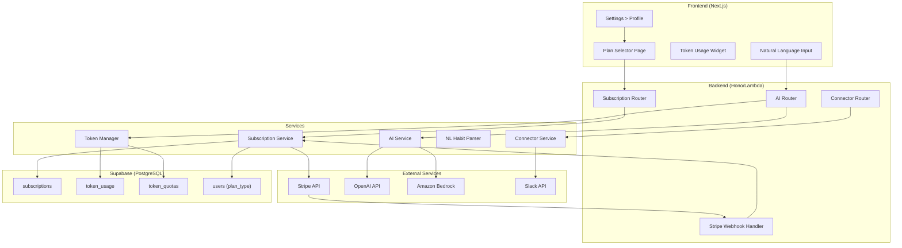
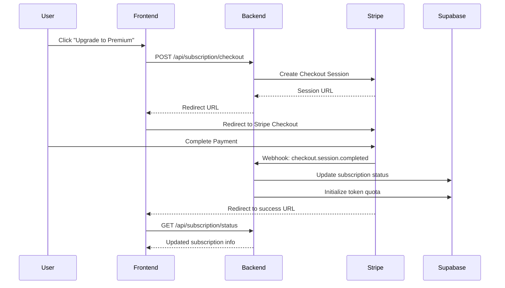
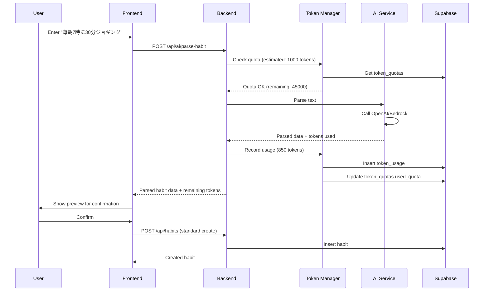
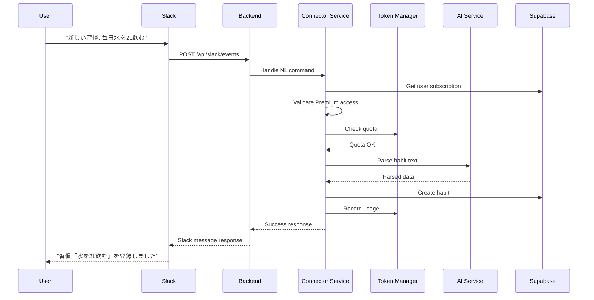

# Design Document: Premium Subscription & AI Features

## Overview

本設計書は、VOW習慣管理アプリにおける有料サブスクリプション機能とAI機能の技術設計を定義します。Stripe決済連携、自然言語によるHabit/Goal操作、トークン使用量管理、およびSlack/ChatGPTコネクタを実装します。

### 設計原則

1. **予算超過防止**: 従量課金を使用せず、固定月額プランのみ提供
2. **既存機能との統合**: 既存のSlack連携、認証システムとシームレスに統合
3. **スケーラビリティ**: AWS Lambda + Supabaseアーキテクチャを活用
4. **セキュリティ**: Stripe署名検証、トークン暗号化、RLSポリシー適用

## Architecture.



## Components and Interfaces

### 1. Frontend Components

#### 1.1 Plan Selector Page (`frontend/app/settings/subscription/page.tsx`)

```typescript
interface PlanSelectorProps {
  currentPlan: 'free' | 'premium_basic' | 'premium_pro';
  subscription: SubscriptionInfo | null;
  tokenUsage: TokenUsageInfo;
}

interface SubscriptionInfo {
  id: string;
  planType: 'free' | 'premium_basic' | 'premium_pro';
  status: 'active' | 'canceled' | 'past_due';
  currentPeriodStart: string;
  currentPeriodEnd: string;
  stripeCustomerId: string;
}

interface TokenUsageInfo {
  monthlyQuota: number;
  usedQuota: number;
  resetAt: string;
  estimatedOperations: number;
}
```

#### 1.2 Token Usage Widget (`frontend/app/dashboard/components/Widget.TokenUsage.tsx`)

```typescript
interface TokenUsageWidgetProps {
  usage: TokenUsageInfo;
  onUpgradeClick: () => void;
}
```

#### 1.3 Natural Language Input (`frontend/app/dashboard/components/Form.NLHabit.tsx`)

```typescript
interface NLHabitFormProps {
  onSubmit: (result: ParsedHabitData) => void;
  isPremium: boolean;
  remainingTokens: number;
}

interface ParsedHabitData {
  name: string;
  type: 'do' | 'avoid';
  frequency?: 'daily' | 'weekly' | 'monthly';
  triggerTime?: string;
  goalId?: string;
  confidence: number;
}
```

### 2. Backend Routers

#### 2.1 Subscription Router (`backend/src/routers/subscription.ts`)

```typescript
// POST /api/subscription/checkout
interface CreateCheckoutRequest {
  planType: 'premium_basic' | 'premium_pro';
  successUrl: string;
  cancelUrl: string;
}

interface CreateCheckoutResponse {
  checkoutUrl: string;
  sessionId: string;
}

// GET /api/subscription/status
interface SubscriptionStatusResponse {
  subscription: SubscriptionInfo | null;
  tokenUsage: TokenUsageInfo;
}

// POST /api/subscription/portal
interface CustomerPortalResponse {
  portalUrl: string;
}

// POST /api/subscription/cancel
interface CancelSubscriptionResponse {
  success: boolean;
  cancelAt: string;
}
```

#### 2.2 AI Router (`backend/src/routers/ai.ts`)

```typescript
// POST /api/ai/parse-habit
interface ParseHabitRequest {
  text: string;
  context?: {
    existingHabits?: string[];
    existingGoals?: string[];
  };
}

interface ParseHabitResponse {
  parsed: ParsedHabitData;
  tokensUsed: number;
  remainingTokens: number;
}

// POST /api/ai/edit-habit
interface EditHabitRequest {
  text: string;
  habitId?: string;
}

interface EditHabitResponse {
  targetHabitId: string;
  changes: Partial<Habit>;
  tokensUsed: number;
  remainingTokens: number;
}
```

#### 2.3 Stripe Webhook Handler (`backend/src/routers/stripeWebhook.ts`)

```typescript
// POST /api/webhooks/stripe
// Handles: checkout.session.completed, invoice.paid, 
//          invoice.payment_failed, customer.subscription.deleted
```

### 3. Services

#### 3.1 Subscription Service (`backend/src/services/subscriptionService.ts`)

```typescript
interface SubscriptionService {
  createCheckoutSession(userId: string, planType: string): Promise<Stripe.Checkout.Session>;
  handleCheckoutCompleted(session: Stripe.Checkout.Session): Promise<void>;
  handleInvoicePaid(invoice: Stripe.Invoice): Promise<void>;
  handlePaymentFailed(invoice: Stripe.Invoice): Promise<void>;
  handleSubscriptionDeleted(subscription: Stripe.Subscription): Promise<void>;
  getSubscriptionStatus(userId: string): Promise<SubscriptionInfo | null>;
  createCustomerPortalSession(userId: string): Promise<string>;
  cancelSubscription(userId: string): Promise<void>;
}
```

#### 3.2 Token Manager (`backend/src/services/tokenManager.ts`)

```typescript
interface TokenManager {
  checkQuota(userId: string, estimatedTokens: number): Promise<QuotaCheckResult>;
  recordUsage(userId: string, feature: string, tokensUsed: number): Promise<void>;
  getUsage(userId: string): Promise<TokenUsageInfo>;
  resetQuota(userId: string, planType: string): Promise<void>;
  sendWarningNotification(userId: string, percentage: number): Promise<void>;
}

interface QuotaCheckResult {
  allowed: boolean;
  remainingTokens: number;
  resetAt: string;
  message?: string;
}
```

#### 3.3 AI Service (`backend/src/services/aiService.ts`)

```typescript
interface AIService {
  parseHabitFromText(text: string, context?: ParseContext): Promise<AIParseResult>;
  parseEditCommand(text: string, existingHabits: Habit[]): Promise<AIEditResult>;
  getProvider(): 'openai' | 'bedrock';
}

interface AIParseResult {
  parsed: ParsedHabitData;
  tokensUsed: number;
  rawResponse: string;
}

interface AIEditResult {
  targetHabitId: string | null;
  candidates: Array<{ habitId: string; similarity: number }>;
  changes: Partial<Habit>;
  tokensUsed: number;
}
```

#### 3.4 NL Habit Parser (`backend/src/services/nlHabitParser.ts`)

```typescript
interface NLHabitParser {
  parse(text: string): Promise<ParsedHabitData>;
  extractFrequency(text: string): 'daily' | 'weekly' | 'monthly' | null;
  extractTime(text: string): string | null;
  matchExistingHabit(text: string, habits: Habit[]): Habit | null;
}
```

#### 3.5 Connector Service (`backend/src/services/connectorService.ts`)

```typescript
interface ConnectorService {
  handleSlackNLCommand(userId: string, text: string): Promise<SlackResponse>;
  handleChatGPTAction(userId: string, action: string, params: any): Promise<ChatGPTResponse>;
  validatePremiumAccess(userId: string): Promise<boolean>;
}
```

#### 3.6 Workload Coaching Service (`backend/src/services/workloadCoachingService.ts`)

```typescript
interface WorkloadCoachingService {
  checkForCoachingCandidates(userId: string): Promise<CoachingCandidate[]>;
  generateWorkloadAdjustment(habit: Habit, consecutiveFailureDays: number): CoachingProposal;
  generateBabyStep(habit: Habit): CoachingProposal;
  applyProposal(userId: string, proposalId: string): Promise<void>;
  dismissProposal(userId: string, proposalId: string, duration: number): Promise<void>;
  snoozeProposal(userId: string, proposalId: string): Promise<void>;
  checkForRecoveryOpportunity(userId: string, habitId: string): Promise<RecoveryProposal | null>;
}

interface CoachingCandidate {
  habitId: string;
  habitName: string;
  reason: 'consecutive_miss' | 'no_activity';
  consecutiveMissDays?: number;
  daysSinceCreation?: number;
  last7DaysCompletionRate?: number;
}

interface CoachingProposal {
  id: string;
  habitId: string;
  habitName: string;
  type: 'workload_adjustment' | 'baby_step';
  currentTargetCount: number;
  proposedTargetCount: number;
  workloadUnit: string | null;
  reason: string;
  message: string;
  stats: {
    consecutiveMissDays?: number;
    last7DaysCompletionRate?: number;
    daysSinceCreation?: number;
  };
  status: 'pending' | 'accepted' | 'dismissed' | 'snoozed';
  dismissedUntil?: string;
  dismissCount: number;
  expiresAt: string;
  createdAt: string;
}

interface RecoveryProposal {
  id: string;
  habitId: string;
  type: 'partial_recovery' | 'full_recovery';
  currentTargetCount: number;
  proposedTargetCount: number;
  originalTargetCount: number;
  consecutiveSuccessDays: number;
  message: string;
}

// Workload計算ロジック
const COACHING_CONFIG = {
  // 連続未達成時のWorkload調整
  workloadAdjustment: {
    triggerDays: 3,           // 3日連続未達成でトリガー
    adjustmentRate: 0.5,      // 50%に調整
    minValue: 1,              // 最小値
  },
  // 無活動時のベビーステップ
  babyStep: {
    triggerDays: 7,           // 7日間無活動でトリガー
    quantityRate: 0.2,        // 数量ベース: 20%に調整
    timeRate: 0.1,            // 時間ベース: 10%に調整
    countValue: 1,            // 回数ベース: 1に設定
    minValue: 1,              // 最小値
    timeUnits: ['分', '時間', 'min', 'hour', 'minutes', 'hours'],
  },
  // 段階的回復
  recovery: {
    partialRecoveryDays: 3,   // 3日連続達成で部分回復提案
    partialRecoveryRate: 0.75, // 元の75%に回復
    fullRecoveryDays: 5,      // 5日連続達成で完全回復提案
  },
  // クールダウン
  cooldown: {
    singleDismissDays: 7,     // 1回拒否: 7日間停止
    tripleDismissDays: 30,    // 3回連続拒否: 30日間停止
    snoozeDays: 1,            // スヌーズ: 24時間後に再表示
  },
} as const;

// ベビーステップ計算関数
function calculateBabyStepTarget(habit: Habit): number {
  const { target_count, workload_unit } = habit;
  const config = COACHING_CONFIG.babyStep;
  
  // 時間ベースのHabit
  if (workload_unit && config.timeUnits.some(u => workload_unit.includes(u))) {
    return Math.max(config.minValue, Math.ceil(target_count * config.timeRate));
  }
  
  // 数量ベースのHabit（workload_unitが設定されている）
  if (workload_unit) {
    return Math.max(config.minValue, Math.ceil(target_count * config.quantityRate));
  }
  
  // 回数ベースのHabit（workload_unitが未設定）
  return config.countValue;
}

// Workload調整計算関数
function calculateAdjustmentTarget(habit: Habit): number {
  const { target_count } = habit;
  const config = COACHING_CONFIG.workloadAdjustment;
  return Math.max(config.minValue, Math.ceil(target_count * config.adjustmentRate));
}
```

#### 3.7 AI Habit Suggester (`backend/src/services/aiHabitSuggester.ts`)

```typescript
interface AIHabitSuggester {
  suggestHabitsForGoal(userId: string, goalId: string): Promise<HabitSuggestion[]>;
  validateSuggestion(suggestion: HabitSuggestion, existingHabits: Habit[]): boolean;
}

interface HabitSuggestion {
  name: string;
  type: 'do' | 'avoid';
  frequency: 'daily' | 'weekly' | 'monthly';
  suggestedWorkload: number;
  reason: string;
  confidence: number;
}
```

#### 3.8 Notice Service (`backend/src/services/noticeService.ts`)

```typescript
interface NoticeService {
  createNotice(userId: string, notice: NoticeCreate): Promise<Notice>;
  getNotices(userId: string, options?: NoticeQueryOptions): Promise<Notice[]>;
  markAsRead(userId: string, noticeId: string): Promise<void>;
  markAllAsRead(userId: string): Promise<void>;
  getUnreadCount(userId: string): Promise<number>;
  deleteNotice(userId: string, noticeId: string): Promise<void>;
}

interface Notice {
  id: string;
  userId: string;
  type: NoticeType;
  title: string;
  message: string;
  actionType?: 'rescue_proposal' | 'recovery_proposal' | 'token_warning' | 'subscription' | 'habit_suggestion';
  actionPayload?: Record<string, any>;
  read: boolean;
  createdAt: string;
}

type NoticeType = 
  | 'workload_coaching'
  | 'habit_recovery'
  | 'token_warning_70'
  | 'token_warning_90'
  | 'token_exhausted'
  | 'subscription_renewed'
  | 'subscription_payment_failed'
  | 'habit_suggestion'
  | 'weekly_report';

interface NoticeQueryOptions {
  unreadOnly?: boolean;
  type?: NoticeType;
  limit?: number;
  offset?: number;
}
```

#### 3.9 Notification Service (`backend/src/services/notificationService.ts`)

```typescript
interface NotificationService {
  sendNotification(userId: string, notification: NotificationPayload): Promise<void>;
  sendSlackNotification(userId: string, notification: SlackNotificationPayload): Promise<void>;
  sendWebPushNotification(userId: string, notification: WebPushPayload): Promise<void>;
  getUserNotificationPreferences(userId: string): Promise<NotificationPreferences>;
  updateNotificationPreferences(userId: string, preferences: Partial<NotificationPreferences>): Promise<void>;
  registerPushSubscription(userId: string, subscription: PushSubscription): Promise<void>;
  unregisterPushSubscription(userId: string): Promise<void>;
}

interface NotificationPayload {
  type: NoticeType;
  title: string;
  message: string;
  channels: ('in_app' | 'slack' | 'web_push')[];
  actionUrl?: string;
  actionPayload?: Record<string, any>;
}

interface NotificationPreferences {
  // In-app notifications
  inApp: {
    workloadCoaching: boolean;
    tokenWarning: boolean;
    weeklyReport: boolean;
  };
  // Slack notifications
  slack: {
    enabled: boolean;
    workloadCoaching: boolean;
    tokenWarning: boolean;
    weeklyReport: boolean;
    notificationTime: string; // HH:MM format
  };
  // Web Push notifications
  webPush: {
    enabled: boolean;
    dailyReminder: boolean;
    dailyReminderTime: string; // HH:MM format
    workloadCoaching: boolean;
  };
}

interface WebPushPayload {
  title: string;
  body: string;
  icon?: string;
  badge?: string;
  tag?: string;
  data?: {
    url?: string;
    actionType?: string;
    actionPayload?: Record<string, any>;
  };
}
```

#### 3.10 Admin Service (`backend/src/services/adminService.ts`)

```typescript
interface AdminService {
  isAdmin(userId: string): Promise<boolean>;
  getAdminByEmail(email: string): Promise<AdminUser | null>;
  logAdminAction(userId: string, action: string, details: Record<string, any>): Promise<void>;
  getAdminUsageStats(userId: string): Promise<AdminUsageStats>;
}

interface AdminUser {
  id: string;
  userId: string;
  email: string;
  grantedAt: string;
  expiresAt: string | null;
  grantedBy: string; // 'env_config' | 'database'
}

interface AdminUsageStats {
  totalTokensUsed: number;
  totalOperations: number;
  estimatedCost: number; // USD
  byFeature: Record<string, { tokens: number; operations: number }>;
}

// 管理者判定ロジック
async function checkAdminAccess(userId: string, userEmail: string): Promise<boolean> {
  // 1. 環境変数からの管理者メールリストをチェック
  const adminEmails = process.env.ADMIN_EMAILS?.split(',').map(e => e.trim().toLowerCase()) || [];
  if (adminEmails.includes(userEmail.toLowerCase())) {
    return true;
  }
  
  // 2. データベースのadmin_usersテーブルをチェック
  const adminUser = await adminRepository.findByUserId(userId);
  if (adminUser && (!adminUser.expiresAt || new Date(adminUser.expiresAt) > new Date())) {
    return true;
  }
  
  return false;
}
```

## Data Models

### Database Schema

```sql
-- Admin users table
CREATE TABLE admin_users (
  id UUID PRIMARY KEY DEFAULT gen_random_uuid(),
  user_id UUID NOT NULL REFERENCES auth.users(id) ON DELETE CASCADE UNIQUE,
  email TEXT NOT NULL,
  granted_at TIMESTAMPTZ NOT NULL DEFAULT NOW(),
  expires_at TIMESTAMPTZ, -- NULL = never expires
  granted_by TEXT NOT NULL DEFAULT 'database', -- 'env_config' or 'database'
  notes TEXT,
  created_at TIMESTAMPTZ NOT NULL DEFAULT NOW()
);

-- Admin audit logs table
CREATE TABLE admin_audit_logs (
  id UUID PRIMARY KEY DEFAULT gen_random_uuid(),
  user_id UUID NOT NULL REFERENCES auth.users(id) ON DELETE CASCADE,
  action TEXT NOT NULL, -- 'ai_habit_parse', 'ai_habit_edit', 'ai_suggest', etc.
  details JSONB,
  ip_address INET,
  user_agent TEXT,
  created_at TIMESTAMPTZ NOT NULL DEFAULT NOW()
);

-- Indexes
CREATE INDEX idx_admin_users_user_id ON admin_users(user_id);
CREATE INDEX idx_admin_users_email ON admin_users(email);
CREATE INDEX idx_admin_audit_logs_user_id ON admin_audit_logs(user_id);
CREATE INDEX idx_admin_audit_logs_created_at ON admin_audit_logs(created_at);

-- RLS Policies (admin tables are service-role only)
ALTER TABLE admin_users ENABLE ROW LEVEL SECURITY;
ALTER TABLE admin_audit_logs ENABLE ROW LEVEL SECURITY;

CREATE POLICY "Service can manage admin users" ON admin_users
  FOR ALL USING (auth.role() = 'service_role');

CREATE POLICY "Service can manage admin audit logs" ON admin_audit_logs
  FOR ALL USING (auth.role() = 'service_role');
```

```sql
-- Subscriptions table
CREATE TABLE subscriptions (
  id UUID PRIMARY KEY DEFAULT gen_random_uuid(),
  user_id UUID NOT NULL REFERENCES auth.users(id) ON DELETE CASCADE,
  stripe_customer_id TEXT UNIQUE NOT NULL,
  stripe_subscription_id TEXT UNIQUE,
  plan_type TEXT NOT NULL DEFAULT 'free' CHECK (plan_type IN ('free', 'premium_basic', 'premium_pro')),
  status TEXT NOT NULL DEFAULT 'active' CHECK (status IN ('active', 'canceled', 'past_due', 'incomplete')),
  current_period_start TIMESTAMPTZ,
  current_period_end TIMESTAMPTZ,
  cancel_at TIMESTAMPTZ,
  created_at TIMESTAMPTZ NOT NULL DEFAULT NOW(),
  updated_at TIMESTAMPTZ NOT NULL DEFAULT NOW()
);

-- Token usage table (individual usage records)
CREATE TABLE token_usage (
  id UUID PRIMARY KEY DEFAULT gen_random_uuid(),
  user_id UUID NOT NULL REFERENCES auth.users(id) ON DELETE CASCADE,
  feature TEXT NOT NULL, -- 'habit_parse', 'habit_edit', 'slack_nl', 'chatgpt'
  tokens_used INTEGER NOT NULL,
  created_at TIMESTAMPTZ NOT NULL DEFAULT NOW()
);

-- Token quotas table (monthly quota tracking)
CREATE TABLE token_quotas (
  id UUID PRIMARY KEY DEFAULT gen_random_uuid(),
  user_id UUID NOT NULL REFERENCES auth.users(id) ON DELETE CASCADE UNIQUE,
  monthly_quota INTEGER NOT NULL DEFAULT 0,
  used_quota INTEGER NOT NULL DEFAULT 0,
  reset_at TIMESTAMPTZ NOT NULL,
  created_at TIMESTAMPTZ NOT NULL DEFAULT NOW(),
  updated_at TIMESTAMPTZ NOT NULL DEFAULT NOW()
);

-- Notices table (in-app notifications)
CREATE TABLE notices (
  id UUID PRIMARY KEY DEFAULT gen_random_uuid(),
  user_id UUID NOT NULL REFERENCES auth.users(id) ON DELETE CASCADE,
  type TEXT NOT NULL,
  title TEXT NOT NULL,
  message TEXT NOT NULL,
  action_type TEXT,
  action_payload JSONB,
  read BOOLEAN NOT NULL DEFAULT FALSE,
  created_at TIMESTAMPTZ NOT NULL DEFAULT NOW()
);

-- Notification preferences table
CREATE TABLE notification_preferences (
  id UUID PRIMARY KEY DEFAULT gen_random_uuid(),
  user_id UUID NOT NULL REFERENCES auth.users(id) ON DELETE CASCADE UNIQUE,
  -- In-app notifications
  in_app_workload_coaching BOOLEAN NOT NULL DEFAULT TRUE,
  in_app_token_warning BOOLEAN NOT NULL DEFAULT TRUE,
  in_app_weekly_report BOOLEAN NOT NULL DEFAULT TRUE,
  -- Slack notifications
  slack_enabled BOOLEAN NOT NULL DEFAULT FALSE,
  slack_workload_coaching BOOLEAN NOT NULL DEFAULT FALSE,
  slack_token_warning BOOLEAN NOT NULL DEFAULT TRUE,
  slack_weekly_report BOOLEAN NOT NULL DEFAULT TRUE,
  slack_notification_time TIME NOT NULL DEFAULT '09:00',
  -- Web Push notifications
  web_push_enabled BOOLEAN NOT NULL DEFAULT FALSE,
  web_push_daily_reminder BOOLEAN NOT NULL DEFAULT FALSE,
  web_push_daily_reminder_time TIME NOT NULL DEFAULT '08:00',
  web_push_workload_coaching BOOLEAN NOT NULL DEFAULT FALSE,
  created_at TIMESTAMPTZ NOT NULL DEFAULT NOW(),
  updated_at TIMESTAMPTZ NOT NULL DEFAULT NOW()
);

-- Web Push subscriptions table
CREATE TABLE push_subscriptions (
  id UUID PRIMARY KEY DEFAULT gen_random_uuid(),
  user_id UUID NOT NULL REFERENCES auth.users(id) ON DELETE CASCADE,
  endpoint TEXT NOT NULL UNIQUE,
  p256dh TEXT NOT NULL,
  auth TEXT NOT NULL,
  user_agent TEXT,
  created_at TIMESTAMPTZ NOT NULL DEFAULT NOW()
);

-- Add plan_type to users (if not using separate subscriptions table for lookup)
ALTER TABLE users ADD COLUMN IF NOT EXISTS plan_type TEXT DEFAULT 'free';

-- Indexes
CREATE INDEX idx_subscriptions_user_id ON subscriptions(user_id);
CREATE INDEX idx_subscriptions_stripe_customer_id ON subscriptions(stripe_customer_id);
CREATE INDEX idx_token_usage_user_id_created ON token_usage(user_id, created_at);
CREATE INDEX idx_token_quotas_user_id ON token_quotas(user_id);
CREATE INDEX idx_token_quotas_reset_at ON token_quotas(reset_at);
CREATE INDEX idx_notices_user_id_read ON notices(user_id, read);
CREATE INDEX idx_notices_user_id_created ON notices(user_id, created_at DESC);
CREATE INDEX idx_push_subscriptions_user_id ON push_subscriptions(user_id);

-- Row Level Security
ALTER TABLE subscriptions ENABLE ROW LEVEL SECURITY;
ALTER TABLE token_usage ENABLE ROW LEVEL SECURITY;
ALTER TABLE token_quotas ENABLE ROW LEVEL SECURITY;

CREATE POLICY "Users can view own subscription" ON subscriptions
  FOR SELECT USING (auth.uid() = user_id);

CREATE POLICY "Users can view own token usage" ON token_usage
  FOR SELECT USING (auth.uid() = user_id);

CREATE POLICY "Users can view own token quota" ON token_quotas
  FOR SELECT USING (auth.uid() = user_id);

-- Service role policies for backend
CREATE POLICY "Service can manage subscriptions" ON subscriptions
  FOR ALL USING (auth.role() = 'service_role');

CREATE POLICY "Service can manage token usage" ON token_usage
  FOR ALL USING (auth.role() = 'service_role');

CREATE POLICY "Service can manage token quotas" ON token_quotas
  FOR ALL USING (auth.role() = 'service_role');

CREATE POLICY "Users can view own notices" ON notices
  FOR SELECT USING (auth.uid() = user_id);

CREATE POLICY "Users can update own notices" ON notices
  FOR UPDATE USING (auth.uid() = user_id);

CREATE POLICY "Service can manage notices" ON notices
  FOR ALL USING (auth.role() = 'service_role');

CREATE POLICY "Users can view own notification preferences" ON notification_preferences
  FOR SELECT USING (auth.uid() = user_id);

CREATE POLICY "Users can update own notification preferences" ON notification_preferences
  FOR UPDATE USING (auth.uid() = user_id);

CREATE POLICY "Service can manage notification preferences" ON notification_preferences
  FOR ALL USING (auth.role() = 'service_role');

CREATE POLICY "Users can manage own push subscriptions" ON push_subscriptions
  FOR ALL USING (auth.uid() = user_id);

CREATE POLICY "Service can manage push subscriptions" ON push_subscriptions
  FOR ALL USING (auth.role() = 'service_role');
```

### Plan Configuration

```typescript
// AI Model: OpenAI GPT-4o mini
// Pricing: Input $0.15/1M tokens, Output $0.60/1M tokens
// Cost calculation (per 1M tokens, assuming 70% input / 30% output):
//   0.7 * $0.15 + 0.3 * $0.60 = $0.285/1M tokens ≈ 43円/1M tokens

const PLAN_CONFIG = {
  free: {
    monthlyQuota: 0,
    price: 0,
    features: [
      'basic_habits',           // 基本的なHabit管理
      'basic_goals',            // 基本的なGoal管理
      'slack_commands',         // Slashコマンド（/habit-done等）
      'workload_coaching',      // Workloadコーチング（ルールベース）
      'notice_section',         // Notice Section
      'web_push_notifications', // Web Push通知
    ],
  },
  premium_basic: {
    monthlyQuota: 500000,  // 500K tokens
    price: 980, // JPY
    stripePriceId: 'price_xxx_basic',
    features: [
      // Free機能すべて +
      'ai_habit_parse',         // 自然言語Habit登録
      'ai_habit_edit',          // 自然言語Habit編集
      'slack_nl',               // Slack自然言語コマンド
      'token_usage_dashboard',  // トークン使用量ダッシュボード
    ],
    estimatedOperations: 500,  // ~1000 tokens per operation
    estimatedCost: 21.5, // JPY (500K * 43円/1M)
    grossMargin: 0.978, // 97.8%
  },
  premium_pro: {
    monthlyQuota: 2000000,  // 2M tokens
    price: 1980, // JPY
    stripePriceId: 'price_xxx_pro',
    features: [
      // Premium Basic機能すべて +
      'ai_habit_suggestion',    // Goal向けHabit提案（AI）
      'chatgpt_connector',      // ChatGPTコネクタ
      'priority_support',       // 優先サポート
    ],
    estimatedOperations: 2000,  // ~1000 tokens per operation
    estimatedCost: 86, // JPY (2M * 43円/1M)
    grossMargin: 0.957, // 95.7%
  },
} as const;

// AI Provider Configuration
const AI_CONFIG = {
  provider: 'openai',
  model: 'gpt-4o-mini',
  pricing: {
    inputPerMillion: 0.15,  // USD
    outputPerMillion: 0.60, // USD
  },
  maxTokensPerRequest: 4096,
  temperature: 0.7,
} as const;
```


## Sequence Diagrams

### Stripe Checkout Flow



### Natural Language Habit Creation Flow



### Slack Natural Language Command Flow



## AI Prompt Templates

### Habit Parse Prompt

```typescript
const HABIT_PARSE_PROMPT = `
あなたは習慣管理アプリのアシスタントです。
ユーザーの自然言語入力から習慣データを抽出してください。

入力: {userInput}

既存のゴール: {existingGoals}

以下のJSON形式で出力してください:
{
  "name": "習慣名（簡潔に）",
  "type": "do" または "avoid",
  "frequency": "daily", "weekly", または "monthly",
  "triggerTime": "HH:MM形式（該当する場合）",
  "duration": 分単位の数値（該当する場合）,
  "goalId": "関連するゴールID（該当する場合）",
  "confidence": 0.0-1.0の信頼度
}

注意:
- 時刻が明示されていない場合はtriggerTimeをnullに
- 頻度が明示されていない場合はdailyをデフォルトに
- 「やめる」「しない」などの表現はtype: "avoid"に
`;

const HABIT_EDIT_PROMPT = `
あなたは習慣管理アプリのアシスタントです。
ユーザーの編集コマンドから、対象の習慣と変更内容を特定してください。

入力: {userInput}

既存の習慣:
{existingHabits}

以下のJSON形式で出力してください:
{
  "targetHabitId": "対象の習慣ID",
  "targetHabitName": "対象の習慣名",
  "changes": {
    "変更するフィールド": "新しい値"
  },
  "confidence": 0.0-1.0の信頼度
}

注意:
- 対象が特定できない場合はtargetHabitIdをnullに
- 複数の候補がある場合は最も類似度の高いものを選択
`;
```

## Error Handling

### Error Types

```typescript
enum SubscriptionErrorCode {
  CHECKOUT_FAILED = 'CHECKOUT_FAILED',
  WEBHOOK_VERIFICATION_FAILED = 'WEBHOOK_VERIFICATION_FAILED',
  SUBSCRIPTION_NOT_FOUND = 'SUBSCRIPTION_NOT_FOUND',
  PAYMENT_FAILED = 'PAYMENT_FAILED',
}

enum TokenErrorCode {
  QUOTA_EXCEEDED = 'QUOTA_EXCEEDED',
  QUOTA_NOT_FOUND = 'QUOTA_NOT_FOUND',
  PREMIUM_REQUIRED = 'PREMIUM_REQUIRED',
}

enum AIErrorCode {
  PARSE_FAILED = 'PARSE_FAILED',
  PROVIDER_ERROR = 'PROVIDER_ERROR',
  RATE_LIMITED = 'RATE_LIMITED',
  INVALID_INPUT = 'INVALID_INPUT',
}
```

### Error Responses

```typescript
// 402 Payment Required - Premium feature access
{
  "error": "PREMIUM_REQUIRED",
  "message": "この機能はPremiumプランでのみ利用可能です",
  "upgradeUrl": "/settings/subscription"
}

// 429 Too Many Requests - Token quota exceeded
{
  "error": "QUOTA_EXCEEDED",
  "message": "今月のトークン上限に達しました",
  "resetAt": "2024-02-01T00:00:00Z",
  "upgradeUrl": "/settings/subscription"
}

// 503 Service Unavailable - AI provider error
{
  "error": "PROVIDER_ERROR",
  "message": "AIサービスが一時的に利用できません。しばらくしてから再試行してください",
  "retryAfter": 60
}
```

## Testing Strategy

### Unit Tests

- Subscription Service: Stripe API モック、Webhook署名検証
- Token Manager: クォータ計算、使用量記録、警告通知
- AI Service: プロンプト生成、レスポンスパース
- NL Habit Parser: 時刻抽出、頻度抽出、類似度マッチング

### Integration Tests

- Stripe Checkout フロー（テストモード）
- Webhook処理（署名付きテストイベント）
- AI API呼び出し（モックレスポンス）

### Property-Based Tests

- トークン使用量の整合性
- サブスクリプション状態遷移
- 自然言語パース結果の構造検証


## Correctness Properties

*A property is a characteristic or behavior that should hold true across all valid executions of a system—essentially, a formal statement about what the system should do. Properties serve as the bridge between human-readable specifications and machine-verifiable correctness guarantees.*

### Property 1: Subscription Info Display Consistency

*For any* user with a subscription, when the Plan Selector displays subscription info, the displayed plan name, next billing date, and remaining tokens SHALL match the values stored in the database.

**Validates: Requirements 1.3**

### Property 2: Webhook Event Processing Integrity

*For any* valid Stripe webhook event (checkout.session.completed, invoice.paid, customer.subscription.deleted), processing the event SHALL result in the corresponding database state change:
- checkout.session.completed → subscription.status = 'active', plan_type = selected plan
- invoice.paid → token_quotas.used_quota = 0, token_quotas.reset_at = next billing date
- customer.subscription.deleted → subscription.plan_type = 'free', subscription.status = 'canceled'

**Validates: Requirements 2.2, 2.3, 2.4**

### Property 3: Stripe Signature Verification

*For any* incoming webhook request, the Stripe_Webhook_Handler SHALL accept requests with valid signatures and reject requests with invalid signatures or timestamps older than 5 minutes.

**Validates: Requirements 2.7**

### Property 4: Subscription Data Persistence

*For any* successful subscription creation, the database SHALL contain a record with non-null stripe_customer_id, stripe_subscription_id, plan_type, and current_period_end fields.

**Validates: Requirements 2.6**

### Property 5: NL Habit Parse Structure

*For any* natural language input to the NL_Habit_Parser, the returned ParsedHabitData SHALL contain:
- name: non-empty string
- type: 'do' or 'avoid'
- frequency: 'daily', 'weekly', 'monthly', or null
- confidence: number between 0.0 and 1.0

**Validates: Requirements 3.1, 3.2**

### Property 6: Token Usage Recording

*For any* AI operation (habit parse, habit edit, Slack NL command), the Token_Manager SHALL record a token_usage entry with the correct user_id, feature name, and tokens_used value, and update token_quotas.used_quota accordingly.

**Validates: Requirements 3.6, 5.4, 6.6**

### Property 7: Quota Enforcement

*For any* AI operation request where token_quotas.used_quota + estimated_tokens > token_quotas.monthly_quota, the system SHALL reject the request with a QUOTA_EXCEEDED error before calling the AI provider.

**Validates: Requirements 3.7, 5.3**

### Property 8: Edit Command Parsing

*For any* edit command input and list of existing habits, the NL_Habit_Parser SHALL return either:
- A targetHabitId matching an existing habit with similarity score > 0.5, OR
- A null targetHabitId with a list of candidate habits sorted by similarity score

**Validates: Requirements 4.1, 4.2**

### Property 9: Premium User Quota Allocation

*For any* user whose subscription transitions to a Premium plan, the Token_Manager SHALL create or update a token_quotas record with:
- monthly_quota = plan's configured quota (500,000 for Basic, 2,000,000 for Pro)
- used_quota = 0
- reset_at = subscription's current_period_end

**Validates: Requirements 5.1**

### Property 10: Token Threshold Notifications

*For any* token usage that causes used_quota to cross a threshold (70%, 90%, 100%), the Token_Manager SHALL trigger the corresponding notification:
- 70%: in-app notification
- 90%: email/Slack notification
- 100%: AI feature suspension + upgrade prompt

**Validates: Requirements 5.6, 5.7, 5.8**

### Property 11: Quota Reset on Billing Cycle

*For any* invoice.paid webhook event, the Token_Manager SHALL reset the user's token_quotas.used_quota to 0 and set reset_at to the new billing period end, regardless of previous used_quota value (no rollover).

**Validates: Requirements 5.10**

### Property 12: Premium Access Control

*For any* AI feature request (NL commands via Slack, ChatGPT Actions) from a user with plan_type = 'free', the system SHALL return a 402/403 error with an upgrade prompt, without consuming any AI provider resources.

**Validates: Requirements 6.5, 7.7**

### Property 13: Workload Coaching Detection - Workload Adjustment

*For any* habit where the user has failed to meet the daily target_count for 3 consecutive days, the Workload_Coaching_Service SHALL generate a CoachingProposal with:
- type = 'workload_adjustment'
- proposedTargetCount = max(1, ceil(currentTargetCount * 0.5))

**Validates: Requirements 10.1**

### Property 14: Baby Step Generation

*For any* habit created more than 7 days ago with zero recorded activity, the Workload_Coaching_Service SHALL generate a CoachingProposal with type = 'baby_step' and proposedTargetCount calculated as:
- Time-based habits (workload_unit contains '分', '時間', 'min', 'hour'): max(1, ceil(target_count * 0.1))
- Quantity-based habits (workload_unit is set): max(1, ceil(target_count * 0.2))
- Count-based habits (workload_unit is null): 1

**Validates: Requirements 10.2**

### Property 15: Proposal Dismissal Cooldown

*For any* dismissed coaching proposal, the Workload_Coaching_Service SHALL NOT generate a new proposal for the same habit within the specified cooldown period:
- Single dismissal: 7 days
- 3 consecutive dismissals: 30 days
- Snooze: 24 hours

**Validates: Requirements 10.3**

### Property 16: Recovery Proposal Generation

*For any* habit that was previously adjusted and has achieved the adjusted target_count for 3 consecutive days, the Workload_Coaching_Service SHALL generate a RecoveryProposal with proposedTargetCount = ceil(originalTargetCount * 0.75).

*For any* habit that has achieved the 75% recovery target for 5 consecutive days, the Workload_Coaching_Service SHALL generate a RecoveryProposal with proposedTargetCount = originalTargetCount.

**Validates: Requirements 10.5**

### Property 17: AI Habit Suggestion Uniqueness

*For any* AI-generated habit suggestion for a goal, the AI_Habit_Suggester SHALL ensure the suggested habit name does not match any existing habit name for the user (case-insensitive comparison).

**Validates: Requirements 11.6**

### Property 18: Notice Creation on Coaching Proposal

*For any* CoachingProposal generated by the Workload_Coaching_Service, the Notice_Service SHALL create a corresponding Notice with type = 'workload_coaching' if the user's notification preferences have in_app_workload_coaching = true.

**Validates: Requirements 12.1, 12.2**

### Property 19: Multi-Channel Notification Delivery

*For any* notification event, the Notification_Service SHALL deliver to all enabled channels (in_app, slack, web_push) based on the user's NotificationPreferences, without duplicating content within the same channel.

**Validates: Requirements 12.2, 12.3**

### Property 21: Admin Access Bypass

*For any* user identified as an admin (via ADMIN_EMAILS env var or admin_users table), the system SHALL:
- Grant access to all Premium features without subscription check
- Skip token quota enforcement (but still record usage)
- Log all AI operations to admin_audit_logs

**Validates: Requirements 13.2, 13.3**

### Property 22: Admin Self-Elevation Prevention

*For any* API request attempting to add a user to admin_users table, the system SHALL reject the request unless it originates from:
- Direct database operation (service_role)
- CLI tool with proper authentication

No user-facing API endpoint SHALL allow admin role assignment.

**Validates: Requirements 13.2**


### Property 20: Web Push Subscription Persistence

*For any* successful Web Push subscription registration, the push_subscriptions table SHALL contain a record with valid endpoint, p256dh, and auth fields, and the notification_preferences.web_push_enabled SHALL be set to true.

**Validates: Requirements 12.3**
