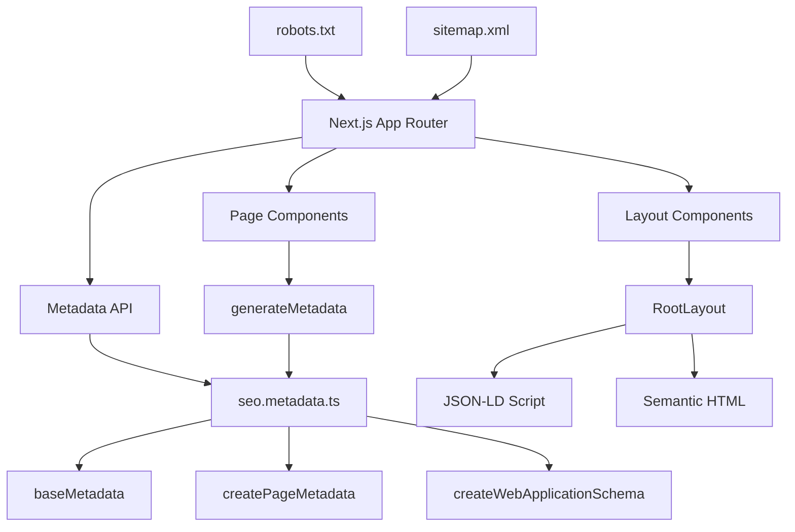

# Design Document: SEO対策とメタデータの実装

## Overview

このドキュメントは、VOWアプリケーションのSEO対策とメタデータ強化の設計を定義します。既存の`seo.metadata.ts`を拡張し、各ページに最適化されたメタデータ、OGP設定、構造化データ、セマンティックHTMLを実装します。

主な目標：
- 検索エンジンでの上位表示（特に日本語キーワード）
- SNS共有時の魅力的な表示
- アクセシビリティとパフォーマンスの維持
- 多言語対応の強化

## Architecture

### システム構成



### レイヤー構造

1. **メタデータ生成層** (`lib/seo.metadata.ts`)
   - 共通メタデータの定義
   - ページ別メタデータ生成関数
   - 構造化データ生成関数

2. **レイアウト層** (`app/layout.tsx`, `app/*/layout.tsx`)
   - 共通メタデータの適用
   - JSON-LD構造化データの埋め込み
   - セマンティックHTML構造

3. **ページ層** (`app/*/page.tsx`)
   - ページ固有のメタデータ生成
   - コンテンツのセマンティック構造

4. **静的ファイル層** (`app/robots.txt`, `app/sitemap.ts`)
   - クローラー制御
   - サイトマップ生成

## Components and Interfaces

### 1. メタデータ設定モジュール (`lib/seo.metadata.ts`)

#### 拡張されたAPP_CONFIG

```typescript
export const APP_CONFIG = {
  name: 'VOW',
  nameJa: 'VOW - 習慣・目標トラッカー',
  description: 'Your personal habit and goal tracking application. Track your progress, build better habits, and achieve your goals with VOW.',
  descriptionJa: 'あなた専用の習慣・目標管理アプリケーション。シンプルなTODOアプリで、タスク管理を無料でブラウザから。AI駆動のタスク管理で習慣を身につけ、目標を達成しましょう。',
  url: process.env.NEXT_PUBLIC_SITE_URL || 'https://vow-app.vercel.app',
  ogImage: '/opengraph-image',
  twitterHandle: '@vow_app',
  keywords: {
    en: [
      'habit tracking',
      'goal setting',
      'productivity',
      'todo app',
      'task management',
      'free browser app',
      'AI-driven task management',
    ],
    ja: [
      'シンプル TODOアプリ',
      'タスク管理 無料 ブラウザ',
      'AI駆動 タスク管理',
      '習慣管理',
      '目標設定',
      '生産性向上',
      '習慣トラッカー',
      '目標管理アプリ',
    ],
  },
} as const;
```

#### 強化されたcreatePageMetadata関数

```typescript
interface PageMetadataOptions {
  title: string;
  description: string;
  path?: string;
  locale?: 'en' | 'ja';
  noIndex?: boolean;
  ogImage?: string;
  keywords?: string[];
}

export function createPageMetadata(options: PageMetadataOptions): Metadata {
  const {
    title,
    description,
    path = '',
    locale = 'en',
    noIndex = false,
    ogImage = APP_CONFIG.ogImage,
    keywords = [],
  } = options;

  const url = `${APP_CONFIG.url}${path}`;
  const ogLocale = locale === 'ja' ? 'ja_JP' : 'en_US';
  const allKeywords = [...APP_CONFIG.keywords[locale], ...keywords];

  return {
    title,
    description,
    keywords: allKeywords,
    openGraph: {
      title,
      description,
      url,
      locale: ogLocale,
      type: 'website',
      siteName: APP_CONFIG.name,
      images: [
        {
          url: ogImage,
          width: 1200,
          height: 630,
          alt: `${title} | ${APP_CONFIG.name}`,
        },
      ],
    },
    twitter: {
      card: 'summary_large_image',
      site: APP_CONFIG.twitterHandle,
      creator: APP_CONFIG.twitterHandle,
      title,
      description,
      images: [ogImage],
    },
    alternates: {
      canonical: url,
      languages: {
        'en': `${APP_CONFIG.url}${path}`,
        'ja': `${APP_CONFIG.url}/ja${path}`,
        'x-default': `${APP_CONFIG.url}${path}`,
      },
    },
    robots: noIndex ? {
      index: false,
      follow: false,
    } : {
      index: true,
      follow: true,
      googleBot: {
        index: true,
        follow: true,
        'max-video-preview': -1,
        'max-image-preview': 'large',
        'max-snippet': -1,
      },
    },
  };
}
```

#### 拡張された構造化データ生成

```typescript
export function createWebApplicationSchema() {
  return {
    '@context': 'https://schema.org',
    '@type': 'SoftwareApplication',
    name: APP_CONFIG.name,
    description: APP_CONFIG.description,
    url: APP_CONFIG.url,
    applicationCategory: 'ProductivityApplication',
    operatingSystem: 'Web Browser',
    offers: {
      '@type': 'Offer',
      price: '0',
      priceCurrency: 'USD',
    },
    author: {
      '@type': 'Organization',
      name: 'VOW Team',
      url: APP_CONFIG.url,
    },
    aggregateRating: {
      '@type': 'AggregateRating',
      ratingValue: '4.8',
      ratingCount: '100',
    },
    featureList: [
      'Habit tracking',
      'Goal setting',
      'Progress visualization',
      'Daily reminders',
      'Multi-language support',
    ],
  };
}

export function createBreadcrumbSchema(items: Array<{ name: string; url: string }>) {
  return {
    '@context': 'https://schema.org',
    '@type': 'BreadcrumbList',
    itemListElement: items.map((item, index) => ({
      '@type': 'ListItem',
      position: index + 1,
      name: item.name,
      item: item.url,
    })),
  };
}
```

### 2. ルートレイアウト (`app/layout.tsx`)

#### セマンティックHTML構造

```typescript
export default function RootLayout({ children }: { children: React.ReactNode }) {
  const webAppSchema = createWebApplicationSchema();

  return (
    <html lang="ja">
      <head>
        {/* 構造化データ */}
        <script
          type="application/ld+json"
          dangerouslySetInnerHTML={{
            __html: JSON.stringify(webAppSchema),
          }}
        />
        {/* パフォーマンス最適化 */}
        <link rel="preconnect" href="https://fonts.googleapis.com" />
        <link rel="preconnect" href="https://fonts.gstatic.com" crossOrigin="anonymous" />
        <link rel="dns-prefetch" href="//supabase.co" />
        <link rel="dns-prefetch" href="//vercel.app" />
      </head>
      <body className={`${geistSans.variable} ${geistMono.variable} antialiased`}>
        {/* アクセシビリティ: スキップリンク */}
        <a href="#main-content" className="skip-link">
          コンテンツへスキップ
        </a>

        {/* セマンティックヘッダー */}
        <Header />

        {/* メインコンテンツ */}
        <main id="main-content">
          {children}
        </main>

        {/* セマンティックフッター */}
        <footer className="border-t border-zinc-200 bg-transparent py-8">
          <div className="mx-auto max-w-4xl px-6 text-center text-sm text-zinc-600">
            © {new Date().getFullYear()} VOW — 集中と継続のために作られました。
          </div>
        </footer>
      </body>
    </html>
  );
}
```

### 3. ページ別メタデータ

#### トップページ (`app/page.tsx`)

```typescript
export async function generateMetadata(): Promise<Metadata> {
  return createPageMetadata({
    title: 'VOW - 習慣・目標トラッカー | シンプルなTODOアプリ',
    description: 'VOWは無料のブラウザベースTODOアプリ。AI駆動のタスク管理で習慣を身につけ、目標を達成。シンプルで使いやすい習慣管理・目標設定ツール。',
    path: '/',
    locale: 'ja',
    keywords: ['無料', 'ブラウザアプリ', 'オンライン', 'クラウド同期'],
  });
}
```

#### ダッシュボードページ (`app/dashboard/page.tsx`)

```typescript
export async function generateMetadata(): Promise<Metadata> {
  return createPageMetadata({
    title: 'ダッシュボード - VOW',
    description: '習慣の進捗を確認し、目標を管理。カレンダービュー、統計グラフ、マインドマップで視覚的にタスクを管理。',
    path: '/dashboard',
    locale: 'ja',
    noIndex: true, // ログイン後のページはインデックスしない
  });
}
```

#### ログインページ (`app/login/page.tsx`)

```typescript
export async function generateMetadata(): Promise<Metadata> {
  return createPageMetadata({
    title: 'ログイン - VOW',
    description: 'VOWにログインして、習慣と目標を管理。ゲストモードでも利用可能。データはクラウドに安全に保存されます。',
    path: '/login',
    locale: 'ja',
  });
}
```

### 4. robots.txt (`app/robots.txt`)

```typescript
import { MetadataRoute } from 'next';

export default function robots(): MetadataRoute.Robots {
  const baseUrl = process.env.NEXT_PUBLIC_SITE_URL || 'https://vow-app.vercel.app';
  
  return {
    rules: [
      {
        userAgent: '*',
        allow: '/',
        disallow: [
          '/api/',
          '/dashboard/',
          '/test-auth/',
          '/_next/',
          '/.*\\.json$',
        ],
      },
    ],
    sitemap: `${baseUrl}/sitemap.xml`,
  };
}
```

### 5. sitemap.xml (`app/sitemap.ts`)

```typescript
import { MetadataRoute } from 'next';

export default function sitemap(): MetadataRoute.Sitemap {
  const baseUrl = process.env.NEXT_PUBLIC_SITE_URL || 'https://vow-app.vercel.app';
  const currentDate = new Date();

  return [
    {
      url: baseUrl,
      lastModified: currentDate,
      changeFrequency: 'weekly',
      priority: 1.0,
      alternates: {
        languages: {
          en: `${baseUrl}/`,
          ja: `${baseUrl}/ja`,
        },
      },
    },
    {
      url: `${baseUrl}/login`,
      lastModified: currentDate,
      changeFrequency: 'monthly',
      priority: 0.8,
      alternates: {
        languages: {
          en: `${baseUrl}/login`,
          ja: `${baseUrl}/ja/login`,
        },
      },
    },
    {
      url: `${baseUrl}/dashboard`,
      lastModified: currentDate,
      changeFrequency: 'daily',
      priority: 0.5,
    },
  ];
}
```

## Data Models

### MetadataOptions型

```typescript
interface PageMetadataOptions {
  title: string;
  description: string;
  path?: string;
  locale?: 'en' | 'ja';
  noIndex?: boolean;
  ogImage?: string;
  keywords?: string[];
}
```

### StructuredDataSchema型

```typescript
interface WebApplicationSchema {
  '@context': string;
  '@type': 'SoftwareApplication';
  name: string;
  description: string;
  url: string;
  applicationCategory: string;
  operatingSystem: string;
  offers: {
    '@type': 'Offer';
    price: string;
    priceCurrency: string;
  };
  author: {
    '@type': 'Organization';
    name: string;
    url: string;
  };
  aggregateRating?: {
    '@type': 'AggregateRating';
    ratingValue: string;
    ratingCount: string;
  };
  featureList: string[];
}

interface BreadcrumbSchema {
  '@context': string;
  '@type': 'BreadcrumbList';
  itemListElement: Array<{
    '@type': 'ListItem';
    position: number;
    name: string;
    item: string;
  }>;
}
```

## Correctness Properties

*プロパティとは、システムの全ての有効な実行において真であるべき特性や振る舞いのことです。これは仕様と機械検証可能な正確性保証の橋渡しとなります。*

### Property 1: 全ページにユニークなメタデータが存在する

*For any* 公開ページ、そのページには一意のtitleとdescriptionメタタグが存在し、他のページと重複しない

**Validates: Requirements 1.1, 1.2, 1.3, 1.4**

### Property 2: OGPメタデータの完全性

*For any* 公開ページ、OGPメタデータ（og:title, og:description, og:image, og:url）が全て存在し、有効な値を持つ

**Validates: Requirements 2.1, 2.2, 2.3, 2.4, 2.5, 2.6**

### Property 3: 構造化データの妥当性

*For any* 構造化データ、それはschema.orgの仕様に準拠し、必須フィールドが全て含まれる

**Validates: Requirements 3.1, 3.2, 3.3, 3.4, 3.5**

### Property 4: セマンティックHTML階層の正確性

*For any* ページ、見出しタグ（h1-h6）は正しい階層順序で使用され、h1は各ページに1つのみ存在する

**Validates: Requirements 4.1, 4.2, 4.3, 4.4, 4.5, 4.6, 4.7**

### Property 5: 多言語メタデータの一貫性

*For any* 多言語ページ、各言語版には適切なlang属性とhreflang属性が設定され、対応する翻訳されたメタデータが存在する

**Validates: Requirements 5.1, 5.2, 5.3, 5.4, 5.5**

### Property 6: robots.txtとsitemap.xmlの整合性

*For any* sitemap.xmlに含まれるURL、それはrobots.txtで許可されており、実際にアクセス可能なページである

**Validates: Requirements 7.1, 7.2, 7.3, 7.4, 7.5, 7.6, 7.7**

### Property 7: キーワードの包含性

*For any* ターゲットキーワード、それは少なくとも1つの公開ページのメタデータ（title、description、またはkeywords）に含まれる

**Validates: Requirements 1.5, 5.5**

## Error Handling

### メタデータ生成エラー

- **環境変数未設定**: `NEXT_PUBLIC_SITE_URL`が未設定の場合、デフォルトURLを使用
- **無効なlocale**: サポートされていないlocaleが指定された場合、'en'にフォールバック
- **画像パス不正**: OGP画像パスが無効な場合、デフォルト画像を使用

### 構造化データエラー

- **必須フィールド欠落**: 構造化データ生成時に必須フィールドが欠落している場合、エラーログを出力し、最小限の有効なスキーマを返す
- **JSON-LD構文エラー**: JSON.stringify失敗時は、エラーをキャッチしてコンソールに警告を出力

### パフォーマンスエラー

- **外部リソース読み込み失敗**: preconnect/dns-prefetchが失敗しても、ページレンダリングは継続
- **OGP画像生成失敗**: 動的OGP画像生成が失敗した場合、静的フォールバック画像を使用

## Testing Strategy

### Unit Tests

各コンポーネントと関数の具体的な動作を検証：

1. **メタデータ生成関数のテスト**
   - `createPageMetadata`が正しいMetadataオブジェクトを返すか
   - 各localeで適切なキーワードが含まれるか
   - noIndexオプションが正しく反映されるか

2. **構造化データ生成のテスト**
   - `createWebApplicationSchema`が有効なJSON-LDを生成するか
   - 必須フィールドが全て含まれるか
   - schema.org仕様に準拠しているか

3. **robots.txtとsitemap.xmlのテスト**
   - 正しいフォーマットで生成されるか
   - 全ての公開ページが含まれるか
   - 非公開ページが除外されているか

### Property-Based Tests

普遍的な性質を多数の入力で検証：

1. **Property 1テスト: メタデータの一意性**
   - ランダムなページパスのセットを生成
   - 各ページのメタデータを生成
   - 全てのtitle/descriptionが一意であることを検証
   - 最小100回の反復実行
   - **Feature: seo-metadata-enhancement, Property 1: 全ページにユニークなメタデータが存在する**

2. **Property 2テスト: OGPメタデータの完全性**
   - ランダムなページメタデータオプションを生成
   - createPageMetadataを実行
   - 必須OGPフィールドが全て存在することを検証
   - 最小100回の反復実行
   - **Feature: seo-metadata-enhancement, Property 2: OGPメタデータの完全性**

3. **Property 3テスト: 構造化データの妥当性**
   - 構造化データを生成
   - JSON.parseで構文エラーがないことを検証
   - 必須フィールドの存在を検証
   - 最小100回の反復実行
   - **Feature: seo-metadata-enhancement, Property 3: 構造化データの妥当性**

4. **Property 4テスト: セマンティックHTML階層**
   - ランダムなページコンポーネントをレンダリング
   - 見出しタグの階層順序を検証
   - h1が1つのみ存在することを検証
   - 最小100回の反復実行
   - **Feature: seo-metadata-enhancement, Property 4: セマンティックHTML階層の正確性**

5. **Property 7テスト: キーワードの包含性**
   - 全てのターゲットキーワードをリスト化
   - 各キーワードについて、少なくとも1ページのメタデータに含まれることを検証
   - 最小100回の反復実行
   - **Feature: seo-metadata-enhancement, Property 7: キーワードの包含性**

### Integration Tests

システム全体の統合動作を検証：

1. **E2Eメタデータ検証**
   - 各ページをブラウザで開く
   - HTMLヘッダーからメタデータを抽出
   - 期待値と一致することを検証

2. **外部ツール検証**
   - Twitter Card Validator APIを使用
   - Facebook Sharing Debugger APIを使用
   - Google Rich Results Test APIを使用
   - エラーがないことを確認

3. **クローラーシミュレーション**
   - robots.txtを読み込み
   - sitemap.xmlを読み込み
   - 各URLにアクセス可能か検証

### Testing Framework

- **Unit/Property Tests**: Jest + @testing-library/react
- **Property-Based Testing**: fast-check (TypeScript用PBTライブラリ)
- **E2E Tests**: Playwright
- **Schema Validation**: ajv (JSON Schema validator)

### Test Configuration

```json
{
  "jest": {
    "testMatch": ["**/__tests__/**/*.test.ts", "**/__tests__/**/*.test.tsx"],
    "collectCoverageFrom": ["lib/seo.metadata.ts", "app/**/layout.tsx", "app/**/page.tsx"]
  },
  "fast-check": {
    "numRuns": 100,
    "seed": 42
  }
}
```
