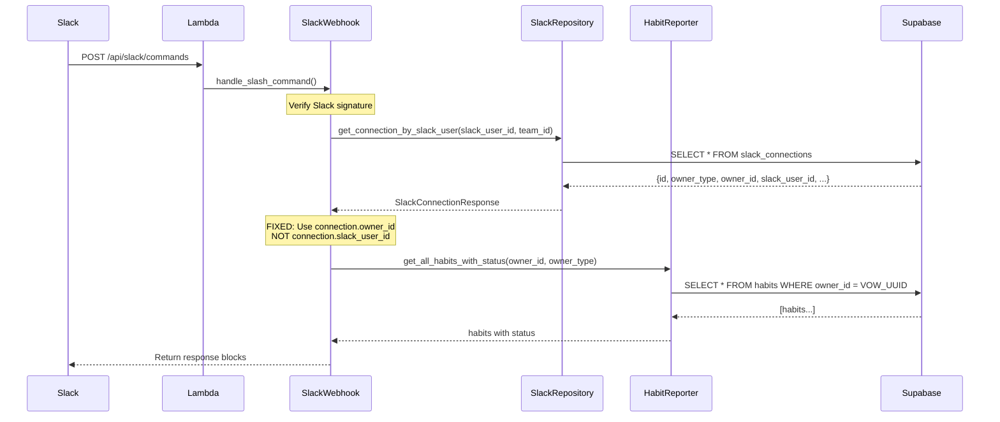
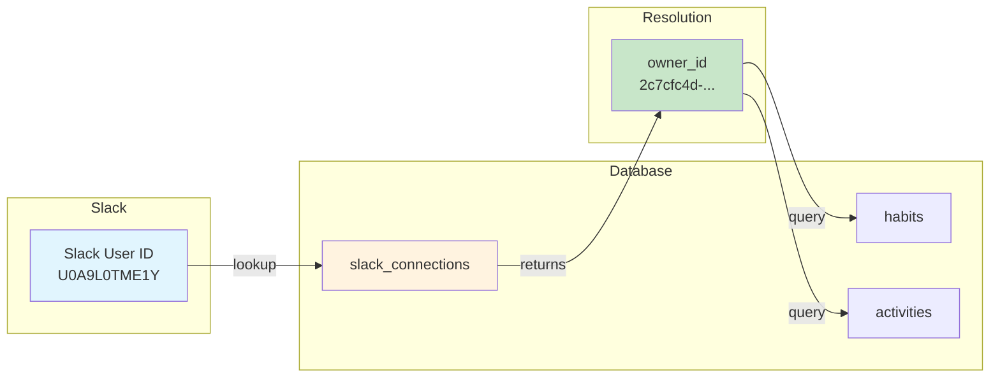

# Design Document: Slack Command Fix

## Overview

This design addresses two critical issues in the VOW Slack integration:

1. **Owner ID Mapping Bug**: In `slack_webhook.py` (the active router at `/api/slack/commands`), line 75-76 incorrectly uses `owner_id = connection.slack_user_id` instead of `owner_id = connection.owner_id`. This causes habit queries to use the Slack User ID (e.g., `U0A9L0TME1Y`) instead of the VOW owner_id UUID (e.g., `2c7cfc4d-7dc2-4a36-b85a-b8c23a012f47`).

2. **Event Loop Closure**: The `slack_interactions.py` router uses FastAPI BackgroundTasks which can cause "Event loop is closed" errors in Lambda. While this router is at `/slack/commands` (not the active endpoint), similar patterns should be avoided.

The solution involves:
- Fixing the owner_id assignment in `slack_webhook.py`
- Removing the redundant `get_connection_with_tokens()` workaround
- Adding comprehensive logging for debugging

## Architecture



## Components and Interfaces

### 1. Bug Fix in slack_webhook.py

The primary fix is in `backend/app/routers/slack_webhook.py`. The current buggy code:

```python
# CURRENT BUGGY CODE (lines 74-80)
owner_type = "user"
owner_id = connection.slack_user_id  # BUG: Using Slack ID instead of VOW ID

# Get the actual owner_id from the connection
conn_data = await slack_repo.get_connection_with_tokens(owner_type, owner_id)
if conn_data:
    owner_id = conn_data.get("owner_id", owner_id)
```

The fixed code:

```python
# FIXED CODE
owner_type = connection.owner_type
owner_id = connection.owner_id  # CORRECT: Use VOW owner_id directly

logger.info(
    f"Resolved Slack user {user_id} to VOW owner {owner_id}",
    extra={"slack_user_id": user_id, "owner_id": owner_id}
)
```

### 2. SlackConnectionResponse Schema

The schema already includes `owner_type` and `owner_id` fields correctly:

```python
class SlackConnectionResponse(BaseModel):
    """Schema for Slack connection response."""
    id: str
    owner_type: str      # "user" or "team"
    owner_id: str        # VOW user UUID (e.g., "2c7cfc4d-7dc2-4a36-b85a-...")
    slack_user_id: str   # Slack user ID (e.g., "U0A9L0TME1Y")
    slack_team_id: str
    slack_team_name: Optional[str]
    slack_user_name: Optional[str]
    connected_at: datetime
    is_valid: bool
```

### 3. Fix in Interactions Handler (slack_webhook.py lines 234-237)

Similar bug exists in the interactions handler:

```python
# CURRENT BUGGY CODE
conn_data = await slack_repo.get_connection_with_tokens("user", connection.slack_user_id)
owner_id = conn_data.get("owner_id") if conn_data else connection.slack_user_id
owner_type = "user"
```

Fixed code:

```python
# FIXED CODE
owner_type = connection.owner_type
owner_id = connection.owner_id

logger.info(
    f"Resolved Slack user {user.get('id')} to VOW owner {owner_id}",
    extra={"slack_user_id": user.get('id'), "owner_id": owner_id}
)
```

### 4. Enhanced Logging

```python
import logging
import uuid
from contextvars import ContextVar

request_id: ContextVar[str] = ContextVar("request_id", default="")

class SlackCommandLogger:
    """Structured logging for Slack command processing."""
    
    def __init__(self, logger: logging.Logger):
        self.logger = logger
    
    def log_command_received(
        self,
        command: str,
        slack_user_id: str,
        team_id: str,
    ) -> str:
        """Log command receipt and return correlation ID."""
        correlation_id = str(uuid.uuid4())[:8]
        request_id.set(correlation_id)
        
        self.logger.info(
            f"[{correlation_id}] Command received: {command}",
            extra={
                "correlation_id": correlation_id,
                "command": command,
                "slack_user_id": slack_user_id,
                "team_id": team_id,
            }
        )
        return correlation_id
    
    def log_owner_resolved(
        self,
        slack_user_id: str,
        owner_id: str,
        owner_type: str,
    ) -> None:
        """Log successful owner resolution."""
        self.logger.info(
            f"[{request_id.get()}] Owner resolved: {owner_id}",
            extra={
                "correlation_id": request_id.get(),
                "slack_user_id": slack_user_id,
                "owner_id": owner_id,
                "owner_type": owner_type,
            }
        )
    
    def log_habit_query(
        self,
        owner_id: str,
        owner_type: str,
        habit_count: int,
    ) -> None:
        """Log habit query results."""
        self.logger.info(
            f"[{request_id.get()}] Habit query: found {habit_count} habits",
            extra={
                "correlation_id": request_id.get(),
                "owner_id": owner_id,
                "owner_type": owner_type,
                "habit_count": habit_count,
            }
        )
    
    def log_error(self, error: Exception, context: str) -> None:
        """Log error with full context."""
        self.logger.error(
            f"[{request_id.get()}] Error in {context}: {error}",
            extra={
                "correlation_id": request_id.get(),
                "context": context,
                "error_type": type(error).__name__,
            },
            exc_info=True,
        )
```

## Data Models

### Slack Connections Table (Existing)

```sql
CREATE TABLE slack_connections (
    id UUID PRIMARY KEY DEFAULT gen_random_uuid(),
    owner_type VARCHAR(50) NOT NULL DEFAULT 'user',
    owner_id UUID NOT NULL,  -- VOW user ID (the correct ID to use)
    slack_user_id VARCHAR(50) NOT NULL,
    slack_team_id VARCHAR(50) NOT NULL,
    slack_team_name VARCHAR(255),
    slack_user_name VARCHAR(255),
    access_token TEXT,
    refresh_token TEXT,
    bot_access_token TEXT,
    token_expires_at TIMESTAMPTZ,
    connected_at TIMESTAMPTZ DEFAULT NOW(),
    is_valid BOOLEAN DEFAULT TRUE,
    UNIQUE(owner_type, owner_id),
    UNIQUE(slack_user_id, slack_team_id)
);
```

### Data Flow Diagram



### Key Data Flow Points

1. **Input**: `slack_user_id` from Slack command payload
2. **Lookup**: Query `slack_connections` by `slack_user_id` + `slack_team_id`
3. **Resolution**: Extract `owner_id` (VOW UUID) from connection record
4. **Query**: Use `owner_id` for all habit/activity queries

**Critical Bug Location**: In `slack_webhook.py`:
- Line 75: `owner_id = connection.slack_user_id` should be `owner_id = connection.owner_id`
- Line 235: Similar bug in interactions handler


## Correctness Properties

*A property is a characteristic or behavior that should hold true across all valid executions of a system—essentially, a formal statement about what the system should do. Properties serve as the bridge between human-readable specifications and machine-verifiable correctness guarantees.*

### Property 1: Connection Response Schema Completeness

*For any* valid slack_connections database record containing owner_type and owner_id fields, parsing it into a SlackConnectionResponse SHALL produce an object where owner_type and owner_id are non-null and match the database values.

**Validates: Requirements 1.2**

### Property 2: Owner ID Resolution Correctness

*For any* Slack command processing where a connection exists with distinct owner_id (VOW UUID) and slack_user_id (Slack ID), all subsequent habit and activity queries SHALL use the owner_id value, never the slack_user_id value.

**Validates: Requirements 1.1, 1.2, 1.4, 2.1, 2.4, 3.1, 3.3, 4.1, 4.2**

### Property 3: Activity Creation Owner Integrity

*For any* habit completion triggered via Slack, the created activity record SHALL have owner_type and owner_id values matching those from the SlackConnectionResponse, not the Slack user identifiers.

**Validates: Requirements 4.3, 4.4**

### Property 4: Habit Status Response Completeness

*For any* habit status query result, the response SHALL contain completed count, total count, and a list of individual habit statuses with completion flags.

**Validates: Requirements 3.2**

### Property 5: Habit List Goal Grouping

*For any* habit list query result containing habits with goal associations, the response SHALL group habits by their goal_name field.

**Validates: Requirements 2.2**

### Property 6: Logging Completeness

*For any* Slack command processing, the system SHALL log the slack_user_id, resolved owner_id, and command type before executing habit queries.

**Validates: Requirements 1.6, 7.1, 7.2, 7.3**

### Property 7: Lambda Environment Detection

*For any* execution in AWS Lambda (where AWS_LAMBDA_FUNCTION_NAME is set), the system SHALL process commands synchronously without using FastAPI BackgroundTasks.

**Validates: Requirements 5.4, 6.1, 6.3**

### Property 8: Backward Compatibility Preservation

*For any* Slack command or interaction, the system SHALL NOT modify the OAuth flow, database schema, or scheduled event handlers.

**Validates: Requirements 8.1, 8.2, 8.3, 8.4, 8.5**

## Lambda Synchronous Processing Strategy

To address Requirement 6 (Synchronous Processing for Lambda), the system will detect the Lambda environment and process commands synchronously to avoid event loop issues.

### Environment Detection

```python
import os

def is_lambda_environment() -> bool:
    """Detect if running in AWS Lambda."""
    return bool(os.environ.get("AWS_LAMBDA_FUNCTION_NAME"))
```

### Synchronous Processing Pattern

```python
async def handle_slash_command(request: Request):
    """Handle Slack slash commands with Lambda-aware processing."""
    
    # Immediate acknowledgment to Slack (within 3 seconds)
    # Process command and return response directly
    
    if is_lambda_environment():
        # Lambda: Process synchronously, return response directly
        result = await process_command_sync(command, owner_id, owner_type)
        return JSONResponse(content=result)
    else:
        # Development: Can use background tasks if needed
        return JSONResponse(content=result)
```

### Response URL for Delayed Responses

When processing takes longer than 3 seconds, use Slack's `response_url`:

```python
async def send_delayed_response(response_url: str, blocks: list):
    """Send delayed response to Slack via response_url."""
    async with httpx.AsyncClient() as client:
        await client.post(
            response_url,
            json={"blocks": blocks, "response_type": "ephemeral"},
            timeout=10.0
        )
```

## Router Consolidation Strategy

To address Requirement 9 (Router Consolidation):

### Active Endpoints

| Endpoint | Router File | Status | Purpose |
|----------|-------------|--------|---------|
| `/api/slack/commands` | `slack_webhook.py` | **Primary** | Slash commands |
| `/api/slack/interactions` | `slack_webhook.py` | **Primary** | Button clicks |
| `/slack/commands` | `slack_interactions.py` | Deprecated | Legacy endpoint |
| `/slack/interactions` | `slack_interactions.py` | Deprecated | Legacy endpoint |

### Consolidation Plan

1. **Phase 1 (This Fix)**: Fix owner_id bug in `slack_webhook.py` (primary router)
2. **Phase 2 (Future)**: Add deprecation warnings to `slack_interactions.py` endpoints
3. **Phase 3 (Future)**: Remove `slack_interactions.py` after migration period

### Slack App Configuration

Ensure Slack App is configured to use:
- **Slash Commands URL**: `https://{domain}/api/slack/commands`
- **Interactivity URL**: `https://{domain}/api/slack/interactions`

## Backward Compatibility

To address Requirement 8 (Backward Compatibility):

### Unchanged Components

| Component | Status | Notes |
|-----------|--------|-------|
| Slack OAuth Flow | ✅ Unchanged | `/api/slack/oauth/callback` |
| `slack_connections` table | ✅ Unchanged | No schema changes |
| Interactive components | ✅ Unchanged | Button clicks work |
| Scheduled events | ✅ Unchanged | Reminders, reports |

### Migration Safety

1. **No Database Changes**: The fix only changes application code
2. **No API Changes**: Same endpoints, same request/response format
3. **No Token Changes**: OAuth tokens remain valid
4. **Rollback Plan**: Revert to previous Lambda deployment if issues arise

### Verification Checklist

- [ ] Existing connected users can use `/habit-list`
- [ ] Existing connected users can use `/habit-status`
- [ ] Existing connected users can use `/habit-done`
- [ ] Button clicks complete habits correctly
- [ ] Scheduled reminders still work
- [ ] Weekly reports still work

## Error Handling

### Connection Not Found

When no slack_connection exists for a Slack user:
- Return a user-friendly message in Japanese: "VOWアカウントとの接続が見つかりません"
- Include a link/instructions to connect their account
- Log the lookup attempt with slack_user_id and team_id

### Event Loop Errors (Lambda)

When an event loop error occurs in Lambda:
- Catch `RuntimeError` with "Event loop is closed" message
- Log the error with full stack trace
- Return a generic error message to Slack via response_url
- Do NOT re-raise the exception (prevents Lambda crash)

```python
try:
    await process_command(...)
except RuntimeError as e:
    if "Event loop is closed" in str(e):
        logger.error(f"Event loop error: {e}", exc_info=True)
        # Attempt to send error response
        try:
            await send_error_response(response_url)
        except Exception:
            pass  # Best effort
except Exception as e:
    logger.error(f"Unexpected error: {e}", exc_info=True)
    await send_error_response(response_url)
```

### Slack API Errors

When Slack API calls fail:
- Log the error with response details
- Return a user-friendly error message
- Include retry suggestion in message

### Database Query Errors

When Supabase queries fail:
- Log the error with query context
- Return a generic error message
- Do NOT expose database details to users

## Testing Strategy

### Unit Tests

Unit tests verify specific examples and edge cases:

1. **Owner ID Resolution Tests**
   - Test that `connection.owner_id` is used, not `connection.slack_user_id`
   - Test with connections where owner_id ≠ slack_user_id
   - Test missing connection returns appropriate error

2. **Connection Lookup Tests**
   - Test successful connection lookup returns correct owner_id
   - Test missing connection returns None
   - Test invalid team_id returns None

3. **Error Handling Tests**
   - Test "not connected" response format
   - Test error response format
   - Test logging includes required fields

### Property-Based Tests

Property tests verify universal properties across generated inputs using `hypothesis`:

**Configuration**: Minimum 100 iterations per property test

1. **Property Test: Connection Schema Round-Trip**
   - Generate random connection data with owner_id and slack_user_id
   - Verify SlackConnectionResponse preserves both fields
   - **Tag**: Feature: slack-command-fix, Property 1: Connection Response Schema Completeness

2. **Property Test: Owner ID Never Equals Slack ID in Queries**
   - Generate connections where owner_id ≠ slack_user_id
   - Mock habit query and verify owner_id is used
   - **Tag**: Feature: slack-command-fix, Property 2: Owner ID Resolution Correctness

3. **Property Test: Activity Creation Uses Connection Owner**
   - Generate random habit completions with mock connections
   - Verify created activity has connection's owner_id
   - **Tag**: Feature: slack-command-fix, Property 3: Activity Creation Owner Integrity

### Integration Tests

Integration tests verify end-to-end flows:

1. **Slack Command Flow Test**
   - Send mock /habit-list command to `/api/slack/commands`
   - Verify correct owner_id used in database query
   - Verify response contains user's habits

2. **Button Click Flow Test**
   - Send mock button interaction to `/api/slack/interactions`
   - Verify correct owner_id used for habit completion
   - Verify activity created with correct owner_id

3. **Lambda Environment Detection Test**
   - Test with AWS_LAMBDA_FUNCTION_NAME set
   - Verify synchronous processing is used
   - Verify no BackgroundTasks are scheduled

4. **Backward Compatibility Test**
   - Verify OAuth endpoints unchanged
   - Verify scheduled event handlers unchanged
   - Verify existing connections still work

### Test File Structure

```
backend/
├── tests/
│   ├── unit/
│   │   ├── test_slack_owner_id_resolution.py
│   │   ├── test_slack_connection_schema.py
│   │   ├── test_lambda_environment_detection.py
│   │   └── test_error_handling.py
│   ├── property/
│   │   ├── test_owner_id_resolution.py
│   │   ├── test_activity_creation.py
│   │   └── test_lambda_processing.py
│   └── integration/
│       ├── test_slack_commands.py
│       └── test_backward_compatibility.py
```

## Design Decisions and Rationale

### Decision 1: Fix in slack_webhook.py (not slack_interactions.py)

**Rationale**: The `/api/slack/commands` endpoint in `slack_webhook.py` is the active endpoint configured in the Slack App. Fixing here ensures immediate impact without requiring Slack App reconfiguration.

### Decision 2: Direct owner_id usage (remove get_connection_with_tokens workaround)

**Rationale**: The `SlackConnectionResponse` already contains `owner_id` from the database. The `get_connection_with_tokens()` call was a workaround that added complexity and didn't fully fix the issue. Direct usage is simpler and correct.

### Decision 3: Synchronous processing in Lambda

**Rationale**: FastAPI BackgroundTasks can cause "Event loop is closed" errors in Lambda because the event loop may close before background tasks complete. Synchronous processing ensures all work completes before the Lambda invocation ends.

### Decision 4: Environment detection via AWS_LAMBDA_FUNCTION_NAME

**Rationale**: This environment variable is automatically set by AWS Lambda and is the standard way to detect Lambda execution. It allows the same codebase to work in both Lambda and local development environments.

### Decision 5: Preserve backward compatibility

**Rationale**: The fix should be minimal and focused. Changing OAuth flows, database schemas, or scheduled events would introduce unnecessary risk and require additional testing.
