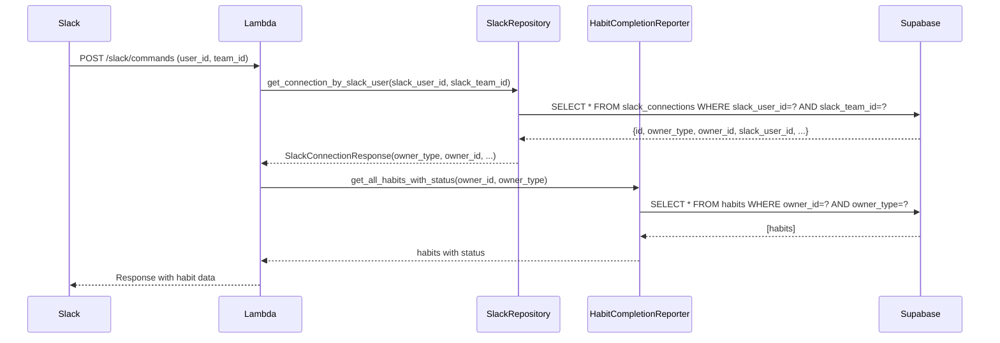

# Design Document: Slack Command Owner ID Fix

## Overview

This design addresses the issue where Slack commands (`/habit-list`, `/habit-status`, `/habit-done`) are not returning habit data because the system queries habits using the Slack User ID instead of the correct VOW owner_id from the slack_connections table.

The fix ensures that when a Slack command is received, the system:
1. Looks up the slack_connection record using slack_user_id and slack_team_id
2. Extracts the VOW owner_id from the connection record
3. Uses the VOW owner_id for all habit-related queries

## Architecture



## Components and Interfaces

### 1. SlackConnectionResponse Schema

**Location**: `backend/app/schemas/slack.py` and `backend/lambda_package/app/schemas/slack.py`

```python
class SlackConnectionResponse(BaseModel):
    """Schema for Slack connection response (excludes sensitive tokens)."""
    id: str
    owner_type: str  # CRITICAL: Must be present for correct user mapping
    owner_id: str    # CRITICAL: Must be present for correct user mapping
    slack_user_id: str
    slack_team_id: str
    slack_team_name: Optional[str]
    slack_user_name: Optional[str]
    connected_at: datetime
    is_valid: bool

    class Config:
        from_attributes = True
```

### 2. SlackRepository.get_connection_by_slack_user

**Location**: `backend/app/repositories/slack.py` and `backend/lambda_package/app/repositories/slack.py`

```python
async def get_connection_by_slack_user(
    self,
    slack_user_id: str,
    slack_team_id: str,
) -> Optional[SlackConnectionResponse]:
    """Get Slack connection by Slack user and team ID."""
    result = self.supabase.table("slack_connections").select("*").eq(
        "slack_user_id", slack_user_id
    ).eq("slack_team_id", slack_team_id).execute()
    
    if result.data:
        return SlackConnectionResponse(**result.data[0])
    return None
```

### 3. Slash Command Handler

**Location**: `backend/app/routers/slack_interactions.py` and `backend/lambda_package/app/routers/slack_interactions.py`

The handler extracts owner_type and owner_id from the connection:

```python
connection = await slack_repo.get_connection_by_slack_user(
    slack_user_id,
    team_id,
)

if not connection:
    # Return not connected message
    return

owner_type = connection.owner_type  # Should be "user"
owner_id = connection.owner_id      # Should be VOW UUID like "2c7cfc4d-7dc2-4a36-b85a-b8c23a012f47"
```

### 4. HabitCompletionReporter

**Location**: `backend/app/services/habit_completion_reporter.py` and `backend/lambda_package/app/services/habit_completion_reporter.py`

All methods accept owner_id and owner_type parameters:

```python
async def _get_habits_by_owner(
    self,
    owner_type: str,
    owner_id: str,
) -> List[Dict[str, Any]]:
    """Get all habits for an owner."""
    result = self.supabase.table("habits").select("*").eq(
        "owner_type", owner_type
    ).eq("owner_id", owner_id).execute()
    
    return result.data if result.data else []
```

## Data Models

### slack_connections Table

| Column | Type | Description |
|--------|------|-------------|
| id | TEXT | Primary key (UUID) |
| owner_type | TEXT | Type of owner ("user") |
| owner_id | TEXT | VOW user UUID |
| slack_user_id | TEXT | Slack user ID (e.g., "U0A9L0TME1Y") |
| slack_team_id | TEXT | Slack workspace ID |
| slack_team_name | TEXT | Slack workspace name |
| slack_user_name | TEXT | Slack username |
| access_token | TEXT | OAuth access token |
| refresh_token | TEXT | OAuth refresh token |
| bot_access_token | TEXT | Bot access token |
| token_expires_at | TIMESTAMPTZ | Token expiration |
| connected_at | TIMESTAMPTZ | Connection timestamp |
| is_valid | BOOLEAN | Whether connection is valid |

### habits Table

| Column | Type | Description |
|--------|------|-------------|
| id | TEXT | Primary key (UUID) |
| owner_type | TEXT | Type of owner ("user") |
| owner_id | TEXT | VOW user UUID |
| name | TEXT | Habit name |
| goal_id | TEXT | Associated goal ID |
| active | BOOLEAN | Whether habit is active |

## Correctness Properties

*A property is a characteristic or behavior that should hold true across all valid executions of a system-essentially, a formal statement about what the system should do. Properties serve as the bridge between human-readable specifications and machine-verifiable correctness guarantees.*

