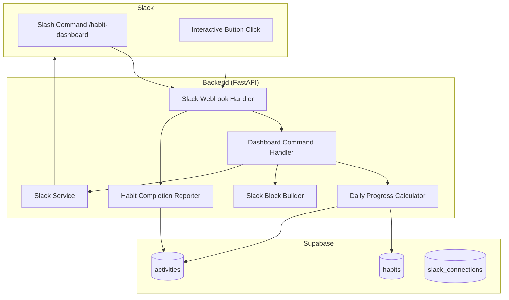

# Design Document: Slack Habit Dashboard Command

## Overview

This design document describes the implementation of an enhanced Slack command (`/habit-dashboard`) that provides a unified view of habit progress with workload-based tracking. The feature integrates the functionality of existing `/habit-list` and `/habit-status` commands while adding count-based progress display, visual progress bars, and interactive increment buttons.

The implementation extends the existing `HabitCompletionReporter` service with daily progress calculation capabilities and enhances the `SlackBlockBuilder` with new message templates for the dashboard view.

## Architecture



### Component Interaction Flow

1. User invokes `/habit-dashboard` command in Slack
2. Slack sends POST request to webhook handler
3. Webhook handler validates signature and routes to Dashboard Command Handler
4. Dashboard Command Handler calls Daily Progress Calculator
5. Daily Progress Calculator queries habits and activities from Supabase
6. Slack Block Builder formats the response with progress bars and buttons
7. Response is sent back to Slack within 3 seconds

## Components and Interfaces

### 1. Daily Progress Calculator

A new service class that calculates workload-based progress for habits.

```python
from dataclasses import dataclass
from typing import List, Optional
from datetime import date, datetime
from zoneinfo import ZoneInfo

@dataclass
class HabitProgress:
    """Progress data for a single habit."""
    habit_id: str
    habit_name: str
    goal_name: str
    current_count: float
    total_count: float
    progress_rate: float
    workload_unit: Optional[str]
    workload_per_count: float
    streak: int
    completed: bool

class DailyProgressCalculator:
    """Service for calculating daily workload progress."""
    
    def __init__(self, supabase: Client):
        self.supabase = supabase
        self.jst = ZoneInfo("Asia/Tokyo")
    
    async def get_daily_progress(
        self,
        owner_id: str,
        owner_type: str = "user",
    ) -> List[HabitProgress]:
        """
        Calculate daily progress for all active habits.
        
        Args:
            owner_id: User ID
            owner_type: Type of owner
            
        Returns:
            List of HabitProgress objects sorted by goal
        """
        pass
    
    async def _get_today_activities(
        self,
        owner_id: str,
        owner_type: str,
    ) -> List[Dict[str, Any]]:
        """Get activities within JST 0:00-23:59 today."""
        pass
    
    def _calculate_workload(
        self,
        habit_id: str,
        activities: List[Dict[str, Any]],
        workload_per_count: float,
    ) -> float:
        """Sum workload from activities for a habit."""
        pass
```

### 2. Enhanced Slack Block Builder

New methods added to the existing `SlackBlockBuilder` class.

```python
class SlackBlockBuilder:
    # ... existing methods ...
    
    @staticmethod
    def habit_dashboard(
        progress_list: List[HabitProgress],
        summary: DashboardSummary,
    ) -> List[Dict[str, Any]]:
        """
        Build the unified dashboard view with progress bars and buttons.
        
        Args:
            progress_list: List of habit progress data
            summary: Overall summary statistics
            
        Returns:
            List of Block Kit blocks
        """
        pass
    
    @staticmethod
    def _progress_bar(progress_rate: float) -> str:
        """
        Generate a text-based progress bar with color coding.
        
        Args:
            progress_rate: Progress percentage (0-100+)
            
        Returns:
            String with colored block characters
        """
        pass
    
    @staticmethod
    def _habit_progress_section(
        habit: HabitProgress,
    ) -> Dict[str, Any]:
        """
        Build a section block for a single habit with progress and button.
        
        Args:
            habit: Habit progress data
            
        Returns:
            Block Kit section with accessory button
        """
        pass
    
    @staticmethod
    def _increment_button(
        habit_id: str,
        workload_per_count: float,
        workload_unit: Optional[str],
    ) -> Dict[str, Any]:
        """
        Build an increment button with appropriate label.
        
        Args:
            habit_id: ID of the habit
            workload_per_count: Amount to add per click
            workload_unit: Unit of measurement
            
        Returns:
            Block Kit button element
        """
        pass
```

### 3. Dashboard Command Handler

New handler for the `/habit-dashboard` command.

```python
class DashboardCommandHandler:
    """Handler for the /habit-dashboard slash command."""
    
    def __init__(
        self,
        supabase: Client,
        slack_service: SlackIntegrationService,
    ):
        self.progress_calculator = DailyProgressCalculator(supabase)
        self.completion_reporter = HabitCompletionReporter(supabase)
        self.slack_service = slack_service
    
    async def handle_command(
        self,
        slack_user_id: str,
        response_url: str,
    ) -> Dict[str, Any]:
        """
        Handle the /habit-dashboard command.
        
        Args:
            slack_user_id: Slack user ID from the command
            response_url: URL for sending responses
            
        Returns:
            Immediate acknowledgment response
        """
        pass
    
    async def handle_increment(
        self,
        habit_id: str,
        owner_id: str,
        response_url: str,
    ) -> bool:
        """
        Handle increment button click.
        
        Args:
            habit_id: ID of the habit to increment
            owner_id: User ID
            response_url: URL for updating the message
            
        Returns:
            True if successful
        """
        pass
```

### 4. Enhanced Habit Completion Reporter

Extended methods for the existing service.

```python
class HabitCompletionReporter:
    # ... existing methods ...
    
    async def increment_habit_progress(
        self,
        owner_id: str,
        habit_id: str,
        amount: Optional[float] = None,
        source: str = "slack",
        owner_type: str = "user",
    ) -> Tuple[bool, str, Optional[Dict]]:
        """
        Increment habit progress by the specified amount.
        
        Args:
            owner_id: User ID
            habit_id: ID of the habit
            amount: Amount to add (defaults to workloadPerCount)
            source: Source of the increment
            owner_type: Type of owner
            
        Returns:
            Tuple of (success, message, result_data)
        """
        pass
```

## Data Models

### HabitProgress Data Class

```python
@dataclass
class HabitProgress:
    habit_id: str
    habit_name: str
    goal_name: str
    current_count: float      # Sum of today's activity amounts
    total_count: float        # workloadTotal or must field
    progress_rate: float      # (current_count / total_count) * 100
    workload_unit: Optional[str]  # e.g., "回", "分", "ページ"
    workload_per_count: float     # Amount per increment (default: 1)
    streak: int               # Current streak count
    completed: bool           # True if progress_rate >= 100
```

### DashboardSummary Data Class

```python
@dataclass
class DashboardSummary:
    total_habits: int
    completed_habits: int
    completion_rate: float
    date_display: str  # e.g., "2026年1月20日（月）"
```

### Activity Record (for increment)

```python
activity_data = {
    "owner_type": str,      # "user"
    "owner_id": str,        # User UUID
    "habit_id": str,        # Habit UUID
    "habit_name": str,      # Habit name for display
    "kind": "complete",     # Activity type
    "timestamp": str,       # ISO format UTC timestamp
    "amount": float,        # workloadPerCount value
}
```

## Slack Block Kit Message Structure

### Dashboard Message Layout

```
┌─────────────────────────────────────────────────────┐
│ 📊 今日の進捗 - 2026年1月20日（月）                    │
│ 3/5 習慣を完了 (60%)                                 │
│ `████████░░░░░░░░░░░░` 60%                          │
├─────────────────────────────────────────────────────┤
│ *健康*                                              │
├─────────────────────────────────────────────────────┤
│ ⬜ 朝のストレッチ                                    │
│ 2/5 回 (40%) 🔥3日                                  │
│ `🟨🟨🟨🟨⬜⬜⬜⬜⬜⬜`                    [+1 回]    │
├─────────────────────────────────────────────────────┤
│ ✅ 水を飲む                                         │
│ 8/8 杯 (100%) ✨5日                                 │
│ `🟩🟩🟩🟩🟩🟩🟩🟩🟩🟩`                    [+1 杯]    │
├─────────────────────────────────────────────────────┤
│ *学習*                                              │
├─────────────────────────────────────────────────────┤
│ ⬜ 読書                                             │
│ 15/30 分 (50%)                                      │
│ `🟨🟨🟨🟨🟨⬜⬜⬜⬜⬜`                    [+10 分]   │
└─────────────────────────────────────────────────────┘
```

### Block Kit JSON Structure

```json
{
  "blocks": [
    {
      "type": "header",
      "text": {
        "type": "plain_text",
        "text": "📊 今日の進捗 - 2026年1月20日（月）"
      }
    },
    {
      "type": "section",
      "text": {
        "type": "mrkdwn",
        "text": "*3/5* 習慣を完了 (60%)\n`████████░░░░░░░░░░░░`"
      }
    },
    {
      "type": "divider"
    },
    {
      "type": "section",
      "text": {
        "type": "mrkdwn",
        "text": "*健康*"
      }
    },
    {
      "type": "section",
      "text": {
        "type": "mrkdwn",
        "text": "⬜ *朝のストレッチ* 🔥3日\n2/5 回 (40%)\n`🟨🟨🟨🟨⬜⬜⬜⬜⬜⬜`"
      },
      "accessory": {
        "type": "button",
        "text": {
          "type": "plain_text",
          "text": "+1 回"
        },
        "action_id": "habit_increment_<habit_id>",
        "value": "<habit_id>"
      }
    }
  ]
}
```

## Error Handling

### Error Scenarios and Responses

| Scenario | Response | Action |
|----------|----------|--------|
| User not connected to Slack | Display connection instructions | Log warning |
| Database query timeout | "一時的なエラーが発生しました。再度お試しください。" | Log error, suggest retry |
| Habit not found on increment | "この習慣は見つかりませんでした。" | Log warning |
| Rate limit from Slack | Exponential backoff retry | Log and queue |
| Invalid action_id format | Ignore silently | Log warning |

### Error Response Block

```python
@staticmethod
def dashboard_error(message: str) -> List[Dict[str, Any]]:
    return [
        {
            "type": "section",
            "text": {
                "type": "mrkdwn",
                "text": f"❌ {message}"
            }
        }
    ]
```

## Testing Strategy

### Unit Tests

Unit tests will verify individual component behavior:

1. **DailyProgressCalculator tests**
   - JST date boundary calculation
   - Activity amount summation
   - Progress rate calculation
   - Handling of missing workloadTotal/workloadUnit

2. **SlackBlockBuilder tests**
   - Progress bar generation for various percentages
   - Button label formatting with units
   - Message structure validation

3. **DashboardCommandHandler tests**
   - Command routing
   - Error handling paths
   - Response format validation

### Property-Based Tests

Property-based tests will verify universal properties across generated inputs.


## Correctness Properties

*A property is a characteristic or behavior that should hold true across all valid executions of a system—essentially, a formal statement about what the system should do. Properties serve as the bridge between human-readable specifications and machine-verifiable correctness guarantees.*

Based on the prework analysis, the following properties have been identified and consolidated to eliminate redundancy:

### Property 1: Dashboard Response Structure

*For any* valid user with connected Slack account and any set of habits, the dashboard response SHALL contain a header with today's date and an overall completion summary showing completed/total counts.

**Validates: Requirements 1.1, 1.2**

### Property 2: Habit Grouping by Goal

*For any* list of habits with associated goals, the dashboard output SHALL group all habits by their goal_name, with habits sharing the same goal appearing consecutively in the output.

**Validates: Requirements 1.3**

### Property 3: Progress Format with Unit Handling

*For any* habit progress data, the formatted output SHALL display progress as `currentCount/totalCount unit (progressRate%)` when workloadUnit is defined, or `currentCount/totalCount (progressRate%)` when workloadUnit is not defined.

**Validates: Requirements 2.1, 2.3**

### Property 4: Current Count Calculation from JST Activities

*For any* set of activities, the currentCount for a habit SHALL equal the sum of amount fields from activities where: kind="complete", habitId matches, and timestamp falls within JST 0:00:00 to 23:59:59 of the current day.

**Validates: Requirements 2.2, 6.1, 6.2**

### Property 5: Total Count Fallback Logic

*For any* habit, the totalCount SHALL equal workloadTotal if defined and greater than 0, otherwise SHALL equal the must field value.

**Validates: Requirements 2.4**

### Property 6: Completion Indicator Based on Progress

*For any* habit progress, the output SHALL display ✅ when progressRate >= 100, and ⬜ when progressRate < 100.

**Validates: Requirements 2.5, 2.6**

### Property 7: Progress Bar Color Coding

*For any* progress percentage, the progress bar SHALL use: 🟩 when >= 100%, 🟦 when 75-99%, 🟨 when 50-74%, and 🟥 when < 50%.

**Validates: Requirements 3.2, 3.3, 3.4, 3.5**

### Property 8: Progress Bar Segment Count

*For any* progress percentage, the progress bar SHALL contain exactly 10 segments, with the number of filled segments equal to min(10, floor(progressRate / 10)).

**Validates: Requirements 3.1, 3.6**

### Property 9: Increment Button Presence

*For any* habit in the dashboard (regardless of completion status), the output SHALL include an increment button with a valid action_id containing the habit_id.

**Validates: Requirements 4.1, 4.6**

### Property 10: Activity Creation on Increment

*For any* increment button click, the created activity record SHALL have: kind="complete", amount equal to the habit's workloadPerCount (default 1), and source="slack".

**Validates: Requirements 4.2, 4.3**

### Property 11: Completion Celebration on Reaching 100%

*For any* increment action that causes progressRate to reach or exceed 100% (from below 100%), the response SHALL include a celebration message containing the streak count.

**Validates: Requirements 4.5**

### Property 12: Increment Button Label Formatting

*For any* habit, the increment button label SHALL be: "+{workloadPerCount} {workloadUnit}" when both are defined, "+{workloadPerCount}" when only workloadPerCount > 1, or "✓" when workloadPerCount is 1 and no unit is defined.

**Validates: Requirements 5.1, 5.2, 5.3**

### Property 13: Default Amount Handling

*For any* activity without an amount field, the Daily_Progress_Calculator SHALL treat it as having amount equal to the habit's workloadPerCount (default 1).

**Validates: Requirements 6.3**

### Property 14: Active 'Do' Habit Filtering

*For any* set of habits, the Daily_Progress_Calculator SHALL return progress data only for habits where active=true AND type="do", excluding all inactive habits and "avoid" type habits.

**Validates: Requirements 6.4, 6.5, 6.6**

### Property 15: Streak Display with Emoji

*For any* habit with streak > 0, the output SHALL include the streak count with: 🔥 emoji when streak >= 7, ✨ emoji when 3 <= streak <= 6, and no special emoji when 1 <= streak <= 2.

**Validates: Requirements 10.1, 10.2, 10.3, 10.4**

## Testing Strategy

### Dual Testing Approach

This feature requires both unit tests and property-based tests for comprehensive coverage:

- **Unit tests**: Verify specific examples, edge cases, and error conditions
- **Property tests**: Verify universal properties across randomly generated inputs

### Property-Based Testing Configuration

- **Library**: Hypothesis (Python)
- **Minimum iterations**: 100 per property test
- **Tag format**: `Feature: slack-habit-dashboard-command, Property {number}: {property_text}`

### Unit Test Coverage

1. **Edge Cases**
   - Empty habit list (Requirement 1.5)
   - User not connected to Slack (Requirement 9.1)
   - Database query failure (Requirement 9.2)
   - Deleted habit on increment (Requirement 9.5)
   - Message update failure fallback (Requirement 8.4)

2. **Backward Compatibility**
   - `/habit-done` command unchanged (Requirement 7.1)
   - `/habit-status` deprecation notice (Requirement 7.2)
   - `/habit-list` deprecation notice (Requirement 7.3)
   - Existing reminder buttons work (Requirement 7.5)

3. **Integration Points**
   - Slack Block Kit message structure validation
   - Response URL message updates
   - Activity record creation in database

### Property Test Coverage

Each correctness property (P1-P15) will have a corresponding property-based test that:
1. Generates random valid inputs using Hypothesis strategies
2. Executes the function under test
3. Verifies the property holds for all generated inputs
4. Runs minimum 100 iterations

### Test Data Generators

```python
from hypothesis import strategies as st

# Habit generator
habit_strategy = st.fixed_dictionaries({
    "id": st.uuids().map(str),
    "name": st.text(min_size=1, max_size=50),
    "goal_name": st.text(min_size=1, max_size=30),
    "active": st.just(True),
    "type": st.just("do"),
    "workloadTotal": st.integers(min_value=1, max_value=100),
    "workloadUnit": st.one_of(st.none(), st.sampled_from(["回", "分", "ページ", "杯"])),
    "workloadPerCount": st.integers(min_value=1, max_value=10),
    "must": st.integers(min_value=1, max_value=100),
})

# Activity generator
activity_strategy = st.fixed_dictionaries({
    "id": st.uuids().map(str),
    "habit_id": st.uuids().map(str),
    "kind": st.just("complete"),
    "amount": st.one_of(st.none(), st.integers(min_value=1, max_value=10)),
    "timestamp": st.datetimes(),
})

# Progress rate generator (0-150%)
progress_rate_strategy = st.floats(min_value=0, max_value=150)

# Streak generator
streak_strategy = st.integers(min_value=0, max_value=365)
```
