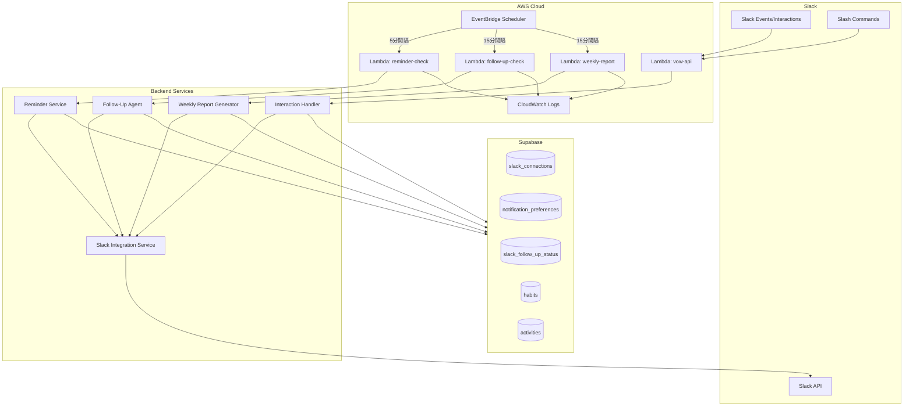
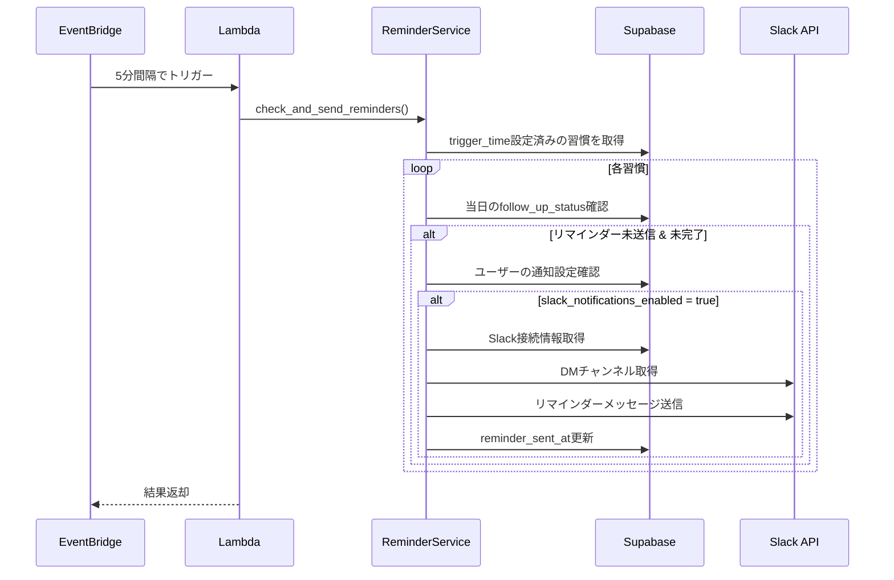
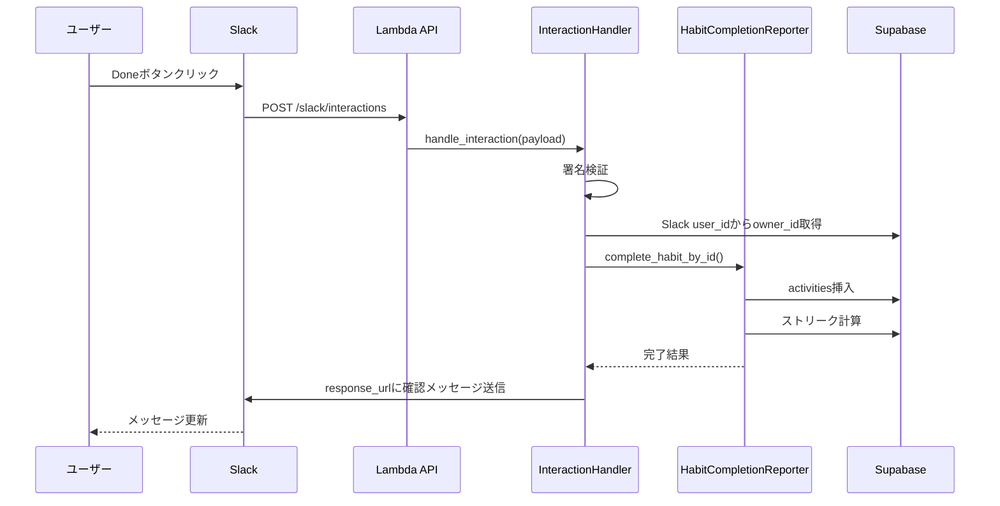

# 設計書

## 概要

本設計書は、VOW習慣管理アプリにおけるSlack通知機能の技術設計を定義します。既存のSlack OAuth連携、サービス層（FollowUpAgent、WeeklyReportGenerator、SlackBlockBuilder、HabitCompletionReporter）を活用し、AWS EventBridgeによるスケジュール実行を追加して、習慣リマインダー、フォローアップメッセージ、週次レポート、スラッシュコマンドを実装します。

## アーキテクチャ



## コンポーネントとインターフェース

### 1. Lambda関数

#### 1.1 リマインダーチェック Lambda

```python
# backend/app/handlers/reminder_handler.py

async def handle_reminder_check(event: dict, context: Any) -> dict:
    """
    EventBridgeから5分間隔で呼び出される。
    trigger_timeが到来した習慣のリマインダーを送信する。
    """
    pass

# 戻り値
{
    "statusCode": 200,
    "body": {
        "reminders_sent": int,
        "errors": int,
        "execution_time_ms": int
    }
}
```

#### 1.2 フォローアップチェック Lambda

```python
# backend/app/handlers/follow_up_handler.py

async def handle_follow_up_check(event: dict, context: Any) -> dict:
    """
    EventBridgeから15分間隔で呼び出される。
    - trigger_timeから2時間以上経過した未完了習慣のフォローアップ
    - remind_later_atが到来したリマインダーの再送信
    """
    pass
```

#### 1.3 週次レポート Lambda

```python
# backend/app/handlers/weekly_report_handler.py

async def handle_weekly_report(event: dict, context: Any) -> dict:
    """
    EventBridgeから15分間隔で呼び出される。
    設定された曜日・時刻に週次レポートを送信する。
    """
    pass
```

### 2. Slack Interaction Handler

```python
# backend/app/routers/slack_interactions.py

class SlackInteractionRouter:
    """Slackのインタラクション（ボタンクリック、スラッシュコマンド）を処理"""

    async def handle_interaction(self, payload: dict) -> dict:
        """ボタンクリックを処理"""
        pass

    async def handle_slash_command(self, command: str, text: str, user_id: str) -> dict:
        """スラッシュコマンドを処理"""
        pass
```

### 3. インターフェース定義

```python
# backend/app/schemas/slack_notifications.py

from pydantic import BaseModel
from datetime import datetime, time
from typing import Optional, List

class ReminderCheckResult(BaseModel):
    reminders_sent: int
    errors: int
    execution_time_ms: int

class FollowUpCheckResult(BaseModel):
    follow_ups_sent: int
    remind_laters_sent: int
    errors: int
    execution_time_ms: int

class WeeklyReportResult(BaseModel):
    reports_sent: int
    errors: int
    execution_time_ms: int

class SlackInteractionPayload(BaseModel):
    type: str  # "block_actions" or "shortcut"
    user: dict
    actions: Optional[List[dict]]
    response_url: str
    trigger_id: str

class SlashCommandPayload(BaseModel):
    command: str  # "/habit-done", "/habit-status", "/habit-list"
    text: str  # コマンドの引数
    user_id: str
    team_id: str
    channel_id: str
    response_url: str
```

## データモデル

### 既存テーブル（変更なし）

#### slack_connections
```sql
-- 既存のテーブル構造を使用
CREATE TABLE slack_connections (
    id TEXT PRIMARY KEY,
    owner_type TEXT NOT NULL DEFAULT 'user',
    owner_id TEXT NOT NULL,
    slack_user_id TEXT NOT NULL,
    slack_team_id TEXT NOT NULL,
    slack_team_name TEXT,
    access_token TEXT NOT NULL,  -- 暗号化済み
    refresh_token TEXT,          -- 暗号化済み
    is_valid BOOLEAN DEFAULT TRUE,
    connected_at TIMESTAMPTZ DEFAULT NOW(),
    updated_at TIMESTAMPTZ DEFAULT NOW(),
    UNIQUE(owner_type, owner_id)
);
```

#### notification_preferences
```sql
-- 既存のテーブル構造を使用
CREATE TABLE notification_preferences (
    id TEXT PRIMARY KEY,
    owner_type TEXT NOT NULL DEFAULT 'user',
    owner_id TEXT NOT NULL,
    slack_notifications_enabled BOOLEAN DEFAULT FALSE,
    weekly_slack_report_enabled BOOLEAN DEFAULT FALSE,
    weekly_report_day INTEGER DEFAULT 0,  -- 0=日曜日
    weekly_report_time TIME DEFAULT '09:00',
    updated_at TIMESTAMPTZ DEFAULT NOW(),
    UNIQUE(owner_type, owner_id)
);
```

#### slack_follow_up_status
```sql
-- 既存のテーブル構造を使用
CREATE TABLE slack_follow_up_status (
    id TEXT PRIMARY KEY,
    owner_type TEXT NOT NULL DEFAULT 'user',
    owner_id TEXT NOT NULL,
    habit_id TEXT NOT NULL,
    date DATE NOT NULL,
    reminder_sent_at TIMESTAMPTZ,
    follow_up_sent_at TIMESTAMPTZ,
    skipped BOOLEAN DEFAULT FALSE,
    remind_later_at TIMESTAMPTZ,
    updated_at TIMESTAMPTZ DEFAULT NOW(),
    UNIQUE(owner_type, owner_id, habit_id, date)
);
```

### 新規追加: usersテーブルへのtimezone列

```sql
-- ユーザーのタイムゾーン設定を追加
ALTER TABLE users 
ADD COLUMN IF NOT EXISTS timezone TEXT DEFAULT 'Asia/Tokyo';
```

## シーケンス図

### リマインダー送信フロー



### ボタンクリック処理フロー




## コンポーネント詳細設計

### 1. Lambdaハンドラー統合

```python
# backend/lambda_handler.py への追加

from mangum import Mangum
from app.main import app
from app.handlers.reminder_handler import handle_reminder_check
from app.handlers.follow_up_handler import handle_follow_up_check
from app.handlers.weekly_report_handler import handle_weekly_report

# API Gateway用ハンドラー
api_handler = Mangum(app, lifespan="off")

def handler(event, context):
    """
    統合Lambdaハンドラー
    EventBridgeとAPI Gatewayの両方に対応
    """
    # EventBridgeからの呼び出し
    if event.get("source") == "aws.scheduler":
        schedule_type = event.get("detail-type", "")
        
        if schedule_type == "reminder-check":
            return handle_reminder_check(event, context)
        elif schedule_type == "follow-up-check":
            return handle_follow_up_check(event, context)
        elif schedule_type == "weekly-report":
            return handle_weekly_report(event, context)
    
    # API Gateway経由のリクエスト
    return api_handler(event, context)
```

### 2. リマインダーサービス拡張

```python
# backend/app/services/reminder_service.py

from datetime import datetime, date, time, timedelta
from typing import List, Dict, Any, Optional
import pytz
from supabase import Client

from .slack_service import SlackIntegrationService, get_slack_service
from .slack_block_builder import SlackBlockBuilder
from .encryption import decrypt_token
from ..repositories.slack import SlackRepository
from ..schemas.slack import SlackMessage

class ReminderService:
    """習慣リマインダーの送信を管理するサービス"""

    def __init__(
        self,
        supabase: Client,
        slack_service: Optional[SlackIntegrationService] = None,
    ):
        self.supabase = supabase
        self.slack_service = slack_service or get_slack_service()
        self.slack_repo = SlackRepository(supabase)

    async def check_and_send_reminders(self) -> Dict[str, int]:
        """
        全ユーザーの習慣をチェックし、リマインダーを送信する。
        
        Returns:
            送信結果の統計
        """
        sent_count = 0
        error_count = 0
        today = date.today()

        # trigger_time設定済みのアクティブな習慣を取得
        habits = await self._get_habits_with_triggers()

        for habit in habits:
            try:
                owner_type = habit.get("owner_type", "user")
                owner_id = habit["owner_id"]
                habit_id = habit["id"]

                # ユーザーのタイムゾーンを取得
                user_tz = await self._get_user_timezone(owner_id)
                current_time = datetime.now(pytz.timezone(user_tz))

                # trigger_timeをユーザーのタイムゾーンで解釈
                trigger_time = self._parse_time(habit.get("trigger_time"))
                if not trigger_time:
                    continue

                # trigger_timeがまだ到来していない場合はスキップ
                if current_time.time() < trigger_time:
                    continue

                # 当日既にリマインダー送信済みかチェック
                status = await self.slack_repo.get_follow_up_status(
                    owner_type, owner_id, habit_id, today
                )
                if status and status.reminder_sent_at:
                    continue

                # 習慣が既に完了済みかチェック
                if await self._is_habit_completed_today(owner_type, owner_id, habit_id, today):
                    continue

                # ユーザーの通知設定を確認
                prefs = await self.slack_repo.get_preferences(owner_type, owner_id)
                if not prefs or not prefs.slack_notifications_enabled:
                    continue

                # Slack接続を取得
                connection = await self.slack_repo.get_connection_with_tokens(
                    owner_type, owner_id
                )
                if not connection or not connection.get("is_valid"):
                    continue

                # リマインダー送信
                success = await self._send_reminder(connection, habit)
                if success:
                    await self.slack_repo.mark_reminder_sent(
                        owner_type, owner_id, habit_id, today
                    )
                    sent_count += 1
                else:
                    error_count += 1

            except Exception as e:
                print(f"Error processing habit {habit.get('id')}: {e}")
                error_count += 1

        return {
            "reminders_sent": sent_count,
            "errors": error_count,
        }

    async def _get_user_timezone(self, user_id: str) -> str:
        """ユーザーのタイムゾーンを取得（デフォルト: Asia/Tokyo）"""
        result = self.supabase.table("users").select("timezone").eq(
            "id", user_id
        ).execute()
        
        if result.data and result.data[0].get("timezone"):
            return result.data[0]["timezone"]
        return "Asia/Tokyo"

    async def _send_reminder(
        self,
        connection: Dict[str, Any],
        habit: Dict[str, Any],
    ) -> bool:
        """Slackリマインダーを送信"""
        try:
            token = decrypt_token(connection["access_token"])
            slack_user_id = connection["slack_user_id"]

            channel = await self.slack_service.get_user_dm_channel(token, slack_user_id)
            if not channel:
                return False

            blocks = SlackBlockBuilder.habit_reminder(
                habit["name"],
                habit["id"],
                habit.get("trigger_message"),
            )

            message = SlackMessage(
                channel=channel,
                text=f"習慣のリマインダー: {habit['name']}",
                blocks=blocks,
            )

            response = await self.slack_service.send_message(token, message)
            return response.ok

        except Exception as e:
            print(f"Error sending reminder: {e}")
            return False

    async def _get_habits_with_triggers(self) -> List[Dict[str, Any]]:
        """trigger_time設定済みのアクティブな習慣を取得"""
        result = self.supabase.table("habits").select("*").not_.is_(
            "trigger_time", "null"
        ).eq("active", True).execute()
        
        return result.data if result.data else []

    async def _is_habit_completed_today(
        self,
        owner_type: str,
        owner_id: str,
        habit_id: str,
        check_date: date,
    ) -> bool:
        """習慣が当日完了済みかチェック"""
        result = self.supabase.table("activities").select("id").eq(
            "owner_type", owner_type
        ).eq("owner_id", owner_id).eq("habit_id", habit_id).eq(
            "date", check_date.isoformat()
        ).eq("completed", True).execute()
        
        return len(result.data) > 0 if result.data else False

    def _parse_time(self, time_str: Optional[str]) -> Optional[time]:
        """時刻文字列をtimeオブジェクトに変換"""
        if not time_str:
            return None
        
        try:
            if isinstance(time_str, time):
                return time_str
            
            for fmt in ["%H:%M:%S", "%H:%M", "%I:%M %p"]:
                try:
                    return datetime.strptime(time_str, fmt).time()
                except ValueError:
                    continue
            
            return None
        except Exception:
            return None
```

### 3. Slack Interaction Router

```python
# backend/app/routers/slack_interactions.py

from fastapi import APIRouter, Request, HTTPException, BackgroundTasks
from fastapi.responses import JSONResponse
import json
import urllib.parse
from typing import Optional

from ..services.slack_service import get_slack_service
from ..services.habit_completion_reporter import HabitCompletionReporter
from ..services.follow_up_agent import FollowUpAgent
from ..services.slack_block_builder import SlackBlockBuilder
from ..repositories.slack import SlackRepository
from ..config import get_supabase_client

router = APIRouter(prefix="/slack", tags=["slack"])

@router.post("/interactions")
async def handle_slack_interaction(
    request: Request,
    background_tasks: BackgroundTasks,
):
    """Slackのインタラクション（ボタンクリック）を処理"""
    slack_service = get_slack_service()
    
    # 署名検証
    timestamp = request.headers.get("X-Slack-Request-Timestamp", "")
    signature = request.headers.get("X-Slack-Signature", "")
    body = await request.body()
    
    if not slack_service.verify_signature(timestamp, body, signature):
        raise HTTPException(status_code=401, detail="Invalid signature")

    # ペイロード解析
    form_data = urllib.parse.parse_qs(body.decode())
    payload = json.loads(form_data.get("payload", ["{}"])[0])
    
    action_type = payload.get("type")
    
    if action_type == "block_actions":
        # バックグラウンドで処理（3秒以内にレスポンス必要）
        background_tasks.add_task(
            process_block_action,
            payload,
        )
        return JSONResponse(content={})
    
    return JSONResponse(content={"error": "Unknown action type"})


async def process_block_action(payload: dict):
    """ブロックアクション（ボタンクリック）を処理"""
    supabase = get_supabase_client()
    slack_repo = SlackRepository(supabase)
    completion_reporter = HabitCompletionReporter(supabase)
    follow_up_agent = FollowUpAgent(supabase)
    slack_service = get_slack_service()

    user = payload.get("user", {})
    slack_user_id = user.get("id")
    actions = payload.get("actions", [])
    response_url = payload.get("response_url")

    if not actions or not response_url:
        return

    action = actions[0]
    action_id = action.get("action_id", "")
    habit_id = action.get("value", "")

    # Slack user_idからowner_idを取得
    connection = await slack_repo.get_connection_by_slack_user(
        slack_user_id,
        payload.get("team", {}).get("id", ""),
    )
    
    if not connection:
        await slack_service.send_response(
            response_url,
            "VOWアカウントとの接続が見つかりません。",
            blocks=SlackBlockBuilder.not_connected(),
            replace_original=True,
        )
        return

    owner_type = connection.owner_type
    owner_id = connection.owner_id

    # アクションに応じた処理
    if action_id.startswith("habit_done_"):
        success, message, data = await completion_reporter.complete_habit_by_id(
            owner_id, habit_id, source="slack", owner_type=owner_type
        )
        
        if success:
            streak = data.get("streak", 0)
            habit_name = data.get("habit", {}).get("name", "")
            blocks = SlackBlockBuilder.habit_completion_confirm(habit_name, streak)
        elif data and data.get("already_completed"):
            habit_name = data.get("habit", {}).get("name", "")
            blocks = SlackBlockBuilder.habit_already_completed(habit_name)
        else:
            blocks = SlackBlockBuilder.error_message(message)
        
        await slack_service.send_response(
            response_url,
            message,
            blocks=blocks,
            replace_original=True,
        )

    elif action_id.startswith("habit_skip_"):
        await follow_up_agent.skip_habit_today(owner_type, owner_id, habit_id)
        
        habit = await completion_reporter._get_habit_by_id(habit_id)
        habit_name = habit.get("name", "") if habit else ""
        
        await slack_service.send_response(
            response_url,
            f"{habit_name}を今日はスキップしました",
            blocks=SlackBlockBuilder.habit_skipped(habit_name),
            replace_original=True,
        )

    elif action_id.startswith("habit_later_"):
        await follow_up_agent.schedule_reminder_later(
            owner_type, owner_id, habit_id, delay_minutes=60
        )
        
        habit = await completion_reporter._get_habit_by_id(habit_id)
        habit_name = habit.get("name", "") if habit else ""
        
        await slack_service.send_response(
            response_url,
            f"60分後に{habit_name}をリマインドします",
            blocks=SlackBlockBuilder.habit_remind_later(habit_name, 60),
            replace_original=True,
        )


@router.post("/commands")
async def handle_slash_command(
    request: Request,
    background_tasks: BackgroundTasks,
):
    """スラッシュコマンドを処理"""
    slack_service = get_slack_service()
    
    # 署名検証
    timestamp = request.headers.get("X-Slack-Request-Timestamp", "")
    signature = request.headers.get("X-Slack-Signature", "")
    body = await request.body()
    
    if not slack_service.verify_signature(timestamp, body, signature):
        raise HTTPException(status_code=401, detail="Invalid signature")

    # フォームデータ解析
    form_data = urllib.parse.parse_qs(body.decode())
    command = form_data.get("command", [""])[0]
    text = form_data.get("text", [""])[0]
    user_id = form_data.get("user_id", [""])[0]
    team_id = form_data.get("team_id", [""])[0]
    response_url = form_data.get("response_url", [""])[0]

    # バックグラウンドで処理
    background_tasks.add_task(
        process_slash_command,
        command, text, user_id, team_id, response_url,
    )
    
    return JSONResponse(content={"response_type": "ephemeral"})


async def process_slash_command(
    command: str,
    text: str,
    slack_user_id: str,
    team_id: str,
    response_url: str,
):
    """スラッシュコマンドを処理"""
    supabase = get_supabase_client()
    slack_repo = SlackRepository(supabase)
    completion_reporter = HabitCompletionReporter(supabase)
    slack_service = get_slack_service()

    # Slack user_idからowner_idを取得
    connection = await slack_repo.get_connection_by_slack_user(slack_user_id, team_id)
    
    if not connection:
        await slack_service.send_response(
            response_url,
            "VOWアカウントとの接続が見つかりません。",
            blocks=SlackBlockBuilder.not_connected(),
        )
        return

    owner_type = connection.owner_type
    owner_id = connection.owner_id

    if command == "/habit-done":
        if text.strip():
            # 名前指定で完了
            success, message, data = await completion_reporter.complete_habit_by_name(
                owner_id, text.strip(), source="slack", owner_type=owner_type
            )
            
            if success:
                streak = data.get("streak", 0)
                habit_name = data.get("habit", {}).get("name", "")
                blocks = SlackBlockBuilder.habit_completion_confirm(habit_name, streak)
            elif data and data.get("suggestions"):
                blocks = SlackBlockBuilder.habit_not_found(text.strip(), data["suggestions"])
            else:
                blocks = SlackBlockBuilder.error_message(message)
            
            await slack_service.send_response(response_url, message, blocks=blocks)
        else:
            # 未完了の習慣リストを表示
            habits = await completion_reporter.get_incomplete_habits_today(owner_id, owner_type)
            blocks = SlackBlockBuilder.habit_list(habits, show_buttons=True)
            await slack_service.send_response(
                response_url,
                "完了する習慣を選択してください",
                blocks=blocks,
            )

    elif command == "/habit-status":
        summary = await completion_reporter.get_today_summary(owner_id, owner_type)
        blocks = SlackBlockBuilder.habit_status(
            summary["completed"],
            summary["total"],
            summary["habits"],
        )
        await slack_service.send_response(
            response_url,
            f"今日の進捗: {summary['completed']}/{summary['total']}",
            blocks=blocks,
        )

    elif command == "/habit-list":
        habits = await completion_reporter.get_all_habits_with_status(owner_id, owner_type)
        blocks = SlackBlockBuilder.habit_list(habits, show_buttons=True)
        await slack_service.send_response(
            response_url,
            "あなたの習慣一覧",
            blocks=blocks,
        )

    else:
        blocks = SlackBlockBuilder.available_commands()
        await slack_service.send_response(
            response_url,
            "利用可能なコマンド",
            blocks=blocks,
        )
```


### 4. EventBridge スケジュール設定

```hcl
# infra/terraform/eventbridge.tf

# リマインダーチェック（5分間隔）
resource "aws_scheduler_schedule" "reminder_check" {
  name       = "${var.project_name}-reminder-check"
  group_name = "default"

  flexible_time_window {
    mode = "OFF"
  }

  schedule_expression = "rate(5 minutes)"

  target {
    arn      = aws_lambda_function.vow_api.arn
    role_arn = aws_iam_role.scheduler_role.arn

    input = jsonencode({
      source      = "aws.scheduler"
      detail-type = "reminder-check"
    })
  }
}

# フォローアップチェック（15分間隔）
resource "aws_scheduler_schedule" "follow_up_check" {
  name       = "${var.project_name}-follow-up-check"
  group_name = "default"

  flexible_time_window {
    mode = "OFF"
  }

  schedule_expression = "rate(15 minutes)"

  target {
    arn      = aws_lambda_function.vow_api.arn
    role_arn = aws_iam_role.scheduler_role.arn

    input = jsonencode({
      source      = "aws.scheduler"
      detail-type = "follow-up-check"
    })
  }
}

# 週次レポート（15分間隔）
resource "aws_scheduler_schedule" "weekly_report" {
  name       = "${var.project_name}-weekly-report"
  group_name = "default"

  flexible_time_window {
    mode = "OFF"
  }

  schedule_expression = "rate(15 minutes)"

  target {
    arn      = aws_lambda_function.vow_api.arn
    role_arn = aws_iam_role.scheduler_role.arn

    input = jsonencode({
      source      = "aws.scheduler"
      detail-type = "weekly-report"
    })
  }
}

# スケジューラー用IAMロール
resource "aws_iam_role" "scheduler_role" {
  name = "${var.project_name}-scheduler-role"

  assume_role_policy = jsonencode({
    Version = "2012-10-17"
    Statement = [
      {
        Action = "sts:AssumeRole"
        Effect = "Allow"
        Principal = {
          Service = "scheduler.amazonaws.com"
        }
      }
    ]
  })
}

resource "aws_iam_role_policy" "scheduler_lambda_invoke" {
  name = "${var.project_name}-scheduler-lambda-invoke"
  role = aws_iam_role.scheduler_role.id

  policy = jsonencode({
    Version = "2012-10-17"
    Statement = [
      {
        Effect   = "Allow"
        Action   = "lambda:InvokeFunction"
        Resource = aws_lambda_function.vow_api.arn
      }
    ]
  })
}
```

### 5. Lambdaハンドラー実装

```python
# backend/app/handlers/reminder_handler.py

import time
import asyncio
from typing import Any, Dict

from ..services.reminder_service import ReminderService
from ..config import get_supabase_client

def handle_reminder_check(event: dict, context: Any) -> dict:
    """リマインダーチェックLambdaハンドラー"""
    start_time = time.time()
    
    try:
        supabase = get_supabase_client()
        service = ReminderService(supabase)
        
        # 非同期処理を実行
        result = asyncio.get_event_loop().run_until_complete(
            service.check_and_send_reminders()
        )
        
        execution_time = int((time.time() - start_time) * 1000)
        
        return {
            "statusCode": 200,
            "body": {
                "reminders_sent": result["reminders_sent"],
                "errors": result["errors"],
                "execution_time_ms": execution_time,
            }
        }
    except Exception as e:
        print(f"Error in reminder check: {e}")
        return {
            "statusCode": 500,
            "body": {"error": str(e)}
        }


# backend/app/handlers/follow_up_handler.py

import time
import asyncio
from typing import Any

from ..services.follow_up_agent import FollowUpAgent
from ..config import get_supabase_client

def handle_follow_up_check(event: dict, context: Any) -> dict:
    """フォローアップチェックLambdaハンドラー"""
    start_time = time.time()
    
    try:
        supabase = get_supabase_client()
        agent = FollowUpAgent(supabase)
        
        loop = asyncio.get_event_loop()
        
        # フォローアップ送信
        follow_up_count = loop.run_until_complete(
            agent.check_and_send_follow_ups()
        )
        
        # Remind Later送信
        remind_later_count = loop.run_until_complete(
            agent.check_remind_later()
        )
        
        execution_time = int((time.time() - start_time) * 1000)
        
        return {
            "statusCode": 200,
            "body": {
                "follow_ups_sent": follow_up_count,
                "remind_laters_sent": remind_later_count,
                "errors": 0,
                "execution_time_ms": execution_time,
            }
        }
    except Exception as e:
        print(f"Error in follow-up check: {e}")
        return {
            "statusCode": 500,
            "body": {"error": str(e)}
        }


# backend/app/handlers/weekly_report_handler.py

import time
import asyncio
from typing import Any

from ..services.weekly_report_generator import WeeklyReportGenerator
from ..config import get_supabase_client

def handle_weekly_report(event: dict, context: Any) -> dict:
    """週次レポートLambdaハンドラー"""
    start_time = time.time()
    
    try:
        supabase = get_supabase_client()
        generator = WeeklyReportGenerator(supabase)
        
        reports_sent = asyncio.get_event_loop().run_until_complete(
            generator.send_all_weekly_reports()
        )
        
        execution_time = int((time.time() - start_time) * 1000)
        
        return {
            "statusCode": 200,
            "body": {
                "reports_sent": reports_sent,
                "errors": 0,
                "execution_time_ms": execution_time,
            }
        }
    except Exception as e:
        print(f"Error in weekly report: {e}")
        return {
            "statusCode": 500,
            "body": {"error": str(e)}
        }
```

## 正確性プロパティ

*正確性プロパティとは、システムの全ての有効な実行において真であるべき特性や振る舞いを表す形式的な記述です。プロパティは人間が読める仕様と機械で検証可能な正確性保証の橋渡しをします。*


### Property 1: リマインダー送信条件

*任意の*習慣とユーザー設定の組み合わせに対して、以下の全ての条件を満たす場合にのみリマインダーが送信される:
- trigger_timeが現在時刻以前
- slack_notifications_enabled = true
- 当日未完了
- 当日リマインダー未送信
- Slack接続が有効

**Validates: Requirements 1.1, 1.3, 1.4, 1.5, 1.6**

### Property 2: リマインダーメッセージフォーマット

*任意の*リマインダーメッセージに対して、Done、Skip、Remind Laterの3つのボタンが含まれる。

**Validates: Requirements 1.2**

### Property 3: フォローアップ送信条件

*任意の*習慣とユーザー設定の組み合わせに対して、以下の全ての条件を満たす場合にのみフォローアップが送信される:
- trigger_timeから2時間以上経過
- 当日未完了
- 当日フォローアップ未送信
- skipped = false

**Validates: Requirements 2.1, 2.3, 2.4**

### Property 4: フォローアップメッセージフォーマット

*任意の*フォローアップメッセージに対して、経過時間とDone、Skip、Remind Laterの3つのボタンが含まれる。

**Validates: Requirements 2.2**

### Property 5: Remind Later処理

*任意の*Remind Laterボタンクリックに対して、remind_later_atが現在時刻+60分に設定され、その時刻到来後にリマインダーが再送信される。

**Validates: Requirements 2.5**

### Property 6: ボタンアクション処理

*任意の*ボタンクリック（Done/Skip/Remind Later）に対して:
- Doneクリック → activitiesに完了レコードが作成される
- Skipクリック → skipped=trueが設定される
- Remind Laterクリック → remind_later_atが設定される

**Validates: Requirements 3.1, 3.2, 3.3**

### Property 7: ストリーク表示

*任意の*習慣完了時に、連続完了日数が1以上の場合、確認メッセージにストリーク数が含まれる。

**Validates: Requirements 3.4**

### Property 8: 重複完了処理

*任意の*既に当日完了済みの習慣に対するDoneクリックは、新しいレコードを作成せず、既に完了済みである旨のメッセージを返す。

**Validates: Requirements 3.5**

### Property 9: 週次レポート送信条件

*任意の*ユーザーに対して、以下の全ての条件を満たす場合にのみ週次レポートが送信される:
- weekly_slack_report_enabled = true
- 現在の曜日 = weekly_report_day
- 現在の時刻がweekly_report_timeの15分以内

**Validates: Requirements 4.1, 4.3**

### Property 10: 週次レポート内容

*任意の*週次レポートに対して、完了率、完了数/総数、最長ストリーク、注意が必要な習慣、アプリへのリンクボタンが含まれる。

**Validates: Requirements 4.2, 4.4**

### Property 11: アクティビティなしの週次レポート

*任意の*当週にアクティビティがないユーザーに対して、習慣追加を促すメッセージが送信される。

**Validates: Requirements 4.5**

### Property 12: スラッシュコマンド処理

*任意の*スラッシュコマンドに対して:
- /habit-done [name] → 指定された習慣が完了としてマークされる
- /habit-done（名前なし） → 未完了習慣リストがボタン付きで表示される
- /habit-status → 当日の進捗サマリーが表示される
- /habit-list → ゴール別にグループ化された習慣リストが表示される

**Validates: Requirements 5.1, 5.2, 5.3, 5.4**

### Property 13: 習慣名の類似検索

*任意の*存在しない習慣名に対する/habit-doneコマンドは、類似度が閾値以上の習慣名を提案する。

**Validates: Requirements 5.5**

### Property 14: 未接続ユーザーへのメッセージ

*任意の*Slack接続が存在しないユーザーからのコマンドに対して、接続を促すメッセージが返される。

**Validates: Requirements 5.6**

### Property 15: Lambda実行結果

*任意の*Lambda関数実行に対して、戻り値に送信数とエラー数が含まれる。

**Validates: Requirements 6.5**

### Property 16: タイムゾーン処理

*任意の*ユーザーに対して:
- タイムゾーンが設定されている場合、そのタイムゾーンで時刻が計算される
- タイムゾーンが未設定の場合、Asia/Tokyoで時刻が計算される

**Validates: Requirements 7.1, 7.2, 7.3**

### Property 17: レート制限とサーキットブレーカー

*任意の*Slack APIエラーに対して:
- レート制限エラー → Retry-Afterに基づいて指数バックオフでリトライ
- 3回連続失敗 → サーキットブレーカーが開く

**Validates: Requirements 8.1, 8.2**

### Property 18: トークンリフレッシュ

*任意の*期限切れトークンに対して、リフレッシュトークンを使用して新しいトークンの取得が試行される。リフレッシュ失敗時はis_valid=falseが設定される。

**Validates: Requirements 8.3, 8.4**

### Property 19: エラーハンドリング

*任意の*予期しないエラーに対して、エラーがログに記録され、処理が継続される（他のユーザーへの通知は影響を受けない）。

**Validates: Requirements 3.6, 8.5**

## エラーハンドリング

### Slack APIエラー

| エラー種別 | 対応 |
|-----------|------|
| `ratelimited` | Retry-Afterヘッダーに基づいて指数バックオフでリトライ（最大3回） |
| `token_expired` | リフレッシュトークンで新しいトークンを取得 |
| `invalid_auth` | 接続を無効としてマーク、ユーザーに再接続を促す |
| `channel_not_found` | DMチャンネルを再取得 |
| その他 | エラーをログに記録し、次のユーザーの処理を継続 |

### サーキットブレーカー

```python
class CircuitBreaker:
    failure_threshold: int = 5  # 失敗回数の閾値
    success_threshold: int = 2  # 回復に必要な成功回数
    timeout: int = 30           # オープン状態のタイムアウト（秒）
    
    states:
    - closed: 通常動作
    - open: リクエストを拒否
    - half-open: 一部のリクエストを許可してテスト
```

### Lambda実行エラー

- 個別のユーザー処理でエラーが発生しても、他のユーザーの処理は継続
- エラー数は戻り値に含めてCloudWatchで監視
- 重大なエラー（DB接続失敗など）はアラートを発生

## テスト戦略

### ユニットテスト

- ReminderService: リマインダー送信条件のテスト
- FollowUpAgent: フォローアップ送信条件のテスト
- SlackBlockBuilder: メッセージフォーマットのテスト
- HabitCompletionReporter: 習慣完了処理のテスト
- タイムゾーン処理のテスト

### プロパティベーステスト

プロパティベーステストには `hypothesis` ライブラリを使用します。

各プロパティテストは最低100回のイテレーションで実行し、以下のタグ形式でコメントを付与します:
**Feature: slack-habit-notifications, Property {number}: {property_text}**

### 統合テスト

- Slack APIモックを使用したエンドツーエンドテスト
- EventBridgeトリガーのシミュレーション
- ボタンクリック処理のテスト
- スラッシュコマンド処理のテスト

### テスト環境

- Slack APIはモックを使用
- Supabaseはテスト用データベースを使用
- EventBridgeはローカルでシミュレーション
