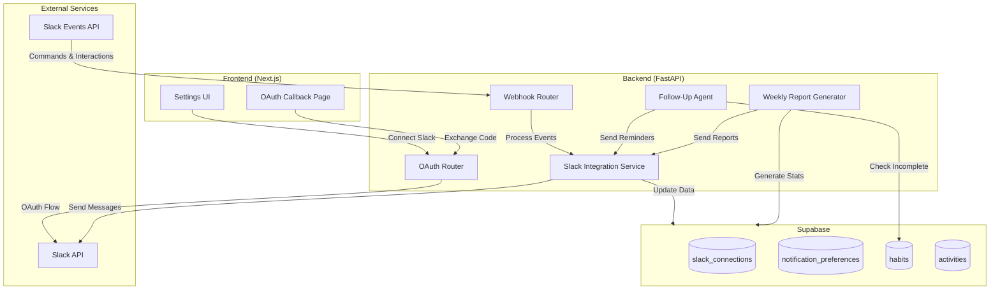
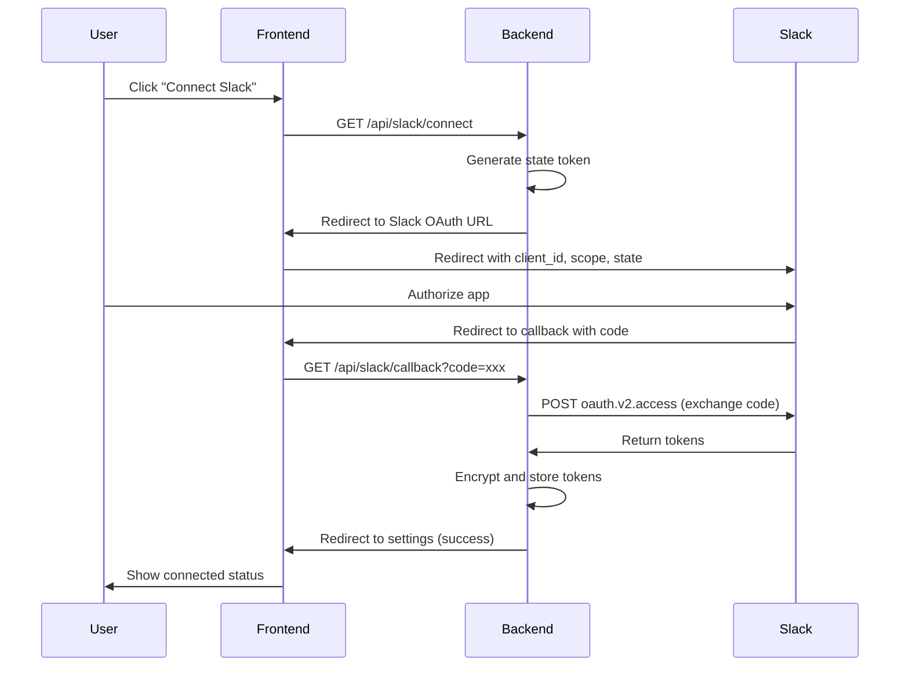
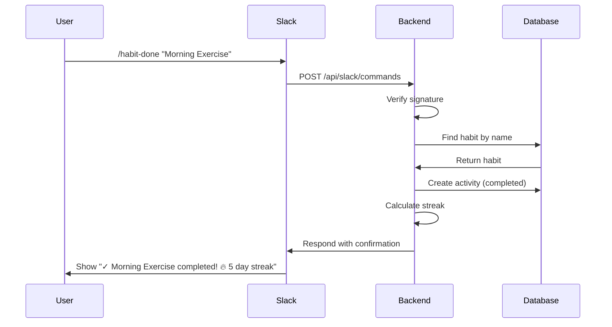
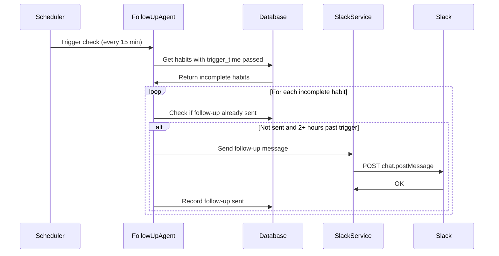

# Design Document: Slack Integration

## Overview

This design document describes the architecture and implementation approach for integrating Slack with the habit management dashboard. The integration enables bidirectional communication: users can report habit completions and check status via Slack commands, while the system sends automated follow-up messages and weekly reports to users through Slack.

The implementation follows a modular architecture with clear separation between:
- **OAuth handling** for secure Slack workspace connections
- **Webhook processing** for incoming Slack events and commands
- **Message composition** using Slack's Block Kit for rich formatting
- **Scheduled jobs** for follow-up messages and weekly reports

## Architecture



## Components and Interfaces

### 1. Slack OAuth Router (`/api/slack/oauth`)

Handles the OAuth 2.0 flow for connecting Slack workspaces.

```python
# backend/app/routers/slack_oauth.py

from fastapi import APIRouter, HTTPException, Query
from fastapi.responses import RedirectResponse

router = APIRouter(prefix="/api/slack", tags=["slack"])

@router.get("/connect")
async def initiate_oauth(owner_type: str, owner_id: str) -> RedirectResponse:
    """
    Initiates Slack OAuth flow.
    Redirects user to Slack authorization page.
    """
    pass

@router.get("/callback")
async def oauth_callback(
    code: str = Query(...),
    state: str = Query(...)
) -> RedirectResponse:
    """
    Handles OAuth callback from Slack.
    Exchanges code for tokens and stores connection.
    """
    pass

@router.post("/disconnect")
async def disconnect_slack(owner_type: str, owner_id: str) -> dict:
    """
    Revokes tokens and removes Slack connection.
    """
    pass
```

### 2. Slack Webhook Router (`/api/slack/webhook`)

Processes incoming events from Slack (slash commands, interactive components).

```python
# backend/app/routers/slack_webhook.py

from fastapi import APIRouter, Request, HTTPException

router = APIRouter(prefix="/api/slack", tags=["slack"])

@router.post("/commands")
async def handle_slash_command(request: Request) -> dict:
    """
    Handles slash commands: /habit-done, /habit-status, /habit-list
    Must respond within 3 seconds.
    """
    pass

@router.post("/interactions")
async def handle_interaction(request: Request) -> dict:
    """
    Handles interactive component callbacks (button clicks).
    """
    pass

@router.post("/events")
async def handle_event(request: Request) -> dict:
    """
    Handles Slack Events API (URL verification, app mentions).
    """
    pass
```

### 3. Slack Integration Service

Core service for Slack API interactions.

```python
# backend/app/services/slack_service.py

from typing import Optional
from dataclasses import dataclass

@dataclass
class SlackMessage:
    channel: str
    text: str
    blocks: Optional[list] = None

class SlackIntegrationService:
    async def send_message(self, connection_id: str, message: SlackMessage) -> bool:
        """Sends a message to a Slack channel or DM."""
        pass
    
    async def send_habit_reminder(self, owner_id: str, habit_id: str) -> bool:
        """Sends a habit reminder with interactive buttons."""
        pass
    
    async def send_follow_up(self, owner_id: str, habit_id: str) -> bool:
        """Sends a follow-up message for incomplete habit."""
        pass
    
    async def send_weekly_report(self, owner_id: str, report_data: dict) -> bool:
        """Sends formatted weekly summary report."""
        pass
    
    async def verify_signature(self, timestamp: str, body: bytes, signature: str) -> bool:
        """Verifies Slack request signature using HMAC-SHA256."""
        pass
    
    async def refresh_token(self, connection_id: str) -> bool:
        """Refreshes expired access token."""
        pass
```

### 4. Habit Completion Reporter

Processes habit completions from Slack interactions.

```python
# backend/app/services/habit_completion_reporter.py

class HabitCompletionReporter:
    async def complete_habit_by_name(
        self, 
        owner_id: str, 
        habit_name: str,
        source: str = "slack"
    ) -> tuple[bool, str]:
        """
        Finds and completes a habit by name.
        Returns (success, message).
        """
        pass
    
    async def complete_habit_by_id(
        self,
        owner_id: str,
        habit_id: str,
        source: str = "slack"
    ) -> tuple[bool, str]:
        """
        Completes a habit by ID.
        Returns (success, message).
        """
        pass
    
    async def get_incomplete_habits_today(self, owner_id: str) -> list[dict]:
        """Returns list of habits not yet completed today."""
        pass
    
    async def get_habit_streak(self, habit_id: str) -> int:
        """Returns current streak count for a habit."""
        pass
```

### 5. Follow-Up Agent

Monitors incomplete habits and sends follow-up messages.

```python
# backend/app/services/follow_up_agent.py

from datetime import time

class FollowUpAgent:
    async def check_and_send_reminders(self) -> int:
        """
        Checks all habits with trigger times and sends reminders.
        Returns count of reminders sent.
        """
        pass
    
    async def check_and_send_follow_ups(self) -> int:
        """
        Checks habits that are 2+ hours past trigger time and incomplete.
        Sends follow-up messages.
        Returns count of follow-ups sent.
        """
        pass
    
    async def schedule_reminder_later(
        self, 
        owner_id: str, 
        habit_id: str, 
        delay_minutes: int = 60
    ) -> bool:
        """Schedules a reminder for later."""
        pass
    
    async def skip_habit_today(self, owner_id: str, habit_id: str) -> bool:
        """Records that user skipped this habit today."""
        pass
```

### 6. Weekly Report Generator

Compiles and sends weekly summary reports.

```python
# backend/app/services/weekly_report_generator.py

from dataclasses import dataclass
from datetime import date

@dataclass
class WeeklyReportData:
    total_habits: int
    completed_habits: int
    completion_rate: float
    best_streak: int
    best_streak_habit: str
    habits_needing_attention: list[str]
    week_start: date
    week_end: date

class WeeklyReportGenerator:
    async def generate_report(self, owner_id: str) -> WeeklyReportData:
        """Generates weekly statistics for a user."""
        pass
    
    async def send_all_weekly_reports(self) -> int:
        """
        Sends weekly reports to all users with enabled preference.
        Returns count of reports sent.
        """
        pass
    
    def format_report_blocks(self, report: WeeklyReportData) -> list[dict]:
        """Formats report data into Slack Block Kit blocks."""
        pass
```

### 7. Block Kit Message Builder

Utility for building Slack Block Kit messages.

```python
# backend/app/services/slack_block_builder.py

class SlackBlockBuilder:
    @staticmethod
    def habit_reminder(habit_name: str, habit_id: str, trigger_message: str) -> list[dict]:
        """Builds reminder message with Done/Skip/Later buttons."""
        pass
    
    @staticmethod
    def habit_completion_confirm(habit_name: str, streak: int) -> list[dict]:
        """Builds confirmation message after habit completion."""
        pass
    
    @staticmethod
    def habit_list(habits: list[dict]) -> list[dict]:
        """Builds interactive list of habits with completion buttons."""
        pass
    
    @staticmethod
    def habit_status(completed: int, total: int, habits: list[dict]) -> list[dict]:
        """Builds status summary with habit details."""
        pass
    
    @staticmethod
    def weekly_report(report: 'WeeklyReportData', app_url: str) -> list[dict]:
        """Builds formatted weekly report with View Full Report button."""
        pass
    
    @staticmethod
    def error_message(message: str, suggestions: list[str] = None) -> list[dict]:
        """Builds error message with optional suggestions."""
        pass
```

## Data Models

### Database Schema

```sql
-- Slack connections table
CREATE TABLE slack_connections (
    id TEXT PRIMARY KEY DEFAULT gen_random_uuid()::text,
    owner_type TEXT NOT NULL,
    owner_id TEXT NOT NULL,
    slack_user_id TEXT NOT NULL,
    slack_team_id TEXT NOT NULL,
    slack_team_name TEXT,
    slack_user_name TEXT,
    access_token TEXT NOT NULL,  -- Encrypted
    refresh_token TEXT,          -- Encrypted
    bot_access_token TEXT,       -- Encrypted
    token_expires_at TIMESTAMPTZ,
    connected_at TIMESTAMPTZ DEFAULT NOW(),
    updated_at TIMESTAMPTZ DEFAULT NOW(),
    is_valid BOOLEAN DEFAULT TRUE,
    UNIQUE(owner_type, owner_id)
);

-- Indexes
CREATE INDEX idx_slack_connections_owner ON slack_connections(owner_type, owner_id);
CREATE INDEX idx_slack_connections_slack_user ON slack_connections(slack_user_id);

-- RLS
ALTER TABLE slack_connections ENABLE ROW LEVEL SECURITY;

CREATE POLICY "Users can access own slack connections" ON slack_connections
    FOR ALL USING (
        owner_type = 'user' AND owner_id = auth.uid()::text
    );

-- Add columns to notification_preferences (or create if not exists)
ALTER TABLE notification_preferences 
ADD COLUMN IF NOT EXISTS slack_notifications_enabled BOOLEAN DEFAULT FALSE,
ADD COLUMN IF NOT EXISTS weekly_slack_report_enabled BOOLEAN DEFAULT FALSE,
ADD COLUMN IF NOT EXISTS weekly_report_day INTEGER DEFAULT 0,  -- 0 = Sunday
ADD COLUMN IF NOT EXISTS weekly_report_time TIME DEFAULT '09:00';

-- Slack follow-up tracking
CREATE TABLE slack_follow_up_status (
    id TEXT PRIMARY KEY DEFAULT gen_random_uuid()::text,
    owner_type TEXT NOT NULL,
    owner_id TEXT NOT NULL,
    habit_id TEXT NOT NULL REFERENCES habits(id) ON DELETE CASCADE,
    date DATE NOT NULL DEFAULT CURRENT_DATE,
    reminder_sent_at TIMESTAMPTZ,
    follow_up_sent_at TIMESTAMPTZ,
    skipped BOOLEAN DEFAULT FALSE,
    remind_later_at TIMESTAMPTZ,
    UNIQUE(owner_type, owner_id, habit_id, date)
);

CREATE INDEX idx_slack_follow_up_owner ON slack_follow_up_status(owner_type, owner_id);
CREATE INDEX idx_slack_follow_up_date ON slack_follow_up_status(date);

ALTER TABLE slack_follow_up_status ENABLE ROW LEVEL SECURITY;

CREATE POLICY "Users can access own follow up status" ON slack_follow_up_status
    FOR ALL USING (
        owner_type = 'user' AND owner_id = auth.uid()::text
    );
```

### TypeScript Interfaces (Frontend)

```typescript
// frontend/lib/types/slack.ts

export interface SlackConnection {
  id: string;
  slackUserId: string;
  slackTeamId: string;
  slackTeamName: string;
  slackUserName: string;
  connectedAt: string;
  isValid: boolean;
}

export interface SlackPreferences {
  slackNotificationsEnabled: boolean;
  weeklySlackReportEnabled: boolean;
  weeklyReportDay: number;  // 0-6, Sunday = 0
  weeklyReportTime: string; // HH:MM format
}

export interface SlackConnectionStatus {
  connected: boolean;
  connection?: SlackConnection;
  preferences?: SlackPreferences;
}
```

### Pydantic Schemas (Backend)

```python
# backend/app/schemas/slack.py

from pydantic import BaseModel
from datetime import datetime, time
from typing import Optional

class SlackConnectionCreate(BaseModel):
    slack_user_id: str
    slack_team_id: str
    slack_team_name: Optional[str]
    slack_user_name: Optional[str]
    access_token: str
    refresh_token: Optional[str]
    bot_access_token: Optional[str]
    token_expires_at: Optional[datetime]

class SlackConnectionResponse(BaseModel):
    id: str
    slack_user_id: str
    slack_team_id: str
    slack_team_name: Optional[str]
    slack_user_name: Optional[str]
    connected_at: datetime
    is_valid: bool

class SlackPreferencesUpdate(BaseModel):
    slack_notifications_enabled: Optional[bool] = None
    weekly_slack_report_enabled: Optional[bool] = None
    weekly_report_day: Optional[int] = None  # 0-6
    weekly_report_time: Optional[time] = None

class SlashCommandPayload(BaseModel):
    command: str
    text: str
    user_id: str
    team_id: str
    channel_id: str
    response_url: str

class InteractionPayload(BaseModel):
    type: str
    user: dict
    team: dict
    actions: list
    response_url: str
    trigger_id: str
```

## Sequence Diagrams

### OAuth Flow



### Habit Completion via Slash Command



### Follow-Up Agent Flow




## Correctness Properties

*A property is a characteristic or behavior that should hold true across all valid executions of a system—essentially, a formal statement about what the system should do. Properties serve as the bridge between human-readable specifications and machine-verifiable correctness guarantees.*

Based on the prework analysis of acceptance criteria, the following correctness properties have been identified for property-based testing:

### Property 1: Token Storage Security and Completeness

*For any* valid OAuth token response from Slack, when stored by the Slack_Integration_Service, the access_token and refresh_token SHALL be encrypted (not stored in plaintext), and all required fields (slack_user_id, slack_team_id, access_token) SHALL be present in the database record.

**Validates: Requirements 1.3, 1.7**

### Property 2: Habit Completion Source Tracking

*For any* habit completed via Slack (slash command or button interaction), the resulting activity record SHALL have source="slack" to distinguish it from completions made through the web app.

**Validates: Requirements 3.7**

### Property 3: Completion Confirmation Content

*For any* successfully completed habit via Slack, the response message SHALL contain the habit name and the current streak count.

**Validates: Requirements 3.4**

### Property 4: Status Command Accuracy

*For any* user with habits, when the /habit-status command is executed, the response SHALL show completed count and total count that match the actual habit completion state for today.

**Validates: Requirements 4.1, 4.2**

### Property 5: List Command Completeness

*For any* user with active habits, when the /habit-list command is executed, the response SHALL include all active habits with their current streaks, grouped by their associated goals.

**Validates: Requirements 4.3, 4.4**

### Property 6: Reminder Trigger Condition

*For any* habit with trigger_time set and reminder_enabled=true, when the current time matches or passes the trigger_time, the Follow_Up_Agent SHALL send a Slack reminder (if slack_notifications_enabled=true).

**Validates: Requirements 5.1**

### Property 7: Follow-Up Timing

*For any* habit that remains incomplete 2 or more hours after its trigger_time, the Follow_Up_Agent SHALL send a follow-up message (if not already sent today and slack_notifications_enabled=true).

**Validates: Requirements 5.2**

### Property 8: Follow-Up Message Format

*For any* follow-up message sent by the Follow_Up_Agent, the message SHALL contain exactly three interactive buttons: "Done ✓", "Skip today", and "Remind me later".

**Validates: Requirements 5.3**

### Property 9: Skip Prevents Further Reminders

*For any* habit where the user clicks "Skip today", the Follow_Up_Agent SHALL not send any additional reminders or follow-ups for that habit on the same day.

**Validates: Requirements 5.5**

### Property 10: Notification Preference Respect

*For any* user with slack_notifications_enabled=false, the Follow_Up_Agent SHALL not send any Slack messages (reminders or follow-ups) to that user.

**Validates: Requirements 5.7**

### Property 11: Weekly Report Preference Respect

*For any* user with weekly_slack_report_enabled=false, the Weekly_Report_Generator SHALL not send weekly reports to that user via Slack.

**Validates: Requirements 6.7**

### Property 12: Weekly Report Content Completeness

*For any* weekly report generated, the report SHALL include: total habits completed, completion rate, best streak with habit name, habits needing attention, and a "View Full Report" button linking to the app.

**Validates: Requirements 6.2, 6.3, 6.4**

### Property 13: Webhook Signature Verification

*For any* incoming webhook request, the Slack_Webhook_Handler SHALL verify the X-Slack-Signature using HMAC-SHA256 with the request timestamp. Requests with invalid signatures SHALL receive 401 Unauthorized. Requests with timestamps older than 5 minutes SHALL be rejected.

**Validates: Requirements 8.1, 8.2, 8.3, 8.4**

### Property 14: Invalid Connection Fallback

*For any* user whose Slack connection is marked as invalid (is_valid=false), the Follow_Up_Agent SHALL fall back to in-app notifications instead of attempting Slack messages.

**Validates: Requirements 9.6**

## Error Handling

### OAuth Errors

| Error | Handling |
|-------|----------|
| User denies authorization | Redirect to settings with error message, allow retry |
| Invalid state token | Reject callback, log security event, show error |
| Token exchange fails | Show error message, allow retry |
| Network timeout | Retry with exponential backoff (max 3 attempts) |

### Webhook Errors

| Error | Handling |
|-------|----------|
| Invalid signature | Return 401 Unauthorized, log attempt |
| Timestamp too old | Return 401 Unauthorized (replay attack prevention) |
| Unknown command | Return helpful error message with available commands |
| Habit not found | Return error with similar habit name suggestions |
| User not connected | Return message prompting user to connect Slack |

### API Errors

| Error | Handling |
|-------|----------|
| Rate limited (429) | Exponential backoff: 1s, 2s, 4s, 8s, max 5 retries |
| Token expired | Attempt refresh, if fails mark connection invalid |
| Token revoked | Mark connection invalid, notify user to reconnect |
| Network failure | Queue message for retry, log error |
| Channel not found | Log error, skip message (user may have left workspace) |

### Circuit Breaker Configuration

```python
CIRCUIT_BREAKER_CONFIG = {
    "failure_threshold": 5,      # Open after 5 consecutive failures
    "success_threshold": 2,      # Close after 2 consecutive successes
    "timeout": 30,               # Seconds before attempting recovery
    "excluded_exceptions": [     # Don't count these as failures
        "RateLimitError",
        "TokenExpiredError"
    ]
}
```

## Testing Strategy

### Dual Testing Approach

This feature requires both unit tests and property-based tests for comprehensive coverage:

- **Unit tests**: Verify specific examples, edge cases, OAuth flows, and error conditions
- **Property tests**: Verify universal properties across all inputs using randomized data

### Property-Based Testing Configuration

- **Library**: Hypothesis (Python) for backend property tests
- **Minimum iterations**: 100 per property test
- **Tag format**: `Feature: slack-integration, Property {number}: {property_text}`

### Test Categories

#### Unit Tests (Examples and Edge Cases)

1. **OAuth Flow Tests**
   - Test successful OAuth callback with valid code
   - Test OAuth callback with invalid state token
   - Test OAuth callback with expired code
   - Test disconnect flow removes connection

2. **Slash Command Tests**
   - Test /habit-done with exact habit name match
   - Test /habit-done with no arguments (shows list)
   - Test /habit-done with non-existent habit
   - Test /habit-done with already completed habit
   - Test /habit-status with no habits
   - Test /habit-list with habits across multiple goals

3. **Webhook Security Tests**
   - Test valid signature verification
   - Test invalid signature rejection
   - Test timestamp replay attack prevention
   - Test URL verification challenge response

4. **Error Handling Tests**
   - Test rate limit retry behavior
   - Test token refresh on expiration
   - Test fallback to in-app notifications

#### Property-Based Tests

Each correctness property from the design document SHALL be implemented as a property-based test:

| Property | Test Description |
|----------|------------------|
| Property 1 | Generate random token responses, verify encryption and field presence |
| Property 2 | Generate random habit completions via Slack, verify source="slack" |
| Property 3 | Generate random habit completions, verify response contains name and streak |
| Property 4 | Generate random habit states, verify status counts match |
| Property 5 | Generate random habit/goal structures, verify list completeness |
| Property 6 | Generate random habits with trigger times, verify reminder sending |
| Property 7 | Generate random incomplete habits past trigger, verify follow-up |
| Property 8 | Generate follow-up messages, verify button presence |
| Property 9 | Generate skip actions, verify no further reminders |
| Property 10 | Generate users with notifications disabled, verify no messages |
| Property 11 | Generate users with reports disabled, verify no reports |
| Property 12 | Generate weekly reports, verify content completeness |
| Property 13 | Generate webhook requests with various signatures/timestamps |
| Property 14 | Generate invalid connections, verify fallback behavior |

### Test Data Generators

```python
# Example Hypothesis strategies for property tests

from hypothesis import strategies as st

# Generate valid Slack token responses
slack_token_response = st.fixed_dictionaries({
    "ok": st.just(True),
    "access_token": st.text(min_size=20, max_size=100),
    "refresh_token": st.text(min_size=20, max_size=100),
    "team": st.fixed_dictionaries({
        "id": st.text(min_size=9, max_size=11, alphabet="ABCDEFGHIJKLMNOPQRSTUVWXYZ0123456789"),
        "name": st.text(min_size=1, max_size=50)
    }),
    "authed_user": st.fixed_dictionaries({
        "id": st.text(min_size=9, max_size=11, alphabet="ABCDEFGHIJKLMNOPQRSTUVWXYZ0123456789")
    })
})

# Generate habits with various states
habit_generator = st.fixed_dictionaries({
    "id": st.uuids().map(str),
    "name": st.text(min_size=1, max_size=100),
    "trigger_time": st.times(),
    "reminder_enabled": st.booleans(),
    "active": st.just(True)
})

# Generate webhook requests
webhook_request = st.fixed_dictionaries({
    "timestamp": st.integers(min_value=0),
    "body": st.binary(min_size=10, max_size=1000),
    "signature": st.text(min_size=64, max_size=64, alphabet="0123456789abcdef")
})
```

### Integration Tests

1. **End-to-End OAuth Flow**: Test complete OAuth flow with mocked Slack API
2. **Command Processing Pipeline**: Test slash command → processing → response
3. **Scheduled Job Execution**: Test Follow-Up Agent and Weekly Report Generator
4. **Database Consistency**: Verify RLS policies and data isolation
