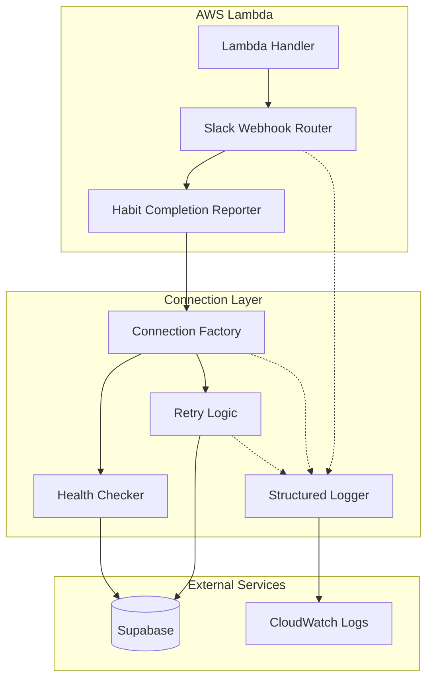
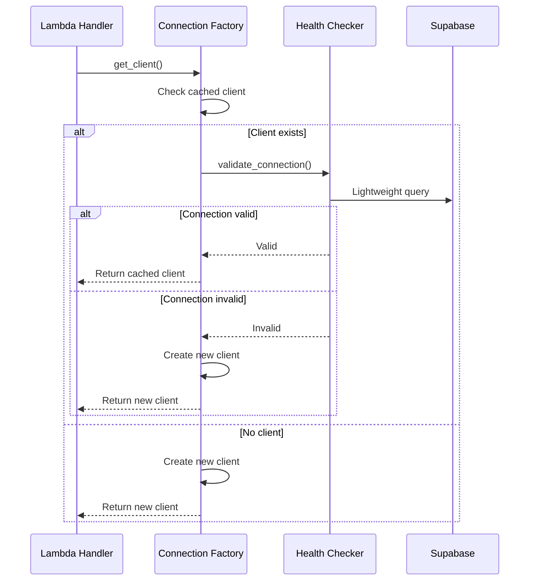
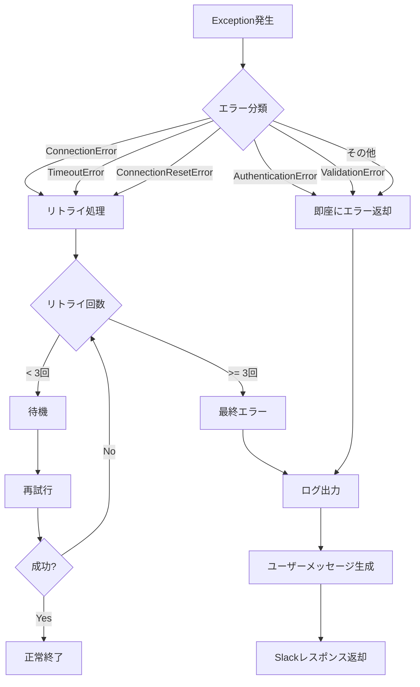

# Design Document: Slack Lambda Connection Stability Fix

## Overview

本設計は、AWS Lambda環境でのSupabase接続の安定性問題を解決するためのアーキテクチャと実装方針を定義します。

主な改善点：
1. **接続ファクトリパターン** - シングルトンから接続ファクトリへの移行
2. **ヘルスチェック付き接続管理** - 使用前の接続検証
3. **リトライデコレータ** - 指数バックオフによる自動リトライ
4. **構造化ログ** - CloudWatch向けの診断ログ強化

## Architecture



### 接続ライフサイクル



## Components and Interfaces

### 1. SupabaseConnectionFactory

接続の作成と管理を担当するファクトリクラス。

```python
from typing import Optional
from datetime import datetime, timedelta
from supabase import Client, create_client
import logging

class SupabaseConnectionFactory:
    """
    Lambda環境向けSupabase接続ファクトリ。
    接続の有効性を検証し、必要に応じて再作成する。
    """
    
    def __init__(
        self,
        supabase_url: str,
        supabase_key: str,
        connection_timeout: float = 5.0,
        read_timeout: float = 10.0,
        max_connections: int = 10,
    ):
        self._url = supabase_url
        self._key = supabase_key
        self._client: Optional[Client] = None
        self._created_at: Optional[datetime] = None
        self._connection_timeout = connection_timeout
        self._read_timeout = read_timeout
        self._max_connections = max_connections
        self._instance_id = self._generate_instance_id()
        self._logger = logging.getLogger(__name__)
    
    def get_client(self) -> Client:
        """
        有効なSupabaseクライアントを取得する。
        既存の接続が無効な場合は新しいクライアントを作成する。
        """
        if self._client is not None and self._is_connection_valid():
            return self._client
        
        return self._create_new_client()
    
    def _is_connection_valid(self) -> bool:
        """接続の有効性を軽量なクエリで検証する。"""
        pass
    
    def _create_new_client(self) -> Client:
        """新しいSupabaseクライアントを作成する。"""
        pass
    
    def _cleanup_old_client(self) -> None:
        """古いクライアントのリソースを解放する。"""
        pass
    
    @staticmethod
    def _generate_instance_id() -> str:
        """一意のインスタンスIDを生成する。"""
        pass
```

### 2. RetryDecorator

リトライロジックを提供するデコレータ。

```python
from functools import wraps
from typing import Callable, TypeVar, Tuple, Type
import asyncio
import logging

T = TypeVar('T')

class RetryConfig:
    """リトライ設定。"""
    max_retries: int = 3
    base_delay_ms: int = 100
    max_delay_ms: int = 1000
    retryable_exceptions: Tuple[Type[Exception], ...] = (
        ConnectionError,
        TimeoutError,
    )

def with_retry(config: Optional[RetryConfig] = None) -> Callable:
    """
    指数バックオフでリトライするデコレータ。
    
    Usage:
        @with_retry()
        async def fetch_data():
            ...
    """
    pass
```

### 3. StructuredLogger

CloudWatch向けの構造化ログを出力するロガー。

```python
import json
import logging
from typing import Any, Dict, Optional
from datetime import datetime

class StructuredLogger:
    """
    CloudWatch向け構造化ログを出力するロガー。
    Lambda実行コンテキストを自動的に含める。
    """
    
    def __init__(self, name: str, lambda_context: Optional[Any] = None):
        self._logger = logging.getLogger(name)
        self._lambda_context = lambda_context
    
    def info(self, message: str, **kwargs) -> None:
        """INFO レベルの構造化ログを出力。"""
        pass
    
    def error(self, message: str, error: Optional[Exception] = None, **kwargs) -> None:
        """ERROR レベルの構造化ログを出力。"""
        pass
    
    def _format_log(self, level: str, message: str, **kwargs) -> str:
        """構造化ログをJSON形式でフォーマット。"""
        pass
```

### 4. SlackErrorHandler

Slackコマンドのエラーハンドリングを担当。

```python
from typing import Dict, Any
from enum import Enum

class ErrorType(Enum):
    CONNECTION_ERROR = "connection_error"
    DATA_FETCH_ERROR = "data_fetch_error"
    VALIDATION_ERROR = "validation_error"
    UNKNOWN_ERROR = "unknown_error"

class SlackErrorHandler:
    """
    Slackコマンドのエラーをユーザーフレンドリーなメッセージに変換する。
    """
    
    ERROR_MESSAGES = {
        ErrorType.CONNECTION_ERROR: "一時的な接続エラーが発生しました。しばらくしてから再度お試しください。",
        ErrorType.DATA_FETCH_ERROR: "データの取得に失敗しました。しばらくしてから再度お試しください。",
        ErrorType.VALIDATION_ERROR: "入力内容に問題があります。",
        ErrorType.UNKNOWN_ERROR: "予期しないエラーが発生しました。",
    }
    
    @classmethod
    def handle_error(cls, error: Exception) -> Dict[str, Any]:
        """
        例外をSlackブロックメッセージに変換する。
        """
        pass
    
    @classmethod
    def classify_error(cls, error: Exception) -> ErrorType:
        """
        例外の種類を分類する。
        """
        pass
```

### 5. HealthCheckEndpoint

接続状態を確認するヘルスチェックエンドポイント。

```python
from fastapi import APIRouter
from pydantic import BaseModel
from typing import Optional
from datetime import datetime

class HealthStatus(BaseModel):
    status: str  # "healthy" or "unhealthy"
    supabase_connected: bool
    latency_ms: Optional[float] = None
    error: Optional[str] = None
    timestamp: datetime
    instance_id: str

router = APIRouter()

@router.get("/health/supabase")
async def check_supabase_health() -> HealthStatus:
    """
    Supabase接続のヘルスチェックを実行する。
    """
    pass
```

## Data Models

### ログエントリ構造

```python
from pydantic import BaseModel
from typing import Optional, Dict, Any
from datetime import datetime

class LogEntry(BaseModel):
    """CloudWatchログエントリの構造。"""
    timestamp: datetime
    level: str
    message: str
    request_id: Optional[str] = None
    remaining_time_ms: Optional[int] = None
    instance_id: Optional[str] = None
    extra: Dict[str, Any] = {}

class ConnectionLogEntry(LogEntry):
    """接続関連のログエントリ。"""
    client_created_at: Optional[datetime] = None
    connection_valid: Optional[bool] = None
    validation_latency_ms: Optional[float] = None

class RetryLogEntry(LogEntry):
    """リトライ関連のログエントリ。"""
    attempt: int
    max_attempts: int
    delay_ms: int
    error_type: str
    error_message: str

class SlackCommandLogEntry(LogEntry):
    """Slackコマンド処理のログエントリ。"""
    command: str
    slack_user_id: str
    team_id: str
    owner_id: Optional[str] = None
    processing_time_ms: float
    result_status: str  # "success", "error", "not_found"
```

### エラー分類

```python
from enum import Enum
from typing import Set, Type

class RetryableError(Enum):
    """リトライ可能なエラーの分類。"""
    CONNECTION_TIMEOUT = "connection_timeout"
    CONNECTION_RESET = "connection_reset"
    TEMPORARY_NETWORK_ERROR = "temporary_network_error"
    SERVICE_UNAVAILABLE = "service_unavailable"

class NonRetryableError(Enum):
    """リトライ不可能なエラーの分類。"""
    AUTHENTICATION_ERROR = "authentication_error"
    AUTHORIZATION_ERROR = "authorization_error"
    VALIDATION_ERROR = "validation_error"
    NOT_FOUND = "not_found"

RETRYABLE_EXCEPTIONS: Set[Type[Exception]] = {
    ConnectionError,
    TimeoutError,
    ConnectionResetError,
    BrokenPipeError,
}
```


## Correctness Properties

*A property is a characteristic or behavior that should hold true across all valid executions of a system-essentially, a formal statement about what the system should do. Properties serve as the bridge between human-readable specifications and machine-verifiable correctness guarantees.*

### Property 1: Connection Validation Before Use

*For any* request to get a Supabase client when a cached client exists, the connection factory SHALL validate the connection before returning the client.

**Validates: Requirements 1.1, 1.4**

### Property 2: Invalid Connection Triggers Recreation

*For any* cached Supabase client that fails validation, the connection factory SHALL create and return a new client instance.

**Validates: Requirements 1.2**

### Property 3: Resource Cleanup on Recreation

*For any* client recreation event, the connection factory SHALL call cleanup methods on the old client before creating a new one.

**Validates: Requirements 1.3**

### Property 4: Exponential Backoff Retry Behavior

*For any* retryable error, the retry logic SHALL attempt up to 3 retries with delays of 100ms, 200ms, and 400ms respectively.

**Validates: Requirements 2.1, 2.2**

### Property 5: Final Retry Failure Handling

*For any* operation that fails all retry attempts, the retry logic SHALL log the final error and raise an exception.

**Validates: Requirements 2.3**

### Property 6: Error Classification Correctness

*For any* exception, the retry logic SHALL correctly classify it as retryable (ConnectionError, TimeoutError, ConnectionResetError) or non-retryable (AuthenticationError, ValidationError), and only retry retryable errors.

**Validates: Requirements 2.4, 2.5**

### Property 7: User-Friendly Error Messages

*For any* error type (connection error, data fetch error, validation error), the Slack error handler SHALL return the corresponding user-friendly message without technical details.

**Validates: Requirements 3.1, 3.2, 3.3**

### Property 8: Error Detail Separation

*For any* connection error, the system SHALL log technical details to CloudWatch while returning only user-friendly messages to Slack users.

**Validates: Requirements 3.4**

### Property 9: Structured Log Content

*For any* log entry, the structured logger SHALL include timestamp, level, message, and when available: request_id, remaining_time_ms, instance_id, and context-specific fields.

**Validates: Requirements 4.1, 4.2, 4.3, 4.4, 4.5**

### Property 10: Connection Cleanup on Termination

*For any* Lambda function termination, the connection pool SHALL close all open connections.

**Validates: Requirements 5.4**

### Property 11: Health Check Response Correctness

*For any* health check request, the endpoint SHALL return "healthy" with latency when connection succeeds, or "unhealthy" with error details when connection fails.

**Validates: Requirements 6.1, 6.2, 6.3**

## Error Handling

### エラー分類と処理フロー



### エラーメッセージマッピング

| エラータイプ | 内部ログ | ユーザーメッセージ |
|------------|---------|------------------|
| ConnectionError | 接続詳細、スタックトレース | 一時的な接続エラーが発生しました。しばらくしてから再度お試しください。 |
| TimeoutError | タイムアウト時間、エンドポイント | 一時的な接続エラーが発生しました。しばらくしてから再度お試しください。 |
| DataFetchError | クエリ詳細、エラーコード | データの取得に失敗しました。しばらくしてから再度お試しください。 |
| ValidationError | 入力値、検証ルール | 入力内容に問題があります。 |
| UnknownError | 完全なスタックトレース | 予期しないエラーが発生しました。 |

### 例外処理の実装パターン

```python
from typing import Dict, Any
import logging

async def handle_slack_command_with_error_handling(
    command: str,
    owner_id: str,
    owner_type: str,
) -> Dict[str, Any]:
    """
    エラーハンドリング付きSlackコマンド処理。
    """
    logger = logging.getLogger(__name__)
    error_handler = SlackErrorHandler()
    
    try:
        # 通常の処理
        result = await process_command(command, owner_id, owner_type)
        return result
        
    except (ConnectionError, TimeoutError) as e:
        # 接続エラー: 詳細をログ、ユーザーには汎用メッセージ
        logger.error(
            "Connection error in Slack command",
            extra={
                "error_type": type(e).__name__,
                "error_message": str(e),
                "command": command,
                "owner_id": owner_id,
            }
        )
        return error_handler.handle_error(e)
        
    except Exception as e:
        # 予期しないエラー
        logger.exception(
            "Unexpected error in Slack command",
            extra={
                "command": command,
                "owner_id": owner_id,
            }
        )
        return error_handler.handle_error(e)
```

## Testing Strategy

### テストアプローチ

本機能では、ユニットテストとプロパティベーステストの両方を使用して包括的なテストカバレッジを実現します。

- **ユニットテスト**: 特定の例、エッジケース、エラー条件の検証
- **プロパティテスト**: 全入力に対して成り立つべき普遍的な性質の検証

### プロパティベーステスト設定

- **ライブラリ**: Hypothesis（Python）
- **最小実行回数**: 100回/プロパティ
- **タグ形式**: `Feature: slack-lambda-stability, Property {number}: {property_text}`

### テスト構成

```
backend/tests/
├── unit/
│   └── services/
│       ├── test_connection_factory.py
│       ├── test_retry_logic.py
│       ├── test_structured_logger.py
│       └── test_slack_error_handler.py
├── property/
│   └── services/
│       ├── test_connection_factory_properties.py
│       ├── test_retry_logic_properties.py
│       └── test_error_handling_properties.py
└── integration/
    └── test_slack_webhook_stability.py
```

### プロパティテスト実装例

```python
from hypothesis import given, strategies as st, settings
import pytest

class TestConnectionFactoryProperties:
    """
    Feature: slack-lambda-stability
    Connection Factory のプロパティテスト
    """
    
    @settings(max_examples=100)
    @given(st.booleans())
    def test_property_1_validation_before_use(self, connection_valid: bool):
        """
        Feature: slack-lambda-stability, Property 1: Connection Validation Before Use
        
        For any request to get a Supabase client when a cached client exists,
        the connection factory SHALL validate the connection before returning the client.
        """
        # Arrange
        factory = SupabaseConnectionFactory(url="test", key="test")
        factory._client = MockClient()
        factory._is_connection_valid = Mock(return_value=connection_valid)
        
        # Act
        client = factory.get_client()
        
        # Assert
        factory._is_connection_valid.assert_called_once()


class TestRetryLogicProperties:
    """
    Feature: slack-lambda-stability
    Retry Logic のプロパティテスト
    """
    
    @settings(max_examples=100)
    @given(st.integers(min_value=1, max_value=3))
    def test_property_4_exponential_backoff(self, failure_count: int):
        """
        Feature: slack-lambda-stability, Property 4: Exponential Backoff Retry Behavior
        
        For any retryable error, the retry logic SHALL attempt up to 3 retries
        with delays of 100ms, 200ms, and 400ms respectively.
        """
        expected_delays = [100, 200, 400][:failure_count]
        actual_delays = []
        
        # Arrange & Act
        retry_config = RetryConfig(max_retries=3, base_delay_ms=100)
        for i in range(failure_count):
            delay = retry_config.calculate_delay(attempt=i)
            actual_delays.append(delay)
        
        # Assert
        assert actual_delays == expected_delays


class TestErrorHandlingProperties:
    """
    Feature: slack-lambda-stability
    Error Handling のプロパティテスト
    """
    
    @settings(max_examples=100)
    @given(st.sampled_from([
        ConnectionError("test"),
        TimeoutError("test"),
        ValueError("test"),
    ]))
    def test_property_6_error_classification(self, error: Exception):
        """
        Feature: slack-lambda-stability, Property 6: Error Classification Correctness
        
        For any exception, the retry logic SHALL correctly classify it as retryable
        or non-retryable.
        """
        # Arrange
        expected_retryable = isinstance(error, (ConnectionError, TimeoutError))
        
        # Act
        is_retryable = RetryConfig.is_retryable(error)
        
        # Assert
        assert is_retryable == expected_retryable
```

### ユニットテスト例

```python
import pytest
from unittest.mock import Mock, patch

class TestSlackErrorHandler:
    """SlackErrorHandler のユニットテスト"""
    
    def test_connection_error_returns_user_friendly_message(self):
        """接続エラー時にユーザーフレンドリーなメッセージを返す"""
        error = ConnectionError("Connection refused")
        handler = SlackErrorHandler()
        
        result = handler.handle_error(error)
        
        assert "一時的な接続エラー" in result["text"]
        assert "Connection refused" not in result["text"]
    
    def test_data_fetch_error_does_not_say_no_habits(self):
        """データ取得エラー時に「習慣がありません」と表示しない"""
        error = DataFetchError("Query failed")
        handler = SlackErrorHandler()
        
        result = handler.handle_error(error)
        
        assert "習慣がありません" not in result["text"]
        assert "データの取得に失敗" in result["text"]


class TestHealthCheckEndpoint:
    """ヘルスチェックエンドポイントのユニットテスト"""
    
    @pytest.mark.asyncio
    async def test_healthy_response_includes_latency(self):
        """正常時はlatencyを含むhealthyレスポンスを返す"""
        with patch('app.config.get_supabase_client') as mock:
            mock.return_value.table.return_value.select.return_value.limit.return_value.execute.return_value = Mock(data=[{}])
            
            response = await check_supabase_health()
            
            assert response.status == "healthy"
            assert response.latency_ms is not None
    
    @pytest.mark.asyncio
    async def test_unhealthy_response_includes_error(self):
        """異常時はerrorを含むunhealthyレスポンスを返す"""
        with patch('app.config.get_supabase_client') as mock:
            mock.side_effect = ConnectionError("Failed")
            
            response = await check_supabase_health()
            
            assert response.status == "unhealthy"
            assert response.error is not None
```
