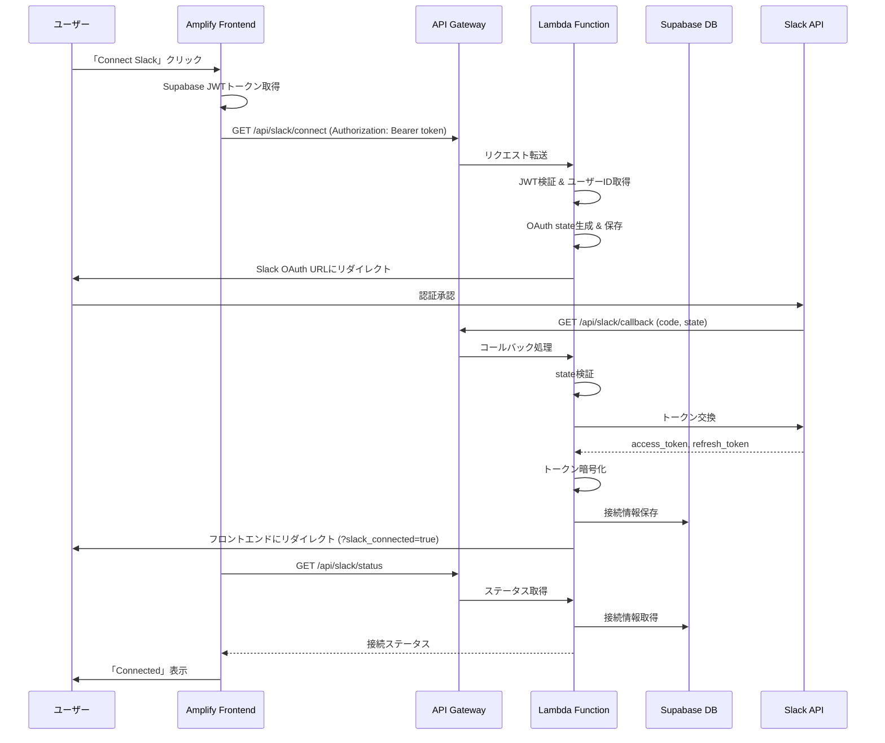

# 設計ドキュメント

## 概要

本設計ドキュメントは、VOWアプリのSlack OAuth連携機能の修正に関する技術設計を定義します。現在発生しているInternal Server Error（500エラー）を解消し、フロントエンド（AWS Amplify）とバックエンド（AWS Lambda + API Gateway）間のSlack OAuth認証フローを正しく動作させます。

### 現在の問題点

1. **環境変数の未設定または不正**: Lambda関数に必要なSlack関連の環境変数が正しく設定されていない可能性
2. **CORS設定の不備**: Amplifyドメインからのリクエストが許可されていない
3. **認証トークンの受け渡し問題**: フロントエンドからバックエンドへの認証トークンの受け渡しが正しく行われていない
4. **Supabase接続の問題**: Lambda環境でSupabaseクライアントが正しく初期化されていない

## アーキテクチャ



## コンポーネントとインターフェース

### 1. フロントエンド（useSlackIntegration フック）

**ファイル**: `frontend/hooks/useSlackIntegration.ts`

**修正内容**:
- 認証トークンをAuthorizationヘッダーに含める
- API URLの検証とエラーハンドリング強化

```typescript
interface UseSlackIntegrationReturn {
  status: SlackConnectionStatus | null;
  loading: boolean;
  error: string | null;
  connectSlack: () => Promise<void>;
  disconnectSlack: () => Promise<boolean>;
  updatePreferences: (prefs: SlackPreferencesUpdate) => Promise<boolean>;
  testConnection: () => Promise<boolean>;
  refreshStatus: () => Promise<void>;
}
```

### 2. バックエンド（Slack OAuth Router）

**ファイル**: `backend/app/routers/slack_oauth.py`

**エンドポイント**:

| メソッド | パス | 説明 |
|---------|------|------|
| GET | `/api/slack/connect` | OAuth開始（認証必須） |
| GET | `/api/slack/callback` | OAuthコールバック（認証不要） |
| POST | `/api/slack/disconnect` | 接続解除（認証必須） |
| GET | `/api/slack/status` | 接続ステータス取得（認証必須） |
| GET | `/api/slack/preferences` | 設定取得（認証必須） |
| PUT | `/api/slack/preferences` | 設定更新（認証必須） |
| POST | `/api/slack/test` | テスト接続（認証必須） |

### 3. 設定（config.py）

**ファイル**: `backend/app/config.py`

**必須環境変数**:

| 変数名 | 説明 | 例 |
|--------|------|-----|
| `SLACK_CLIENT_ID` | Slack App Client ID | `1234567890.1234567890` |
| `SLACK_CLIENT_SECRET` | Slack App Client Secret | `abcdef123456...` |
| `SLACK_SIGNING_SECRET` | Slack Signing Secret | `abcdef123456...` |
| `SLACK_CALLBACK_URI` | OAuthコールバックURL | `https://lyry9riumg.execute-api.ap-northeast-1.amazonaws.com/development/api/slack/callback` |
| `TOKEN_ENCRYPTION_KEY` | トークン暗号化キー | Fernet.generate_key() |
| `CORS_ORIGINS` | 許可するオリジン | `["https://main.do1k9oyyorn24.amplifyapp.com"]` |
| `SUPABASE_URL` | Supabase URL | `https://xxx.supabase.co` |
| `SUPABASE_ANON_KEY` | Supabase Anon Key | `eyJhbGciOiJIUzI1NiIs...` |

### 4. 認証ミドルウェア

**ファイル**: `backend/app/middleware/auth.py`

**除外パス**（認証不要）:
- `/api/slack/callback` - OAuthコールバック
- `/api/slack/commands` - Slashコマンド
- `/api/slack/interactions` - インタラクション
- `/api/slack/events` - イベント

## データモデル

### slack_connections テーブル

```sql
CREATE TABLE slack_connections (
    id UUID PRIMARY KEY DEFAULT gen_random_uuid(),
    owner_type VARCHAR(50) NOT NULL DEFAULT 'user',
    owner_id UUID NOT NULL,
    slack_user_id VARCHAR(50) NOT NULL,
    slack_team_id VARCHAR(50) NOT NULL,
    slack_team_name VARCHAR(255),
    slack_user_name VARCHAR(255),
    access_token TEXT NOT NULL,  -- 暗号化済み
    refresh_token TEXT,          -- 暗号化済み
    bot_access_token TEXT,       -- 暗号化済み
    token_expires_at TIMESTAMPTZ,
    is_valid BOOLEAN DEFAULT TRUE,
    connected_at TIMESTAMPTZ DEFAULT NOW(),
    updated_at TIMESTAMPTZ DEFAULT NOW(),
    UNIQUE(owner_type, owner_id)
);
```

### notification_preferences テーブル

```sql
CREATE TABLE notification_preferences (
    id UUID PRIMARY KEY DEFAULT gen_random_uuid(),
    owner_type VARCHAR(50) NOT NULL DEFAULT 'user',
    owner_id UUID NOT NULL,
    slack_notifications_enabled BOOLEAN DEFAULT FALSE,
    weekly_slack_report_enabled BOOLEAN DEFAULT FALSE,
    weekly_report_day INTEGER DEFAULT 0,  -- 0=Sunday
    weekly_report_time TIME DEFAULT '09:00',
    created_at TIMESTAMPTZ DEFAULT NOW(),
    updated_at TIMESTAMPTZ DEFAULT NOW(),
    UNIQUE(owner_type, owner_id)
);
```


## 修正箇所の詳細設計

### 1. フロントエンド修正

#### 1.1 useSlackIntegration.ts の修正

**問題**: 現在の実装では認証トークンがリクエストに含まれていない

**修正内容**:

```typescript
// 認証トークンを取得するヘルパー関数
const getAuthHeaders = async (): Promise<HeadersInit> => {
  const { data: { session } } = await supabase.auth.getSession();
  if (!session?.access_token) {
    throw new Error('Not authenticated');
  }
  return {
    'Authorization': `Bearer ${session.access_token}`,
    'Content-Type': 'application/json',
  };
};

// connectSlack の修正
const connectSlack = useCallback(async () => {
  try {
    const { data: { session } } = await supabase.auth.getSession();
    if (!session?.access_token) {
      setError('Please log in to connect Slack');
      return;
    }
    
    const redirectUri = encodeURIComponent(window.location.origin + '/settings');
    const token = encodeURIComponent(session.access_token);
    
    // トークンをクエリパラメータとして渡す（リダイレクトのため）
    window.location.href = `${SLACK_API_URL}/api/slack/connect?redirect_uri=${redirectUri}&token=${token}`;
  } catch (err) {
    setError(err instanceof Error ? err.message : 'Failed to initiate Slack connection');
  }
}, []);
```

#### 1.2 API URL検証の追加

```typescript
// 環境変数の検証
useEffect(() => {
  if (!SLACK_API_URL) {
    setError('Slack API URL is not configured');
    setLoading(false);
  }
}, []);
```

### 2. バックエンド修正

#### 2.1 slack_oauth.py の修正

**問題**: OAuth開始時の認証トークン取得方法

**修正内容**:

```python
@router.get("/connect")
async def initiate_oauth(
    request: Request,
    redirect_uri: Optional[str] = Query(None),
    token: Optional[str] = Query(None),  # クエリパラメータからトークンを取得
) -> RedirectResponse:
    """
    Initiate Slack OAuth flow.
    """
    # トークンからユーザーを取得
    if token:
        try:
            # JWTを検証
            payload = jwt.decode(
                token,
                settings.jwt_secret,
                algorithms=[settings.jwt_algorithm],
                audience=settings.jwt_audience,
            )
            user_id = payload.get("sub")
            if not user_id:
                raise HTTPException(status_code=401, detail="Invalid token")
        except JWTError:
            raise HTTPException(status_code=401, detail="Invalid token")
    else:
        # ミドルウェアからユーザーを取得
        user = getattr(request.state, "user", None)
        if not user:
            raise HTTPException(status_code=401, detail="Not authenticated")
        user_id = user.get("sub")
    
    # 以降の処理は同じ
    ...
```

#### 2.2 CORS設定の修正

**ファイル**: `backend/app/main.py`

```python
# CORS Middleware - Amplifyドメインを追加
app.add_middleware(
    CORSMiddleware,
    allow_origins=[
        "http://localhost:3000",
        "https://main.do1k9oyyorn24.amplifyapp.com",
    ],
    allow_credentials=True,
    allow_methods=["*"],
    allow_headers=["*"],
)
```

#### 2.3 環境変数検証の追加

**ファイル**: `backend/app/config.py`

```python
def validate_slack_settings(self) -> list[str]:
    """Validate Slack-related settings."""
    errors = []
    
    if not self.slack_client_id:
        errors.append("SLACK_CLIENT_ID is required for Slack integration")
    if not self.slack_client_secret:
        errors.append("SLACK_CLIENT_SECRET is required for Slack integration")
    if not self.slack_signing_secret:
        errors.append("SLACK_SIGNING_SECRET is required for Slack integration")
    if not self.token_encryption_key:
        errors.append("TOKEN_ENCRYPTION_KEY is required for Slack integration")
    if not self.supabase_url:
        errors.append("SUPABASE_URL is required")
    if not self.supabase_anon_key:
        errors.append("SUPABASE_ANON_KEY is required")
    
    return errors
```

#### 2.4 エラーハンドリングの改善

```python
@router.get("/connect")
async def initiate_oauth(...) -> RedirectResponse:
    """Initiate Slack OAuth flow."""
    # 環境変数の検証
    slack_service = get_slack_service()
    if not slack_service.client_id:
        raise HTTPException(
            status_code=500,
            detail="Slack integration is not configured. Please contact administrator."
        )
    
    try:
        # OAuth処理
        ...
    except Exception as e:
        # エラーログ
        import logging
        logging.error(f"Slack OAuth error: {str(e)}")
        raise HTTPException(
            status_code=500,
            detail=f"Failed to initiate Slack OAuth: {str(e)}"
        )
```

### 3. Lambda環境変数設定

AWS Lambda コンソールまたはTerraformで以下の環境変数を設定:

```hcl
environment {
  variables = {
    # Slack Integration
    SLACK_CLIENT_ID       = var.slack_client_id
    SLACK_CLIENT_SECRET   = var.slack_client_secret
    SLACK_SIGNING_SECRET  = var.slack_signing_secret
    SLACK_CALLBACK_URI    = "https://lyry9riumg.execute-api.ap-northeast-1.amazonaws.com/development/api/slack/callback"
    TOKEN_ENCRYPTION_KEY  = var.token_encryption_key
    
    # Supabase
    SUPABASE_URL          = var.supabase_url
    SUPABASE_ANON_KEY     = var.supabase_anon_key
    
    # JWT
    JWT_SECRET            = var.jwt_secret
    JWT_ALGORITHM         = "HS256"
    JWT_AUDIENCE          = "authenticated"
    
    # CORS
    CORS_ORIGINS          = "[\"https://main.do1k9oyyorn24.amplifyapp.com\"]"
  }
}
```

### 4. Amplify環境変数設定

AWS Amplify コンソールで以下の環境変数を設定:

```
NEXT_PUBLIC_SLACK_API_URL=https://lyry9riumg.execute-api.ap-northeast-1.amazonaws.com/development
```

## エラーハンドリング

### エラーコード一覧

| コード | 説明 | 対処法 |
|--------|------|--------|
| 401 | 認証エラー | 再ログインを促す |
| 403 | 権限エラー | 管理者に連絡 |
| 500 | サーバーエラー | ログを確認、環境変数を検証 |
| CORS | CORSエラー | CORS設定を確認 |

### ログ出力

```python
import logging

logger = logging.getLogger(__name__)

# エラー時のログ出力
logger.error(f"Slack OAuth failed: {error}", extra={
    "user_id": user_id,
    "error_type": type(error).__name__,
    "error_message": str(error),
})
```


## 正確性プロパティ

*正確性プロパティとは、システムのすべての有効な実行において真であるべき特性や動作のことです。プロパティは、人間が読める仕様と機械で検証可能な正確性保証の橋渡しとなります。*

### Property 1: JWT検証の正確性

*For any* 有効なSupabase JWTトークン、THE Slack_OAuth_Handler SHALL トークンからユーザーID（sub claim）を正しく抽出し、無効なトークンに対しては401エラーを返す

**Validates: Requirements 1.4, 1.5, 4.2, 4.3**

### Property 2: 環境変数検証の完全性

*For any* Lambda関数の起動において、必須環境変数（SLACK_CLIENT_ID, SLACK_CLIENT_SECRET, SLACK_SIGNING_SECRET, TOKEN_ENCRYPTION_KEY, SUPABASE_URL, SUPABASE_ANON_KEY）のいずれかが欠けている場合、THE Lambda_Function SHALL 明確なエラーメッセージを返す

**Validates: Requirements 1.2, 1.3, 6.1, 6.5**

### Property 3: OAuth State生成の一意性

*For any* ユーザーIDに対して、THE Slack_OAuth_Handler SHALL 一意のOAuth stateを生成し、そのstateにユーザーIDを関連付けて保存する。同じstateが2回生成されることはない。

**Validates: Requirements 4.4**

### Property 4: Redirect URI構築の正確性

*For any* ページURL（origin + path）に対して、THE Frontend_Settings_Page SHALL 正しくエンコードされたredirect_uriパラメータを構築し、OAuth開始リクエストに含める

**Validates: Requirements 2.4**

## テスト戦略

### ユニットテスト

1. **JWT検証テスト**
   - 有効なトークンでユーザーIDが抽出されることを確認
   - 無効なトークンで401エラーが返されることを確認
   - 期限切れトークンで401エラーが返されることを確認

2. **環境変数検証テスト**
   - すべての必須環境変数が設定されている場合、エラーなしで起動
   - 各必須環境変数が欠けている場合、適切なエラーメッセージ

3. **OAuth State生成テスト**
   - stateが一意であることを確認
   - stateにユーザーIDが関連付けられていることを確認
   - stateの有効期限が正しく設定されていることを確認

4. **CORS設定テスト**
   - Amplifyドメインからのリクエストが許可されることを確認
   - OPTIONSリクエストに適切なヘッダーが返されることを確認

### プロパティベーステスト

プロパティベーステストには `hypothesis` ライブラリを使用します。

```python
from hypothesis import given, strategies as st

# Property 1: JWT検証
@given(st.text(min_size=1))
def test_jwt_validation_rejects_invalid_tokens(token: str):
    """任意の無効なトークンに対して401エラーが返される"""
    # テスト実装
    pass

# Property 2: 環境変数検証
@given(st.sampled_from([
    "SLACK_CLIENT_ID",
    "SLACK_CLIENT_SECRET", 
    "SLACK_SIGNING_SECRET",
    "TOKEN_ENCRYPTION_KEY",
    "SUPABASE_URL",
    "SUPABASE_ANON_KEY"
]))
def test_missing_env_var_returns_error(missing_var: str):
    """任意の必須環境変数が欠けている場合、エラーが返される"""
    # テスト実装
    pass

# Property 3: OAuth State一意性
@given(st.uuids())
def test_oauth_state_is_unique(user_id):
    """任意のユーザーIDに対して一意のstateが生成される"""
    # テスト実装
    pass

# Property 4: Redirect URI構築
@given(st.text(alphabet=st.characters(whitelist_categories=('L', 'N')), min_size=1))
def test_redirect_uri_encoding(path: str):
    """任意のパスに対して正しくエンコードされたredirect_uriが構築される"""
    # テスト実装
    pass
```

### 統合テスト

1. **OAuth フロー全体テスト**
   - Connect Slack → Slack認証 → コールバック → 設定ページ
   - エラーケース（認証拒否、トークン交換失敗）

2. **API エンドポイントテスト**
   - `/api/slack/connect` - 認証あり/なし
   - `/api/slack/callback` - 有効/無効なstate
   - `/api/slack/status` - 接続あり/なし
   - `/api/slack/disconnect` - 接続あり/なし

### E2Eテスト

Playwrightを使用したE2Eテスト:

```typescript
test('Slack連携フロー', async ({ page }) => {
  // 設定ページに移動
  await page.goto('/settings');
  
  // Connect Slackボタンをクリック
  await page.click('text=Connect Slack');
  
  // Slack認証ページにリダイレクトされることを確認
  await expect(page).toHaveURL(/slack\.com\/oauth/);
});
```
