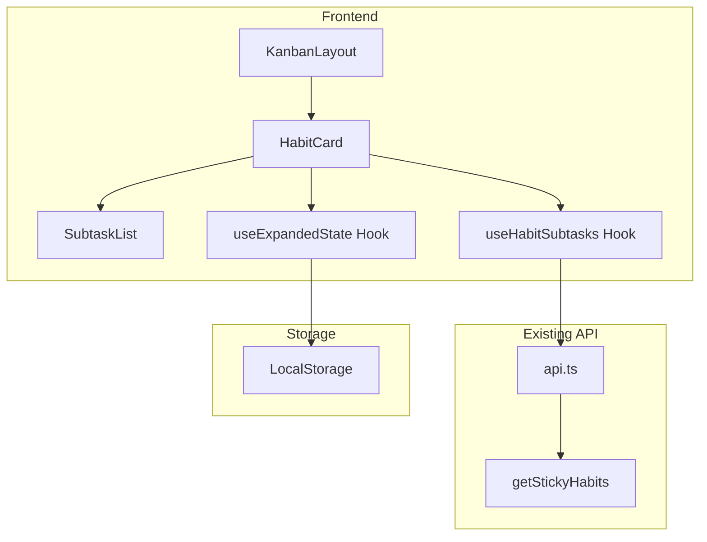
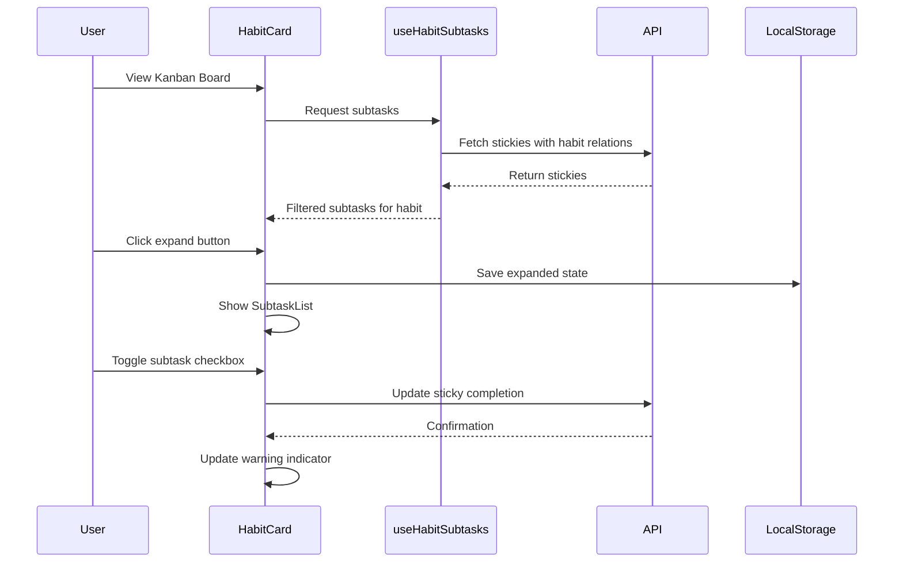

# Design Document: Sticky-Habit Subtask Integration

## Overview

この機能は、Sticky'nとHabitの親子関係を強化し、BoardセクションのカンバンビューでHabitに属するサブタスク（Sticky'n）を展開表示できるようにします。既存のsticky-habit関連APIを活用し、フロントエンドのみの変更で実装します。

## Architecture

### システム構成



### データフロー



## Components and Interfaces

### 1. useHabitSubtasks Hook

Habitに関連するサブタスク（Sticky'n）を取得・管理するカスタムフック。

```typescript
interface UseHabitSubtasksOptions {
  habits: Habit[];
  stickies: Sticky[];
}

interface HabitSubtasksMap {
  [habitId: string]: Sticky[];
}

interface UseHabitSubtasksReturn {
  /** Habit IDをキーとしたサブタスクのマップ */
  subtasksByHabit: HabitSubtasksMap;
  /** 指定したHabitにサブタスクがあるかどうか */
  hasSubtasks: (habitId: string) => boolean;
  /** 指定したHabitのサブタスク数 */
  getSubtaskCount: (habitId: string) => number;
  /** 指定したHabitの未完了サブタスク数 */
  getIncompleteCount: (habitId: string) => number;
  /** 警告表示が必要かどうか（サブタスクがあり、すべて未完了） */
  needsWarning: (habitId: string) => boolean;
}

function useHabitSubtasks(options: UseHabitSubtasksOptions): UseHabitSubtasksReturn;
```

### 2. useExpandedHabits Hook

Habitカードの展開状態を管理するカスタムフック。

```typescript
interface UseExpandedHabitsReturn {
  /** 展開されているHabit IDのセット */
  expandedHabits: Set<string>;
  /** 指定したHabitが展開されているかどうか */
  isExpanded: (habitId: string) => boolean;
  /** 展開状態をトグル */
  toggleExpanded: (habitId: string) => void;
  /** 展開状態を設定 */
  setExpanded: (habitId: string, expanded: boolean) => void;
}

function useExpandedHabits(): UseExpandedHabitsReturn;
```

### 3. HabitCard Component 拡張

既存のHabitCardコンポーネントに以下のpropsを追加：

```typescript
interface HabitCardProps {
  // 既存のprops...
  habit: Habit;
  activities: Activity[];
  status: HabitStatus;
  onComplete: (amount?: number) => void;
  onEdit: () => void;
  onDragStart: () => void;
  onDragEnd: () => void;
  isDragging: boolean;
  
  // 新規追加
  /** このHabitに関連するサブタスク */
  subtasks?: Sticky[];
  /** 展開状態 */
  isExpanded?: boolean;
  /** 展開状態トグルコールバック */
  onToggleExpand?: () => void;
  /** サブタスク完了コールバック */
  onSubtaskComplete?: (stickyId: string) => void;
  /** サブタスク編集コールバック */
  onSubtaskEdit?: (stickyId: string) => void;
  /** 警告表示が必要かどうか */
  showWarning?: boolean;
}
```

### 4. SubtaskList Component

Habitカード内でサブタスクを表示するコンポーネント。

```typescript
interface SubtaskListProps {
  /** 表示するサブタスク */
  subtasks: Sticky[];
  /** サブタスク完了コールバック */
  onComplete: (stickyId: string) => void;
  /** サブタスク編集コールバック */
  onEdit: (stickyId: string) => void;
}

function SubtaskList(props: SubtaskListProps): JSX.Element;
```

### 5. ExpandButton Component

展開/折りたたみボタンコンポーネント。

```typescript
interface ExpandButtonProps {
  /** 展開状態 */
  isExpanded: boolean;
  /** クリックコールバック */
  onClick: () => void;
  /** サブタスク数（バッジ表示用） */
  count: number;
}

function ExpandButton(props: ExpandButtonProps): JSX.Element;
```

### 6. WarningIndicator Component

警告マークを表示するコンポーネント。

```typescript
interface WarningIndicatorProps {
  /** ツールチップテキスト */
  tooltip?: string;
}

function WarningIndicator(props: WarningIndicatorProps): JSX.Element;
```

## Data Models

### 既存のデータモデル（変更なし）

```typescript
// Sticky型（既存）
interface Sticky {
  id: string;
  name: string;
  description?: string;
  completed: boolean;
  completedAt?: string;
  displayOrder: number;
  tags?: Tag[];
  goals?: Goal[];
  habits?: Habit[];  // Related Habits
  createdAt: string;
  updatedAt: string;
}

// Habit型（既存）
interface Habit {
  id: string;
  goalId: string;
  name: string;
  active: boolean;
  type: "do" | "avoid";
  count: number;
  must: number;
  completed: boolean;
  // ... その他のフィールド
}
```

### 展開状態の永続化形式

```typescript
// LocalStorageに保存する形式
interface ExpandedHabitsState {
  expandedIds: string[];  // 展開されているHabit IDの配列
  updatedAt: string;      // 最終更新日時
}

// LocalStorageキー
const EXPANDED_HABITS_KEY = 'vow-expanded-habits';
```

## Correctness Properties

*A property is a characteristic or behavior that should hold true across all valid executions of a system-essentially, a formal statement about what the system should do. Properties serve as the bridge between human-readable specifications and machine-verifiable correctness guarantees.*


### Property 1: Subtask Grouping by Habit

*For any* set of stickies with habit relations, the `subtasksByHabit` map SHALL correctly group each sticky under all its related habit IDs, such that a sticky with N related habits appears in exactly N habit entries.

**Validates: Requirements 1.1**

### Property 2: Sticky Data Structure Preservation

*For any* sticky that is associated with a habit as a subtask, the sticky object SHALL maintain all its original properties unchanged (id, name, description, completed, etc.).

**Validates: Requirements 1.2**

### Property 3: Expand Button Visibility

*For any* habit in the Kanban board, the expand button SHALL be visible if and only if the habit has one or more associated subtasks.

**Validates: Requirements 2.1, 2.2**

### Property 4: Expand Button Icon State

*For any* habit with subtasks, the expand button SHALL display [▼] when `isExpanded` is false and [▲] when `isExpanded` is true.

**Validates: Requirements 2.3**

### Property 5: Expand Toggle Behavior

*For any* habit with subtasks, clicking the expand button SHALL toggle the `isExpanded` state from true to false or false to true.

**Validates: Requirements 3.1**

### Property 6: Subtask List Completeness

*For any* expanded habit, the subtask list SHALL contain exactly all stickies that have that habit in their `habits` relation array.

**Validates: Requirements 3.2**

### Property 7: Expanded State Preservation on Subtask Completion

*For any* expanded habit, toggling the completion state of any subtask SHALL NOT change the expanded state of the parent habit.

**Validates: Requirements 3.5**

### Property 8: Habit Completion Independence

*For any* habit with subtasks, when the habit's completion state changes (daily, cumulative, or manual), the completion states of all its subtasks SHALL remain unchanged.

**Validates: Requirements 4.1, 4.2, 4.3, 4.4**

### Property 9: Warning Indicator Logic

*For any* habit, the warning indicator SHALL be visible if and only if: (1) the habit has at least one subtask, AND (2) all subtasks have `completed === false`.

**Validates: Requirements 5.1, 5.2, 5.5**

### Property 10: Subtask Checkbox Toggle

*For any* subtask in the expanded list, clicking the checkbox SHALL invoke the `onSubtaskComplete` callback with the correct sticky ID.

**Validates: Requirements 6.1**

### Property 11: Subtask Edit Callback

*For any* subtask in the expanded list, clicking the subtask name SHALL invoke the `onSubtaskEdit` callback with the correct sticky ID.

**Validates: Requirements 6.2**

### Property 12: Expanded State Persistence Round-Trip

*For any* habit, if the expanded state is toggled and saved to localStorage, then reading from localStorage SHALL return the same expanded state.

**Validates: Requirements 7.1, 7.2**

## Error Handling

### エラーケース

1. **サブタスク取得失敗**
   - APIエラー時は空の配列を返し、UIは正常に動作を継続
   - コンソールにエラーログを出力

2. **LocalStorage アクセス失敗**
   - プライベートブラウジングモードなどでLocalStorageが使用できない場合
   - デフォルト値（すべて折りたたみ）を使用
   - エラーをサイレントに処理

3. **不正なデータ形式**
   - LocalStorageに保存されたデータが破損している場合
   - デフォルト値にフォールバック

### エラー処理の実装方針

```typescript
// LocalStorage操作のエラーハンドリング例
function loadExpandedState(): Set<string> {
  try {
    const stored = localStorage.getItem(EXPANDED_HABITS_KEY);
    if (!stored) return new Set();
    
    const parsed = JSON.parse(stored);
    if (!Array.isArray(parsed.expandedIds)) {
      console.warn('Invalid expanded state format, using default');
      return new Set();
    }
    
    return new Set(parsed.expandedIds);
  } catch (error) {
    console.warn('Failed to load expanded state:', error);
    return new Set();
  }
}
```

## Testing Strategy

### Unit Tests

1. **useHabitSubtasks Hook**
   - 空のstickies配列での動作
   - 単一のhabit関連を持つstickyの処理
   - 複数のhabit関連を持つstickyの処理
   - `needsWarning`関数の各条件分岐

2. **useExpandedHabits Hook**
   - 初期状態の読み込み
   - トグル操作
   - LocalStorage永続化

3. **ExpandButton Component**
   - アイコン表示の切り替え
   - クリックイベントの発火

4. **WarningIndicator Component**
   - 表示/非表示の切り替え

### Property-Based Tests

Property-based testing library: **fast-check** (TypeScript/JavaScript用)

各プロパティテストは最低100回のイテレーションで実行。

**Feature: sticky-habit-subtask-integration, Property 1: Subtask Grouping by Habit**
- 任意のsticky配列とhabit関連を生成
- `subtasksByHabit`マップが正しくグループ化されていることを検証

**Feature: sticky-habit-subtask-integration, Property 3: Expand Button Visibility**
- 任意のhabitとsubtasks配列を生成
- サブタスクの有無とボタン表示の一致を検証

**Feature: sticky-habit-subtask-integration, Property 9: Warning Indicator Logic**
- 任意のsubtasks配列（完了/未完了の組み合わせ）を生成
- 警告表示条件の正確性を検証

**Feature: sticky-habit-subtask-integration, Property 12: Expanded State Persistence Round-Trip**
- 任意のhabit ID配列を生成
- 保存→読み込みの往復で同一性を検証

### Integration Tests

1. **KanbanLayout + HabitCard統合**
   - サブタスク展開/折りたたみの動作
   - サブタスク完了時のUI更新

2. **LocalStorage永続化**
   - ページリロード後の状態復元
