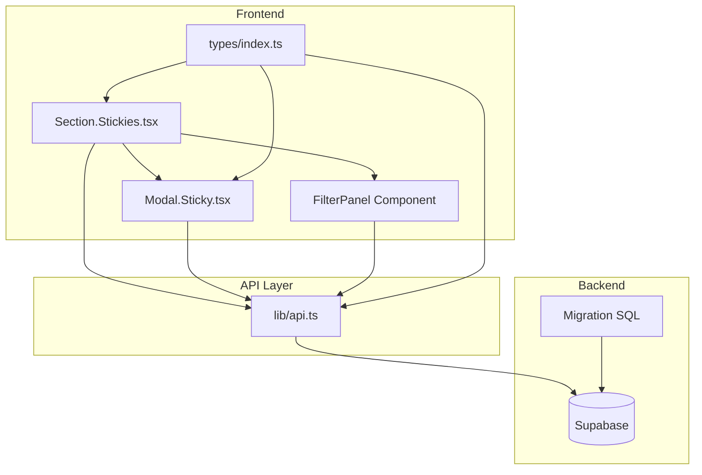

# Design Document: Task Priority and Status Management

## Overview

This design document describes the implementation of task priority and status management for Stickies in the habit management dashboard. The feature extends the existing Stickies functionality with Eisenhower Matrix-based priority classification, status tracking, due date management, and visual indicators.

The implementation follows a layered approach:
1. Database layer: Schema migration to add new columns
2. Type layer: TypeScript type definitions
3. API layer: Extended CRUD operations with filtering/sorting
4. UI layer: Enhanced Modal and Section components

## Architecture



### Data Flow

1. User interacts with Sticky Modal to set priority/status/due date
2. Modal calls API with updated fields
3. API sends request to Supabase
4. Supabase persists data and returns updated record
5. UI re-renders with new data
6. Filter/Sort operations query Supabase with parameters

## Components and Interfaces

### Priority Types

```typescript
// Priority levels based on Eisenhower Matrix
export type Priority = 
  | 'urgent-important'      // Do First (Quadrant 1)
  | 'not-urgent-important'  // Schedule (Quadrant 2)
  | 'urgent-not-important'  // Delegate (Quadrant 3)
  | 'not-urgent-not-important' // Eliminate (Quadrant 4)
  | 'none';                 // No priority set

// Priority display configuration
export interface PriorityConfig {
  value: Priority;
  label: string;
  labelJa: string;
  color: string;        // Tailwind class
  bgColor: string;      // Background class
  icon?: string;        // Optional icon
  sortOrder: number;    // For sorting (lower = higher priority)
}

export const PRIORITY_CONFIG: Record<Priority, PriorityConfig> = {
  'urgent-important': {
    value: 'urgent-important',
    label: 'Urgent + Important',
    labelJa: '緊急＋重要',
    color: 'text-destructive',
    bgColor: 'bg-destructive/10',
    sortOrder: 1
  },
  'not-urgent-important': {
    value: 'not-urgent-important',
    label: 'Important',
    labelJa: '重要',
    color: 'text-warning',
    bgColor: 'bg-warning/10',
    sortOrder: 2
  },
  'urgent-not-important': {
    value: 'urgent-not-important',
    label: 'Urgent',
    labelJa: '緊急',
    color: 'text-muted-foreground',
    bgColor: 'bg-muted',
    sortOrder: 3
  },
  'not-urgent-not-important': {
    value: 'not-urgent-not-important',
    label: 'Low Priority',
    labelJa: '低優先度',
    color: 'text-muted-foreground/60',
    bgColor: 'bg-muted/50',
    sortOrder: 4
  },
  'none': {
    value: 'none',
    label: 'No Priority',
    labelJa: '優先度なし',
    color: 'text-muted-foreground',
    bgColor: 'bg-transparent',
    sortOrder: 5
  }
};
```

### Status Types

```typescript
// Task status values
export type StickyStatus = 
  | 'not_started'  // 未着手
  | 'in_progress'  // 進行中
  | 'completed'    // 完了
  | 'on_hold';     // 保留

// Status display configuration
export interface StatusConfig {
  value: StickyStatus;
  label: string;
  labelJa: string;
  color: string;
  bgColor: string;
  icon?: string;
}

export const STATUS_CONFIG: Record<StickyStatus, StatusConfig> = {
  'not_started': {
    value: 'not_started',
    label: 'Not Started',
    labelJa: '未着手',
    color: 'text-muted-foreground',
    bgColor: 'bg-muted'
  },
  'in_progress': {
    value: 'in_progress',
    label: 'In Progress',
    labelJa: '進行中',
    color: 'text-blue-600',
    bgColor: 'bg-blue-100 dark:bg-blue-900/30'
  },
  'completed': {
    value: 'completed',
    label: 'Completed',
    labelJa: '完了',
    color: 'text-success',
    bgColor: 'bg-success/10'
  },
  'on_hold': {
    value: 'on_hold',
    label: 'On Hold',
    labelJa: '保留',
    color: 'text-warning',
    bgColor: 'bg-warning/10'
  }
};
```

### Extended Sticky Interface

```typescript
export interface Sticky {
  id: string;
  name: string;
  description?: string;
  completed: boolean;
  completedAt?: string;
  displayOrder: number;
  // New fields
  priority: Priority;
  status: StickyStatus;
  dueDate?: string | null;
  // Relations
  tags?: Tag[];
  goals?: Goal[];
  habits?: Habit[];
  createdAt: string;
  updatedAt: string;
}

export interface CreateStickyPayload {
  name: string;
  description?: string;
  displayOrder?: number;
  priority?: Priority;
  status?: StickyStatus;
  dueDate?: string | null;
}

export interface UpdateStickyPayload extends Partial<CreateStickyPayload> {
  id: string;
  completed?: boolean;
}
```

### Filter and Sort Types

```typescript
export interface StickyFilters {
  priorities?: Priority[];
  statuses?: StickyStatus[];
  hasDueDate?: boolean;
  isOverdue?: boolean;
}

export type StickySortField = 'priority' | 'status' | 'dueDate' | 'createdAt' | 'displayOrder';
export type SortDirection = 'asc' | 'desc';

export interface StickySort {
  field: StickySortField;
  direction: SortDirection;
}
```

### UI Components

#### PrioritySelector Component

```typescript
interface PrioritySelectorProps {
  value: Priority;
  onChange: (priority: Priority) => void;
  disabled?: boolean;
}
```

Renders a segmented control or dropdown with all priority options, using color-coded indicators.

#### StatusSelector Component

```typescript
interface StatusSelectorProps {
  value: StickyStatus;
  onChange: (status: StickyStatus) => void;
  disabled?: boolean;
}
```

Renders a dropdown or button group for status selection.

#### DueDatePicker Component

```typescript
interface DueDatePickerProps {
  value: string | null;
  onChange: (date: string | null) => void;
  disabled?: boolean;
}
```

Renders a date input with clear button and visual indicators for overdue/upcoming.

#### FilterPanel Component

```typescript
interface FilterPanelProps {
  filters: StickyFilters;
  sort: StickySort;
  onFiltersChange: (filters: StickyFilters) => void;
  onSortChange: (sort: StickySort) => void;
}
```

Renders filter dropdowns and sort controls in a collapsible panel.

## Data Models

### Database Schema

```sql
-- Migration: Add priority, status, and due_date to stickies table
ALTER TABLE stickies 
  ADD COLUMN IF NOT EXISTS priority TEXT DEFAULT 'none',
  ADD COLUMN IF NOT EXISTS status TEXT DEFAULT 'not_started',
  ADD COLUMN IF NOT EXISTS due_date TIMESTAMP WITH TIME ZONE;

-- Add check constraints for valid values
ALTER TABLE stickies 
  ADD CONSTRAINT stickies_priority_check 
  CHECK (priority IN ('urgent-important', 'not-urgent-important', 'urgent-not-important', 'not-urgent-not-important', 'none'));

ALTER TABLE stickies 
  ADD CONSTRAINT stickies_status_check 
  CHECK (status IN ('not_started', 'in_progress', 'completed', 'on_hold'));

-- Create indexes for filtering and sorting
CREATE INDEX IF NOT EXISTS idx_stickies_priority ON stickies(priority);
CREATE INDEX IF NOT EXISTS idx_stickies_status ON stickies(status);
CREATE INDEX IF NOT EXISTS idx_stickies_due_date ON stickies(due_date);

-- Composite index for common filter combinations
CREATE INDEX IF NOT EXISTS idx_stickies_owner_priority_status 
  ON stickies(owner_type, owner_id, priority, status);
```

### API Functions

```typescript
// Extended API methods in lib/api.ts

// Fetch stickies with optional filters and sorting
async function getStickies(
  filters?: StickyFilters,
  sort?: StickySort
): Promise<Sticky[]>

// Create sticky with new fields
async function createSticky(
  payload: CreateStickyPayload
): Promise<Sticky>

// Update sticky with new fields
async function updateSticky(
  id: string,
  payload: UpdateStickyPayload
): Promise<Sticky>
```

### Supabase Query Builder

```typescript
// Building filtered query
let query = supabase
  .from('stickies')
  .select('*')
  .eq('owner_type', 'user')
  .eq('owner_id', userId);

// Apply priority filter
if (filters?.priorities?.length) {
  query = query.in('priority', filters.priorities);
}

// Apply status filter
if (filters?.statuses?.length) {
  query = query.in('status', filters.statuses);
}

// Apply due date filter
if (filters?.isOverdue) {
  query = query.lt('due_date', new Date().toISOString());
}

// Apply sorting
const sortColumn = sort?.field === 'dueDate' ? 'due_date' : sort?.field;
query = query.order(sortColumn, { ascending: sort?.direction === 'asc' });
```


## Correctness Properties

*A property is a characteristic or behavior that should hold true across all valid executions of a system—essentially, a formal statement about what the system should do. Properties serve as the bridge between human-readable specifications and machine-verifiable correctness guarantees.*

Based on the prework analysis, the following properties have been identified and consolidated to eliminate redundancy:

### Property 1: Sticky Field Round-Trip

*For any* valid sticky with priority, status, and due_date fields set, creating the sticky and then fetching it should return the same field values.

**Validates: Requirements 2.2, 2.4, 3.2, 4.2, 8.1, 8.2, 8.3**

### Property 2: Priority Filter Correctness

*For any* set of stickies and any priority filter selection, the filtered result should contain only stickies whose priority matches one of the selected priority values.

**Validates: Requirements 6.3, 8.4**

### Property 3: Status Filter Correctness

*For any* set of stickies and any status filter selection, the filtered result should contain only stickies whose status matches one of the selected status values.

**Validates: Requirements 6.3, 8.5**

### Property 4: Combined Filter AND Logic

*For any* set of stickies and any combination of priority and status filters, the filtered result should contain only stickies that match ALL selected filter criteria.

**Validates: Requirements 6.7**

### Property 5: Sort Correctness

*For any* set of stickies and any sort field (priority, status, due_date), the sorted result should be correctly ordered according to the sort field and direction.

**Validates: Requirements 6.4, 6.5, 6.6, 8.6**

### Property 6: Due Date Display Formatting

*For any* sticky with a due_date value, the displayed date string should contain a correctly formatted representation of that date.

**Validates: Requirements 4.4**

### Property 7: Overdue Indicator Correctness

*For any* sticky with a due_date in the past (before current time), the system should display an overdue indicator.

**Validates: Requirements 4.5**

### Property 8: Upcoming Indicator Correctness

*For any* sticky with a due_date within 24 hours of the current time (and not overdue), the system should display an upcoming indicator.

**Validates: Requirements 4.6**

### Property 9: Priority Indicator Display

*For any* sticky with a priority value other than 'none', the system should display a color-coded priority indicator matching the priority level.

**Validates: Requirements 5.1**

## Error Handling

### Input Validation

| Error Condition | Handling Strategy |
|----------------|-------------------|
| Invalid priority value | Reject with validation error, default to 'none' |
| Invalid status value | Reject with validation error, default to 'not_started' |
| Invalid due_date format | Reject with validation error, show user-friendly message |
| Due date in past on create | Allow (user may be logging completed tasks) |

### API Errors

| Error Condition | Handling Strategy |
|----------------|-------------------|
| Network failure on save | Show toast error, retain form state for retry |
| Database constraint violation | Show specific error message |
| Concurrent update conflict | Refresh data and notify user |

### UI Error States

```typescript
// Error state handling in Modal
const [error, setError] = useState<string | null>(null);

const handleSave = async () => {
  try {
    setError(null);
    await saveSticky(payload);
    onClose();
  } catch (err) {
    if (err instanceof ValidationError) {
      setError(err.message);
    } else {
      setError('Failed to save. Please try again.');
    }
  }
};
```

### Edge Cases

1. **Null due_date handling**: Display "No due date" or empty state
2. **Timezone handling**: Store in UTC, display in user's local timezone
3. **Filter with no results**: Show empty state with clear filters option
4. **Status/completed sync**: When `completed` boolean changes, sync `status` field

## Testing Strategy

### Dual Testing Approach

This feature requires both unit tests and property-based tests for comprehensive coverage:

- **Unit tests**: Verify specific examples, edge cases, and error conditions
- **Property tests**: Verify universal properties across all valid inputs

### Property-Based Testing Configuration

- **Library**: fast-check (TypeScript property-based testing library)
- **Minimum iterations**: 100 per property test
- **Tag format**: `Feature: task-priority-status, Property {number}: {property_text}`

### Test Categories

#### Unit Tests

1. **Component rendering tests**
   - PrioritySelector renders all 5 options
   - StatusSelector renders all 4 options
   - DueDatePicker renders with/without value
   - FilterPanel renders filter options

2. **Default value tests**
   - New sticky defaults to priority='none'
   - New sticky defaults to status='not_started'
   - New sticky defaults to due_date=null

3. **Checkbox sync tests**
   - Checking checkbox sets status='completed'
   - Unchecking checkbox sets status='not_started'

4. **Color mapping tests**
   - 'urgent-important' → bg-destructive
   - 'not-urgent-important' → bg-warning
   - 'urgent-not-important' → bg-muted
   - 'not-urgent-not-important' → bg-muted/50
   - 'none' → no indicator

5. **Edge case tests**
   - Empty filter selection shows all stickies
   - Null due_date displays correctly
   - Past due_date shows overdue indicator

#### Property-Based Tests

Each correctness property from the design document will be implemented as a property-based test:

```typescript
// Example: Property 1 - Sticky Field Round-Trip
describe('Feature: task-priority-status, Property 1: Sticky Field Round-Trip', () => {
  it('should preserve priority, status, and due_date through create/fetch cycle', () => {
    fc.assert(
      fc.property(
        fc.record({
          name: fc.string({ minLength: 1 }),
          priority: fc.constantFrom(...PRIORITY_VALUES),
          status: fc.constantFrom(...STATUS_VALUES),
          dueDate: fc.option(fc.date())
        }),
        async (payload) => {
          const created = await api.createSticky(payload);
          const fetched = await api.getSticky(created.id);
          
          expect(fetched.priority).toBe(payload.priority);
          expect(fetched.status).toBe(payload.status);
          expect(fetched.dueDate).toBe(payload.dueDate?.toISOString() ?? null);
        }
      ),
      { numRuns: 100 }
    );
  });
});

// Example: Property 2 - Priority Filter Correctness
describe('Feature: task-priority-status, Property 2: Priority Filter Correctness', () => {
  it('should return only stickies matching selected priorities', () => {
    fc.assert(
      fc.property(
        fc.array(arbitrarySticky, { minLength: 1 }),
        fc.array(fc.constantFrom(...PRIORITY_VALUES), { minLength: 1 }),
        (stickies, selectedPriorities) => {
          const filtered = filterByPriority(stickies, selectedPriorities);
          
          return filtered.every(s => selectedPriorities.includes(s.priority));
        }
      ),
      { numRuns: 100 }
    );
  });
});
```

### Test File Structure

```
frontend/__tests__/
├── components/
│   ├── PrioritySelector.test.tsx
│   ├── StatusSelector.test.tsx
│   ├── DueDatePicker.test.tsx
│   └── FilterPanel.test.tsx
├── hooks/
│   └── useStickyFilters.test.ts
├── lib/
│   └── stickyUtils.test.ts
└── properties/
    └── sticky-properties.test.ts  # All property-based tests
```

### Integration Tests

1. **Modal save flow**: Open modal → set fields → save → verify persistence
2. **Filter flow**: Set filters → verify list updates → clear filters
3. **Sort flow**: Change sort → verify order → change direction
4. **Checkbox sync**: Check/uncheck → verify status updates
