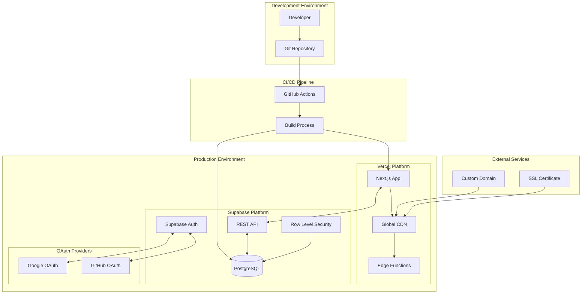
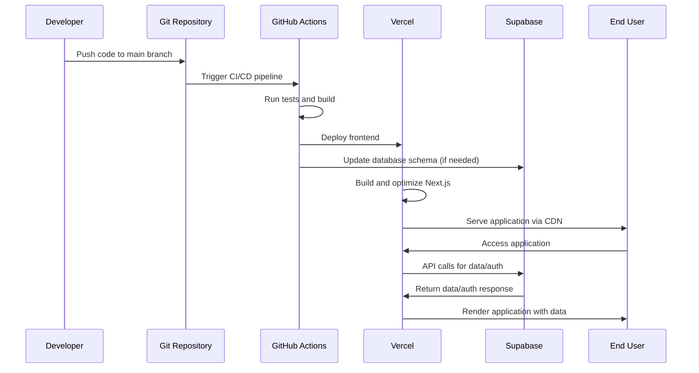

# Design Document: WEB Production Deployment

## Overview

本設計は、Next.jsフロントエンドをVercelに、バックエンドサービスをSupabaseにデプロイする本番環境構築システムを定義します。Google/GitHub OAuth認証を含む完全なWEBアプリケーションの公開プロセスを提供し、セキュリティ、パフォーマンス、自動化を重視した設計となっています。

## Architecture

### システム構成図



### デプロイメントフロー



## Components and Interfaces

### 1. Vercel Frontend Platform

**責任範囲:**
- Next.jsアプリケーションのホスティング
- グローバルCDN配信
- 自動ビルドとデプロイメント
- 環境変数管理
- カスタムドメイン設定

**主要機能:**
- Server-Side Rendering (SSR)
- Static Site Generation (SSG)
- Edge Functions
- 画像最適化
- 自動HTTPS

**設定項目:**
```typescript
interface VercelConfig {
  projectName: string;
  framework: 'nextjs';
  buildCommand: 'npm run build';
  outputDirectory: '.next';
  environmentVariables: {
    NEXT_PUBLIC_SUPABASE_URL: string;
    NEXT_PUBLIC_SUPABASE_ANON_KEY: string;
    NEXT_PUBLIC_SITE_URL: string;
  };
  domains: string[];
  regions: string[];
}
```

### 2. Supabase Backend Platform

**責任範囲:**
- PostgreSQLデータベース
- 認証サービス
- REST API自動生成
- Row Level Security
- リアルタイム機能

**主要機能:**
- OAuth認証 (Google/GitHub)
- JWT トークン管理
- データベーススキーマ管理
- セキュリティポリシー
- API エンドポイント

**設定項目:**
```typescript
interface SupabaseConfig {
  projectId: string;
  databaseUrl: string;
  anonKey: string;
  serviceRoleKey: string;
  jwtSecret: string;
  oauthProviders: {
    google: {
      clientId: string;
      clientSecret: string;
    };
    github: {
      clientId: string;
      clientSecret: string;
    };
  };
  redirectUrls: string[];
}
```

### 3. OAuth認証システム

**Google OAuth設定:**
```typescript
interface GoogleOAuthConfig {
  clientId: string;
  clientSecret: string;
  authorizedOrigins: string[];
  redirectUris: string[];
  scopes: ['openid', 'email', 'profile'];
}
```

**GitHub OAuth設定:**
```typescript
interface GitHubOAuthConfig {
  clientId: string;
  clientSecret: string;
  authorizationCallbackUrl: string;
  scopes: ['user:email'];
}
```

### 4. CI/CD Pipeline

**GitHub Actions設定:**
```yaml
name: Deploy to Production
on:
  push:
    branches: [main]
jobs:
  deploy:
    runs-on: ubuntu-latest
    steps:
      - name: Checkout code
      - name: Setup Node.js
      - name: Install dependencies
      - name: Run tests
      - name: Build application
      - name: Deploy to Vercel
      - name: Update Supabase migrations
```

## Data Models

### 1. 環境変数スキーマ

**開発環境 (.env.local):**
```bash
# Supabase Configuration
NEXT_PUBLIC_SUPABASE_URL=http://localhost:54321
NEXT_PUBLIC_SUPABASE_ANON_KEY=eyJhbGciOiJIUzI1NiIsInR5cCI6IkpXVCJ9...
SUPABASE_SERVICE_ROLE_KEY=eyJhbGciOiJIUzI1NiIsInR5cCI6IkpXVCJ9...

# Site Configuration
NEXT_PUBLIC_SITE_URL=http://localhost:3000
```

**本番環境 (Vercel):**
```bash
# Supabase Configuration
NEXT_PUBLIC_SUPABASE_URL=https://your-project.supabase.co
NEXT_PUBLIC_SUPABASE_ANON_KEY=eyJhbGciOiJIUzI1NiIsInR5cCI6IkpXVCJ9...
SUPABASE_SERVICE_ROLE_KEY=eyJhbGciOiJIUzI1NiIsInR5cCI6IkpXVCJ9...

# Site Configuration
NEXT_PUBLIC_SITE_URL=https://your-app.vercel.app
```

### 2. データベーススキーマ

**主要テーブル:**
```sql
-- Users (Supabase Auth管理)
-- goals, habits, activities, diary_cards, diary_tags
-- 各テーブルにowner_id (UUID) とRLSポリシー
```

**RLSポリシー例:**
```sql
CREATE POLICY "Users can only access their own data" ON goals
  FOR ALL USING (owner_id = auth.uid());
```

### 3. API インターフェース

**Supabase Client設定:**
```typescript
interface SupabaseClient {
  url: string;
  anonKey: string;
  options: {
    auth: {
      autoRefreshToken: boolean;
      persistSession: boolean;
      detectSessionInUrl: boolean;
    };
  };
}
```

**API呼び出し例:**
```typescript
interface ApiResponse<T> {
  data: T | null;
  error: Error | null;
  status: number;
}

interface GoalData {
  id: string;
  name: string;
  description: string;
  owner_id: string;
  created_at: string;
  updated_at: string;
}
```

## Correctness Properties

*A property is a characteristic or behavior that should hold true across all valid executions of a system-essentially, a formal statement about what the system should do. Properties serve as the bridge between human-readable specifications and machine-verifiable correctness guarantees.*

### Property 1: Secure Communication
*For any* API request from Vercel frontend to Supabase backend, the communication should use HTTPS and include proper authentication headers
**Validates: Requirements 1.3, 7.3**

### Property 2: Data Isolation by User
*For any* authenticated user, they should only be able to access data where the owner_id matches their authentication ID across all database tables
**Validates: Requirements 2.3, 7.2**

### Property 3: JWT Token Security
*For any* successful OAuth authentication, the generated JWT token should be properly signed, contain expected claims, and have appropriate expiration
**Validates: Requirements 3.3**

### Property 4: OAuth Redirect Security
*For any* OAuth redirect attempt, only authorized URLs should be accepted, and unauthorized redirect attempts should be blocked
**Validates: Requirements 3.4**

### Property 5: Row Level Security Enforcement
*For any* database table with RLS enabled, security policies should prevent unauthorized access regardless of the query method used
**Validates: Requirements 7.1**

## Error Handling

### 1. デプロイメントエラー

**Vercelデプロイメントエラー:**
- ビルドエラー: 詳細なエラーログとスタックトレースを提供
- 環境変数エラー: 不足または無効な環境変数の明確な識別
- ドメイン設定エラー: DNS設定の問題と解決手順を提供

**Supabaseセットアップエラー:**
- データベース接続エラー: 接続文字列と認証情報の検証
- RLSポリシーエラー: ポリシー構文と権限の検証
- OAuth設定エラー: プロバイダー設定の検証と修正手順

### 2. 認証エラー

**OAuth認証エラー:**
```typescript
interface AuthError {
  code: 'oauth_provider_error' | 'invalid_credentials' | 'redirect_mismatch';
  message: string;
  details: {
    provider: 'google' | 'github';
    redirectUrl?: string;
    expectedUrl?: string;
  };
}
```

**JWT トークンエラー:**
```typescript
interface TokenError {
  code: 'token_expired' | 'token_invalid' | 'token_missing';
  message: string;
  expiresAt?: string;
  refreshAvailable: boolean;
}
```

### 3. API通信エラー

**Supabase APIエラー:**
```typescript
interface SupabaseError {
  code: string;
  message: string;
  details: string;
  hint?: string;
}
```

**ネットワークエラー:**
- タイムアウト: 30秒後にタイムアウト、リトライ機構
- 接続エラー: ネットワーク状態の確認と再試行
- CORS エラー: オリジン設定の検証と修正

### 4. エラー回復戦略

**自動回復:**
- 一時的なネットワークエラー: 指数バックオフでリトライ
- トークン期限切れ: 自動リフレッシュ
- API レート制限: 適切な待機時間後にリトライ

**手動介入が必要なエラー:**
- OAuth設定エラー
- データベーススキーマエラー
- ドメイン設定エラー

## Testing Strategy

### 1. テスト戦略概要

**デュアルテストアプローチ:**
- **Unit Tests**: 具体的な例、エッジケース、エラー条件をテスト
- **Property Tests**: 全入力にわたる普遍的プロパティをテスト
- 両方のテストは相補的で、包括的なカバレッジに必要

### 2. Property-Based Testing

**使用ライブラリ:** Jest + fast-check (TypeScript/JavaScript)

**設定要件:**
- 各プロパティテストは最低100回の反復実行
- 各テストは対応するデザインプロパティを参照
- タグ形式: **Feature: web-production-deployment, Property {number}: {property_text}**

**プロパティテスト例:**
```typescript
import fc from 'fast-check';

describe('Property Tests', () => {
  test('Property 1: Secure Communication', () => {
    // Feature: web-production-deployment, Property 1: Secure Communication
    fc.assert(fc.property(
      fc.webUrl(),
      fc.string(),
      (apiUrl, authToken) => {
        const request = makeApiRequest(apiUrl, authToken);
        expect(request.protocol).toBe('https:');
        expect(request.headers.authorization).toBeDefined();
      }
    ), { numRuns: 100 });
  });
});
```

### 3. Unit Testing

**テスト対象:**
- デプロイメント設定の検証
- 環境変数の設定確認
- OAuth設定の検証
- データベーススキーマの確認
- セキュリティポリシーの動作確認

**Unit Test例:**
```typescript
describe('Deployment Configuration', () => {
  test('should validate Vercel environment variables', () => {
    const config = getVercelConfig();
    expect(config.NEXT_PUBLIC_SUPABASE_URL).toMatch(/^https:\/\/.+\.supabase\.co$/);
    expect(config.NEXT_PUBLIC_SUPABASE_ANON_KEY).toMatch(/^eyJ/);
  });

  test('should validate Supabase OAuth configuration', () => {
    const oauthConfig = getSupabaseOAuthConfig();
    expect(oauthConfig.google.clientId).toBeDefined();
    expect(oauthConfig.github.clientId).toBeDefined();
  });
});
```

### 4. Integration Testing

**E2Eテストシナリオ:**
- 完全なデプロイメントフロー
- OAuth認証フロー
- データCRUD操作
- セキュリティポリシーの検証

**テストツール:**
- Playwright (E2Eテスト)
- Supabase Test Client (データベーステスト)
- GitHub Actions (CI/CDテスト)

### 5. セキュリティテスト

**セキュリティ検証項目:**
- RLSポリシーの有効性
- JWT トークンの検証
- HTTPS通信の確認
- OAuth リダイレクトの検証
- 環境変数の漏洩チェック

**セキュリティテスト例:**
```typescript
describe('Security Tests', () => {
  test('should enforce RLS policies', async () => {
    const user1 = await createTestUser();
    const user2 = await createTestUser();
    
    const data = await user1.createGoal('Test Goal');
    const unauthorizedAccess = await user2.getGoal(data.id);
    
    expect(unauthorizedAccess).toBeNull();
  });
});
```

### 6. パフォーマンステスト

**パフォーマンス指標:**
- ページロード時間 < 3秒
- API レスポンス時間 < 500ms
- Lighthouse スコア > 90
- Core Web Vitals の基準達成

**テストツール:**
- Lighthouse CI
- WebPageTest
- Vercel Analytics
- Supabase Performance Insights