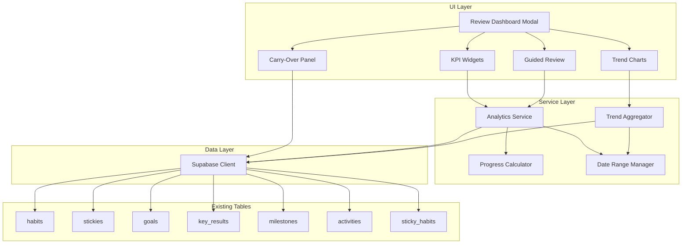

# Design Document: Weekly Review Analytics

## Overview

This design document describes the implementation of the Weekly Review Analytics feature for the habit management dashboard. The feature provides users with a comprehensive weekly summary of their productivity, including task completion rates, habit analytics, goal progress, and trend visualizations.

The implementation follows a layered approach:
1. **Data Layer**: Computed aggregations from existing tables (no new database tables)
2. **Service Layer**: Analytics calculation services and data aggregation
3. **UI Layer**: Review Dashboard modal with KPI widgets, charts, and guided workflow

Key design decisions:
- Use computed views from existing data (habits, stickies, goals, key_results, milestones)
- Lightweight SVG-based charts (consistent with existing MultiEventChart patterns)
- Modal-based Review Dashboard for focused review experience
- Local storage for user preferences (KPI widget selection, date range)

## Architecture



### Data Flow

1. **Dashboard Open**: User opens Weekly Review → Date range initialized → Analytics service queries data
2. **Statistics Calculation**: Service aggregates data from existing tables → Computes completion rates, streaks, trends
3. **Trend Visualization**: Trend aggregator fetches 4-week historical data → Renders SVG line charts
4. **Carry-Over**: User selects incomplete tasks → Service updates due dates → UI refreshes

## Components and Interfaces

### Analytics Service (`frontend/lib/analyticsService.ts`)

```typescript
interface AnalyticsService {
  // Get weekly summary statistics
  getWeeklySummary(dateRange: DateRange): Promise<WeeklySummary>;
  
  // Get habit analytics for the week
  getHabitAnalytics(dateRange: DateRange): Promise<HabitAnalytics[]>;
  
  // Get goal progress analytics
  getGoalAnalytics(dateRange: DateRange): Promise<GoalAnalytics[]>;
  
  // Get task completion analytics
  getTaskAnalytics(dateRange: DateRange): Promise<TaskAnalytics>;
  
  // Get trend data for charts (4 weeks)
  getTrendData(endDate: Date): Promise<TrendData>;
  
  // Get incomplete tasks for carry-over
  getIncompleteTasks(dateRange: DateRange): Promise<Sticky[]>;
  
  // Carry over tasks to next week
  carryOverTasks(taskIds: string[], newDueDate: string): Promise<void>;
}
```

### Type Definitions

```typescript
interface DateRange {
  start: Date;
  end: Date;
  label: 'this_week' | 'last_week' | 'custom';
}

interface WeeklySummary {
  tasksCompleted: number;
  tasksPlanned: number;
  taskCompletionRate: number;
  habitCompletionRate: number;
  keyResultsUpdated: number;
  commitCount: number;
  goalsCompleted: number;
}

interface HabitAnalytics {
  habitId: string;
  habitName: string;
  completionRate: number;
  previousWeekRate: number;
  trend: 'up' | 'down' | 'stable';
  currentStreak: number;
  completedDays: number;
  totalDays: number;
}

interface GoalAnalytics {
  goalId: string;
  goalName: string;
  progressPercent: number;
  progressChange: number;
  keyResultsCompleted: number;
  keyResultsTotal: number;
  milestonesCompleted: number;
  milestonesTotal: number;
  isCompleted: boolean;
}

interface TaskAnalytics {
  byPriority: Record<Priority, { completed: number; total: number }>;
  byStatus: Record<StickyStatus, number>;
  overdueCount: number;
  onTimeCompletionRate: number;
  averageCompletionTime: number | null; // in hours
}

interface TrendData {
  weeks: WeekTrendPoint[];
}

interface WeekTrendPoint {
  weekStart: string;
  weekEnd: string;
  taskCompletionRate: number;
  habitCompletionRate: number;
  goalProgress: number;
}

interface KPIWidget {
  id: string;
  type: 'task_completion' | 'habit_streak' | 'goal_progress' | 'commit_count';
  label: string;
  value: number;
  previousValue: number;
  unit: string;
  trend: 'up' | 'down' | 'stable';
}

interface GuidedReviewStep {
  id: string;
  title: string;
  description: string;
  type: 'wins' | 'reflection' | 'carry_over' | 'priorities';
  completed: boolean;
}

interface ReviewSession {
  id: string;
  weekStart: string;
  completedAt: string | null;
  stepsCompleted: string[];
  carryOverTaskIds: string[];
}
```

### UI Components

#### Modal.WeeklyReview.tsx (Main Component)

```typescript
interface WeeklyReviewModalProps {
  open: boolean;
  onClose: () => void;
}

// Internal state
interface ReviewState {
  dateRange: DateRange;
  activeTab: 'summary' | 'habits' | 'goals' | 'tasks' | 'trends' | 'review';
  summary: WeeklySummary | null;
  habitAnalytics: HabitAnalytics[];
  goalAnalytics: GoalAnalytics[];
  taskAnalytics: TaskAnalytics | null;
  trendData: TrendData | null;
  isLoading: boolean;
  error: string | null;
}
```

**UI Structure:**
```
┌─────────────────────────────────────────────────────────────┐
│ Weekly Review                              [This Week ▼] [×]│
├─────────────────────────────────────────────────────────────┤
│ [Summary] [Habits] [Goals] [Tasks] [Trends] [Review]        │
├─────────────────────────────────────────────────────────────┤
│ ┌─────────┐ ┌─────────┐ ┌─────────┐ ┌─────────┐            │
│ │ Tasks   │ │ Habits  │ │ Goals   │ │ Commits │            │
│ │ 85%     │ │ 72%     │ │ 45%     │ │ 12      │            │
│ │ ↑ +5%   │ │ ↓ -3%   │ │ ↑ +8%   │ │ ↑ +4    │            │
│ └─────────┘ └─────────┘ └─────────┘ └─────────┘            │
├─────────────────────────────────────────────────────────────┤
│ [Content area based on active tab]                          │
│                                                             │
│                                                             │
└─────────────────────────────────────────────────────────────┘
```

#### Widget.KPICard.tsx

```typescript
interface KPICardProps {
  label: string;
  value: number;
  previousValue: number;
  unit: string;
  format?: 'percent' | 'number';
}
```

#### Widget.TrendChart.tsx

```typescript
interface TrendChartProps {
  data: WeekTrendPoint[];
  metric: 'taskCompletionRate' | 'habitCompletionRate' | 'goalProgress';
  height?: number;
  showTooltip?: boolean;
}
```

SVG-based line chart consistent with existing MultiEventChart patterns.

#### Section.HabitAnalytics.tsx

```typescript
interface HabitAnalyticsSectionProps {
  analytics: HabitAnalytics[];
  isLoading: boolean;
}
```

Displays habit list sorted by completion rate (lowest first), with trend indicators.

#### Section.GoalAnalytics.tsx

```typescript
interface GoalAnalyticsSectionProps {
  analytics: GoalAnalytics[];
  isLoading: boolean;
}
```

Displays goal progress with key results and milestones summary.

#### Section.TaskAnalytics.tsx

```typescript
interface TaskAnalyticsSectionProps {
  analytics: TaskAnalytics | null;
  isLoading: boolean;
}
```

Displays task breakdown by priority and status.

#### Section.GuidedReview.tsx

```typescript
interface GuidedReviewSectionProps {
  steps: GuidedReviewStep[];
  incompleteTasks: Sticky[];
  onStepComplete: (stepId: string) => void;
  onCarryOver: (taskIds: string[]) => void;
  onTaskAction: (taskId: string, action: 'carry_over' | 'on_hold' | 'delete') => void;
}
```

Step-by-step guided review workflow.

#### Widget.DateRangePicker.tsx

```typescript
interface DateRangePickerProps {
  value: DateRange;
  onChange: (range: DateRange) => void;
}
```

Quick selection buttons + custom date picker.

## Data Models

### Computed Aggregations (No New Tables)

All analytics are computed from existing tables:

```typescript
// Task completion rate
const taskCompletionRate = await supabase
  .from('stickies')
  .select('id, completed, due_date, completed_at, created_at')
  .gte('created_at', dateRange.start.toISOString())
  .lte('created_at', dateRange.end.toISOString());

// Habit completion rate (from activities)
const habitActivities = await supabase
  .from('activities')
  .select('id, habit_id, kind, timestamp')
  .in('kind', ['complete'])
  .gte('timestamp', dateRange.start.toISOString())
  .lte('timestamp', dateRange.end.toISOString());

// Goal progress (from goals + key_results + milestones)
const goals = await supabase
  .from('goals')
  .select(`
    id, name, is_completed, target_value, current_value,
    key_results (id, progress, current_value, target_value),
    milestones (id, completed, completed_at)
  `);

// Commit count (from sticky_habits junction)
const commits = await supabase
  .from('sticky_habits')
  .select('sticky_id, stickies!inner(completed, completed_at)')
  .gte('stickies.completed_at', dateRange.start.toISOString())
  .lte('stickies.completed_at', dateRange.end.toISOString());
```

### Local Storage Schema

```typescript
interface WeeklyReviewPreferences {
  visibleKPIs: string[]; // KPI widget IDs to display
  lastDateRange: DateRange;
  lastReviewDate: string | null;
}

const STORAGE_KEY = 'weekly-review-preferences';
```

### Progress Calculation Utilities

```typescript
// Calculate habit completion rate for a date range
function calculateHabitCompletionRate(
  habit: Habit,
  activities: Activity[],
  dateRange: DateRange
): number {
  const daysInRange = getDaysInRange(dateRange);
  const expectedCompletions = getExpectedCompletions(habit, daysInRange);
  const actualCompletions = activities.filter(
    a => a.habitId === habit.id && a.kind === 'complete'
  ).length;
  
  if (expectedCompletions === 0) return 0;
  return Math.min(100, (actualCompletions / expectedCompletions) * 100);
}

// Calculate habit streak
function calculateHabitStreak(
  habit: Habit,
  activities: Activity[]
): number {
  // Sort activities by date descending
  // Count consecutive days with completions
  // Return streak count
}

// Calculate on-time completion rate
function calculateOnTimeRate(tasks: Sticky[]): number {
  const tasksWithDueDate = tasks.filter(t => t.dueDate);
  if (tasksWithDueDate.length === 0) return 100;
  
  const onTime = tasksWithDueDate.filter(t => 
    t.completed && 
    t.completedAt && 
    new Date(t.completedAt) <= new Date(t.dueDate!)
  ).length;
  
  return (onTime / tasksWithDueDate.length) * 100;
}
```

## Correctness Properties

*A property is a characteristic or behavior that should hold true across all valid executions of a system—essentially, a formal statement about what the system should do. Properties serve as the bridge between human-readable specifications and machine-verifiable correctness guarantees.*


Based on the prework analysis, the following properties have been identified and consolidated:

### Property 1: Task Completion Rate Calculation

*For any* set of tasks within a date range, the task completion rate SHALL equal `(completed_count / total_count) * 100`, and the completed/planned counts SHALL accurately reflect the task states.

**Validates: Requirements 1.1, 1.2**

### Property 2: Habit Completion Rate Calculation

*For any* active habit and date range, the completion rate SHALL equal `(actual_completions / expected_completions) * 100`, where expected_completions is derived from the habit's repeat schedule.

**Validates: Requirements 1.3, 2.1**

### Property 3: Commit Count Calculation

*For any* date range, the commit count SHALL equal the number of completed stickies that are linked to habits (via sticky_habits junction) with completion dates within the range.

**Validates: Requirements 1.5**

### Property 4: Habit Streak Calculation

*For any* habit with activity history, the streak count SHALL equal the number of consecutive days (counting backward from today) where the habit was completed at least once.

**Validates: Requirements 2.2**

### Property 5: Trend Indicator Correctness

*For any* habit with completion rates for current and previous weeks, the trend indicator SHALL be 'up' if current > previous, 'down' if current < previous, and 'stable' if current equals previous.

**Validates: Requirements 2.3, 2.4, 2.5**

### Property 6: Habit Sorting by Completion Rate

*For any* list of habits with completion rates, sorting by completion rate ascending SHALL produce a list where each habit's rate is less than or equal to the next habit's rate.

**Validates: Requirements 2.6**

### Property 7: Goal Progress Calculation

*For any* goal, the progress percentage SHALL be calculated as: (1) `min(100, (current_value / target_value) * 100)` if target_value exists, (2) average of key result progress values if key results exist, or (3) `(completed_milestones / total_milestones) * 100` if milestones exist.

**Validates: Requirements 3.1, 3.4**

### Property 8: Goal Component Counts

*For any* goal and date range, the key results updated count SHALL equal key results with updated_at within the range, and milestones completed count SHALL equal milestones with completed_at within the range.

**Validates: Requirements 3.2, 3.3**

### Property 9: Goal Completion Highlighting

*For any* goal where progress reached 100% during the selected week (progress was < 100 at week start and >= 100 at week end), the goal SHALL be marked as completed.

**Validates: Requirements 3.5**

### Property 10: Task Grouping Correctness

*For any* set of tasks, grouping by priority SHALL produce buckets where each task appears in exactly one bucket matching its priority value, and grouping by status SHALL produce buckets where each task appears in exactly one bucket matching its status value.

**Validates: Requirements 4.1, 4.2**

### Property 11: Overdue Task Identification

*For any* task with a due_date before the current time and completed = false, the task SHALL be identified as overdue.

**Validates: Requirements 4.3**

### Property 12: On-Time Completion Rate Calculation

*For any* set of completed tasks with due dates, the on-time completion rate SHALL equal `(tasks_completed_before_or_on_due_date / total_tasks_with_due_date) * 100`.

**Validates: Requirements 4.4**

### Property 13: Average Completion Time Calculation

*For any* set of completed tasks, the average completion time SHALL equal the arithmetic mean of `(completed_at - created_at)` for all completed tasks, expressed in hours.

**Validates: Requirements 4.5**

### Property 14: Trend Data Aggregation

*For any* end date, the trend data SHALL contain exactly 4 weekly data points, each with correctly calculated task completion rate, habit completion rate, and goal progress for that week.

**Validates: Requirements 5.1, 5.2, 5.3**

### Property 15: Default Date Range Calculation

*For any* current date, the default date range SHALL have start as the Monday of the current week (00:00:00) and end as the Sunday of the current week (23:59:59).

**Validates: Requirements 6.1**

### Property 16: Date Range Session Persistence

*For any* date range set by the user, retrieving the date range within the same session SHALL return the same start and end dates.

**Validates: Requirements 6.5**

### Property 17: Review Completion Timestamp

*For any* completed guided review, the saved timestamp SHALL be within a reasonable tolerance (e.g., 1 second) of the actual completion time.

**Validates: Requirements 7.6**

### Property 18: Incomplete Task Filtering

*For any* set of tasks and date range, the incomplete tasks list SHALL contain exactly the tasks where completed = false AND (due_date is within range OR created_at is within range).

**Validates: Requirements 8.1**

### Property 19: Task Carry-Over Date Update

*For any* task with a due_date that is carried over, the new due_date SHALL be set to the same day-of-week in the following week.

**Validates: Requirements 8.3**

### Property 20: KPI Delta Calculation

*For any* KPI metric with current and previous period values, the displayed delta SHALL equal `current_value - previous_value` and the trend indicator SHALL correctly reflect the direction.

**Validates: Requirements 9.3**

### Property 21: KPI Preferences Round-Trip

*For any* valid KPI preferences object, saving to local storage and then retrieving SHALL return an equivalent object with the same visible KPI IDs.

**Validates: Requirements 9.5**

### Property 22: Weekly Review Prompt Trigger

*For any* date that is a Sunday after 18:00 local time, and the user has not completed a review for the current week, the system SHALL trigger a review prompt.

**Validates: Requirements 10.3**

## Error Handling

### Error Categories

| Error Type | Trigger | User Message | Recovery Action |
|------------|---------|--------------|-----------------|
| Data Load Error | Failed to fetch analytics data | "データの読み込みに失敗しました。再試行してください。" | Retry button |
| Calculation Error | Division by zero or invalid data | Graceful fallback to 0 or N/A | Display fallback value |
| Carry-Over Error | Failed to update task due date | "タスクの更新に失敗しました。" | Retry option |
| Storage Error | Local storage unavailable | Silent fallback to defaults | Use session state |

### Error Handling Strategy

1. **Graceful Degradation**: If one section fails to load, other sections remain functional
2. **Loading States**: Show skeleton loaders while data is being fetched
3. **Empty States**: Display helpful messages when no data exists for the selected period
4. **Retry Logic**: Automatic retry for transient network errors (max 3 attempts)

### Edge Cases

1. **No data for selected week**: Display empty state with guidance
2. **Division by zero**: Return 0 for completion rates when total is 0
3. **Missing timestamps**: Handle null completed_at gracefully
4. **Timezone handling**: Use user's local timezone for date calculations
5. **Large data volumes**: Implement pagination for task lists

## Testing Strategy

### Dual Testing Approach

This feature requires both unit tests and property-based tests for comprehensive coverage:

- **Unit tests**: Verify specific examples, edge cases, and error conditions
- **Property tests**: Verify universal properties across all valid inputs

### Property-Based Testing Configuration

- **Library**: fast-check (TypeScript property-based testing library)
- **Minimum iterations**: 100 per property test
- **Tag format**: `Feature: weekly-review-analytics, Property {number}: {property_text}`

### Test Categories

#### Unit Tests

1. **Analytics Service tests**
   - Returns empty summary for week with no data
   - Correctly aggregates task completion stats
   - Correctly calculates habit streaks
   - Handles timezone edge cases

2. **Date Range tests**
   - Default range is current Monday-Sunday
   - "Last Week" returns previous Monday-Sunday
   - Custom range validation

3. **KPI Widget tests**
   - Renders correct format for percentages
   - Shows positive/negative trend indicators
   - Handles zero values gracefully

4. **Trend Chart tests**
   - Renders 4 data points
   - Handles missing data for some weeks
   - Tooltip displays correct values

#### Property-Based Tests

Each correctness property (P1-P22) will be implemented as a property-based test:

```typescript
// Example: Property 1 - Task Completion Rate Calculation
// Feature: weekly-review-analytics, Property 1: Task Completion Rate Calculation
describe('Task Completion Rate', () => {
  it('should calculate rate as (completed / total) * 100', () => {
    fc.assert(
      fc.property(
        fc.array(fc.record({
          id: fc.uuid(),
          completed: fc.boolean(),
          createdAt: fc.date()
        }), { minLength: 1 }),
        (tasks) => {
          const completed = tasks.filter(t => t.completed).length;
          const total = tasks.length;
          const expectedRate = (completed / total) * 100;
          const actualRate = calculateTaskCompletionRate(tasks);
          
          return Math.abs(actualRate - expectedRate) < 0.001;
        }
      ),
      { numRuns: 100 }
    );
  });
});

// Example: Property 6 - Habit Sorting
// Feature: weekly-review-analytics, Property 6: Habit Sorting by Completion Rate
describe('Habit Sorting', () => {
  it('should sort habits by completion rate ascending', () => {
    fc.assert(
      fc.property(
        fc.array(fc.record({
          habitId: fc.uuid(),
          completionRate: fc.float({ min: 0, max: 100 })
        }), { minLength: 2 }),
        (habits) => {
          const sorted = sortHabitsByCompletionRate(habits);
          
          for (let i = 0; i < sorted.length - 1; i++) {
            if (sorted[i].completionRate > sorted[i + 1].completionRate) {
              return false;
            }
          }
          return true;
        }
      ),
      { numRuns: 100 }
    );
  });
});

// Example: Property 15 - Default Date Range
// Feature: weekly-review-analytics, Property 15: Default Date Range Calculation
describe('Default Date Range', () => {
  it('should return Monday-Sunday of current week', () => {
    fc.assert(
      fc.property(
        fc.date({ min: new Date('2020-01-01'), max: new Date('2030-12-31') }),
        (currentDate) => {
          const range = getDefaultDateRange(currentDate);
          
          // Start should be Monday
          const startDay = range.start.getDay();
          // End should be Sunday
          const endDay = range.end.getDay();
          // Range should be 7 days
          const daysDiff = (range.end.getTime() - range.start.getTime()) / (1000 * 60 * 60 * 24);
          
          return startDay === 1 && endDay === 0 && Math.abs(daysDiff - 6) < 0.1;
        }
      ),
      { numRuns: 100 }
    );
  });
});
```

### Integration Tests

1. **Full analytics flow**
   - Open modal → Verify data loads → Change date range → Verify recalculation

2. **Carry-over flow**
   - Select incomplete tasks → Carry over → Verify due dates updated

3. **Guided review flow**
   - Start review → Complete steps → Verify timestamp saved

### Test File Structure

```
frontend/__tests__/
├── lib/
│   └── analyticsService.test.ts
├── components/
│   ├── Modal.WeeklyReview.test.tsx
│   ├── Widget.KPICard.test.tsx
│   ├── Widget.TrendChart.test.tsx
│   └── Section.GuidedReview.test.tsx
├── utils/
│   ├── dateRangeUtils.test.ts
│   └── progressCalculator.test.ts
└── properties/
    ├── completion-rate.property.test.ts
    ├── trend-calculation.property.test.ts
    ├── date-range.property.test.ts
    └── carry-over.property.test.ts
```
