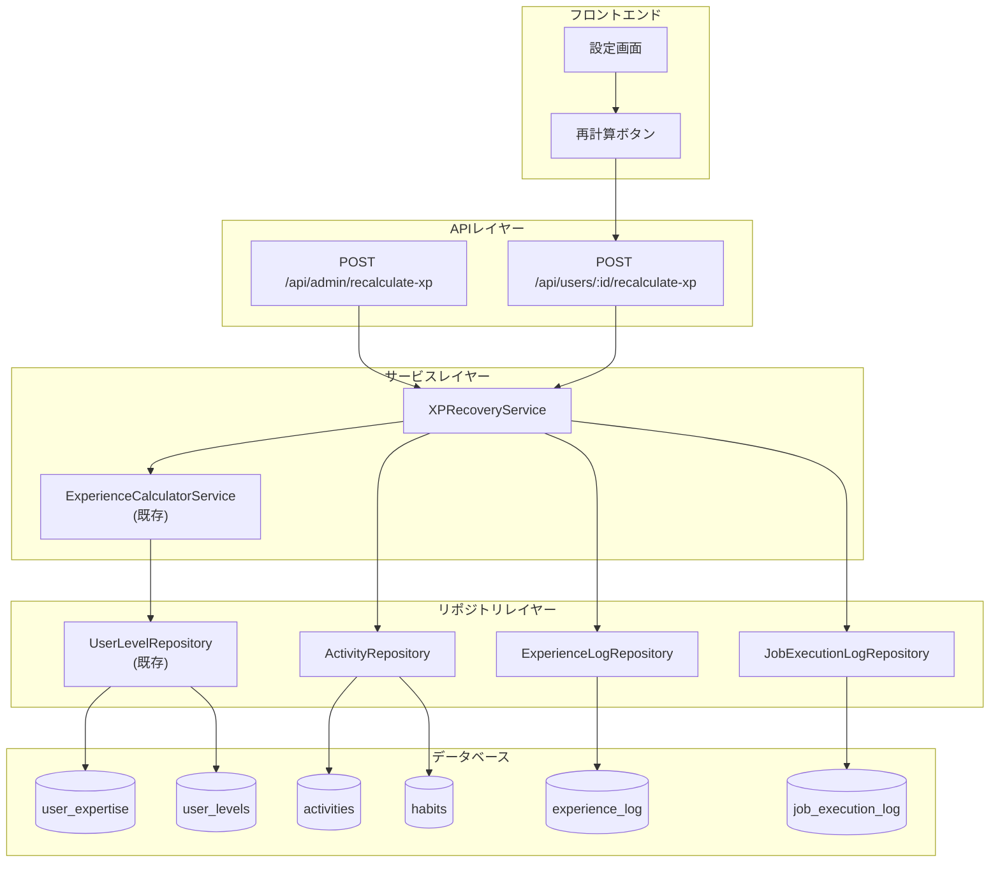

# Design Document: XP Recovery Calculation

## Overview

本設計は、過去の習慣完了履歴（Activity）から経験値を遡及計算し、既存ユーザーのレベルを正しく反映させるXPリカバリー機能を実装します。

主要な設計方針:
1. **既存サービスの再利用**: `experienceCalculatorService`の計算ロジックを再利用し、一貫性を保つ
2. **バッチ処理**: 大量データを効率的に処理するため、100件単位のバッチ処理を採用
3. **冪等性**: 同一Activityへの重複付与を防止し、何度実行しても同じ結果を保証
4. **監査可能性**: 全ての処理をログに記録し、追跡可能にする

## Architecture



## Components and Interfaces

### 1. XPRecoveryService

経験値再計算の中核サービス。バッチ処理と重複チェックを担当。

```typescript
interface XPRecoveryService {
  /**
   * 特定ユーザーの経験値を再計算
   * @param userId - 対象ユーザーID
   * @returns 処理結果サマリー
   */
  recalculateForUser(userId: string): Promise<RecoveryResult>;

  /**
   * 全ユーザーの経験値を再計算
   * @returns 処理結果サマリー
   */
  recalculateForAllUsers(): Promise<RecoveryResult>;
}

interface RecoveryResult {
  userId: string;
  totalXPAwarded: number;
  activitiesProcessed: number;
  activitiesSkipped: number;
  errors: RecoveryError[];
  startedAt: Date;
  completedAt: Date;
}

interface RecoveryError {
  activityId: string;
  message: string;
  timestamp: Date;
}
```

### 2. ActivityRepository (拡張)

Activity取得のためのリポジトリ拡張。

```typescript
interface ActivityRepository {
  /**
   * ユーザーの完了Activityを取得
   * @param userId - 対象ユーザーID
   * @param options - 取得オプション
   * @returns Activity配列
   */
  getCompletedActivities(
    userId: string,
    options?: {
      limit?: number;
      offset?: number;
      excludeActivityIds?: string[];
    }
  ): Promise<ActivityWithHabit[]>;

  /**
   * 完了Activity数を取得
   * @param userId - 対象ユーザーID
   * @returns Activity数
   */
  countCompletedActivities(userId: string): Promise<number>;
}

interface ActivityWithHabit {
  id: string;
  habitId: string;
  habitName: string;
  timestamp: Date;
  amount: number | null;
  habit: {
    id: string;
    name: string;
    thliLevel: number | null;
    domainCodes: string[];
  };
}
```

### 3. ExperienceLogRepository (拡張)

重複チェックのためのリポジトリ拡張。

```typescript
interface ExperienceLogRepository {
  /**
   * 既に経験値が付与されたActivityIDを取得
   * @param userId - 対象ユーザーID
   * @param activityIds - チェック対象のActivityID配列
   * @returns 既に付与済みのActivityID配列
   */
  getProcessedActivityIds(
    userId: string,
    activityIds: string[]
  ): Promise<string[]>;
}
```

### 4. JobExecutionLogRepository

ジョブ実行ログのリポジトリ。

```typescript
interface JobExecutionLogRepository {
  /**
   * ジョブ開始を記録
   * @param jobName - ジョブ名
   * @param metadata - メタデータ
   * @returns ジョブログID
   */
  startJob(jobName: string, metadata?: Record<string, unknown>): Promise<string>;

  /**
   * ジョブ完了を記録
   * @param jobId - ジョブログID
   * @param result - 処理結果
   */
  completeJob(jobId: string, result: JobResult): Promise<void>;

  /**
   * ジョブ失敗を記録
   * @param jobId - ジョブログID
   * @param errors - エラー情報
   */
  failJob(jobId: string, errors: unknown[]): Promise<void>;
}

interface JobResult {
  activitiesProcessed: number;
  xpAwarded: number;
  skipped: number;
  errors: unknown[];
}
```

### 5. API Endpoints

```typescript
// POST /api/admin/recalculate-xp
// 全ユーザーの経験値再計算（管理者のみ）
interface AdminRecalculateRequest {
  // 空（全ユーザー対象）
}

interface AdminRecalculateResponse {
  success: boolean;
  usersProcessed: number;
  totalXPAwarded: number;
  totalActivitiesProcessed: number;
  totalSkipped: number;
  errors: Array<{
    userId: string;
    message: string;
  }>;
  duration: number; // ミリ秒
}

// POST /api/users/:id/recalculate-xp
// 特定ユーザーの経験値再計算
interface UserRecalculateResponse {
  success: boolean;
  totalXPAwarded: number;
  activitiesProcessed: number;
  skipped: number;
  newLevel?: number;
  levelChange?: {
    oldLevel: number;
    newLevel: number;
  };
  errors: Array<{
    activityId: string;
    message: string;
  }>;
}
```

## Data Models

### 1. job_execution_log テーブル拡張

既存の`job_execution_log`テーブルに`xp_recovery`ジョブタイプを追加。

```sql
-- job_execution_log テーブルの制約を更新
ALTER TABLE job_execution_log DROP CONSTRAINT IF EXISTS job_execution_log_job_name_valid;
ALTER TABLE job_execution_log ADD CONSTRAINT job_execution_log_job_name_valid
  CHECK (job_name IN (
    'level_up_detection',
    'level_down_detection',
    'monthly_quota_reset',
    'combined_level_detection',
    'xp_recovery',           -- 新規追加
    'xp_recovery_single'     -- 新規追加（単一ユーザー用）
  ));
```

### 2. experience_log テーブル

既存テーブルを使用。`activity_id`カラムで重複チェックを行う。

```sql
-- 既存のexperience_logテーブル構造
-- activity_idにインデックスを追加（重複チェック高速化）
CREATE INDEX IF NOT EXISTS idx_experience_log_activity_id 
  ON experience_log(activity_id) 
  WHERE activity_id IS NOT NULL;
```

### 3. 処理フロー用データ構造

```typescript
// バッチ処理用の内部データ構造
interface BatchProcessingContext {
  userId: string;
  batchNumber: number;
  totalBatches: number;
  processedCount: number;
  skippedCount: number;
  errorCount: number;
  totalXP: number;
}

// Activity処理結果
interface ActivityProcessResult {
  activityId: string;
  status: 'processed' | 'skipped' | 'error';
  xpAwarded?: number;
  error?: string;
}
```


## Correctness Properties

*A property is a characteristic or behavior that should hold true across all valid executions of a system—essentially, a formal statement about what the system should do. Properties serve as the bridge between human-readable specifications and machine-verifiable correctness guarantees.*

### Property 1: Activity取得の正確性

*For any* ユーザーIDに対して、XP_Recovery_Serviceが取得するActivityは全て`kind='complete'`であり、他のkind（skip, partialなど）のActivityは含まれない。

**Validates: Requirements 1.1**

### Property 2: 冪等性（重複付与防止）

*For any* ユーザーとActivity集合に対して、XP_Recovery_Serviceを2回実行した場合、2回目の実行では既に処理済みのActivityに対する経験値付与がスキップされ、最終的な経験値合計は1回実行した場合と同じになる。

**Validates: Requirements 2.2**

### Property 3: バッチ処理の正確性

*For any* 100件を超えるActivity集合に対して、XP_Recovery_Serviceは100件以下のバッチに分割して処理し、全てのActivityが漏れなく処理される。

**Validates: Requirements 3.1**

### Property 4: エラー耐性（バッチ継続）

*For any* バッチ処理において、1つのバッチでエラーが発生しても、他のバッチは正常に処理され、エラーが発生したバッチの情報が結果に含まれる。

**Validates: Requirements 3.2**

### Property 5: 結果サマリーの完全性

*For any* XP_Recovery_Service実行結果に対して、結果には`totalXPAwarded`、`activitiesProcessed`、`activitiesSkipped`、`errors`の全フィールドが含まれ、`activitiesProcessed + activitiesSkipped + errors.length`が処理対象Activity総数と一致する。

**Validates: Requirements 2.4, 3.3**

### Property 6: 経験値計算の正確性

*For any* 習慣レベル`L`（0-199）とストリーク日数`S`（0以上）に対して、計算される経験値は`L * 10 + min(S * 2, 50)`と等しい。習慣レベルがnullの場合は`L = 50`として計算される。

**Validates: Requirements 1.2, 1.3, 6.2, 6.3**

### Property 7: ドメイン配分の正確性

*For any* 経験値`XP`と`N`個のドメインコードに対して、各ドメインに配分される経験値の合計は`XP`と等しく、各ドメインには`floor(XP / N)`以上の経験値が配分される。

**Validates: Requirements 6.4**

### Property 8: デフォルトドメイン付与

*For any* ドメインコードが設定されていない習慣に対して、経験値は一般ドメイン（コード'000'）に付与される。

**Validates: Requirements 6.5**

### Property 9: ジョブログのラウンドトリップ

*For any* XP_Recovery_Service実行に対して、job_execution_logに開始記録が作成され、処理完了後に同じレコードが更新されて`status='completed'`となり、`metadata`に処理対象ユーザーID、処理Activity数、付与XP合計が記録される。

**Validates: Requirements 7.1, 7.2, 7.3**

## Error Handling

### 1. Activity取得エラー

```typescript
// データベース接続エラー時
try {
  const activities = await activityRepo.getCompletedActivities(userId);
} catch (error) {
  logger.error('Failed to fetch activities', { userId, error });
  throw new XPRecoveryError('ACTIVITY_FETCH_FAILED', 'Activity取得に失敗しました');
}
```

### 2. 経験値計算エラー

```typescript
// 習慣データ不整合時
if (!activity.habit) {
  logger.warning('Habit not found for activity', { activityId: activity.id });
  return { status: 'error', error: 'HABIT_NOT_FOUND' };
}
```

### 3. バッチ処理エラー

```typescript
// バッチ内エラー時は記録して継続
for (const batch of batches) {
  try {
    await processBatch(batch);
  } catch (error) {
    errors.push({ batchNumber, error: error.message });
    logger.error('Batch processing failed', { batchNumber, error });
    // 次のバッチに進む
  }
}
```

### 4. API エラーレスポンス

| エラーコード | HTTPステータス | メッセージ |
|-------------|---------------|-----------|
| UNAUTHORIZED | 401 | 認証が必要です |
| FORBIDDEN | 403 | この操作を実行する権限がありません |
| USER_NOT_FOUND | 404 | ユーザーが見つかりません |
| ACTIVITY_FETCH_FAILED | 500 | Activity取得に失敗しました |
| XP_CALCULATION_FAILED | 500 | 経験値計算に失敗しました |
| JOB_LOG_FAILED | 500 | ジョブログ記録に失敗しました |

## Testing Strategy

### 1. Property-Based Testing

プロパティベーステストには`fast-check`ライブラリを使用。各プロパティに対して最低100回のイテレーションを実行。

```typescript
// テストタグ形式
// Feature: xp-recovery-calculation, Property N: {property_text}
```

**テスト対象プロパティ:**

1. **Property 1**: Activity取得の正確性
   - ジェネレータ: 様々なkindを持つActivity配列
   - アサーション: 取得結果が全てkind='complete'

2. **Property 2**: 冪等性
   - ジェネレータ: ユーザーIDとActivity配列
   - アサーション: 2回実行後の経験値 = 1回実行後の経験値

3. **Property 5**: 結果サマリーの完全性
   - ジェネレータ: 様々なサイズのActivity配列
   - アサーション: processed + skipped + errors = total

4. **Property 6**: 経験値計算の正確性
   - ジェネレータ: 習慣レベル(0-199, null)、ストリーク日数(0-1000)
   - アサーション: 計算結果が期待式と一致

5. **Property 7**: ドメイン配分の正確性
   - ジェネレータ: 経験値(1-10000)、ドメイン数(1-10)
   - アサーション: 配分合計 = 元の経験値

### 2. Unit Testing

**テスト対象:**

- XPRecoveryService.recalculateForUser()
- XPRecoveryService.recalculateForAllUsers()
- ActivityRepository.getCompletedActivities()
- ExperienceLogRepository.getProcessedActivityIds()
- JobExecutionLogRepository.startJob/completeJob/failJob

**エッジケース:**

- Activity数が0件の場合
- Activity数がちょうど100件の場合
- 全てのActivityが既に処理済みの場合
- 習慣が削除されているActivityの場合
- ドメインコードが空配列の場合

### 3. Integration Testing

**テスト対象:**

- API エンドポイント認証
- データベーストランザクション整合性
- 既存experienceCalculatorServiceとの連携

### 4. テストファイル構成

```
backend/src/
├── services/
│   └── __tests__/
│       ├── xpRecoveryService.test.ts        # Unit tests
│       └── xpRecoveryService.property.test.ts # Property tests
├── repositories/
│   └── __tests__/
│       └── activityRepository.test.ts
└── routes/
    └── __tests__/
        └── xpRecoveryRoutes.test.ts          # API tests
```
